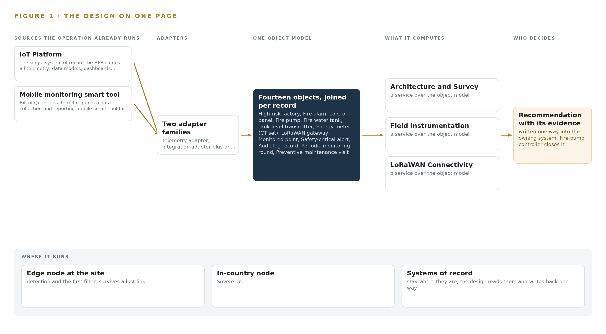
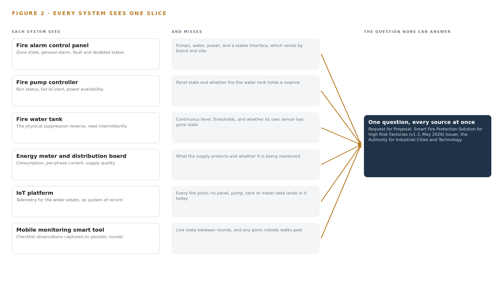
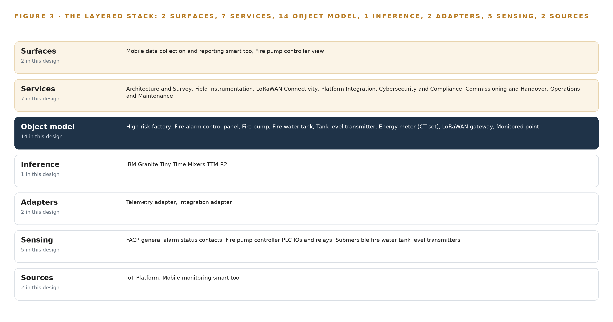
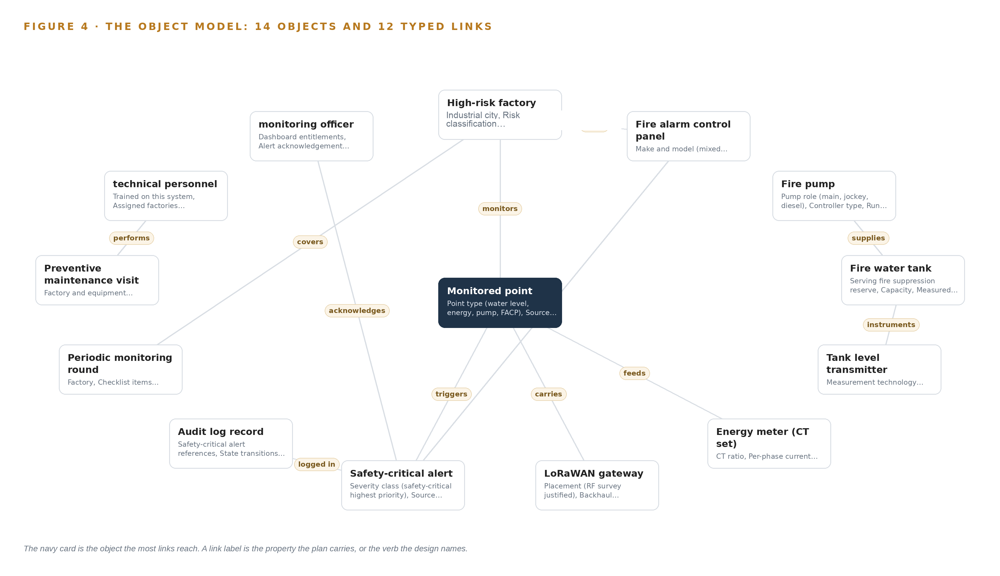
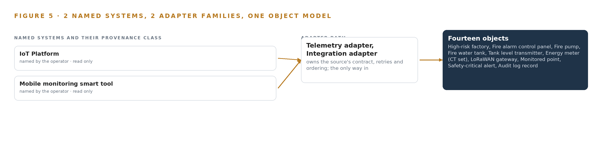
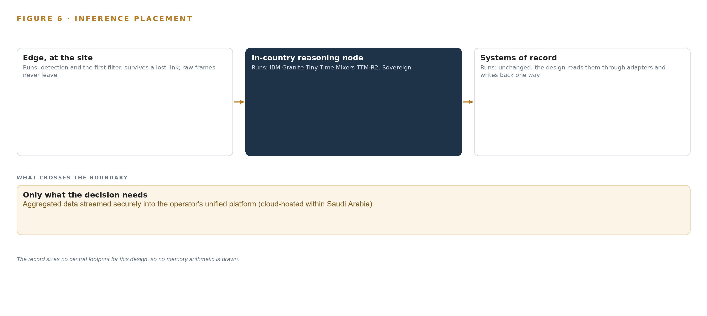
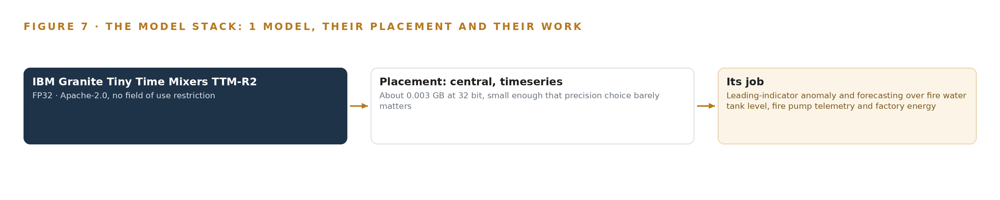
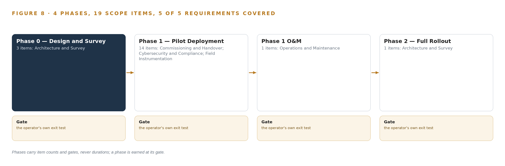
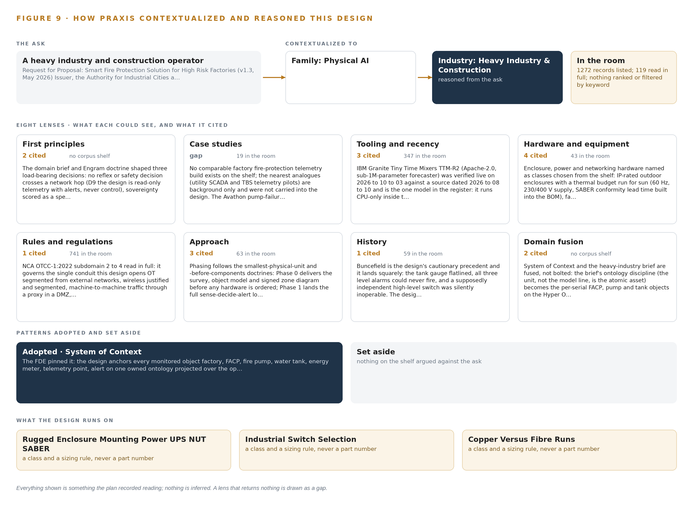

# Factory Fire Watch: Read-Only Smart Fire Protection Monitoring for Every High-Risk Factory

Canonical: https://codeatoms.ai/factory-fire-monitoring-saudi-arabia/
DOI: https://doi.org/10.5281/zenodo.23126565
PDF: https://codeatoms.ai/factory-fire-monitoring-saudi-arabia/paper/factory-fire-watch-fire-protection-monitoring-industrial-cities-saudi-arabia.pdf
License: CC BY 4.0
Publisher: CodeNinja Atoms (https://codeatoms.ai), a fully owned subsidiary of CodeNinja

VERTICAL-DRIVEN ARCHITECTURES · HEAVY INDUSTRY & CONSTRUCTION · DESIGNED WITH PRAXIS · OCTOBER 2026

# Factory Fire Watch: Read-Only Smart Fire Protection Monitoring for Every High-Risk Factory

A smart fire protection monitoring design that gives a heavy industry and construction operator live, read-only visibility of fire alarm panels, fire pumps, fire water reserves and energy consumption across its highest-risk factories, published into its own IoT platform hosted in Saudi Arabia.

CodeNinja Engineering Team

For the safety and operations executive accountable for fire risk at a heavy industry and construction operator, factory and reliability leads, and the instrumentation, radio, integration and platform engineers who would build and run it.

---

Vertical-Driven Architectures is a CodeNinja series of system designs. Every design in the series is driven by a real-world problem and scenario in a single industry, and every one is designed on Praxis, CodeNinja's platform for designing physical AI systems. Operations are described by class, never by name.

At a glance

## Read-only fire protection monitoring for high-risk factories in Saudi Arabia

**What this is.** An open reference architecture for system design in physical AI: live, read-only visibility of fire alarm panels, fire pumps, fire water tanks and energy meters across an operator's highest-risk factories, read through contacts, PLC inputs and LoRaWAN into an IoT platform hosted in Saudi Arabia, with never a write path into certified life-safety equipment. It is written for the safety and operations executive accountable for fire risk and for the engineers who would build it. The operator is described by class, never by name.

**The answer in numbers.**

| Part | The design |
| --- | --- |
| Sources joined | Panel general alarm contacts, pump controller PLC inputs and relays, submersible tank level transmitters, CT energy meters and field rounds, through LoRaWAN gateways into the operator's existing IoT platform |
| Object model | 14 typed objects and 12 links, with the monitored point as the focal object, published as JSON for reuse |
| Models | One: IBM Granite Tiny Time Mixers (TTM-R2), about 0.85 million parameters, Apache-2.0, on CPU inside the platform; threshold evaluation on the safety path is rule logic |
| Compute | None bought: the requirement asks for no server or GPU, and the field gateways carry no model runtime |
| Equipment, per factory | About 2,600 to 3,200 US dollars in list prices: a LoRaWAN gateway, two tank transmitters, two CT meters, four contact nodes, a switch, an enclosure and a UPS |
| Three-year cost, 100 factories | About 328,000 to 439,000 US dollars with support and power; the eight-factory pilot is about 21,000 to 26,000 of equipment |
| Human control | A monitoring officer acknowledges or escalates every safety-critical alert; the design monitors and never controls a panel, pump or valve |

**Reuse it.** The object model, the model register and the figures are free to reuse under CC BY 4.0. Cite as DOI <https://doi.org/10.5281/zenodo.23126565.>

**Made with.** Reasoned on [Praxis](<https://codeatoms.ai/praxis/>), CodeNinja's platform for designing physical AI systems. The object model imports into [Hyper Ontology](<https://codeatoms.ai/hyper-ontology/>), which turns it into a living system. Both are in beta; access by request.

ABSTRACT

## A Fire Estate Should Report Its Own Silence

The operation needs one answer at all hours: are the fire alarm panels, fire pumps, fire water reserves and energy feeds in its highest-risk factories alive, within limits, and provably monitored. It cannot answer that today because panel status, pump health, tank levels and meter readings sit behind separate or unmonitored equipment, and a sensor that has stopped reporting still reads as normal, so the worst failure mode is silence that looks like safety.

The design adds a read-only smart fire protection monitoring layer across the eight pilot high-risk factories: fire alarm control panel status, fire pump controllers, fire water tank level transmitters and current transformer energy meters enter through LoRaWAN field connectivity and per-site backhaul, cross two adapter families into fourteen objects and seven services surfaced on two screens, all published as one owned object model over secure MQTT into the operator's existing Saudi-hosted IoT platform, hardened to national cybersecurity controls for operational technology, with one small forecasting model running centrally on CPU inside that platform. No write path into certified fire equipment exists anywhere in the design.

The paper states the problem and its documented cost, shows why each existing system sees only one slice of fire risk, fixes the constraints, walks the stack from field sensor to dashboard, defines the object model and its typed links, specifies ingestion and state discipline, places inference, registers the model and its license, plans a four-phase rollout with exit gates and requirement coverage, assigns ownership, and closes with the Praxis chapter that records how every choice was reasoned.

---



Figure 1. Factory Fire Watch on one page: the sources the operation already runs, one object model, what it computes, and the person who decides.

## Contents

Each chapter is tagged for the reader it serves most directly: Executive, Team Lead, FDE, Reference.

|  |  |  |
| --- | --- | --- |
|  | Abstract · A Fire Estate Should Report Its Own Silence | Executive |
| PART I · THE PROBLEM | | |
| 1 | [A Silent Fire Sensor Reads as Normal](#ch1) | Executive |
| 2 | [Every Factory System Sees One Slice](#ch2) | ExecutiveTeam Lead |
| PART II · THE DESIGN | | |
| 3 | [Read-Only Safety Shapes Every Choice](#ch3) | Team Lead |
| 4 | [One Stack Runs Sensor to Dashboard](#ch4) | Team LeadFDE |
| 5 | [Fourteen Objects Turn Telemetry Into Accountability](#ch5) | FDE |
| 6 | [Every Source Enters Through an Adapter](#ch6) | FDE |
| 7 | [No Safety Decision Crosses a Network Hop](#ch7) | FDE |
| 8 | [A Small Forecaster Is the Right Size](#ch8) | FDEExecutive |
| PART III · THE ROLLOUT | | |
| 9 | [Survey the Panels Before Hardware Is Ordered](#ch9) | Team LeadExecutive |
| 10 | [The Fire Estate's Evidence Stays In-Country](#ch10) | Executive |
| PART IV · HOW IT WAS DESIGNED | | |
|  | Conclusion · Monitoring Beats Control Where Life Safety Is Certified | Executive |
| 11 | [Every Choice Traces to a Recorded Reading](#ch11) | Team LeadFDE |
|  | [Sources](#sources) | Reference |

PART I · CHAPTER 1

## A Silent Fire Sensor Reads as Normal

Fire protection failures in industry are documented, fined and fatal, and the operation's highest-risk factories cannot currently prove their own fire systems are watched.

The design summarized in the abstract turns scattered fire telemetry into one owned picture of readiness. This chapter states the question that picture answers, what it costs to leave the question unanswered today, and the ground any answer must stand on.

### 1.1  The Question, the Data and the Regimes

The question the operation needs answered is direct: at any hour, can it prove that the fire protection of every factory it classes as high risk is watched, powered, supplied with water, and reporting? Answering it requires four families of data the factories already produce but do not yet publish in one place: general alarm status, fault and disabled states from each fire alarm control panel; run status, fail-to-start and power availability from each fire pump, main, jockey and diesel alike; measured levels and alert thresholds from the fire water tanks serving suppression reserves; and energy consumption with supply quality from the distribution boards that keep all of it alive. Fire regulation worldwide takes the same shape, a duty to prevent, to monitor and to prove: United States construction rules carry a dedicated fire prevention standard (Cornell n.d.), British rules require employers to eliminate or reduce the risk of fire and explosion from work substances (HSE n.d.), and a dedicated code of practice governs fire precautions where flammable gases, liquids and dusts are handled (Standards 2012). On top of the fire code sit two national regimes: national cybersecurity and communications controls for operational technology, which govern any conduit from factory OT into an external platform, and the conformity and radio-type-approval schemes that imported gateways and instruments must clear before they touch a factory wall.

### 1.2  The Documented Cost

The cost of fire protection that fails quietly is written in public investigation records. A fertilizer facility fire and explosion in 2013 killed 15 people and injured more than 260, and the final report cited gaps in regulatory oversight and emergency response (CSB 2013). A fatal coke oven gas explosion at a steel works in 2025 drew an investigation that listed procedures, hazard analysis and facility siting among its findings (CSB 2025). The financial tail is equally documented: a record 87 million dollar fine was imposed for failing to correct safety hazards after a refinery explosion that killed 15 workers (Seattletimes 2009), and proposed fines of 16.6 million dollars across 371 alleged violations followed a fatal natural gas explosion at a construction site (ISHN 2010). Every one of these records points at the same failure surface: the state of protection was not known, or not known in time.

### 1.3  The Operation as a Scenario

The operator is a heavy industry and construction operator, running factories inside industrial cities across the country, with a factory estate in the thousands of which 100 are classed high risk. Eight of those, the most critical, form the pilot. The people in the loop are three: monitoring officers who hold dashboard entitlements and alert acknowledgement authority, technicians who walk periodic monitoring rounds, six of whom use the field data collection tool, and the certified fire protection contractors who keep the life-safety systems themselves. The physical environments are unforgiving: factory floors with mixed-brand panels, pump rooms, roof and tank installations, electrical rooms, and outdoor exposure of dust, direct sun and hose washing. The named systems number two, the operator's existing cloud-hosted IoT platform, which is the system of record and stays Saudi-hosted, and the mobile monitoring smart tool; the design reaches them through two adapter families and fourteen objects, and it never writes into a single certified fire system.

PART I · CHAPTER 2

## Every Factory System Sees One Slice

Panels, pump controllers, tanks, meters and field rounds each hold a fragment of fire readiness, and no existing view joins them into one answer.

Chapter 1 established the question and its cost. This chapter shows why no system the factories already run can answer that question alone, because each one holds a single slice of fire readiness.

### 2.1  What Each System Sees

The fire alarm control panel is the closest thing each factory has to a fire brain, and it sees, general alarm status, fault and disabled states. It misses the pumps, the water and the power, and its make, model and interface type vary by site until a survey says otherwise. The fire pump controller sees its own run status, fail-to-start signal and power availability, and it misses whether the panel is in fault and whether the tank behind it holds anything to pump. The fire water tank physically holds the suppression reserve, but it is read by intermittent gauging rather than by any instrument on the network, and a level reading that has stopped changing still looks like a normal level. The distribution boards and energy meters see consumption and supply quality, and they miss what the supply protects. The operator's IoT platform is the system of record for the wider estate's telemetry, and it holds no fire points at all today. The mobile smart tool sees whatever six users walk past on their rounds, at round intervals, and it sees nothing between rounds. Figure 2 sets these slices side by side against the question none of them can answer.



Figure 2. Six systems, each seeing one part of the answer. the question needs all of them in one place at once.

### 2.2  What None of Them See Together, and What That Costs

What none of them see together is the answer to one sentence: is this factory's fire protection watched, healthy and supplied right now? Each fragment is true alone; only the join is safety. The cost in practice is threefold: a flatlined sensor reads as normal because nothing watches the watcher; escalation runs on whoever notices first because no alert carries a severity class and an acknowledgement trail; and compliance evidence for the high-risk estate is assembled by hand from rounds and memory rather than read from one object model. Investigation reports keep finding the same shape of gap, procedures and monitoring that existed on paper but not at the moment of the event (CSB 2025).

PART II · CHAPTER 3

## Read-Only Safety Shapes Every Choice

The tender's own terms, the six-month clock, the read-only rule and national cybersecurity controls for operational technology set the boundaries the design works inside.

Chapter 2 showed five fragments that never join. The tender's own terms decide how they may be joined, and four constraints do most of the shaping.

### 3.1  Read-only Into Certified Life-safety Systems

The design monitors panels, pumps and tanks through contacts, relays and PLC IOs and never issues a command into any of them. This is hard because fire panels and pump controllers are certified life-safety equipment: any write path would drag re-certification, change control and vendor agreement into a six-month program, and it would put a monitoring layer between a person and a pump. The regulation pattern itself points the same way, since the employer's duty is to reduce risk, not to add a new failure surface to it (HSE n.d.). Read-only is therefore not caution, it is the only integration posture that fits the schedule and the certification ground.

### 3.2  The Six-month Pilot Clock

The pilot covers eight factories within six months of commencement, with liquidated damages behind it. What makes the clock hard is that the panel makes, models and interface types are unknown until a survey walks each factory, and the conformity and radio-type-approval paperwork for imported gateways and instruments sits on the critical path if ordering starts late. The design answers with a Phase 0 survey and point register before hardware is ordered, certification started at award, and an interface adapter class held in spares for every panel type the survey discovers.

### 3.3  A Silent Sensor Must Never Read as Normal

Plain telemetry that publishes last-known values cannot distinguish a healthy idle device from a dead one, and on a fire estate that is the most dangerous failure available: a tank level that has stopped changing still reads as a normal level, so no threshold ever fires. The design treats a reading that stops changing as a fault, not a reading, and builds device birth and death state, heartbeats and stuck-value detection into the publish path so a lost sensor raises an alert of its own.

### 3.4  National Cybersecurity Controls for Operational Technology

The single conduit from factory OT into an external platform is exactly what national operational technology controls govern. The design segments factory OT from the wireless field zone, authenticates every device with its own credentials and TLS operator authentication, publishes through a hardened gateway, and delivers the zone and data-flow map the controls require as an as-built document rather than an afterthought.

### 3.5  Scoping Decisions

Three scoping decisions carry the rest of the design, each buying something real at a stated price, as Table 1 records.

Table 1 · Scoping Decisions

| Decision | What it buys | What it costs |
| --- | --- | --- |
| Read-only telemetry and alerts, never control | Certified fire systems stay untouched, no re-certification, response stays with a named person | The system cannot actuate a pump or silence a panel; every response is human |
| State discipline on the publish path, where the operator's topic architecture permits | A dead or stuck sensor raises its own alert instead of reading as normal | The gateway publishing layer must follow the operator's existing MQTT topic architecture rather than its own |
| Phase 0 survey and point register before hardware order | Interface classes, gateway counts and backhaul choices are known before the bill of materials freezes | Design approval waits on field survey across eight dispersed factories |

### 3.6  What the Design Chose Against

Each rejection below was taken on a stated reason, and the last rows close the scope, as Table 2 records.

Table 2 · What the Design Chose Against

| Where | What was picked | Instead of, and why |
| --- | --- | --- |
| Backhaul at the highest-risk pilot factories | A redundant secondary path, fibre, microwave or wired, offered as a priced option | A single 4G path per gateway, because a dropped backhaul silences safety-critical telemetry exactly when it matters |
| Publishing discipline | Sparkplug 3.0.0 birth and death state and state discipline | Plain MQTT topics carrying last-known values, because a flatlined tank level reading normal is the failure the design exists to prevent |
| Integration into fire equipment | Read-only contacts, relays and PLC IOs | Any write path or command into the panels and pump controllers, which are certified life-safety systems under change control the tender never grants |
| Field compute | Gateways as radios with hours-scale store-and-forward buffers | Container workloads and inference at the edge, because no field action is gated by a model and simpler firmware survives the environment |
| Monitoring points | Panel, pump, tank level and energy only | Cameras and video analytics, which the tender never lists among its monitored points |
| Out of scope | Confirmed at pilot acceptance | Civil Defense or external alert integration, which the tender names no recipient for, and Phase 2 quantities, which are re-estimated after pilot acceptance rather than priced now |

PART II · CHAPTER 4

## One Stack Runs Sensor to Dashboard

The architecture keeps systems of record below, one object model in the middle, and services and surfaces above, with the operator's platform as the store of record.

Chapter 3 fixed the constraints: a read-only monitoring layer, no write path into certified fire equipment, and every reading landing in infrastructure the operator already owns and hosts. This chapter arranges the stack that keeps those promises from the panel contact to the dashboard.

### 4.1  One Object Model Between the Records and the Work

The pattern is systems of record below, one object model in the middle, and applications and agents above, and it fits because the RFP leaves no choice about the bottom layer: the operator's existing Saudi-hosted IoT Platform is the store of record and the MQTT broker of record, so the design builds no historian, no video layer and no edge inference runtime. What it adds is the middle. Fourteen typed objects, from the factory down to the audit log record, give every reading a home, every alert an owner and every field round a place to land. Above the model run seven services, from Architecture and Survey through Operations and Maintenance, two surfaces, the mobile monitoring smart tool and the fire pump controller view, and one model, a small time-series forecaster that runs centrally on CPU inside the platform estate.

Figure 3 shows this layering with the counts per layer. The middle layer is what makes the design one system rather than a bundle of dashboards: a stuck tank level, a pump fail-to-start signal and a technician's checklist all reconcile against the same factory record, so a query can walk from an alert to the gateway that carried it to the officer who closed it. Two plumbing choices support the whole: Sparkplug 3.0.0 state discipline on the publishing path, so silence is distinguishable from idleness, and time discipline from Chrony on each gateway, so events from mixed-brand panels can be ordered after the fact. Prometheus with Grafana dashboards observes the running system itself.



Figure 3. The layered stack: 2 sources, 2 adapter families, 14 objects, 7 services and 2 surfaces.

### 4.2  The Stack Stage by Stage

Table 3 walks the same stack stage by stage and names the components in each. The sensing stage is fixed by the monitored points the RFP lists: panel general alarm contacts, pump controller PLC IOs and relays, submersible tank level transmitters and CT energy meters, all carried by LoRaWAN field sensors with store-and-forward buffering. The adapter stage is deliberately narrow, two families and no direct connections, because Chapter 6 requires every source to enter through one. The inference stage is equally narrow: one zero-shot forecaster over rule-thresholded telemetry, placed centrally because no field action in this read-only design waits on a model, so field hardware carries no model-serving runtime and no container workload.

Table 3 · The Stack, Stage by Stage

| Stage | What it is responsible for | How |
| --- | --- | --- |
| Sources | Holds the records the monitoring layer reads and the store everything lands in | The operator's existing Saudi-hosted IoT Platform as store of record and MQTT broker of record, plus the mobile monitoring smart tool for field rounds |
| Sensing | Converts physical plant state into signals a network can carry | FACP general alarm status contacts, fire pump controller PLC IOs and relays, submersible fire water tank level transmitters, CT energy meters, LoRaWAN field sensors with store-and-forward buffering |
| Adapters | Form the only path any reading or record takes into the object model | Two families only: the telemetry adapter for gateway and MQTT flows, and the integration adapter for mobile tool records, with Sparkplug 3.0.0 state discipline on the publish path |
| Object model | Gives every reading, alert, round and person a typed home | Fourteen objects anchored in the operator's platform, from factory and facp through alarm\_event, field\_round, \_technician and monitoring\_officer |
| Inference | Flags leading indicators before a rule threshold does | One time-series forecaster (IBM Granite TTM-R2) running centrally on CPU inside the platform estate, feeding alerting, with no field inference |
| Services | Build, harden, commission and run the system | Architecture and Survey, Field Instrumentation, LoRaWAN Connectivity, Platform Integration, Cybersecurity and Compliance, Commissioning and Handover, Operations and Maintenance |
| Surfaces | Where people see state and act on it | The mobile data collection and reporting smart tool for six field users, and the fire pump controller view on the platform dashboards |

PART II · CHAPTER 5

## Fourteen Objects Turn Telemetry Into Accountability

A typed object model joins factories, panels, pumps, tanks, meters, gateways, alerts, audits, rounds and people so a query can reach what a document store cannot.

Chapter 4 placed one object model at the center of the stack and counted its contents. This chapter opens that model: the fourteen objects, the typed links between them, where the human beings sit inside it, and how it is hosted.

### 5.1  Fourteen Objects and What a Query Can Reach

Fourteen objects carry the design. The factory is the site object, holding its industrial city, risk classification, assigned gateways and monitored point count. Seven asset objects follow: the fire alarm control panel with its interface type and general alarm, fault and disabled states; the fire pump with its role as main, jockey or diesel and its fail-to-start signal; the fire water tank with configurable alert thresholds and an obstruction flag; the tank level transmitter with heartbeat and stuck-value state; the energy meter with per-phase current and kilowatt-hour accumulation; the LoRaWAN gateway with placement, backhaul technology and buffer state; and the monitored point that binds each reading to its source device, sampling cadence and MQTT topic. Three record and event objects close the loop: the safety-critical alert with its acknowledgement and escalation trail, the audit log record of every state transition and configuration change, and the periodic monitoring round captured in the field. Two people objects, the technician and the monitoring officer, give the model its human actors. Figure 4 draws every object and its typed links.

The links are what a document store cannot fake. From an alarm event, one traversal across typed edges reaches the monitored point that raised it, the device behind that point, the gateway that carried it, the factory it belongs to, the officer who acknowledged it and the audit record that proves it. A document store would need a hand-written join for each hop, and each join is a place where accountability quietly breaks: the alert exists in one collection, the device in another, and nothing forces them to agree.



Figure 4. The fourteen objects of the model and the typed links that let a query reach across them.

### 5.2  Where the Human Loop Lives and How It Is Hosted

The human loop lives in two objects. The monitoring officer holds dashboard entitlements, alert acknowledgement authority and escalation list membership, so every alert in the Raised state has a named person whose acknowledgement moves it to Acknowledged, and every escalation is a recorded step in the object's trail rather than a message outside the system. The technician performs preventive maintenance visits against a corrective response clock, and the periodic monitoring round records what field users check on their rounds, synced through the mobile tool with a sync state of Open, Submitted or Synced.

The hosting posture follows the operator's requirement that data stay: every platform-anchored object lives in the operator's existing Saudi-hosted IoT Platform, and the design adds no store of its own. Human identity and entitlements stay in that platform rather than in a parallel directory, which the design does not replace; device identity is per-device credentials with TLS operator authentication, built inside the cybersecurity hardening item. There are no external links: no Civil Defense interface and no alert channel outside the platform, with escalation recipients confirmed with the operator. The only write path into the object model is telemetry publication and mobile tool sync, and there is no write path of any kind into the fire systems themselves.

### 5.3  One Object in Its Recorded Form

The fire water tank appears below in its recorded form, with its label, kind, properties, status vocabulary and links exactly as the object model holds them.

```
{
  "id": "factory",
  "label": "High-risk factory",
  "kind": "site",
  "anchored_in": "",
  "properties": [
    "Industrial city",
    "Risk classification",
    "Assigned LoRaWAN gateways",
    "Monitored point count"
  ],
  "status_vocabulary": [],
  "links": [
    {
      "to": "facp",
      "label": "hosts"
    },
    {
      "to": "telemetry_point",
      "label": "monitors"
    }
  ]
}
```

PART II · CHAPTER 6

## Every Source Enters Through an Adapter

Field telemetry and mobile monitoring rounds cross two adapter families with state discipline, so a device that stops reporting raises an alert of its own.

Chapter 5 gave every reading a typed home and fixed the only write path into it. This chapter describes how readings actually travel: the two source systems, the two adapter families, and the event backbone underneath both.

### 6.1  Two Source Systems, Two Adapter Families

Two named source systems exist, and Figure 5 maps each to its adapter path. The operator's existing cloud-hosted IoT Platform is the first: an operator-owned system of record, read for dashboards, entitlements and the topic architecture every publish must respect. The mobile monitoring smart tool is the second, also operator-owned, required as a data collection and reporting tool for six users performing periodic monitoring rounds; its records enter through the same model so that a field round and a live reading reconcile against one factory. Each family has exactly one adapter. The telemetry adapter receives LoRaWAN gateway traffic over the per-site backhaul and publishes it onward into the platform; the integration adapter receives mobile tool records and syncs them into the model. No source connects directly to the object model at any point, which is what makes the adapter tier auditable as a single place where provenance is stamped.



Figure 5. The 2 named systems, the adapter path each one takes, and the object model they all map into.

### 6.2  What the Adapter Tier Guarantees

The adapter tier makes four guarantees. First, it is read-only into fire equipment: panel general alarm status arrives through contacts, pump state through PLC IOs and relays, and no command of any kind travels the other way, which keeps the certified life-safety systems independent of the monitoring layer. Second, it applies state discipline under the Sparkplug 3.0.0 specification where the operator's topic architecture permits: each device publishes a birth certificate when it connects and a death certificate when it goes silent, so a dead sensor raises an event of its own instead of leaving a last-known value that looks normal. Third, it treats a reading that has stopped changing as a fault, not a reading: a flatlined tank level that still shows normal is the classic way a draining suppression reserve hides until it is needed, and the investigation record the US Chemical Safety Board produced after the West Fertilizer fire shows what unmonitored industrial fire risk costs when it matures (CSB 2013). Fourth, every device authenticates with its own credentials over TLS, so one compromised radio cannot impersonate another.

### 6.3  The Event Backbone

The event backbone is MQTT, with the operator's platform as broker of record. Ordering rests on two mechanisms: Chrony keeps gateway clocks disciplined against a common reference, and each message carries its event time and a sequence number, so mixed-brand sources can be ordered after the fact. Receipt is guaranteed by acknowledgement at publish and by store-and-forward buffers in every gateway, sized in hours, which hold telemetry through a backhaul outage and replay it idempotently on reconnection, so no duplicate alert is ever raised. Replication is the platform's own: because it is the store of record, the design adds no second historian, and the gateway buffers are the only replication the telemetry path needs. When the link fails, buffering absorbs it; when power fails, the gateway's clean-shutdown behavior protects buffer integrity; when the update path fails, the patching regime holds the last known-good firmware as the recovery point. Prometheus with Grafana dashboards watches the backbone itself, so a stalled adapter alerts before a missing reading does.

PART II · CHAPTER 7

## No Safety Decision Crosses a Network Hop

Thresholds fire in the platform, the single forecaster runs centrally on CPU, and nothing in this design gates a field action on inference.

Chapter 6 described how every field signal enters through an adapter and rides a disciplined publish path into the operator's platform. This chapter describes what, if anything, computes on those signals, and it arrives at an answer shaped by subtraction: the design has one inference tier, one model, and no field action anywhere that waits on a network round trip.

### 7.1  One Central Tier, Arrived at by Subtraction

Figure 6 shows the whole inference placement: a single central tier inside the operator's existing Saudi-hosted IoT platform, running on CPU, with the field edge deliberately empty of inference. The reason is stated in the operator's own requirement: no server or GPU is asked for, so the design treats CPU-only execution inside the platform as a binding constraint rather than a limitation to engineer around. The field gateways are radios with store-and-forward buffers; they carry no model-serving runtime and no container workload, because compute that is not needed at the extremity is not deployed there. The hazardous-area discipline of keeping compute out is satisfied by simply not putting compute there. The one model in the design, a forecaster described fully in Chapter 8, has roughly 0.85 million parameters and occupies about 0.003 GB at FP32 precision, small enough that the precision choice barely matters. The memory arithmetic is therefore short: weights of about 0.003 GB sit comfortably inside a fraction of any platform host's memory, and because the model is a mixer-architecture forecaster rather than an attention-based transformer, it holds no key-value cache at all, so the usual KV cache ceiling calculation is absent. The working set is the weights plus a sliding window of recent telemetry, measured in megabytes. Threshold evaluation, the safety-critical path, is pure rule logic in the platform and consumes no model capacity.



Figure 6. Where each tier runs, what runs there, and the narrow set of outputs that cross the boundary.

### 7.2  The Latency Budget

The budget that matters runs end to end from a field contact change to an alert a monitoring officer sees: sensor state change, LoRaWAN uplink at the point's sampling cadence, gateway publish over backhaul, adapter ingestion, threshold evaluation in the platform, and a safety-critical alert raised against the alarm\_event object for acknowledgement. The dominant terms are the LoRaWAN uplink cadence and the backhaul hop, not compute: a sub-million-parameter forecaster evaluates in milliseconds on CPU. The forecaster itself runs on a slower cadence than the thresholds, as a leading-indicator watch over tank level, pump behavior and energy rather than a gate on anything. The distinction is deliberate: industrial fire events escalate in minutes, and investigations of fatal industrial fires repeatedly trace harm to gaps in recognition and response rather than to sensor spacing (CSB 2013), so the design spends its latency budget on getting a state change to a human fast, not on inference depth.

### 7.3  What Crosses the Boundary and What Fails

Exactly one direction of traffic crosses from factory OT toward the platform: outbound telemetry, birth and death messages, heartbeats and acknowledgements, published through a hardened gateway. Nothing crosses back. No command, setpoint or panel write ever leaves the platform toward fire equipment, which is what makes the network boundary a one-way valve rather than an attack and failure surface. When the link fails, gateway store-and-forward buffers hold hours of telemetry and replay them in order on reconnection, so the platform's history fills in rather than tearing. When gateway power fails, a rugged enclosure supply with UPS and NUT-class clean shutdown lets the gateway close its session properly instead of dying mid-message, and its own state flips to offline so the loss is itself an alert. When a sensor flatlines, stuck-value detection treats a reading that has stopped changing as a fault, not a reading. When the update path fails, gateway firmware and the model artifact are versioned and patched under the operations and maintenance regime, so a missed update degrades to a tracked backlog rather than a silent drift. Every failure path ends in a state the platform can see, which is the design's central wager: a monitored system should never look healthy while it is not.

PART II · CHAPTER 8

## A Small Forecaster Is the Right Size

One sub-million-parameter time series model under a permissive license meets the CPU-only constraint and leaves the operator owning the deployed artifact outright.

Chapter 7 established that the design runs one model, centrally, on CPU, and that nothing in the field waits on it. This chapter names that model, explains why a very small one is the correct answer here, and records everything the design stands on, from weights to enclosures, in one register. Figure 7 shows the model stack in full: one model, one license, one placement. A stack of one is not an omission; it is the design matching model weight to the size of the telemetry estate and to the operator's own constraint that no server or GPU is in scope.



Figure 7. The one model, their placement, and the work each one does.

### 8.1  The Forecaster and Its License

The model is IBM Granite Tiny Time Mixers TTM-R2, a roughly 0.85 million parameter multivariate time series forecaster. Its architecture is a pretrained mixer designed for zero-shot and few-shot forecasting, meaning it produces forecasts on telemetry streams it was never specifically trained on and can adapt with a small number of site-specific examples during the pilot. It runs in FP32, occupying about 0.003 GB, and it runs on CPU inside the operator's existing Saudi-hosted platform, which is the binding constraint this design inherits. Its role is leading-indicator anomaly detection and forecasting over the three streams where drift precedes failure: fire water tank level, fire pump telemetry and factory energy consumption. It does not gate any field action and does not raise safety-critical alerts on its own; thresholds own that duty, and the forecaster flags slow departures from learned behavior that a fixed threshold cannot see. The license is Apache-2.0 with no field of use restriction. Its terms permit the operator to hold, modify and run the deployed artifact outright, with no copyleft trigger, no per-seat fee and no call-home condition, so the weights stay with the platform that produced the telemetry. The model was chosen over runner-ups including Chronos-Bolt and Toto because those are larger than this telemetry estate needs, and every extra parameter would buy forecast depth the monitored points cannot use while costing the CPU-only constraint.

### 8.2  The Model and Equipment Register

Table 4 records the model alongside the hardware classes, sensing choices, standing patterns and the ground the design runs on, so that every physical and software choice traces to a reason.

Table 4 · Model and Equipment Register

| The choice | What was picked | Why here |
| --- | --- | --- |
| Model | IBM Granite Tiny Time Mixers TTM-R2, about 0.85M parameters, FP32, about 0.003 GB | CPU-only forecaster inside the operator's Saudi-hosted platform; Apache-2.0 with no field of use restriction leaves the artifact owned outright |
| Hardware class | Rugged enclosure, mounting, power and UPS with NUT-class clean shutdown; IP ratings per IEC 60529; NEMA enclosure types; SABER conformity | Outdoor exposure to dust, direct sun and hose washing, with certification lead time built into the bill of materials |
| Hardware class | Fanless hardened industrial switches; copper-versus-fibre run selection | Fibre between buildings and near the high-current systems being metered; copper for short powered drops |
| Sensing | FACP general alarm status contacts; fire pump controller PLC IOs and relays | Read-only interface into certified life-safety equipment, never a write path |
| Sensing | Submersible tank level transmitters; CT energy meters; LoRaWAN field sensors with store-and-forward buffering | The four monitored point families: panel status, pump status, water level and energy |
| Pattern | Sparkplug 3.0.0 birth and death messages and state discipline | Distinguishes a healthy idle device from a dead one, so a flatlined sensor reads as a fault |
| Pattern | Read-only integration with stuck-value detection | No command ever reaches fire equipment, and a stopped reading is never mistaken for a normal one |
| Ground | The operator's existing Saudi-hosted IoT platform | The store of record by the requirement's own design; no separate historian is built |
| Ground | Chrony for time sync; Prometheus with Grafana for observability | Event ordering across gateways and visibility of the running system |

PART III · CHAPTER 9

## Survey the Panels Before Hardware Is Ordered

Four phases with item counts and exit gates settle unknown interfaces early, shadow the alerts before anyone trusts them, and cover every stated requirement.

Chapter 8 closed the design itself: one model under an Apache-2.0 license, its CPU-only placement inside the operator's platform, and the hardware classes the field estate is bought by. This chapter sets out the order of work: four phases with item counts and exit gates, the measurements the rollout takes of itself, the failure modes it plans against, the lessons it carries, and the questions it leaves open.

### 9.1  Four Phases and Their Gates

Figure 8 shows the rollout as four phases, each with an item count, workstreams and an exit gate. Phase 0, design and survey, carries three items in the Architecture and Survey workstream: the ontology foundation layer, the fire equipment site survey and point register, and the gateway placement and per-site backhaul design. Its exit gate is a per-factory point register and a justified backhaul design, approved before any hardware is ordered. Phase 1, the pilot build across the eight highest-risk factories, carries fourteen items across five workstreams: Field Instrumentation, LoRaWAN Connectivity, Platform Integration, Cybersecurity and Compliance, and Commissioning and Handover. Its exit gate is every monitored point in the register publishing into the operator's existing platform and verified end to end, with the zone and data-flow map required by the national operational technology controls handed over as an as-built record. The Phase 1 support period carries one item, operations, maintenance and local spares under the Operations and Maintenance workstream, and closes at the gate of alert acknowledgement and corrective response running to the agreed service levels. Phase 2, the full rollout, carries one item, the scalable architecture baseline for the one-hundred-factory estate, and its gate is pilot acceptance.

Requirement coverage reads five covered, none partial and none gapped, against the five stated requirements: fire alarm general alarm status visibility, fire pump operation monitoring, fire water tank level monitoring, energy consumption monitoring, and centralized telemetry published over secure MQTT into the operator's own IoT platform.



Figure 8. The four phases and their gates, and coverage of the 5 requirements across them.

### 9.2  What the Rollout Measures

The rollout measures five families of evidence, all landing in the operator's platform as the same objects the estate uses, so the program's own performance is readable from the object model it builds. Sensor health: heartbeat losses and stuck-value detections raised per monitored point. Link health: gateway store-and-forward buffer depth during disconnections and the time taken to flush after recovery. Alert discipline: elapsed time from a raised alert to acknowledgement, measured against the escalation list, and escalations per severity class. Threshold behavior: breach counts per point class, with nuisance and false alerts reviewed at the support gate. Program mechanics: conformity and radio type-approval milestones tracked against the procurement schedule, because those lead times are the constraint the fixed clock actually turns on. Fire and explosion investigations repeatedly return to what the operator could see and when, and to gaps in oversight and emergency planning rather than to the absence of equipment (CSB 2013), which is why the measurements above watch the visibility layer itself and not only the plant.

### 9.3  Failure Modes and Countermeasures

The design names its own failure modes and pairs each with a mechanism already in the stack. Table 5 carries the six that matter most.

Table 5 · Failure Modes

| What fails | What the design does |
| --- | --- |
| Mixed-brand panel makes, models and interfaces stay unknown until installation | The per-factory survey runs in Phase 0 before design approval, and the Phase 1 spares inventory holds an interface adapter for every discovered panel class |
| The single cellular backhaul drops at a highest-risk factory | Store-and-forward buffering at every gateway survives disconnection, and a redundant secondary path is presented as a priced decision for the highest-risk sites |
| Gateway coverage gaps silence sensors across dispersed cities | Gateway count and placement are justified by an RF survey, and device birth and death state with heartbeats raise an alert of their own when a sensor goes quiet |
| A level transmitter flatlines and reads as a normal value | Stuck-value detection and state discipline treat a reading that stops changing as a fault, never as a reading |
| Conformity and radio type-approval lead times slip past the schedule | Certification paperwork starts at award with a local partner, and long-lead certified items are pre-ordered against the Phase 0 point schedule |
| The one conduit from factory OT is over-permissive | Factory OT is segmented from the wireless field zone, every device authenticates with its own credentials, publishing runs through a hardened gateway, and the required zone and data-flow map is produced as built |

### 9.4  Lessons

**Survey the panels before ordering a single adapter.** The most expensive unknown in this estate is the mixed-brand fire alarm panel population: makes, models and interface types cannot be settled from documents, and an interface adapter discovered after installation moves cost and schedule against the fixed clock. Phase 0 exists to convert that unknown into a counted list, and the gate refuses to release hardware orders until it is.

**A reading that stops changing is a fault, not a value.** A flatlined transmitter keeps reporting the last level it saw, every threshold looks satisfied, and a suppression reserve can drain while the dashboard reads normal. State discipline, heartbeats and stuck-value detection move that case from invisible to alerting, and it is the single most important property the telemetry path carries.

**Safety telemetry deserves its second path before it needs one.** Buffering is the minimum that keeps a disconnection from becoming data loss; the priced secondary backhaul is what keeps one dead cell or cut cable from silencing a factory. Presenting redundancy as a decision with its price attached is honest scoping, and omitting it would be the cheapest failure available in this design.

**Uncorrected hazards compound.** The enforcement record is consistent: penalties reach record sizes when hazards are identified and left uncorrected after a fatal event (Seattletimes 2009), and one fatal explosion can be followed by hundreds of alleged violations spread across the contractors on a site (ISHN 2010). A monitoring layer that proves continuous visibility and keeps its audit trail is the operator's evidence that nothing on the fire estate was left unwatched.

### 9.5  What Is Still Open

Four questions remain open, and each would change a specific part of the design when settled. The redundant secondary backhaul at the highest-risk pilot factories is priced and awaiting the operator's call; accepting it adds hardware items to Phase 1 and removes the single-path caveat from Table 5. The agentic work surface is offered, not committed; confirming it reopens the language serving tier and the frontier inference question that the model register currently carries as an unlock condition. Phase 2 quantities are not fixed in the document; re-estimating them after pilot acceptance turns the scalable architecture baseline into a priced bill of materials for the remaining factories. External alert recipients and channels are unnamed; confirming them adds an outbound integration and fixes the final hop of the escalation trail, which until then ends at the operator's own list.

PART III · CHAPTER 10

## The Fire Estate's Evidence Stays In-Country

The object model, the telemetry record, the decision record and the boundary all remain with the operator, inside its own platform and its own country.

Chapter 9 left four questions open on the table. This chapter closes the design by fixing who owns what it builds, because a monitoring layer over a life-safety estate is only worth building if the operator keeps it.

### 10.1  What the Operator Holds

The object model is the operator's: fourteen objects defined inside its existing platform, with their schema, status vocabularies and typed links exportable in full, and no vendor-held copy that the estate depends on. The weights are the operator's: the single forecasting artifact is licensed Apache-2.0 with no field-of-use restriction, runs on central processing units inside the operator's in-country platform, and the operator owns the deployed artifact outright, along with any future fine-tune of it; no license trigger exists that could recall it. The decision record is the operator's: every safety-critical alert with its acknowledgement, actor and escalation trail, and every audit log entry recording state transitions and configuration changes, stays inside the operator's platform and remains readable by the next person and the next decision. The boundary is the operator's: the design's only path into the fire estate is read-only, through status contacts, relays and controller inputs, and its only path out is outbound publishing into the in-country platform, so no command ever enters a certified life-safety system and no telemetry ever leaves the country.

### 10.2  The Offer Behind the Design

This design is CodeNinja's work, and each layer of it maps to a named element of the offer. The sensing, detection and forecasting of physical behavior across tank levels, pump telemetry and factory energy is Adaptive Operations; the fourteen-object model that turns scattered field signals into one argument is Hyper Ontology; the combination of the operator's own field hardware, an open-weight model the operator owns outright and in-country hosting on its existing platform is Sovereign Infrastructure; and the platform on which the design itself was contextualized, reasoned and recorded is Praxis.

PART IV · CONCLUSION

## Monitoring Beats Control Where Life Safety Is Certified

In one view, the design is a read-only nervous system for a fire estate: sensors and radios at the factory extremity, state discipline so a dead device announces itself, one object model the operator owns, and alerts a named monitoring officer decides on, all inside a platform and boundary the operator already holds.

Running the same shape elsewhere takes four things: a survey phase that discovers mixed equipment before hardware is ordered, published telemetry that carries birth and death state so silence is a fault, strictly read-only integration into certified safety systems, and a small central forecaster sized to the telemetry rather than to a server the operator never asked for. Any dispersed heavy industrial estate with fixed plant and safety-critical status points fits that pattern.

PART IV · CHAPTER 11

## Every Choice Traces to a Recorded Reading

The design was produced on Praxis, and this chapter lets a reader trace each decision back to the lenses, patterns and recorded evidence that justified it.

Chapter 10 fixed ownership of everything the design builds. This final chapter turns to how the design was produced: every design in the series is created on Praxis, and this chapter lets a reader trace any choice back to the lenses, patterns and recorded evidence that justified it. Figure 9 shows that trail on one page.

### 11.1  Contextualizing the Ask

The ask arrived as a request for proposals seeking a single prime contractor for a smart fire protection monitoring layer across high-risk factories in industrial cities: fire alarm general alarm status, fire pump monitoring, fire water tank levels and energy consumption over LoRaWAN field connectivity and per-site backhaul, published into the operator's existing cloud-hosted IoT platform, beginning with the eight most critical factories in a pilot and sized for a full estate of one hundred. Praxis assigned the family as industrial monitoring within heavy industry and construction, with the country set by the operator's own requirement rather than by inference. What was in the room and read in full: the request text itself; the recorded answers on server and GPU expectations, backhaul redundancy, external alerting and Phase 2 quantities; the national operational technology cybersecurity controls, whose relevant subdomain was read in full; and the published documentation of the chosen forecasting model, verified live against its source. All of it remains available on request.



Figure 9. From the ask to the design: the family and industry Praxis assigned, the eight lenses and what each cited, the patterns adopted and set aside, and the equipment the design lands on.

### 11.2  The Eight Lenses

Table 6 lists all eight lenses, what each could see, what it cited and what it contributed. One lens returned nothing comparable and is shown as a gap; three worked from the recorded room without external citation.

Table 6 · The Lenses and What They Contributed

| Lens | Could see | Cited | What it contributed |
| --- | --- | --- | --- |
| First principles | The recorded ask and its constraints, unpacked | 2 | Fixed three load-bearing decisions: no reflex or safety decision crosses a network hop, sovereignty scored as a spectrum across data, model, infrastructure and operations, and edge buffering sized for hours of disconnection |
| Case studies | Nineteen comparable builds on the shelf | 0 | Gap: no comparable factory fire-protection telemetry build existed, and the nearest analogues stayed background |
| Tooling and recency | The verified tooling shelf | 3 | Fixed the single forecasting model against the CPU-only constraint, MQTT state discipline through the Sparkplug specification, and the observability stack, each verified against its published source |
| Hardware and equipment | Forty-three hardware records on the shelf | 4 | Named the enclosure, power, switch and cabling classes and tied conformity and radio type-approval lead times into the bill of materials |
| Rules and regulations | The national operational technology controls text | 1 | Governed the single conduit: factory OT segmented from the wireless field zone, per-device authentication, publishing through a hardened gateway, and the zone and data-flow map as an as-built deliverable |
| Approach | The monitoring patterns on the shelf | 0 | Adopted the read-only telemetry pattern with alerts and set the control-and-command pattern aside, working from the recorded room |
| History | Industry fire and enforcement records | 0 | Sharpened the stuck-sensor and uncorrected-hazard lessons that the failure-mode table carries |
| Domain fusion | Fire safety, radio planning and OT security as one field | 0 | Fused fire-domain thresholds, LoRaWAN link budgets and cybersecurity zoning into one object model and one point register |

### 11.3  Patterns Adopted and Set Aside

The design adopted four patterns and set the rest aside with reasons. It adopted read-only telemetry with birth and death state discipline, because plain topics cannot distinguish a healthy idle device from a dead one. It adopted store-and-forward buffering at every gateway, because a safety-critical path must survive its own disconnections. It adopted RF-survey-justified wireless placement, because silent sensor loss on a fire estate looks like nothing happening. It adopted a zone-segmented, outbound-only conduit, because that is what the controls require of the one path the design opens. It set aside any write path into life-safety equipment, since those systems are certified and their independence is not for a monitoring layer to disturb; a hardware data diode, since the outbound-only conduit already satisfies the controls and a diode would add permanent operational burden; separate historian and video layers, since no task in the monitored-point list names them; edge inference and container orchestration, since no inference gates a field action and gateway firmware is managed by the patching regime; and a frontier model tier, since no committed workload justifies one, a question carried open instead.

### 11.4  Where the Reasoning Lands

The reasoning lands on equipment classes rather than part numbers: the rugged enclosure, mounting, power and uninterruptible supply class with a thermal budget run before any cooling decision; the industrial switch selection class; the copper-versus-fibre rule for runs between buildings and near the high-current systems being metered; and IP rating selection read from the exposure the sites actually present, dust, sun and hose washing. Buying by class on an approved-equipment basis lets the Phase 0 survey fill in specifics without reopening the design. And that is the closing point of this chapter and of the series' method: nothing in these pages is inferred. Every object, count, gate, pattern, license term and control citation was a recorded reading, taken from the room and its sources, and this chapter is the trail back to each one.

Appendix A

## What the Monitoring Estate Costs Over Three Years

The design buys field equipment and no compute: gateways, transmitters, meters and contact nodes at each factory, read into an IoT platform the operator already runs inside Saudi Arabia. This appendix prices the estate for the hundred factories the paper classes high risk, from public list prices, dated and cited. There is no equivalent to rent: the devices sit at the factories in every option, so the only cloud line is what ingesting their messages would cost on a hyperscaler, printed for reference only, because the operator's platform is already hosted in the Kingdom and its cost is sunk. Every number can be rerun with a written quote.

### A.1 The Answer

Equipping a factory costs about **2,623 to 3,211 US dollars** in list prices, the range being the gateway class. Across 100 high-risk factories the estate costs **262,000 to 321,000 dollars**, and with support and power over three years **328,000 to 439,000 dollars**. The eight-factory pilot the paper starts with is about 21,000 to 26,000 dollars of equipment. Message ingestion on a hyperscaler outside the Kingdom would add at most about 1,188 dollars over three years, which says how little the platform cost matters next to the field estate.

### A.2 What Owning Costs

| Line | Basis | Three-year cost (USD) |
| --- | --- | --- |
| Equipment, per factory | RAK7289V2 WisGate Edge Pro, 16 channels with LTE (RAK Wireless 2026); two Milesight EM500-SWL LoRaWAN submersible level transmitters at 420 dollars (MCCI 2026); two Eastron SDM630 three-phase CT meters at 137.63 pounds (Forestrock 2026), at an assumed 1.34 dollars to the pound; four Dragino LT-22222-L LoRaWAN digital input nodes at 71 dollars for the panel and pump contacts (Embedded Works 2026); one Moxa EDS-2008-EL fanless industrial switch at 107 euros (Elmark 2026), at an assumed 1.17 dollars to the euro; one Hoffman NEMA 4X fibreglass enclosure (DigiKey 2026); one APC BR1000MS UPS (Markertek 2026) | 2,623 |
| Gateway, upper bound | Kerlink Wirnet iStation outdoor gateway at 1,112 dollars (Novotech 2026) in place of the RAK gateway | 3,211 per factory |
| Equipment, 100 factories | The paper's count of factories classed high risk, one gateway, two tanks, two meters and four contact nodes each, as the design's monitored point families | 262,000 to 321,000 |
| Support | 8 to 12 percent of equipment value a year (Introl 2026) | 63,000 to 116,000 |
| Power | 20 W a factory for gateway, switch and nodes, 52,560 kWh at the industrial tariff of 0.20 riyals per kWh (ECRA 2025) at 3.75 riyals to the dollar | 2,803 |
| **Total** |  | **328,000 to 439,000** |

The one model in the design, a 0.85 million parameter forecaster, runs on CPU inside the existing platform and adds no hardware line.

### A.3 What Ingesting the Messages Would Cost on a Hyperscaler

For reference only: the operator's platform is already hosted in Saudi Arabia. At 100 factories with 20 monitored points each sampled every 15 minutes, about 192,000 messages a day:

| Option | Basis | Three-year cost (USD) |
| --- | --- | --- |
| AWS IoT Core, Bahrain region | 1.10 dollars per million messages, 0.165 per million rules triggered and per million actions (AWS 2026); outside the Kingdom | 301 |
| Azure IoT Hub, UAE North | S1 units at 33 dollars a month for 400,000 messages a day each, 1.0 units (Azure 2026); outside the Kingdom | 1,188 |

### A.4 What the Price Does Not Include

- **Installation, cabling, RF survey and commissioning** at each factory, which the design's phase 0 survey sizes.
- **Thermal and current transformer selection** per panel and pump controller, which the site survey fixes.
- **Customs duty and 15 percent VAT** on the equipment, which a written quote delivered to the Kingdom settles.
- **Exchange rates.** The meter and switch prices are listed in pounds and euros; this appendix converts them at assumed rates of 1.34 and 1.17 dollars, stated in the table.
- **The platform's own cost**, which the operator already pays.

### A.5 Sources for This Appendix

- AWS. 2026. AWS IoT Core price list, me-south-1. <https://pricing.us-east-1.amazonaws.com/offers/v1.0/aws/AWSIoT/current/me-south-1/index.json>
- Azure. 2026. Retail prices, IoT Hub, UAE North. <https://prices.azure.com/api/retail/prices>
- DigiKey. 2026. Hoffman A16148CHSCFG. <https://www.digikey.com/>
- ECRA. 2025. Electricity tariff, effective 28 May 2025, as reported. <https://clenergize.com/ksa-electricity-tariff-changes-in-2025-is-your-business-ready/>
- Elmark. 2026. Moxa EDS-2008-EL. <https://elmark-automation.com/shop/moxa/eds-2008-el>
- Embedded Works. 2026. Dragino LT-22222-L. <https://embeddedworks.net/product/sens648>
- Forestrock. 2026. Eastron SDM630-MBUS-MID. <https://forestrock.co.uk/product/eastron-sdm630-mbus-mid-meter>
- Introl. 2026. GPU infrastructure TCO model (support rate). <https://introl.com/blog/gpu-infrastructure-tco-model-5-year-enterprise-ai-deployment>
- Markertek. 2026. APC BR1000MS. <https://www.markertek.com/product/apc-br1000ms/>
- MCCI. 2026. Milesight EM500-SWL. <https://store.mcci.com/>
- Novotech. 2026. Kerlink Wirnet iStation 915. <https://novotech.com/products/outdoor-gateway-wirnet-istation-915-mhz>
- RAK Wireless. 2026. WisGate Edge Pro RAK7289V2. <https://store.rakwireless.com/products/wisgate-edge-pro-rak7289v2-rak7289cv2>

SOURCES

## Source Register

CSB. 2013. INVESTIGATION REPORT. <https://www.csb.gov/assets/1/6/west_fertilizer_final_report_for_website_021216.pdf?15620=>

CSB. 2025. Investigation Report. <https://www.csb.gov/assets/1/6/us_steel_clairton_investigation_report_publication_copy.pdf>

HSE. n.d.. Dangerous Substances and Explosive Atmospheres: Dangerous Substances and Explosive Atmospheres Regulations 2002. Approved Code of Practice and guidance L138. <https://www.hse.gov.uk/pubns/priced/l138.pdf>

Standards. 2012. Buy BS 5908 to 1:2012 NSAI. <https://shop.standards.ie/en-ie/standards/bs-5908-1-2012-274002_saig_bsi_bsi_631523/>

Cornell. n.d.. 29 CFR § 1926.151 , Fire prevention. Electronic Code of Federal Regulations (e-CFR) US Law LII / Legal Information Institute. <https://www.law.cornell.edu/cfr/text/29/1926.151>

Seattletimes. 2009. OSHA fines BP a record $87M for Texas refinery fix The Seattle Times. <https://www.seattletimes.com/business/osha-fines-bp-a-record-87m-for-texas-refinery-fix/>

ISHN. 2010. OSHA proposes $16.6 million in fines in connection with fatal Connecticut natural gas explosion (8/5) ISHN. <https://www.ishn.com/articles/90195-osha-proposes-16-6-million-in-fines-in-connection-with-fatal-connecticut-natural-gas-explosion-8-5>

---

### About CodeNinja

CodeNinja is a Middle Eastern-American artificial intelligence lab focused on building self-improving systems. We are reinventing knowledge work to close the loop between vertical AI use cases and the generalized intelligence that fuels it, accelerating the path toward organizational superintelligence.
