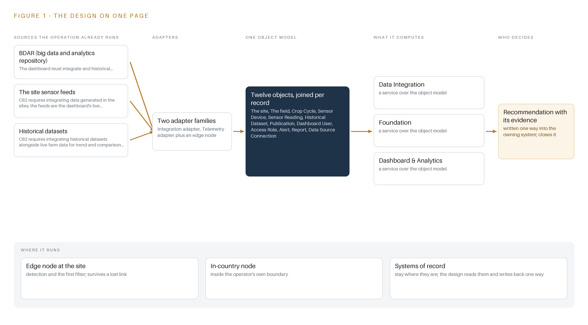
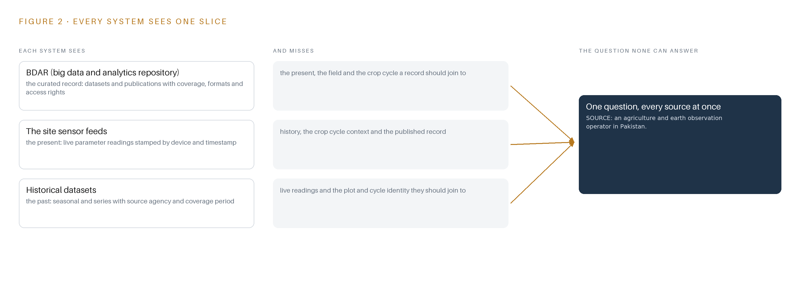
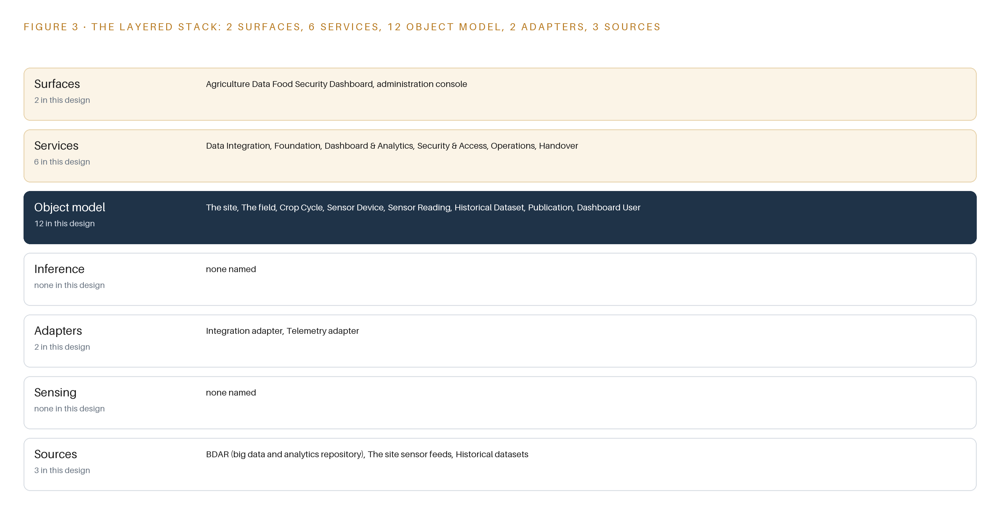
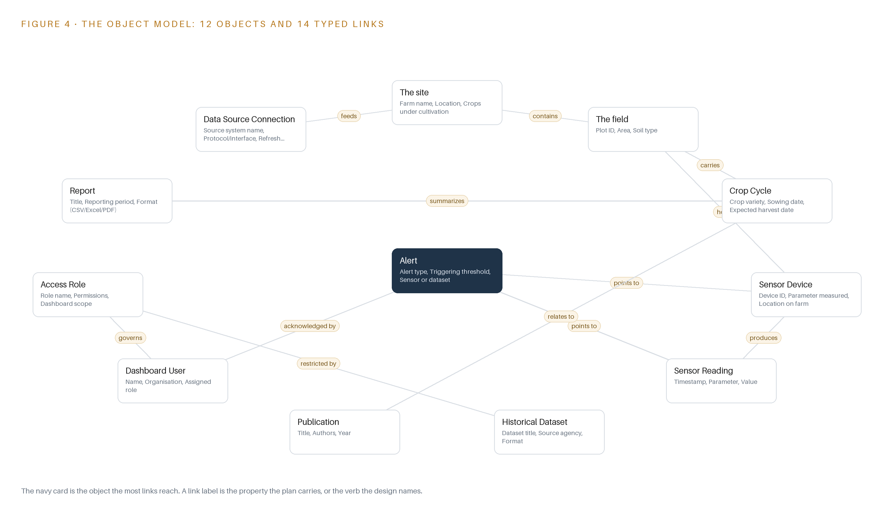
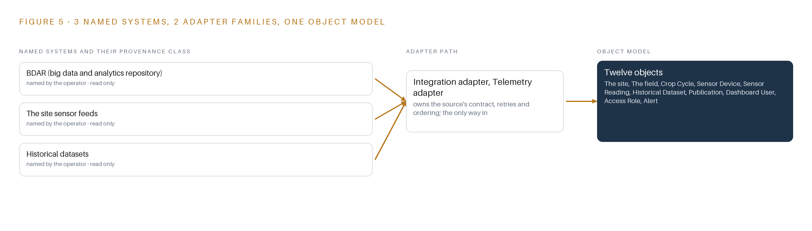
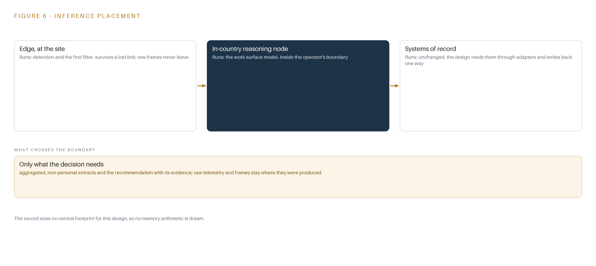
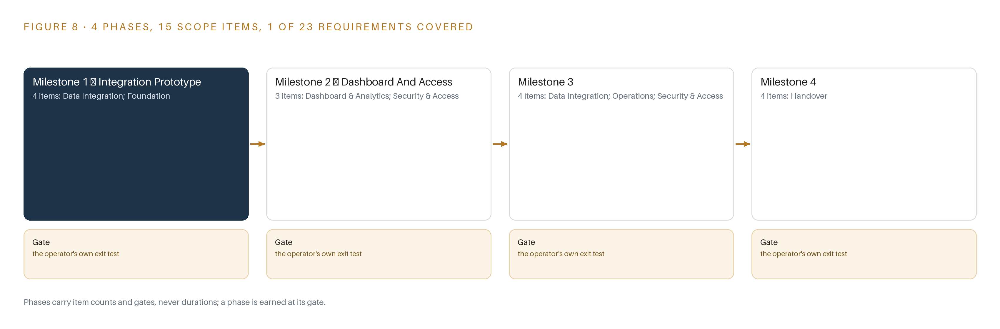
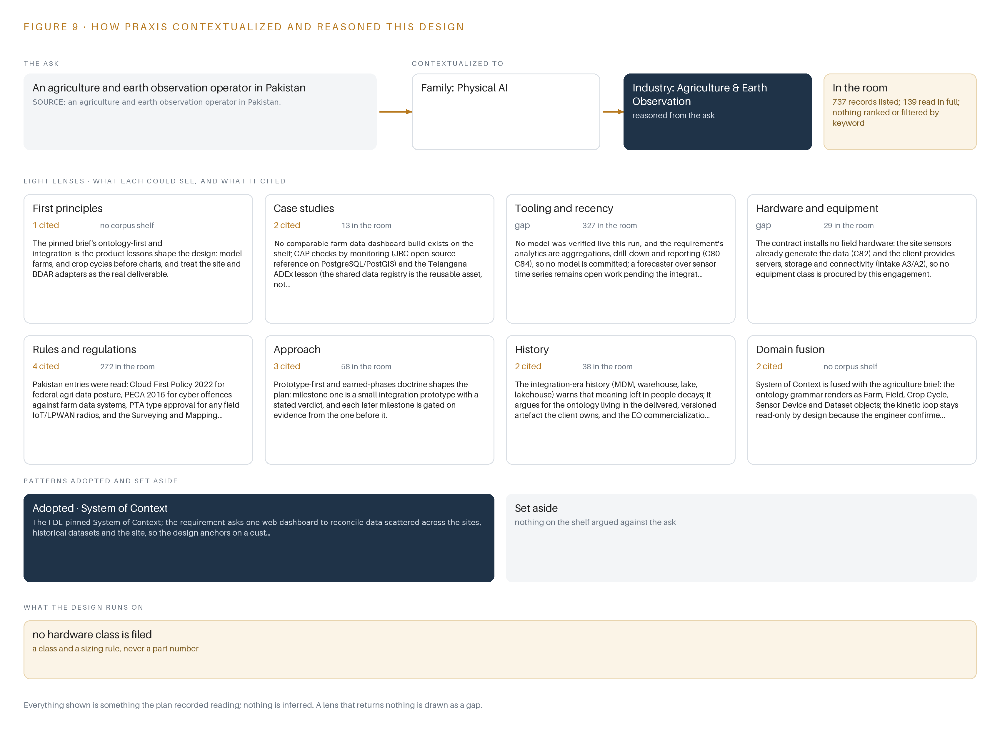

# Field Ledger: An Open Source Agriculture Data Dashboard the Operator Fully Owns

Canonical: https://codeatoms.ai/farm-data-dashboard-pakistan/
DOI: https://doi.org/10.5281/zenodo.23186671
PDF: https://codeatoms.ai/farm-data-dashboard-pakistan/paper/field-ledger-agriculture-data-dashboard-pakistan.pdf
License: CC BY 4.0
Publisher: CodeNinja Atoms (https://codeatoms.ai), a fully owned subsidiary of CodeNinja

VERTICAL-DRIVEN ARCHITECTURES · AGRICULTURE & EARTH OBSERVATION · DESIGNED WITH PRAXIS · OCTOBER 2026

# Field Ledger: An Open Source Agriculture Data Dashboard the Operator Fully Owns

An ontology-anchored web dashboard that unites farm sensor feeds, historical datasets and a big data and analytics repository for an agriculture and earth observation operator in Pakistan, handed over with source code, full intellectual property and documentation.

CodeNinja Engineering Team

For the program director accountable for the federal agriculture productivity pilot, the farm operations and data managers who will use the dashboard, and the integration, and data engineers who would build and run it.

---

Vertical-Driven Architectures is a CodeNinja series of system designs. Every design in the series is driven by a real-world problem and scenario in a single industry, and every one is designed on Praxis, CodeNinja's platform for designing physical AI systems. Operations are described by class, never by name.

At a glance

## An open-source agriculture data dashboard in Pakistan

**What this is.** An open reference architecture for system design in physical AI: one dashboard that joins a farm's live sensor feeds, its historical datasets and a big data and analytics repository into one object model, so any farm, crop cycle or season can be drilled into, exported and reported on under role-based access. It is written for the program director of a federal agriculture productivity pilot and for the data, integration and platform engineers who would build it. The operator is described by class, never by name.

**The answer in numbers.**

| Part | The design |
| --- | --- |
| Sources joined | 3: the site sensor feeds, the historical datasets and the big data and analytics repository, through 2 adapter families |
| Object model | 12 typed objects, from farm site and field to crop cycle, sensor reading and alert, published as JSON for reuse |
| Models | None: the analytics are deterministic aggregations, drill-down and reporting |
| Stack | Open-source PostgreSQL with PostGIS on the operator's own servers; source code and full intellectual property handed over |
| Three-year cost | No hardware line to price: the cost is the integration and software work (Appendix A) |
| Human control | Every alert is acknowledged by a named user under a role the operator assigns |

**Reuse it.** The object model, the model register and the figures are free to reuse under CC BY 4.0. Cite as DOI <https://doi.org/10.5281/zenodo.23186671.>

**Made with.** Reasoned on [Praxis](<https://codeatoms.ai/praxis/>), CodeNinja's platform for designing physical AI systems. The object model imports into [Hyper Ontology](<https://codeatoms.ai/hyper-ontology/>), which turns it into a living system. Both are in beta; access by request.

ABSTRACT

## One Dashboard Cannot Answer What Three Systems Hold Apart

The operation needs one question answered: for any farm, any crop cycle and any season, what do the sensor feeds, the historical datasets and the big data and analytics repository say together, and can a named person drill down, export and report on the answer under role-based access? Today it cannot be answered, because the live site sensor feeds, the historical datasets and the repository live in separate systems whose formats, volumes, refresh rates and interfaces are not stated anywhere in the requirement, so no single view, however well charted, can reconcile them until the integration contracts themselves are discovered.

The design is a milestone-phased, open-source agriculture data dashboard built as an ontology-first integration: three source systems, the site sensor feeds, the historical datasets and the big data and analytics repository, enter through two adapter families into a twelve-object ontology projected as a versioned schema inside an open-source PostgreSQL database with PostGIS, running on the operator's own on-premises servers. Six services, from data integration and foundation through dashboard and analytics, security and access, operations and handover, feed two surfaces: the agriculture data food security dashboard and an administration console. No model is committed this run; the analytics are deterministic aggregations, drill-down and reporting, and every figure the dashboard shows is reproducible from the operator's own data.

The paper sets out the problem and the join failure across the three systems, then the design: the contract- constraints, the layered stack, the object model with one object in its recorded form, ingestion through the adapter tier, where aggregation runs and why the model register is honestly empty. Part III covers the four-milestone rollout with fifteen items, exit gates and failure modes, and who owns what is built. Part IV closes with how the design was produced on Praxis, so every choice traces back to what justified it.

---



Figure 1. Field Ledger on one page: the sources the operation already runs, one object model, what it computes, and the person who decides.

## Contents

Each chapter is tagged for the reader it serves most directly: Executive, Team Lead, FDE, Reference.

|  |  |  |
| --- | --- | --- |
|  | Abstract · One Dashboard Cannot Answer What Three Systems Hold Apart | Executive |
| PART I · THE PROBLEM | | |
| 1 | [Farm Data Exists but No Question Can Reach It](#ch1) | Executive |
| 2 | [Every Repository Sees One Slice of the Farm](#ch2) | ExecutiveTeam Lead |
| PART II · THE DESIGN | | |
| 3 | [Four Contract Terms Shape Everything Downstream](#ch3) | Team Lead |
| 4 | [One Open Stack Runs From Records to Surfaces](#ch4) | Team LeadFDE |
| 5 | [Twelve Objects Turn Farm Data Into One Argument](#ch5) | FDE |
| 6 | [Every Source Enters Through an Adapter, Never Directly](#ch6) | FDE |
| 7 | [Aggregation Runs Where the Data Lives, Not Beside It](#ch7) | FDE |
| 8 | [An Empty Model Register Is an Honest One](#ch8) | FDEExecutive |
| PART III · THE ROLLOUT | | |
| 9 | [A One-Farm Prototype Answers Before Scale Is Priced](#ch9) | Team LeadExecutive |
| 10 | [The Whole Argument Stays with the Operator](#ch10) | Executive |
| PART IV · HOW IT WAS DESIGNED | | |
|  | Conclusion · Integration, Not Intelligence, Is the Product Here | Executive |
| 11 | [Every Choice Here Traces to a Recorded Reading](#ch11) | Team LeadFDE |
|  | [Sources](#sources) | Reference |

PART I · CHAPTER 1

## Farm Data Exists but No Question Can Reach It

The operator holds live sensor feeds, historical datasets and a big data and analytics repository, yet the question a federal agriculture productivity pilot exists to answer, what a farm did and why, spans all three and is answerable by none alone.

The abstract sketched the shape of the answer, an ontology-anchored dashboard over three data estates, phased in four milestones and transferred with source code and full intellectual property. This chapter establishes the question that design exists to answer, the data and the rules the answer depends on, and the operation as a scenario.

### 1.1  The Question, the Data It Requires and the Regulatory Ground

The question the pilot exists to answer is deceptively plain: on each farm, in each crop cycle, what happened this season and why. Answering it needs three kinds of data at once: live sensor readings for current soil and irrigation conditions, historical datasets that carry seasons past, and the record held in the big data and analytics repository, BDAR, where datasets and publications sit with their access rights. A reading only becomes an answer when it is placed against a crop cycle, a field and a baseline, and no single estate holds all three. The regulatory ground is federal procurement law plus national data governance. The pilot is funded as a public sector development program project, and the dashboard is procured through the national electronic procurement system under single stage two envelope rules. Beyond procurement, four governance regimes touch the design: a federal cloud first policy that shapes where agricultural data may be hosted, the cybercrime statute that covers offences against the data systems, telecom type approval that would apply if any field radio were added, and the surveying and mapping act that governs publishing geospatial boundaries. Each turns on a fact the requirement does not state, so each is carried as an open question rather than a settled constraint.

### 1.2  The Documented Cost of the Problem

The cost has two layers. The first is opportunity: the operator already holds every byte the question needs, yet the join across live readings, history and the published record happens, when it happens at all, by hand in spreadsheets, so season decisions wait on individual analysts and their private stitching of fragments. The second layer is documented in the public record on programs like this one. The World Bank cites United Nations estimates that about one trillion US dollars is paid in bribes and 2.6 trillion US dollars is stolen through corruption every year worldwide (World Bank 2020), and agriculture is not exempt: a European Union special report on the common agricultural policy lists public procurement fraud, including collusion between bidders, fictitious subcontracting and falsification of documents, among the risks such programs must manage (European Court of Auditors n.d.). The United States Government Accountability Office found that selected federal programs did not fully include recognized requirements and leading practices for preventing fraud, waste and abuse (GAO n.d.). For a fixed-price pilot of this kind, that record argues for a rollout in which spend is gated on evidence at each milestone rather than committed up front against unstated interfaces.

### 1.3  The Operation as a Scenario

The operator is an agriculture and earth observation operator in Pakistan executing a federal agriculture productivity pilot. It runs a small estate of farm sites and plots instrumented with sensors measuring soil and irrigation parameters, contributes to and draws on BDAR, and holds a library of historical datasets with stated coverage periods and formats. The scale is banded: one farm site anchors the phase-one prototype, a modest number of sites make up the full integration, and the requirement names no city, site or plot. The people in the loop fall into four functions: farm staff and researchers who generate the data, analysts and project staff who would consume the dashboard, administrators who would run access and the, and the repository administrators on the BDAR side whom the operator coordinates with. The requirement requires role-based access control but names no roles, so the role list is itself an open question. The physical environments are open cultivated wheat plots, tilled along irrigation lines and greenhouse seedling aisles, sensed by fixed instruments rather than watched by cameras. The named counts are small and fixed: three named source systems, two adapter families, twelve objects, six services, two surfaces, zero models, four milestones and 23 tracked requirements, all inside one country of operation.

PART I · CHAPTER 2

## Every Repository Sees One Slice of the Farm

The site sensor feeds see the present, the historical datasets see the past, and the big data and analytics repository sees the record; none of them joins crop cycle to reading to dataset, and the cost of that gap is a dashboard that charts fragments instead of answering questions.

Chapter 1 framed the question, what a farm did this season and why, and the three estates that between them hold every piece. This chapter walks each estate, shows what it sees and what it misses, and names the join none of them performs.

### 2.1  What Each System Sees

BDAR sees the record. It holds curated datasets and publications with their authors, coverage periods, formats and access rights, and it is the estate the operator coordinates with through its administrators rather than through a stated interface. What it misses is everything live and everything in the field: no current reading, no plot geometry, no crop cycle that would say which season a dataset should be compared against. The site sensor feeds see the present. Devices across the farm sites report parameters such as soil and irrigation state, each reading stamped with a device, a timestamp and a value. What they miss is context in both directions: no history beyond their own retention, no link to the crop cycle a reading belongs to, and no connection to the published record that would say whether a reading is normal for this plot, this variety and this week of the season. The historical datasets see the past. They carry seasonal and series with source agency, format and coverage period, and they are the estate a trend or comparison analytics view is built on. What they miss is the live layer and the identity of the plot and cycle they should join to; a historical series without a join key to the current season is an archive, not a baseline.

### 2.2  What None of Them See Together

Figure 2 sets the three estates side by side, and the figure's convergence point is the question none can answer alone: join this season's crop cycle to its sensor readings and to the historical and published record, and say what a farm did and why. That join requires a crop cycle object, a reading, a dataset and typed links between them, and no source system carries the links. The cost in practice is a dashboard that charts fragments: a curve without a baseline, a dataset listing without a season, a report assembled by hand each time the pilot must account for itself. Meaning ends up living in individual analysts, and meaning left in people decays as staff turn over. Figure 2's summary rows follow.



Figure 2. Three systems, each seeing one part of the answer. the question needs all of them in one place at once.

PART II · CHAPTER 3

## Four Contract Terms Shape Everything Downstream

An open-source mandate, a fixed price, a source code and intellectual property transfer, and unstated data interfaces are the four forces that decide the architecture, and each one buys something at a stated cost.

Chapter 2 showed the gap the dashboard exists to close and why adapters, not charts, are the real build. This chapter sets out the four forces that bound the architecture before any component is chosen, then records what the design scoped in, what each choice buys and what it costs.

### 3.1  The Open-Source Mandate

The requirement requires an open-source web dashboard over an open-source database backend. This is hard in agriculture because the sector's analytics tooling is dominated by proprietary platforms and hosted services, and an open-source mandate disqualifies most shelf products before their features are even weighed. It is also the force that makes the design ownable: every layer must be licensable for the operator to hold, run and extend.

### 3.2  The Fixed Price

The contract is fixed at PKR 8.80 million, and the effort it must cover depends on data interfaces the requirement does not state. That combination is the engagement's central risk: integration effort on unstated formats can absorb a fixed budget quietly. The design answers with phase-one discipline, a small integration prototype on one farm site and one BDAR dataset that measures the per-farm integration slope before full-farm spend is committed, with later milestone pricing stated against that evidence.

### 3.3  The Source Code and Intellectual Property Transfer

The requirement transfers source code and full intellectual property to the operator, together with documentation and staff training for independent operation. This rules out any proprietary component in the critical path, because a closed dependency would sit inside a transfer that cannot carry it. It also raises the bar on the artifacts themselves: versioned schema, mappings and documentation must be complete enough for the operator's own engineers to run the system without the builder.

### 3.4  The Unstated Interfaces

The BDAR interface, its location and what it exposes are not stated; sensor formats, volumes and refresh cadences are unknown; the server specification is assumed but unspecified. The design therefore treats the two adapter families, one integration adapter for BDAR and historical datasets and one telemetry adapter for the sensor feeds, as the core build, with the integration contract register as a phase-one output produced with the repository administrators in the room.

### 3.5  Scoping Decisions

Three scoping decisions carry the design, each buying something specific at a stated cost; Table 1 records them.

Table 1 · Scoping Decisions

| Decision | What it buys | What it costs |
| --- | --- | --- |
| Integration prototype on one farm site and one BDAR dataset before full integration | Measured evidence on formats, volumes and join quality before the fixed budget is spent | Answers about full-farm behavior wait until the prototype's verdict |
| Ontology as a versioned schema and mapping layer inside PostgreSQL with PostGIS | One open-source system of record the operator owns outright, with the twelve objects projected over it | Graph questions run as SQL joins rather than native graph traversal |
| A hardened open-source BI layer over the committed backend | Proven visualization, drill-down, export and role-based access without bespoke build cost | The dashboard's look and interaction patterns follow the BI layer's conventions |

### 3.6  What the Design Chose Against

Every rejection below keeps the design inside the four forces; Table 2 records where, what was picked, instead of what, and why, ending with what is out of scope entirely.

Table 2 · What the Design Chose Against

| Where | What was picked | Instead of, and why |
| --- | --- | --- |
| Data movement | Scheduled batch pulls through the two adapter families | A streaming backbone, because sensor cadences and volumes are unstated and streaming infrastructure would be premature before the prototype settles them |
| The object model | A versioned schema and mapping layer inside PostgreSQL with PostGIS | A separate graph database product, because the open-source mandate and the fixed price favor one database the operator owns outright |
| The dashboard surface | A hardened open-source BI layer | A bespoke web application built from scratch, because proven software beats hand-built code on this budget and survives the intellectual property transfer |
| Inference | Deterministic aggregations, drill-down and reporting | A trained forecasting model, because the requirement's analytics are aggregations and no forecaster can be specified before integration is measured |
| Out of scope | Existing farm sensors and operator-provided servers, storage and connectivity | New field hardware, cameras, edge compute and sensing of any kind, because the sensing estate already generates the data and the operator provides the infrastructure |

PART II · CHAPTER 4

## One Open Stack Runs From Records to Surfaces

The architectural pattern fits because the systems of record stay below untouched, one object model sits in the middle as a projection rather than a copy, and the services and surfaces above read from it, all on the operator's own servers under open-source licenses.

Chapter 3 fixed the constraints that shape everything downstream: an open-source stack the operator owns outright, integration treated as the product rather than a preliminary, no hardware procurement, and a first milestone that settles the unknown data formats cheaply. This chapter shows the stack those constraints produce, layer by layer, and names every component in it.

### 4.1  Three Layers in a Fixed Order

The architectural pattern is a system of context: three layers in a fixed order, with nothing between them allowed to shortcut. At the bottom sit the systems of record: the big data and analytics repository known as BDAR, the site sensor feeds, and the historical datasets. They are never replaced, never modified and never loaded into a shadow copy; the design reads them where they live, through adapters, exactly once. In the middle sits one object model, a projection over those records rather than a duplicate of them: twelve typed objects held as versioned schema and mapping definitions inside PostgreSQL, the open-source relational database, with PostGIS, its geospatial extension, carrying the field boundary geometry. Above sit the applications: six services and two surfaces that read the projection and never touch a source directly.

This pattern fits here for three reasons that the terms of reference force. First, the requirement commits an open-source web dashboard with an open-source database backend, and it transfers source code and full intellectual property to the operator, so the middle layer must be schema the operator owns; no shelf analytics product carries a published license that survives those terms. Second, no model is committed this run: the analytics are deterministic aggregations, drill-down and reporting, so the middle layer needs no feature store or vector index, and a disciplined relational projection with typed links is enough. Third, the budget is fixed, so one database engine carries the ontology, the sensor time series and the operational metadata together, avoiding a second system of record that the operator would have to run and eventually hand over twice.

Figure 3 shows the layered stack with its counts per layer: three sources below, two adapter families, twelve objects in the projection, six services, two surfaces, and zero models this run. The kinetic loop of the pattern, sense, decide, act and learn, stays deliberately read-only at the act step: the people who use the dashboard act on its outputs inside the tools they already operate, so the design closes the loop through alerts and reports rather than through automated control of anything in the field.



Figure 3. The layered stack: 3 sources, 2 adapter families, 12 objects, 6 services and 2 surfaces.

### 4.2  The Stack Stage by Stage

Table 3 walks the same stack stage by stage, naming what each stage is responsible for and how it discharges that responsibility. The stages are read top to bottom in the order data flows: sources hold the records, sensing describes what the estate already generates, adapters carry records in, the object model turns them into one queryable argument, inference names what reasons over it, services assemble the capabilities, and surfaces put them in front of people.

Table 3 · The Stack, Stage by Stage

| Stage | What it is responsible for | How |
| --- | --- | --- |
| Sources | Holding the three records the dashboard reads: the BDAR repository, the site sensor feeds and the historical datasets | Left untouched in place; the operator provides hosting infrastructure and connectivity and coordinates with the repository administrators |
| Sensing | Describing what the estate already senses: in-field instruments measuring soil and parameters as time-stamped readings | No new hardware is procured; cameras, edge compute and field radios are out of scope because the sensors already exist |
| Adapters | Being the only path data takes into the stack: one integration adapter for the repository and historical datasets, one telemetry adapter for the sensor feeds | Scheduled pulls governed by a contract register, with provenance stamped on every record and unknown formats settled before the first read |
| Object model | Twelve typed objects that turn scattered records into one argument a query can traverse | Versioned schema and mappings projected inside PostgreSQL with PostGIS, never a shadow copy, with typed links naming every relationship |
| Inference | Nothing this run: every analytic is a deterministic aggregation, drill-down or report computed from the object model | A time-series forecaster over the sensor readings stays open work until the integration prototype measures the real feed cadence |
| Services | Six services: Data Integration, Foundation, Dashboard and Analytics, Security and Access, Operations, and Handover | Open-source components the operator owns outright, assembled so each service reads from the object model and never from a source |
| Surfaces | Two surfaces: the Agriculture Data Food Security Dashboard and the administration console | Web interfaces over the services, with role-based access deciding who sees which data and who changes which object |

PART II · CHAPTER 5

## Twelve Objects Turn Farm Data Into One Argument

Farms, crop cycles, sensor devices and readings, datasets, publications, users, roles, alerts, reports and data source connections form a typed graph whose crossing links answer what no single store can, with the human loop and the only write path living in the alert and access objects.

Chapter 4 placed one object model in the middle of the stack as a projection the services read and the sources never feel. This chapter names the twelve objects in that projection, the typed links that join them, and the one place in the graph where a person's hand changes state.

### 5.1  Twelve Objects and the Links Between Them

The twelve objects group into four families. The estate objects are the site, a farm with its name, location, crops under cultivation, sensor count and connectivity status; the field, a plot with area, soil type, crop variety and boundary geometry; and the crop cycle, a season on a plot that moves through planned, sown, growing and harvested. The measurement objects are the sensor device, with its parameter, position and health, and the sensor reading, the timestamped value and unit it produces. The knowledge objects are the historical dataset and the publication, both anchored in the BDAR repository rather than in the dashboard's own store. The governance objects are the dashboard user and the access role. The working objects are the alert, the report, and the data source connection, which records each source's protocol, refresh cadence and last successful pull.

Figure 4 draws the objects and their typed links. A field carries crop cycles; a publication relates to the crop cycles it concerns; a dataset's access rights are restricted by an access role; a user holds a role and a role governs a dashboard scope; an alert points to the sensor device and the sensor reading that triggered it; a data source connection feeds the site it serves. Typed means each link names its relationship, such as hosts or triggers, rather than leaving the meaning of a foreign key to guesswork, so a traversal carries its own explanation.

The reach across these links is what a document store cannot give. Consider the question an operations officer actually asks when an alert fires: is the crop at risk, and what does the institution already know about this variety? Starting at the alert, one traversal reaches the sensor reading and its device, the device's field, the field's current crop cycle, and every publication in the repository tagged to that crop. A document store holds each of those as a flat record keyed by identifiers; it cannot follow the edges, so the officer assembles the answer by hand across five stores. The graph answers the crossing question in one query, and that is the argument the twelve objects exist to make.



Figure 4. The twelve objects of the model and the typed links that let a query reach across them.

### 5.2  Where the Human Loop and the Write Path Live

The human loop lives in three objects, and every state change in them is a named person's decision. An alert moves from open to acknowledged to resolved, and its acknowledged by property records who took it. A report moves from draft to final. A dashboard user and an access role are themselves created, suspended and disabled by an administrator, whose identity the console records.

The hosting posture follows from the operator's stated requirement for the country. The servers are the operator's own, on premises in Pakistan, so the data residency boundary is the operator's estate and nothing in the design copies records outside it. Identity is role-based access control implemented inside the same open-source stack; the requirement requires the controls but does not name the roles, so the role list is settled in a design workshop before any access rule is written. External links exist only as properties, such as the repository link on a publication, which a user clicks by choice; rendering the dashboard sends nothing out. The only write path into the graph runs through the five objects the dashboard owns natively, the alert, the report, the dashboard user, the access role and the data source connection. Everything downstream of the adapters is a read-only projection, so no dashboard action, however mistaken, can alter a record in the systems of record below.

### 5.3  One Object in Its Recorded Form

Sensor Reading is the object the daily argument rests on, and it is shown below in its recorded form: the timestamped value, its parameter and unit, and the source device it came from.

```
{
  "id": "the-site",
  "label": "The site",
  "kind": "site",
  "anchored_in": "",
  "properties": [
    "Farm name",
    "Location",
    "Crops under cultivation",
    "Number of sensors",
    "Connectivity status"
  ],
  "status_vocabulary": [
    "Online",
    "Degraded",
    "Offline"
  ],
  "links": [
    {
      "to": "the-field",
      "label": "contains"
    }
  ]
}
```

PART II · CHAPTER 6

## Every Source Enters Through an Adapter, Never Directly

The integration adapter and the telemetry adapter are the real deliverable: they carry provenance classes, buffer scheduled pulls, and guarantee that unknown formats are settled in a contract register before anything reads from them.

Chapter 5 defined the twelve objects and the single write path into them. This chapter describes how everything else gets in: three sources entering through two adapter families, the guarantees those adapters make, and the batch backbone that carries the pulls.

### 6.1  Three Sources, One Provenance Class, Two Adapters

The design names three source systems, and all three share one provenance class. BDAR, the operator's big data and analytics repository, holds the historical datasets and the publications the dashboard must integrate with; the operator provides the hosting infrastructure and coordinates with the repository's administrators, who control what the repository exposes. The site sensor feeds generate live readings and form the dashboard's operational layer. The historical datasets, read through and alongside the repository, carry the trend and comparison layer. All three are read-only from the dashboard's side, and all three are operator-held, meaning every record originates inside the operator's own estate and never leaves its boundary. Figure 5 draws the integration map: each named source, its provenance class, and the adapter path it enters through.

The requirement states no protocol or format for any of the three, and that omission is the plan's central risk, which is why the adapters are the core build rather than a preliminary. Two families cover the three sources: the integration adapter serves BDAR and the historical datasets, whether they arrive as database endpoints, file exports or scheduled extracts, and the telemetry adapter serves the sensor feeds, whatever instrument protocols the discovery item finds. Each source enters through exactly one adapter path, and each path is specified in a contract register before the first pull.



Figure 5. The 3 named systems, the adapter path each one takes, and the object model they all map into.

### 6.2  What the Adapter Tier Guarantees

The adapter tier makes five guarantees. First, no direct reads: services and surfaces connect only to the object model, never to a source. Second, contract before read: every source receives an entry in the integration contract register stating its format, interface, refresh cadence, keys and credential owner, agreed with that source's administrators before any adapter reads from it, and the register is a milestone one gate. Third, provenance on every record: each row carries its source connection and pull timestamp, so a join against historical data shows its lineage and a weak source is visible instead of silently averaged. Fourth, idempotent pulls: replaying a pull never duplicates readings, because upserts key on the source's natural key and timestamp. Fifth, schema drift alarms: a renamed column or a changed unit flips the data source connection to failed rather than writing wrong values forward.

The register also carries public accountability weight. This is a federally funded pilot procured under public rules, and the audit literature on such programs is blunt: European Union audits of agricultural subsidy spending list falsified documents and fictitious subcontracting among the procurement fraud modes they pursue (European Court of Auditors n.d.); the United States Government Accountability Office found selected federal programs that did not fully include recognized requirements and leading practices for preventing fraud, waste and abuse (GAO n.d.); and United Nations estimates cited by the World Bank put about one trillion dollars paid in bribes and about 2.6 trillion dollars stolen through corruption worldwide every year (World Bank 2020). An auditable record of what entered the system, when and from where, is the cheapest integrity control a pilot of this kind can hold.

### 6.3  The Event Backbone

The design commits no streaming infrastructure, deliberately. Sensor formats, volumes and refresh rates are not stated, so the integration may be batch or scheduled pulls, and a message broker would be premature until the milestone one prototype settles the real cadence. In its place stand three mechanisms. Ordering: every record carries its source timestamp plus an ingest sequence assigned on arrival, queries sort on the source timestamp, and missing windows surface as feed faults instead of being smoothed over. Delivery: at-least-once, made safe by the idempotent upserts above. Buffering and replication: adapters write into staging tables inside the same PostgreSQL estate, so a missed window re-pulls rather than losing data, and the database replicates by streaming replication to a standby within the same estate, with nothing copied past the operator's boundary.

Failure behavior closes the loop: a feed that stops, or a gap in the readings during irrigation stress, which is precisely the fault the rollout watches for, flips the connection status to failed and raises an alert on the dashboard surface for a named person to acknowledge.

PART II · CHAPTER 7

## Aggregation Runs Where the Data Lives, Not Beside It

No inference tier is procured because the committed analytics are deterministic aggregations, drill-down and reporting executed inside the open-source database, and the latency budget is therefore a query and render budget on the operator's network.

Chapter 6 described how every source enters through an adapter on a scheduled pull, with the data source connection object recording the last successful pull per feed. This chapter describes where the computation happens once the data lands, and it makes an argument that runs against the habit of this series: nothing needs to be inferred, so nothing needs a model server.

### 7.1  One Tier of Computation, Inside the Database

Figure 6 shows an inference placement diagram with one active tier, and that tier is not a model server. It is the open-source database engine running on the operator's own on-premises servers, in Pakistan, executing every committed analytic as a deterministic query: aggregations over sensor readings and historical datasets, drill-down from farm to field to crop cycle to individual device, and the scheduled and ad hoc reporting that the report object captures.

The reason is arithmetic before it is philosophy. The requirement commits no machine learning: the analytics it asks for are aggregations, drill-down and reporting, and no model was verified for this design. An aggregation that runs in seconds inside the engine that holds the data does not justify a second system, and the stack review set aside edge model serving, on-site language model serving and edge orchestration of containers for exactly this reason: the objects of this design are farms, sensors and datasets, nothing moves and gets tracked, and users act on outputs inside tools they already use.

Papers in this series normally carry a memory arithmetic at this point: model weights against usable memory, and the token budget that bounds the key-value cache. Here that arithmetic has no terms to carry, because the register holds zero parameters. What replaces it is a storage and working-memory question: time-series rows accumulated per device, the spatial indexes over field boundary geometry, and the concurrent query buffers that drill-down sessions consume, all sized against the recorded server specification at the Milestone 1 kick-off. That sizing is an item with a gate, not a guess carried into the build.



Figure 6. Where each tier runs, what runs there, and the narrow set of outputs that cross the boundary.

### 7.2  A Query and Render Budget

The latency budget is therefore not a token or first-token budget; it is a query-and-render budget on the operator's own network, and it decomposes into three measured components: the refresh cadence of each data source connection, the execution time of each dashboard query, and the render time of the visualization layer.

The budget is set at a gate rather than asserted now. Milestone 3 carries the monitoring item, and the system monitoring metrics the requirement requires record usage and performance per dashboard panel, so the execution times are measured on real volumes before full-farm integration is priced. A panel that cannot render inside an interactive session is treated as a defect against the requirement, not as a tuning backlog.

### 7.3  What Crosses the Boundary, and What Fails

What crosses a network boundary is narrow and read-only: sensor pulls from the farms onto the hosting servers, scheduled pulls from the historical datasets and the big data and analytics repository, and exports in CSV, Excel or PDF onto the machines of named users. Nothing leaves the operator's boundary, and nothing writes back into a system of record, which keeps the kinetic loop read-only by design.

Three failure paths are designed for. If the link fails, the affected data source connection records the failed status, its last successful pull timestamp freezes, and dashboards show staleness instead of freshness; a sensor feed gap during irrigation stress is exactly the condition the alert object is built to surface as an open alert acknowledged by a named person. If power fails, the servers restart into the same schema, and the frozen pull timestamps mark the gap so the analytics never average over it silently. If the update path fails, the ontology's versioned schema and mappings inside the database roll back to the previous version, because the upgrade is a migration the operator owns, not an external service.

PART II · CHAPTER 8

## An Empty Model Register Is an Honest One

The requirement commits no machine learning and no model was verified for this design, so the register records zero models, a forecaster over sensor time series stays open work, and what the operator is licensed to own is settled instead by the open-source licenses on the stack itself.

Chapter 7 argued that every committed analytic runs as deterministic SQL inside the database, and that no compute tier is procured. This chapter draws the honest consequence for the model register and settles, through the licenses on the stack itself, what the operator is entitled to own.


Figure 7. The zero models, their placement, and the work each one does.

### 8.1  The Register Holds Zero Models, by Decision

Figure 7 shows the model stack for this design, and its model shelf is empty by decision rather than by oversight. Each entry in this section would normally carry a name, a parameter count, an architecture, a context window, a placement and a license; the requirement commits aggregations, drill-down and reporting, and no model was verified for this run, so the prose list is the empty list, recorded as such.

That emptiness is the design's most defensive claim. The open work it protects is a forecaster over sensor time series: if Milestone 1 shows that measured volumes and join quality support one, a forecaster would run in the same tier as the aggregations, reading the same sensor reading history, and its labelling loop would be scoped then rather than promised now.

What the operator owns instead is settled by the open-source licenses on the stack. The database engine ships under a permissive license that permits use, modification and redistribution with attribution conditions the operator meets trivially. The spatial extension carries copyleft terms: if the operator distributes a modified version, those modifications must be shared under the same license, but in-house use on its own servers triggers nothing, so copyleft costs this operator nothing. The BI layer of the Superset class sits under a permissive license that lets the operator's own dashboard modules remain its property. Combined with the requirement's requirement for source code and full intellectual property transfer, the operator ends up holding the schema, the mappings, the dashboard definitions and every line of the stack, which is the ownership outcome a model register would have complicated, since closed or restricted weights cannot be transferred as intellectual property.

An honest register also protects the buyer in a setting where the risk runs the other way: procurement fraud in agricultural support programs is documented in public audits (European Court of Auditors n.d.), and oversight bodies have found programs that did not fully apply recognized practices against fraud, waste and abuse (GAO n.d.). A bid that promises no analytics it cannot evidence is the defensible one.

### 8.2  The Model and Equipment Register

Table 4 records what the design commits where a model register would normally speak: the empty model row, the hardware position, the sizing rule, the sensing, the pattern the design stands on and the ground it runs on.

Table 4 · Model and Equipment Register

| The choice | What was picked | Why here |
| --- | --- | --- |
| Model | Zero models committed; a forecaster over sensor time series stays open work gated on Milestone 1 evidence | The requirement commits aggregations, drill-down and reporting, and no model was verified for this run |
| Hardware class | No compute procured; all compute runs on operator-provided servers, storage and connectivity | The operator provides the hosting infrastructure and the sensors already generate the data, so no field compute or inference server is bought |
| Sizing rule | Database and buffer sizing set against the recorded server specification at the Milestone 1 kick-off, re-estimated on measured sensor volumes before full-farm integration | Sensor formats, volumes and refresh rates are settled by the prototype, not assumed at bid time |
| Sensing | The operator's existing sensor devices, read-only; no cameras and no new field hardware | The world is sensed by farm rather than watched, and the engagement installs no equipment |
| Pattern | System of Context, with the ontology as a versioned schema and mapping projection inside the database | Farm, field, crop cycle, sensor device and dataset objects answer the cross-system questions no single source can |
| Ground | Open-source PostgreSQL with PostGIS, on operator premises in Pakistan, under permissive and copyleft open-source licenses | The open-source database mandate and the source code and intellectual property transfer make the operator the owner of every artefact |

PART III · CHAPTER 9

## A One-Farm Prototype Answers Before Scale Is Priced

Four milestones carrying fifteen items move from integration prototype through dashboard and access to full integration and handover, each exit gate decided on evidence the previous milestone measured, with no duration promised and the riskiest assumption retired first.

Chapter 8 closed the design with the model and equipment register, deliberately empty of models because the analytics the requirement commits to are deterministic aggregations, drill-down and reporting. This chapter moves from what the system is to how it gets built: four milestones, fifteen items, and exit gates that each turn on evidence rather than on a calendar.

### 9.1  Four Milestones Gated on Evidence

Figure 8 shows the rollout as four milestones carrying fifteen items, with no duration promised anywhere. Milestone 1 is the integration prototype: four items across the Data Integration and Foundation workstreams, among them discovering the data sources and their integration contracts, building the shared farm and dataset ontology, and standing up the open-source database backend. Its exit gate is the one-farm prototype verdict: one farm and one dataset from the big data and analytics repository integrated end to end on real data, with sensor volumes and refresh behavior measured rather than assumed. Milestone 2 carries three items across the Dashboard & Analytics and Security & Access workstreams: the web-based interactive dashboard, role-based access controls, and report generation and export. Its gate is a design workshop at which the role list and the administrator are confirmed before any access rule is written, because the requirement demands role-based access without naming the roles. Milestone 3 carries four items across Data Integration, Operations and Security & Access, among them integrating the site sensor streams, integrating the historical datasets and the repository, and implementing the system monitoring metrics; before it starts, full-farm integration is re-estimated on the volumes Milestone 1 measured. Milestone 4 carries four items in the Handover workstream: source code and intellectual property transfer, technical documentation, and training that leaves the operator's own staff running the system independently. The requirement coverage table records twenty-three requirements, with one fully traced and twenty-two awaiting the discovery evidence the first gate produces, which is the honest state of a plan whose riskiest assumption is still untested. Each milestone ends on a stated verdict, never a date, and the evidence trail lets a public buyer audit what was claimed against what was shown, the traceability that oversight of federal awards looks for and does not always find (GAO n.d.).



Figure 8. The four phases and their gates, and coverage of the 23 requirements across them.

### 9.2  What the Rollout Measures

The rollout carries one recorded operational measurement: soil, expressed as a percent, with a nominal value of thirty percent. A reading below that nominal is treated as a fault, and the fault it exists to catch is a sensor feed gap during irrigation stress. The measurement therefore does two jobs at once: it watches the crop's water condition and it watches the telemetry itself, because a gap in the feed during the hours when irrigation decisions are made is precisely when missing data costs the most. The monitoring metrics introduced at Milestone 3 sit underneath this measurement, tracking usage and performance of the system, so that a silent adapter failure surfaces as an alert rather than as an empty chart noticed after the season has moved on.

### 9.3  Failure Modes

The rollout's risks were recorded as failure modes with their mitigations, summarized in Table 5.

Table 5 · Failure Modes

| What fails | What the design does |
| --- | --- |
| The repository interface, where it runs and what it exposes, is unstated and the operator only coordinates with its administrators | The integration contract register is a Milestone 1 deliverable with the repository administrators in the room, and adapter risk is priced transparently in the financial proposal |
| Sensor formats, volumes and refresh rates are unknown, so ingestion effort and database sizing cannot be fixed | Milestone 1 gates on the one-farm prototype verdict and full-farm integration is re-estimated on measured volumes before Milestone 3 |
| Access roles are required but unnamed, so the access design could miss a stakeholder class | The role list and the administrator are confirmed in the Milestone 2 design workshop before any access rule is built |
| Server capacity, power and cooling are assumed but not specified | The infrastructure specification is recorded at the Milestone 1 kick-off, the database is sized to it, and shortfalls are escalated before installation |
| Historical datasets carry quality gaps, inconsistent keys or licensing restrictions that break joins to live data | The prototype validates joins on real data and carries provenance per dataset, so weak sources stay visible instead of being silently averaged |
| The fixed price against unstated integration effort makes full-farm integration uneconomic | The prototype is quoted honestly, the per-farm integration slope it measures is stated, and Milestone 3 pricing is contingent on that evidence |

### 9.4  Lessons

**Prototype on one farm before the rest is priced.** The requirement states what must be integrated but not in what format, at what volume or on what cadence, so the first milestone is sized to retire that single assumption cheaply. A small prototype on one farm and one dataset produces measured numbers that no amount of proposal writing could produce. Put the repository administrators in the room at the first gate. The operator coordinates with the repository's administrators but does not control it, so an integration contract written without them is a guess. Making the contract register a Milestone 1 deliverable converts coordination from a phrase in the terms of reference into a working session with a verdict. Quote the integration slope, not only the prototype. The public-procurement setting raises the stakes of optimiztic bidding: procurement fraud in agricultural support systems is documented as a standing risk class (European Court of Auditors n.d.), and corruption in public contracting worldwide is estimated in the trillions of dollars a year (World Bank 2020). A bid that hides integration risk inside a fixed number wins by moving the failure to someone else. Stating the measured per-farm slope and tying later pricing to it turns the requirement's own discipline into protection for both sides. Name the roles before the rules. Access control fails quietly when a stakeholder class is discovered after the permissions are built. The design workshop at Milestone 2 exists so that the role list is settled evidence, not an assumption inherited into the security model.

### 9.5  What Is Still Open

Five recorded questions remain, and each changes a specific downstream choice. Settling the repository interface fixes whether the read path is batch or scheduled and which adapter family carries it. Settling sensor formats, volumes and refresh cadence fixes database sizing and whether a streaming layer ever earns its place, which the stack currently declines. Settling the role list fixes the access model and its administrator. Settling the infrastructure specification fixes the sizing ceiling the database must respect. Settling dataset licensing fixes which historical sources can be joined and published. Alongside these, four national rules, a cloud-first posture for federal data, cybercrime coverage of farm data systems, type approval for any field radio, and a surveying and mapping act governing geospatial publication, each turn on a fact the requirement does not state, so each is carried as an open question rather than an assumption.

PART III · CHAPTER 10

## The Whole Argument Stays with the Operator

The object model, the source code, the documentation and the boundary all transfer to the operator by contract, because an ontology that lives in a versioned artifact the operator owns is the only kind that survives the people who built it.

Chapter 9 set the gates that move the work forward; this chapter states who holds what those gates approve, and why holding it matters more here than in a conventional build.

### 10.1  What the Operator Owns

The object model transfers as a versioned schema and mapping layer inside PostgreSQL with PostGIS, twelve objects and their typed links living in the same open-source database the operator already owns. Because the ontology is an artifact rather than a service, it survives the departure of the people who built it: the nouns, properties and links are in the repository, under the operator's change control, readable by any engineer it hires next. The weights and fine-tunes row is empty by design: the model register holds no model, so there are no weights to own, and everything the analytics run on is deterministic code that transfers as source under the intellectual property terms of reference. The decision record stays inside the operator's boundary as well: the alert object carries acknowledged-by and the report object carries generated-by, so the trail of who saw a breach, who acknowledged it and who resolved it accumulates in the operator's own tables, not in a vendor's tenancy. The boundary itself is owned: all compute runs on the operator's own on-premises servers in Pakistan, no external service sits in the read path, and the adapters are the only write path into the ontology, which means the integration surface is small enough to audit line by line. Milestone 4 closes the loop with technical documentation and staff training, so independent operation is a gate condition, not a courtesy.

### 10.2  The Offer Behind the Design

CodeNinja designed this system on Praxis, its for designing physical AI systems, and the design maps directly onto what the lab builds. The twelve-object model at the center of the stack is Hyper Ontology, the object model product, implemented here as an operator-owned projection over the sensor feeds, the historical datasets and the repository. Running the whole stack on the operator's own on-premises servers, on open-source licensing, inside Pakistan, is Sovereign Infrastructure, the posture the design takes so the data and the argument built on it never leave the boundary. The recorded reasoning behind every choice in this paper is the work of Praxis, and Chapter 11 shows that record.

PART IV · CONCLUSION

## Integration, Not Intelligence, Is the Product Here

The design is one thing seen whole: a operator-owned ontology projected over three systems of record, fed by two adapter families, rendered by six services onto two surfaces, phased so that a one-farm integration prototype with a stated verdict settles the riskiest assumption before anything scales, and closed out with source code, full intellectual property and documentation in the operator's hands. No model runs, no field hardware is bought, and no data leaves the operator's boundary; the value is the schema, the mappings and the eleven gates that turn unknown interfaces into known ones.

Running the same shape elsewhere takes three commitments: treat the adapter contract register, not the chart library, as the deliverable to be priced and proven; keep the ontology as a versioned artifact inside the open-source database the operator already owns, so meaning survives the handover instead of living in people; and gate each phase on measured evidence from the one before it, re-estimating scale work only on volumes the prototype has actually seen. Any operation holding live telemetry, historical archives and a sector repository can run this shape; none of them need to buy hardware or a license to start.

PART IV · CHAPTER 11

## Every Choice Here Traces to a Recorded Reading

The design was produced on Praxis, which assigned the family and industry, held seven hundred thirty-seven records in the room with one hundred thirty-nine read in full, and worked the eight lenses, two of which honestly returned gaps, so any reader can trace each choice back to what justified it.

Chapter 10 named who holds the design; this final chapter shows how the design was reasoned, so that any reader can trace each choice back to what justified it. Every design in the series is produced on Praxis, and Figure 9 lays out that reasoning for this paper: the ask, the family and industry assigned, what was in the room, the eight lenses worked, and the patterns and equipment the reasoning landed on.

### 11.1  Contextualizing the Ask

The ask, in the operator's own words, is an open-source, web-based agriculture data dashboard on an open-source database backend, integrating the site sensor feeds, historical datasets and the big data and analytics repository, with drill-down analytics, role-based access, exports, and source code and intellectual property transferred to the operator. Praxis assigned the design to the Physical AI family and to the Agriculture and Earth Observation industry. The industry pin is the FDE's own decision on this project, not a reasoned match, and the domain brief was nonetheless read in full as a reasoning input. The room held seven hundred thirty-seven records, of which one hundred thirty-nine were read in full and five hundred ninety-eight remain available on demand; that inventory is part of the record, so a reader can ask what else was in the room when any choice was made.



Figure 9. From the ask to the design: the family and industry Praxis assigned, the eight lenses and what each cited, the patterns adopted and set aside, and the equipment the design lands on.

### 11.2  The Eight Lenses

Table 6 records the eight lenses, what each could see, how many entries it cited, and what it contributed. Two lenses honestly returned gaps, and the gaps are recorded rather than smoothed over.

Table 6 · The Lenses and What They Contributed

| Lens | Could see | Cited | What it contributed |
| --- | --- | --- | --- |
| First principles | The pinned brief's lessons on ontology-first design | 1 | Model farms, and crop cycles before charts, and treat the sensor and repository adapters as the real deliverable |
| Case studies | Comparable builds in the sector | 2 | A checks-by-monitoring reference on PostgreSQL and PostGIS and an advisory-registry lesson that the shared data registry is the reusable asset, both shaping integration-first phasing |
| Tooling and recency | Live-verified models for the analytics layer | 0 | Gap: no model was verified live this run and the analytics are aggregations, drill-down and reporting, so no model is committed and a forecaster stays open work |
| Hardware and equipment | Equipment classes for this engagement to procure | 0 | Gap: the design installs no field hardware, the sensors already generate the data, and the operator provides the servers, storage and connectivity |
| Rules and regulations | National rules bearing on farm data | 4 | A cloud-first posture for federal data, cybercrime coverage of the data systems, type approval for field radios, and a mapping act over geospatial publication, each read to an open question |
| Approach | Doctrines for phasing the work | 3 | Prototype-first and earned phases: milestone one is a small integration prototype with a stated verdict, and each later milestone is gated on evidence from the one before it |
| History | How integration-era data platforms decayed | 2 | Meaning left in people decays, so the ontology lives in the versioned artifact the operator owns rather than in documentation and memory |
| Domain fusion | Patterns fused with the agriculture brief | 2 | System of Context renders as farm, field, crop cycle, sensor device and dataset objects, with the kinetic loop held read-only by design |

### 11.3  Patterns Adopted and Set Aside

One pattern was adopted: system of context, pinned as the primary pattern. Its three layers run in fixed order, with the systems of record below, never replaced, never modified and never loaded; the operator-owned ontology in the middle as a projection over those records, never a shadow copy; and the dashboard, access controls, exports and monitoring above, all reading from that projection. Its grammar is deliberately small: nouns become objects, facts become properties, relationships become typed links, and actions change them. The kinetic loop, sense, decide, act, learn, closes read-only because the engineer confirmed that users act on the outputs inside tools they already use, so the return edge that would make the twin living is absent from the committed scope by recorded decision, not by omission. No pattern was set aside: the layered shape carried every stage the requirement commits to, and nothing in the ask pulled a second pattern into conflict with the first.

### 11.4  Where the Reasoning Lands

The reasoning lands on equipment classes, and the landing is a set of recorded rejections. No field compute, no cameras, no edge orchestration, no air gap, no frontier inference: each layer the hardware lens examined resolved to not needed with a reason written against it, because the sensors already generate the data and the operator provides the infrastructure. The layers marked class are the ontology as a schema projection inside PostgreSQL with PostGIS, time series in the same database, observability, identity and access, and the integration adapters that form the core build. That is the whole equipment argument: what runs, what does not, and why each row says so. Everything shown in this chapter was recorded reading: the lens counts, the records read in full, the empty model register, the not-needed layers and the two honest gaps. Nothing is inferred, and a reader who disagrees with any row can point at the row itself.

Appendix A

## What It Costs

The design buys no hardware and serves no model. The dashboard, its PostgreSQL and PostGIS database and the adapters run on servers, storage and connectivity the operator provides, the sensors already in the field generate the data, and the analytics are deterministic aggregations, drill-down and reporting, so there is no owned-versus-rented comparison to print. The cost of this design is the integration and software work itself, delivered against the requirement's milestones and handed over with its source code and intellectual property.

### A.1 What Would Change the Answer

| Line | When it appears | How to price it |
| --- | --- | --- |
| Database and buffer capacity | If measured sensor volumes in the phase one prototype outgrow the operator's servers | The server specification recorded at the Milestone 1 kick-off, re-estimated on measured volumes; the operator's own hardware cost per core and per terabyte |
| A forecaster over sensor time series | If the operator later commits a forecasting workload | A small open-weight time series model on CPU or one 48 GB card; one L40S-class card lists at 7,709 dollars (esaitech 2026), and Pakistan needs a US export licence for that class |
| A generative work surface | If staff later ask questions of the farm model in natural language | A frontier open-weight model on one node of eight 141 GB HBM-class GPUs, 320,000 to 420,000 dollars (Mercatus 2026), priced in the series' other papers |

### A.2 Sources for This Appendix

- esaitech. 2026. PNY NVIDIA L40S 48 GB GDDR6 PCIe. <https://esaitech.com/products/pny-technologies-nvl40stcgpu-kit-nvidia-l40s-4-port-48gb-gddr6-graphic-card>
- Mercatus. 2026. H200 server price. <https://mercatus-ai.com/blog/h200-server-price>

SOURCES

## Source Register

European Court of Auditors. n.d.. Special report: anti-fraud measures in the CAP. <https://op.europa.eu>

World Bank. 2020. Early Detection of Fraud and Corruption in Public. <https://www.worldbank.org>

GAO. n.d.. Federal Awards: Selected Programs Did Not Fully Include. <https://www.gao.gov/products/gao-26-107444>

---

### About CodeNinja

CodeNinja is a Middle Eastern-American artificial intelligence lab focused on building self-improving systems. We are reinventing knowledge work to close the loop between vertical AI use cases and the generalized intelligence that fuels it, accelerating the path toward organizational superintelligence.
