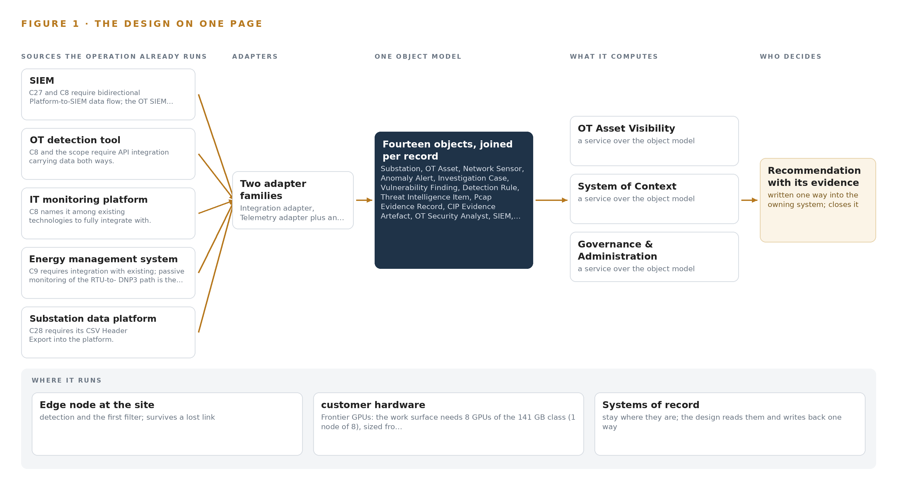
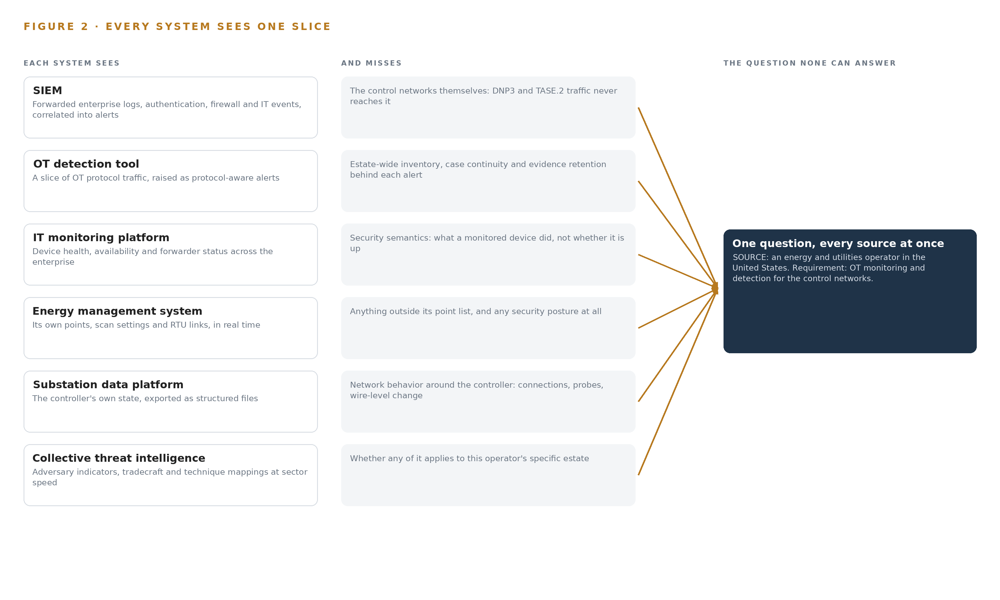
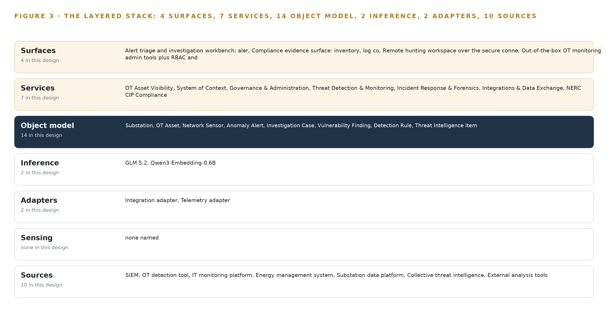
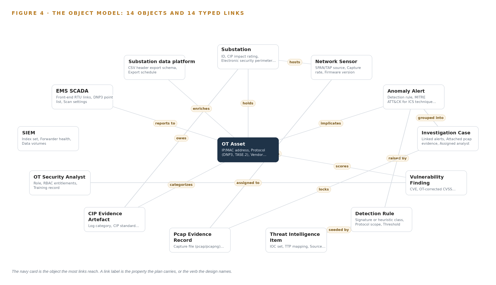
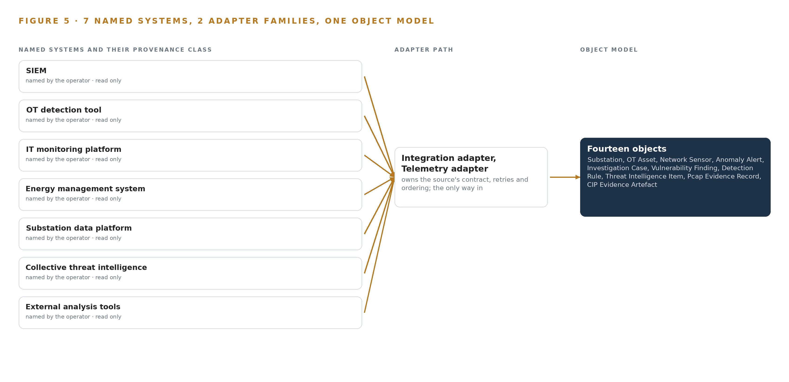
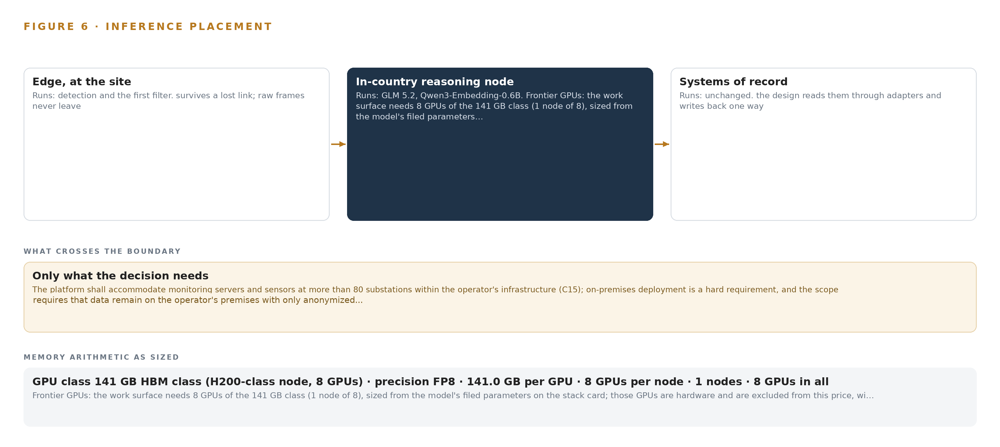
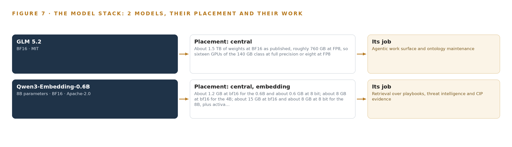
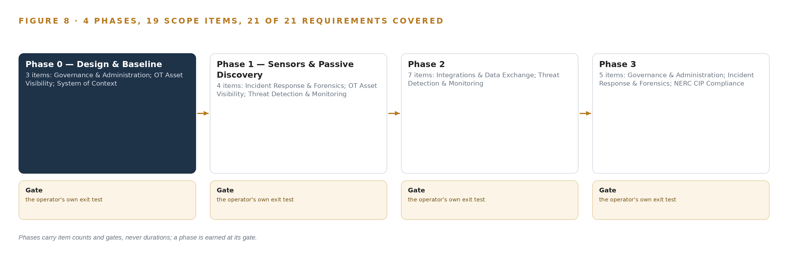
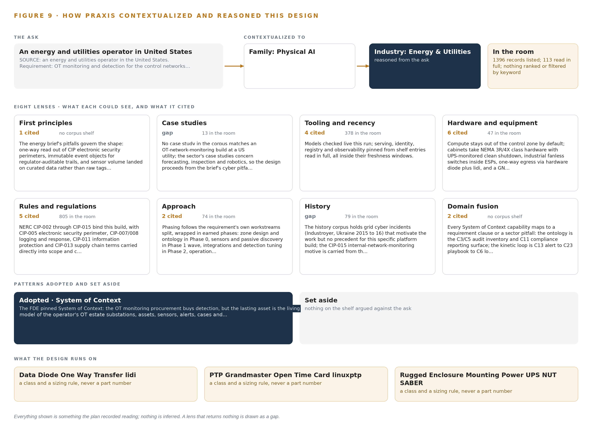

# Grid Context Watch: One system of context for OT Security and NERC CIP Evidence

Canonical: https://codeatoms.ai/ot-security-cip-evidence-us/
DOI: https://doi.org/10.5281/zenodo.23157957
PDF: https://codeatoms.ai/ot-security-cip-evidence-us/paper/grid-context-watch-ot-security-nerc-cip-evidence-utility-us.pdf
License: CC BY 4.0
Publisher: CodeNinja Atoms (https://codeatoms.ai), a fully owned subsidiary of CodeNinja

VERTICAL-DRIVEN ARCHITECTURES · ENERGY & UTILITIES · DESIGNED WITH PRAXIS · OCTOBER 2026

# Grid Context Watch: One system of context for OT Security and NERC CIP Evidence

A system of context, passive operational technology monitoring and agentic evidence assembly for an energy and utilities operator in the United States, fed one-way out of its control networks and run entirely on its own hardware.

CodeNinja Engineering Team

For the operational technology security lead, the compliance and CIP lead, and the platform, network, data and integration engineers who would build and run it.

---

Vertical-Driven Architectures is a CodeNinja series of system designs. Every design in the series is driven by a real-world problem and scenario in a single industry, and every one is designed on Praxis, CodeNinja's platform for designing physical AI systems. Operations are described by class, never by name.

At a glance

## OT security monitoring and NERC CIP evidence for a utility in the United States

**What this is.** An open reference architecture for system design in physical AI: one system of context that sees every device on a utility's control networks, flags abnormal behaviour and assembles the evidence a NERC CIP audit asks for, on the operator's own hardware. It is written for the OT security and CIP compliance leads and for the platform, network and integration engineers who would build it. The operator is described by class, never by name.

**The answer in numbers.**

| Part | The design |
| --- | --- |
| Sources joined | 10 source systems, including the SIEM, an OT detection tool, an IT monitoring platform, the energy management system and the substation data platform, through 2 adapter families |
| Object model | 14 typed objects and 14 links, with the OT asset as the focal object, published as JSON for reuse |
| Models | GLM 5.2 (MIT) for reasoning and Qwen3-Embedding-0.6B (Apache-2.0) for retrieval; detection stays in the procured sensors |
| Compute | One node of eight 141 GB HBM-class GPUs: 753 GB of FP8 weights, 904 GB with the 1.2 planning factor, against 1,128 GB |
| Boundary | Read only and one way out of the control networks; nothing writes into an electronic security perimeter, and no data leaves the operator |
| Three-year cost | About 510,000 dollars to own the reasoning node, about four fifths the deepest three-year AWS commitment (Appendix A) |
| Human control | Every triage, case and risk acceptance carries a named OT security analyst; agents draft, the analyst decides |

**Reuse it.** The object model, the model register and the figures are free to reuse under CC BY 4.0. Cite as DOI <https://doi.org/10.5281/zenodo.23157957.>

**Made with.** Reasoned on [Praxis](<https://codeatoms.ai/praxis/>), CodeNinja's platform for designing physical AI systems. The object model imports into [Hyper Ontology](<https://codeatoms.ai/hyper-ontology/>), which turns it into a living system. Both are in beta; access by request.

ABSTRACT

## An OT Estate Should Be Watched From One system of context, Not Five Fragmented Tools

An energy and utilities operator in the United States needs one answer about its operational technology estate: what is connected to the control networks behind its more than 80 substations, whether anything on those networks is behaving abnormally, and whether that can be proven with evidence when the regional reliability regulator arrives for its next audit. Today the answer cannot be produced, because asset discovery, network monitoring, log retention, threat intelligence and compliance reporting live in separate systems that each hold one slice of the picture. The stakes are set by regulation and by events: mandatory critical infrastructure protection standards for the bulk system (FERC 2008), a federal rule requiring internal network security monitoring for high and medium impact bulk system cyber systems (Federal Register 2023), and advisories showing state-affiliated actors actively exploiting programmable logic controllers across US critical infrastructure (CISA 2026).

The design is a system of context: one living model of the operational technology estate, holding 14 object types spanning substations, assets, sensors, alerts, cases, vulnerabilities, detection rules, threat intelligence, pcap evidence and CIP evidence artefacts. It is fed by 10 source systems entering through 2 adapter families, always read-only and one-way out of the control networks, so nothing in the design ever writes into an electronic security perimeter. Seven services and 4 surfaces carry asset visibility, detection, forensics, integration and compliance work; 2 models, a frontier-class reasoning model under an MIT license and an Apache-2.0 embedding model for retrieval, run on the operator's own hardware at its data center, sized to one node of eight GPUs of the 141 GB HBM class, with no weights rented and no data leaving the boundary.

The paper proceeds in four parts. Part I states the industry problem and the join failure across the operator's existing systems. Part II gives the constraints, the stack from systems of record to surfaces, the 14-object model, ingestion through adapters, inference placement and the memory arithmetic, and the models and licenses that decide ownership. Part III lays out the four-phase rollout with item counts and measured gates, and who owns what the design builds. Part IV closes with the conclusion and Chapter 11, how Praxis contextualized and reasoned this design.

---



Figure 1. Grid Context Watch on one page: the sources the operation already runs, one object model, what it computes, and the person who decides.

## Contents

Each chapter is tagged for the reader it serves most directly: Executive, Team Lead, FDE, Reference.

|  |  |  |
| --- | --- | --- |
|  | Abstract · An OT Estate Should Be Watched From One system of context, Not Five Fragmented Tools | Executive |
| PART I · THE PROBLEM | | |
| 1 | [A Control Network Cannot Defend What It Cannot See](#ch1) | Executive |
| 2 | [Every Operational System Sees One Slice of the Grid](#ch2) | ExecutiveTeam Lead |
| PART II · THE DESIGN | | |
| 3 | [Four Constraints Shape the Design Before Any Component](#ch3) | Team Lead |
| 4 | [One Stack Runs From Systems of Record to Surfaces](#ch4) | Team LeadFDE |
| 5 | [Fourteen Objects Turn Sensor Traffic Into One Living Model](#ch5) | FDE |
| 6 | [Every Source Enters Through an Adapter, Never Directly](#ch6) | FDE |
| 7 | [All Inference Runs on the Operator's Own Hardware](#ch7) | FDE |
| 8 | [The License Decides Whether the Operator Owns the Weights](#ch8) | FDEExecutive |
| PART III · THE ROLLOUT | | |
| 9 | [Shadow Mode and Measured Gates Come Before Scale-Out](#ch9) | Team LeadExecutive |
| 10 | [The Intelligence Should Stay with the That Produced It](#ch10) | Executive |
| PART IV · HOW IT WAS DESIGNED | | |
|  | Conclusion · The Same Shape Runs on Any Regulated Grid | Executive |
| 11 | [How Praxis Contextualized and Reasoned This Design](#ch11) | Team LeadFDE |
|  | [Sources](#sources) | Reference |

PART I · CHAPTER 1

## A Control Network Cannot Defend What It Cannot See

An energy and utilities operator must inventory, monitor and evidence more than 80 substations under NERC CIP, and passive visibility is now a regulatory requirement rather than a choice.

The abstract states the shape of the answer before the problem is established: one system of context, fed one way out of the control networks, read by agents on the operator's own hardware. This chapter establishes what question that system exists to answer, what the industry's failure to answer it has already cost, and what the operation it must serve actually runs.

### 1.1  The Question, the Data and the Regulatory Ground

The operation needs three questions answered continuously and provably: what is connected to every control network, what is each connected thing doing, and what evidence exists to show both under audit. Answering them requires data the operation must hold anyway: packet-level copies of operational technology traffic taken passively at each electronic security perimeter, an asset inventory carrying address, protocol, vendor, model, firmware version and critical infrastructure protection categorization for every device, security and application logs retained to the audit clock, change records that explain legitimate network evolution, and threat intelligence mapped to the techniques adversaries actually use against control systems.

The regulatory ground is fixed and layered. In 2008 the Federal Energy Regulatory Commission issued Order 706, making critical infrastructure protection reliability standards mandatory for the bulk system (FERC 2008). A 2023 federal rule then required internal network security monitoring for high and medium impact bulk system cyber systems, converting passive visibility inside the perimeter from good practice into an enforceable obligation (Federal Register 2023). The operator must therefore satisfy CIP-005 electronic security perimeters, CIP-007 and CIP-008 system security logging and incident response, CIP-010 change management, CIP-013 supply chain terms and CIP-015 internal network security monitoring, hold capture and log evidence against a three-year retention clock, and produce it to the regional enforcement entity when the audit arrives.

### 1.2  What the Blind Spot Has Cost the Industry

No ledger line names the cost of an unseen control network; the cost is documented in public incident records instead. A joint federal advisory warns that Iranian-affiliated cyber actors have exploited programmable logic controllers across US critical infrastructure, the exact device class an unmonitored network hides from its own operator (CISA 2026). When visibility is partial, the burden surfaces after the fact: a national cyber authority's follow-up analysis of an energy sector incident on 29 December 2025 shows how much reconstruction an investigator must perform to establish what happened inside an energy network (CERT Polska 2025). And the physical stakes of the same blind spot are not hypothetical: the 28 April 2025 Iberian blackout was called the most severe incident in the European power system in more than 20 years, a demonstration of how far grid behavior can depart from what its operators believe it to be (ENTSO-E 2025). For an operator under mandatory reliability standards, that cost takes three forms: forensic reconstruction after an incident, regulatory exposure at audit, and outage risk on a control path nobody was watching.

### 1.3  The Operation as a Scenario

The setting is an energy and utilities operator in the United States, fixed there by its own requirement. It runs a bulk system: an energy management system directing field devices over DNP3 from remote terminal units, TASE.2 ties to neighboring transmission, controllers exporting structured state, and more than 80 substations, each a candidate electronic security perimeter. Its enterprise side already holds a SIEM, an OT detection tool, an IT monitoring platform, collective threat intelligence and external analysis tools, ten named source systems in all, which this design reaches through two adapter families rather than direct connections.

The people in the loop are counted by role, not by org chart: OT security analysts who triage alerts and run investigations, compliance staff who assemble CIP evidence, and incident responders available through a vendor retainer, with no dedicated security operations center. The physical environments are cabinets and switchyards, the electronic security perimeter boundary drawn around each, and one central data center where the operator's own compute already lives. The programmatic frame is 21 contractual requirements spanning asset visibility, network visualization, OT monitoring and logging and compliance use cases, phased into 4 phases whose boundaries are gates, not dates.

PART I · CHAPTER 2

## Every Operational System Sees One Slice of the Grid

The operator's existing systems each hold one fragment of the operational technology picture, and none of them together can answer what is connected, what is anomalous and what can be proven.

Chapter 1 described an operation whose regulatory standing depends on knowing its own control networks. This chapter shows why it cannot know them today: every system it owns was built to watch one slice of the grid, and the slices do not join.

### 2.1  Each System Sees One Slice

The SIEM sees every log source that forwards to it: authentication events, firewall traffic, server and application logs, correlated into enterprise alerts. It misses the control networks themselves, because DNP3 sessions between remote terminal units and their station never reach it; this is precisely why the requirements demand bidirectional flow between the new platform and the SIEM rather than assuming it already exists. The OT detection tool sees a slice of operational technology protocol traffic and raises protocol-aware alerts, but an alert it raises has no durable home: no estate-wide inventory behind it, no case continuity around it, no evidence retention beneath it. The IT monitoring platform sees device health, availability and forwarder status across the enterprise, and carries no security semantics: it can report that a collector is down but cannot say what the collector was watching or what moved past it.

The energy management system sees its own points, scan settings and RTU links, and it is the process being defended rather than a sensor for it: it knows nothing outside its point list and cannot be repurposed as a security instrument without endangering the control path it serves. The substation data platform sees the controller's own state and exports it as structured files, but it is blind to the network behavior around the controller: what connects to it, what probes it, what changed on the wire between scans. Collective threat intelligence sees adversary tradecraft, indicators and technique mappings shared at sector speed, and knows nothing about this operator's estate, so it cannot say whether any of it applies here. External analysis tools see whatever an analyst exports to them; by then the data is frozen, and they see nothing live. Figure 2 sets these seven views side by side, each with its sees and its misses, converging on the question none of them can answer alone.



Figure 2. Seven systems, each seeing one part of the answer. the question needs all of them in one place at once.

### 2.2  Together They Still See Nothing Whole

What none of them see together is the join itself: one living model holds its assets, an asset holds its alerts, an alert holds its detection rule and its case, and a case holds the packet capture that proves what happened. The cost of that absence is concrete. At audit, the inventory is assembled by hand from spreadsheets and project files, and unidentified devices surface of the reviewer rather than of the operator. In the SOC-less daily round, alerts are triaged without asset context, and two tools can investigate the same anomaly without either knowing it. The 2023 internal monitoring rule makes this an enforcement matter rather than an inconvenience, because the evidence the rule demands is exactly the joined record no existing system produces (Federal Register 2023).

PART II · CHAPTER 3

## Four Constraints Shape the Design Before Any Component

One-way flow out of electronic security perimeters, data residency on the operator's own hardware, named human decisions, and a cheap first gate govern every choice downstream.

Chapter 2 showed seven systems each holding a fragment of the operational technology picture. The design joins those fragments into one system of context, but four constraints, fixed before any component was chosen, decide what that join may touch, where it may run, who may act on it and how cheaply it can be stopped.

### 3.1  One-Way Flow Out of the Perimeter

The first constraint is that data leaves the control network and nothing enters it. An electronic security perimeter is a regulatory boundary under CIP-005, and DNP3 is a control path, so analytics ride a copy of the traffic and never add a second writer to the wire. This is hard in this industry because conventional monitoring assumes agents and active probes that write into what they watch, and here an active probe would put packets onto a control path; a monitoring capability that can write is also a path an adversary can write, and federal advisories document actors exploiting exactly the device classes at the end of these wires (CISA 2026). The design therefore egresses through a constrained broker conduit by default and places hardware-enforced one-way transfer beside the highest-impact perimeters, where policy demands demonstrable one-way flow.

### 3.2  Residency on the Operator's Own Hardware

The second constraint is that every weight, index, capture and artifact stays on hardware the operator owns, inside its own data center, with no colocation and no external region. This is hard because operational technology estates trend isolated: the design must bring compute to the data rather than route data to compute, which means sizing central inference to run beside the networks it watches rather than assuming an elastic cloud behind them. Both models in the design run centrally on the operator's own nodes, and every source system's provenance class is the operator's own estate, so the boundary the data never crosses is also the boundary the weights never leave.

### 3.3  Every Flag Ends with a Named Person

The third constraint is that recommendations stop at the case and the playbook: nothing in the design writes to the energy management system, to protection relays or to the substation data platform, and every triage draft an agent produces carries a visible human decision on it. This is hard because the operator runs no dedicated security operations center, so an alert flood would not merely overload a team, it would erode trust until alerts stopped being read, the quietest and worst failure a detection program can have. Agent drafting exists here to be judged by a named analyst, not to act, and the design treats that judgment as the product rather than the overhead.

### 3.4  The First Gate Must Be Cheap to Fail

The fourth constraint is that the work can be stopped early and cheaply, on measurement rather than momentum. Phase 0 carries 3 items, zone and conduit design, the ontology of the operator's OT estate, and role-based access and on-prem identity design, and it gates everything downstream: the scale-out of sensors waits on measured inventory coverage at a 95 percent threshold, and false-positive rate is a first-class gate rather than a dashboard afterthought. The program runs as 4 phases matching the requirement's own 4.1 and 4.2 split, covering all 21 requirements, and no phase carries a duration: each boundary is a verdict point at which the sponsor can stop with an inventory, a baseline and a design, having bought nothing twice.

### 3.5  Scoping Decisions and What Each Costs

Every constraint above is free to state and expensive to honor, and a design that will not name its payments is not honest about either. Table 1 records the three scoping decisions that shape the build, what each buys the operator, and what each one costs.

Table 1 · Scoping Decisions

| Decision | What it buys | What it costs |
| --- | --- | --- |
| Central-only inference on one node in the operator's own data center | One hardware class to size, license, cool and maintain, and every model weight held inside the operator's boundary | The central link becomes load-bearing, so the design must define what degrades when it fails |
| Agents draft, a named person decides | Machine-speed triage and evidence assembly without any autonomous action in a regulated control environment | Alert throughput is bounded by the analysts' review cadence, which the false-positive gate exists to protect |
| No independent telemetry store; capture metadata and logs stay in the vendor platform and the SIEM | No duplicate storage to size, fund and reconcile against a three-year retention clock | Query load lands on existing systems, so every adapter contract must be built to their schemas |

### 3.6  What the Design Chose Against, and What Stays Out

A design is also defined by what it refuses, and the refusals carry reasons that a reviewer should be able to audit as easily as the choices. Table 2 records the alternatives the design turned down, and closes with the scope boundary it drew.

Table 2 · What the Design Chose Against

| Where | What was picked | Instead of, and why |
| --- | --- | --- |
| Detection engine | A procured OT monitoring platform for protocol parsing and signatures, with the ontology and agentic layer built above it | Instead of a from-scratch build on Zeek and Suricata, because the requirements demand vendor-grade OT signatures, accurate ATT&CK for ICS mapping and machine-speed collective intelligence that no open-source stack carries |
| One-way egress | Hardware data diodes at the highest-impact perimeters, a constrained DMZ broker conduit elsewhere | Instead of diodes, because a diode ends the argument only where policy demands demonstrable one-way flow, and its permanent operational burden elsewhere buys nothing |
| Frontier model | A 753B-parameter model under a plain MIT license | Instead of newer or larger alternatives carrying security-review or service triggers, because the license terms are the difference between the operator owning its weights and renting them |
| Sensing posture | Passive SPAN and TAP copies of OT traffic | Instead of active scanning inside control networks, because an active probe writes packets into a control path, which the one-way rule forbids outright |
| Scope boundary | SOC build-out, grid analytics, write paths into control systems, video analytics and metering scope all stay out | Instead of widening the program, because each addition carries its own procurement and would delay the audit-critical path of inventory, monitoring and evidence |

PART II · CHAPTER 4

## One Stack Runs From Systems of Record to Surfaces

A single layered stack carries sensor traffic from the control networks through adapters and one object model up to the services and surfaces the operator's people work in.

Chapter 3 fixed the constraints that shape this design: one-way reads out of the control networks, one object model as the lasting asset, and every inference on the operator's own hardware. This chapter lays out the stack that carries those constraints end to end, from the systems of record at the bottom to the surfaces where the operator's people decide.

### 4.1  One Pattern From the Control Networks to the Desk

The stack follows one pattern from bottom to top: systems of record below, one object model in the middle, applications and agents above. At the bottom sit the systems the operator already runs and trusts: the energy management system with its RTU-to-DNP3 control path, the SIEM, the OT detection tool, the IT monitoring platform, the substation data platform, and the vendor OT monitoring platform that parses protocols and carries signatures. Each remains authoritative for what it owns; the design replaces none of them and writes to none of them.

In the middle sits the system of context, the object model holding fourteen object types on an event backbone, fed one-way out of the control networks. Above it run seven services and four surfaces, and the agents that draft triage, retrieve playbooks and assemble CIP evidence, all on the operator's own hardware.

The pattern fits because the problem is a join problem. Adversaries have exploited programmable logic controllers across United States critical infrastructure (CISA 2026), and the federal rule requiring internal network security monitoring for high and medium impact bulk system cyber systems makes watching that traffic a compliance duty rather than an option (Federal Register 2023). A sensor answers one slice; the audit, the investigation and the vulnerability decision each need the alert joined to the asset, the asset to its the operator's impact rating, and the case to its evidence. Figure 3 shows the layered stack with the counts per layer: ten sources, two adapter families, fourteen object types, two models, seven services and four surfaces.



Figure 3. The layered stack: 10 sources, 2 adapter families, 14 objects, 7 services and 4 surfaces.

### 4.2  The Stack Stage by Stage

Table 3 walks the stack stage by stage and names the components in each. Two scoping choices are visible in the table: the design adds no independent telemetry store, because capture metadata and logs live in the vendor platform's own store and in the SIEM, and no operator model is placed inside an electronic security perimeter, because detection runs in the vendor's sensors and the central platform.

Table 3 · The Stack, Stage by Stage

| Stage | What it is responsible for | How |
| --- | --- | --- |
| Sources | Holding the operator's authoritative records | The energy management system, the SIEM, the OT detection tool, the IT monitoring platform, the substation data platform, the vendor platform's detection and log store, the sensor capture stream and the intelligence feeds, each read in place |
| Sensing | Watching OT network traffic passively | SPAN/TAP ports on hardened, fanless industrial switches inside each electronic security perimeter capture DNP3 and TASE.2 flows, timestamped against an OCP Time Card grandmaster running linuxptp and chrony |
| Adapters | Moving every record one way into the system of context | Two families: integration adapters for the API and CSV contracts with the SIEM, the OT detection tool, the IT monitoring platform and the substation data platform, and telemetry adapters for captures; egress through a DMZ conduit, with Lidi beside hardware data diodes at the highest-impact perimeters |
| Object model | Holding the single living model of the OT estate | the object model v0.9 carrying fourteen object types on RKE2, fed by Apache Kafka 4.3.1 |
| Inference | Drafting triage, retrieval and evidence assembly | GLM 5.2 at FP8, 753 billion parameters on one node of eight 141 GB HBM GPUs, beside Qwen3-Embedding-0.6B for retrieval, both served by vLLM |
| Services | Carrying the seven capabilities in scope | OT Asset Visibility, system of context, Governance & Administration, Threat Detection & Monitoring, Incident Response & Forensics, Integrations & Data Exchange and NERC CIP Compliance, with Keycloak for identity, Harbor for artifacts, and Prometheus 3.15.0, Grafana 13.2.3 and Loki 3.7.8 for observability |
| Surfaces | Putting the work of a named person | The alert triage and investigation workbench, the compliance evidence surface, the remote hunting workspace over the secure connection, and the platform administration tools with RBAC |

PART II · CHAPTER 5

## Fourteen Objects Turn Sensor Traffic Into One Living Model

The system of context holds every, asset, alert, case and CIP evidence artefact as typed, linked objects, and the human loop and the only write path live inside it.

Chapter 4 placed the object model at the center of the stack. This chapter opens it: the fourteen object types, the typed links between them, where the human loop and the only write path live, and one object in its recorded form.

### 5.1  Fourteen Objects and the Links That Join Them

The fourteen objects fall into four families. Sites and assets: substation, OT asset and network sensor. Events and records: anomaly alert, investigation case, vulnerability finding, detection rule and pcap evidence record. Documents: threat intelligence item and CIP evidence artefact. People and systems: OT security analyst, the SIEM, the energy management system and the substation data platform. Figure 4 draws every object and its typed links, with the OT asset in navy as the focal object.

The links are typed and directional. A substation holds OT assets and network sensors and carries a CIP impact rating that decides which CIP evidence artefacts it owes. An OT asset links to CIP evidence through its CIP categorization; an anomaly alert points at the detection rule that raised it and the asset it implicates; a vulnerability finding scores an asset and is assigned to an analyst for risk acceptance; an investigation case groups alerts and locks pcap evidence to itself; a threat intelligence item seeds detection rules; the substation data platform enriches assets with the export data the contract requires. The system objects anchor the model to the sources of record, so every derived property can be traced back to the system that produced it.

Because the links are typed, one query traverses the whole argument: from a single alert, the query reaches the rule that fired, the affected asset, that asset's substation and its impact rating, the analyst who owns the triage, and every evidence artefact the asset's categorization obliges the operator to retain. A document store holds the same records side by side but cannot traverse them, so each of those joins happens in an analyst's head or not at all.



Figure 4. The fourteen objects of the model and the typed links that let a query reach across them.

### 5.2  Where the Human Loop and the Write Path Live

The human loop lives in the analyst object and in the status vocabularies that reference it. Every alert that moves from new to triaged, every case that opens, and every vulnerability risk acceptance carries a named analyst, held in the object model with role, role-based access control entitlements and training record. Agents on the work surface draft triage notes, retrieve playbooks and assemble evidence, but the decision itself is a person's, recorded against the case.

The hosting posture follows the operator's own requirement. All fourteen object types live on the operator's hardware, in the operator's own data center, so nothing in the model leaves the operator's boundary. Identity runs through Keycloak with role-based access control. External links are outbound only: pulls from the collective and sector intelligence feeds, and the platform-to-SIEM exchange the integration contract requires. The only write path into the object model runs through the adapter tier and the services; nothing in the design writes to the energy management system, protection relays or the substation data platform, and recommendations stop at the case and the playbook.

### 5.3  One Object in Its Recorded Form

The block below shows the substation object in its recorded form: an identifier, a label, its kind, the properties passive discovery populates, the four statuses passive discovery allows, and the typed links out.

```
{
  "id": "substation", "label": "Substation",
  "kind": "site",
  "anchored_in": "OT monitoring platform inventory (to be created)",
  "properties": [
    "ID",
    "CIP impact rating",
    "Electronic security perimeter boundary",
    "Sensor count",
    "Criticality"
  ],
  "status_vocabulary": [
    "Not instrumented",
    "Sensor commissioned",
    "Baseline learning",
    "Monitoring"
  ],
  "links": [
    {
      "to": "ot-asset",
      "label": "holds"
    },
    {
      "to": "network-sensor",
      "label": "hosts"
    },
    {
      "to": "cip-evidence",
      "label": "owes"
    }
  ]
}
```

PART II · CHAPTER 6

## Every Source Enters Through an Adapter, Never Directly

Ten named source systems, from the energy management system to the SIEM and the substation data platform, enter through two adapter families that guarantee ordering, provenance and one-way direction onto an event backbone.

Chapter 5 described what the object model holds. This chapter describes how records reach it: ten named sources, two adapter families and one event backbone between them.

### 6.1  Ten Sources, Three Provenance Classes

Figure 5 maps every source to its provenance class and its adapter path. The design names ten sources in three provenance classes. Control-network telemetry: the RTU-to-DNP3 path the energy management system scans, observed one-way through the passive sensors, and the pcap capture stream those sensors produce. Operator systems of record: the SIEM, the OT detection tool, the IT monitoring platform, the substation data platform with its CSV header export, and the vendor OT monitoring platform's own detection and log store. External intelligence: the collective threat intelligence feed the contract requires, and the bodies named on the threat intelligence item object, vendor feeds, E-ISAC, DOE and INL, whose items arrive attributed and dated. External analysis tools complete the map as the sanctioned path for searching and exporting collected data for examination outside the platform. The provenance class matters because each class carries a different audit question: telemetry proves what was observed, systems of record prove what the operator already knew, and intelligence proves where a detection idea came from. Energy sector incidents keep proving the stakes; a December 2025 energy sector incident drew a full follow-up analysis from a national cyber authority (CERT Polska 2025).



Figure 5. The 10 named systems, the adapter path each one takes, and the object model they all map into.

### 6.2  What the Adapter Tier Guarantees

Both adapter families guarantee the same four things. Direction: every flow is a read out of a source; the adapters never write into a control network, and egress from the highest-impact electronic security perimeters passes hardware data diodes with Lidi beside them. Provenance: every event carries its source, its provenance class and its capture timestamp, so any object in the model can show where each property came from. Contract fidelity: integration adapters speak the published API contracts for the SIEM and the OT detection tool and the CSV header export schema for the substation data platform, with DNP3 and IEEE 1815 protocol context carried alongside. Replay: every adapter is idempotent, so a redelivered batch updates state once, and records that fail validation land in a quarantine queue instead of dropping silently.

### 6.3  The Event Backbone

The event backbone is Apache Kafka 4.3.1 in KRaft mode with three dedicated controllers, so the metadata quorum does not share brokers with data traffic. Events are partitioned by and asset identifier, which holds per-asset ordering while letting the cluster spread load. Delivery is at least once, and idempotent consumers make redelivery safe. Buffers absorb the loss link or a data center segment, sized from the capture rates measured in Phase 1 rather than from estimates. The log is replicated across the broker cluster, and retention is set well inside the evidence clocks the compliance objects carry, since pcap evidence lives in the evidence store, not in the backbone. Time discipline comes from the GNSS-disciplined grandmaster, so a pcap, a sensor event and a backbone record can be ordered against one another when an investigation needs them.

PART II · CHAPTER 7

## All Inference Runs on the Operator's Own Hardware

Detection stays in the procured sensors, reasoning runs on one GPU node at the operator's data center, and only curated data crosses the network boundary, never control traffic.

Chapter 6 described how every source enters the platform through an adapter and lands on the event backbone as an ordered, replayable stream. This chapter places the compute that turns those events into triage drafts, case evidence and answers, and it draws the one line the control networks depend on: data leaves the electronic security perimeter in one direction only, and nothing ever writes back.

### 7.1  Two Tiers of Inference and One Node of Memory Arithmetic

The design runs inference in two tiers, and neither tier puts a model of this design inside an electronic security perimeter. The first tier is detection, and it belongs to the procured OT monitoring platform: vendor signatures and heuristics running in the network sensors and the central platform, refreshed no less than monthly under the contract's update clause. Passive monitoring of the RTU-to-DNP3 path is a control path, so analytics ride a copy of the traffic taken at SPAN or TAP ports; the sensors are the procurement's own product, and the sensor and collector servers around them are fanless, extended-temperature, cabinet-mount class hardware placed outside electronic security perimeters wherever the topology allows (Federal Register 2023).

The second tier is reasoning, and it runs on one node of eight 141 GB HBM GPUs at the operator's own data center, serving the agentic work surface and the ontology. The arithmetic that fixes this node is worth writing out. The frontier model is filed at 753 billion parameters, the largest of the two models the register counts, because the GPUs must hold every weight at once. At FP8 precision, one byte per parameter, the weights occupy 753 GB. Applying the 1.2 planning factor for KV cache and activations raises the requirement to 904 GB. One node of eight GPUs at 141 GB each provides 1,128 GB, which holds the weights with 375 GB to spare beside them; the planning factor itself reserves about 151 GB of that headroom, and the serving register puts the KV cache ceiling at roughly 280 GB once serving overhead is accounted. The embedding model adds about 1.2 GB at BF16 beside it. A smaller GPU class cannot hold the FP8 weights, which is why the node is sized as it is. Figure 6 shows both tiers and what crosses between them.



Figure 6. Where each tier runs, what runs there, and the narrow set of outputs that cross the boundary.

### 7.2  The Latency Budget

The budget has three clocks, and only one of them may never slip. The first clock is detection: capture, parsing and signature matching happen in the procured sensors at line rate, and this design neither adds latency to that path nor touches it. The second clock is transport: curated events, alerts and inventory updates cross the adapters onto the event backbone in machine time, and the backbone's ordering guarantees mean the ontology always replays events in the sequence the networks produced them. The third clock is reasoning: agent triage drafts, playbook retrieval and evidence assembly run in seconds, and seconds are acceptable because the consumer is an analyst at a workbench, not a protection relay. A triage draft that arrives two seconds late costs nothing; an alert that arrives late costs an incident. That distinction sets every placement decision in this chapter. Container scheduling on the reasoning node runs on a hardened Kubernetes distribution, and Prometheus with Grafana and Loki watches the running system so a drifting clock or a saturating broker is seen before an analyst feels it.

### 7.3  What Crosses the Boundary, and What Fails

Only curated data crosses the network boundary, in one direction. By default, egress is a constrained DMZ broker conduit out of each zone; at the highest-impact electronic security perimeters, hardware-enforced data diodes paired with the one-way transfer appliance end the argument about demonstrable one-way flow. Nothing in this design writes to the energy management system, protection relays or the controller, so the boundary has no return path to protect.

Three failures matter. If a link fails, local detection continues unaffected because the sensors are autonomous; events buffer at the broker and the reasoning tier resynchronizes from the backbone when the link returns, so no alert is silently lost. If power fails, uninterruptible power supplies with network-monitored clean shutdown bring the cabinets down in order, and the GNSS-disciplined time card grandmaster holds over, keeping sensor, capture and log clocks in agreement so pcap evidence stays correlated across the outage. If the update path fails, the air-gapped artifact registry scans and stages signature updates, model artifacts and ontology changes offline, and the monthly vendor refresh under the contract's lifetime notification clause degrades in freshness rather than in availability. A stale detection set is an operational nuisance; a blind sensor is an audit finding.

PART II · CHAPTER 8

## The License Decides Whether the Operator Owns the Weights

A 753-billion-parameter model under an MIT license and an Apache-2.0 embedding model are sized to one node of eight 141 GB HBM GPUs, so the operator holds its intelligence outright.

Chapter 7 fixed where inference runs: detection in the procured sensors, reasoning on one node of eight 141 GB HBM GPUs on the operator's own hardware. This chapter names the models that occupy that node, the licenses that let a public utility hold them outright, and the register that ties every model, hardware class, sensing choice and pattern to the ground it stands on. Figure 7 shows the model stack: two models, both open weight, both served on the single central node, one doing the reasoning and one doing the remembering.



Figure 7. The two models, their placement, and the work each one does.

### 8.1  The Frontier Model That Serves the Work Surface

The reasoning model is GLM 5.2, a frontier-class language model filed at 753 billion parameters, at or above the 300 billion threshold that defines the frontier tier in the sizing rules. As published it occupies about 1.5 TB of weights at BF16, roughly 760 GB at FP8, which is what lets one node of eight 141 GB GPUs hold it, as Chapter 7's arithmetic showed. Its role is the work surface's role: OT security analysts and compliance staff are judgement-over-information workers, and the requirements specification names their workbench explicitly, an analyst workbench for native investigations, step-by-step playbook guides, and case management that auto-associates playbooks. On this model, agents draft triage decisions, retrieve the relevant playbook, assemble the CIP evidence artefact and maintain the ontology itself, all under a named human decision recorded in the case. Its context window of one million tokens suits long evidence chains and playbook reasoning that a smaller window would truncate. The reason it was chosen is its license: GLM 5.2 carries a plain MIT license with no revenue trigger and no security-review clause, which is the difference between the operator owning the weights and renting them. GLM 5.3 and Kimi K3 were weighed and set aside on exactly that ground.

### 8.2  The Embedding Model That Retrieves the Record

The retrieval model is Qwen3-Embedding-0.6B, a 0.6 billion-parameter embedding model under an Apache-2.0 license. It runs beside the frontier model on the same central node, occupying about 1.2 GB at BF16 or about 0.6 GB at eight-bit precision, and it converts playbooks, threat intelligence items and CIP evidence artefacts into retrievable passages. Its 32K window is the deciding property: a whole incident response playbook or a CIP procedure fits as one passage, so an agent retrieving guidance never reasons over a procedure cut in half. BGE-M3 was the runner-up and loses on window length. Because both models hold permissive licenses, the operator's ownership is complete: weights, fine-tunes, the ontology above them and the decision record they write, all on the operator's own on-premises hardware, with identity governed by the on-site identity provider and no external link in the serving path (Federal Register 2023).

### 8.3  The Model and Equipment Register

Table 4 closes the design's technical record. It ties each model to its license, each hardware class to its sizing rule, the sensing to its source, the patterns to their roles and the whole stack to the ground it runs on, so an engineer can build from the table and an auditor can trace the choice.

Table 4 · Model and Equipment Register

| The choice | What was picked | Why here |
| --- | --- | --- |
| Reasoning model | GLM 5.2, 753B parameters, frontier class, FP8, 1M context | Plain MIT license with no revenue trigger or security-review clause; one node of eight 141 GB HBM GPUs holds it; the work surface's role demands long-context agentic reasoning |
| Embedding model | Qwen3-Embedding-0.6B, Apache-2.0, 32K window | Whole playbooks and CIP procedures retrieve as single passages; runs beside the frontier model for about 1.2 GB at BF16 |
| Sizing rule | 1.2 planning factor over FP8 weights | 753 GB of weights times 1.2 is 904 GB against 1,128 GB of node memory, leaving governed headroom for KV cache and activations |
| Frontier compute | One node of eight 141 GB HBM GPUs | The smallest class that holds the FP8 weights; sized from the model's filed parameters |
| Edge compute | Fanless, extended-temperature, cabinet-mount class | Compute stays out of electronic security perimeters wherever topology allows |
| Enclosure and power | NEMA 3R/4X class cabinets with uninterruptible power supplies under Network UPS Tools | Clean shutdown ordering protects capture integrity environment |
| Time synchronization | OCP Time Card GNSS grandmaster with holdover, Linuxptp and chrony | Pcap, sensor and log clocks must agree for evidence to correlate |
| One-way transfer | Hardware data diodes with the one-way transfer appliance at highest-impact perimeters | Demonstrable one-way flow where policy demands it; constrained DMZ conduit elsewhere |
| Site networking | Hardened, fanless, dual-DC industrial switches with SPAN/TAP ports | Segmentation remains the operator's policy decision; the design reads a copy, never the control path |
| Sensing | Passive network traffic capture via the procured OT monitoring sensors at SPAN/TAP sources | The scope watches OT traffic, not premises; no cameras or video models |
| Primary pattern | System of Context over one Hyper-style object model of 14 objects | The lasting asset is the living model of the OT estate, not any single alert |
| Ground | The operator's own on-premises OT hardware and data center | Ownership of weights, ontology, decision record and boundary stays with the operator; identity and update paths run inside the air gap |

PART III · CHAPTER 9

## Shadow Mode and Measured Gates Come Before Scale-Out

Four phases, phased to the scope of work's own split, gate every expansion on measured inventory coverage and false-positive rates, so the next audit finds evidence that was never bolted on.

Chapter 8 fixed the model stack and its licenses: a frontier reasoner under MIT and an Apache-2.0 embedder, both held outright on the operator's own hardware. This chapter describes how the build reaches that state in four gated phases, phased to the scope of work's own split between passive sensor installation and platform integration, so that every expansion is earned by a measurement rather than a plan.

### 9.1  Four Phases with Gates, Not Durations

The rollout runs in four phases, shown in Figure 8, and every phase boundary is a verdict point where measured coverage and alert quality decide whether the work scales. Phase 0, Design and Baseline, carries 3 items across the Governance and Administration, OT Asset Visibility and system of context workstreams: the electronic security perimeter and conduit design, the ontology of the operator's OT estate, and role-based access control with on-premises identity design. Its exit gate is an approved zone and conduit design and an object model ready to receive passive discovery, because every later phase writes into that model and reworking it after sensors land means touching cleared spaces twice. Phase 1, Sensors and Passive Discovery, carries 4 items across the Incident Response and Forensics, OT Asset Visibility and Threat Detection and Monitoring workstreams: passive sensor installation across the substations, baseline learning and the first OT asset inventory, and protocol monitoring on the DNP3 and TASE.2 control paths. This phase implements the scope of work's own 4.1 split, the passive monitoring core, and its exit gate is measured inventory coverage at 95 percent with baseline learning complete; the design does not scale sensor rollout past that coverage number, because an inventory that reaches the audit incomplete is the failure the whole build exists to prevent. Phase 2 carries 7 items across the Integrations and Data Exchange and Threat Detection and Monitoring workstreams: the SIEM, OT detection, IT monitoring and substation data platform integrations, signature, heuristic and ATT&CK-for-ICS detection tuning, baseline deviation anomaly alerting, and passive vulnerability matching with operational-technology context. Its exit gate is the false-positive rate gate, held per input, because an alert flood with no security operations center erodes trust faster than any blind spot. Phase 3 carries 5 items across the Governance and Administration, Incident Response and Forensics, NERC CIP Compliance and system of context workstreams: incident response playbooks and the vendor forensics retainer, threat intelligence sharing with monthly updates, and the compliance evidence and audit pack. Its gate is production of that pack, and it closes the 21 requirements with 21 covered, none partial and none open. The internal network security monitoring obligation that motivates the evidence trail is itself a federal rule for high and medium impact bulk system cyber systems (Federal Register 2023), so the pack is built against a standing duty, not a one-time ask.



Figure 8. The four phases and their gates, and coverage of the 21 requirements across them.

### 9.2  What the Rollout Measures

Four measurements run from Phase 1 onward. Inventory coverage, the share of passively discovered assets that reach Categorized status, is the scale-out gate. The unidentified-asset count is reviewed weekly, enriched from the substation data platform export and project files, because every unidentified asset at audit time is a finding waiting to happen. False-positive rate is tracked per detection input and per sensor, so a single noisy feed cannot hide inside a fleet average, and per-input drift is instrumented alongside it. Capture growth is measured against the retention clock, with real capture rates from Phase 1 sizing the tiered storage rather than a paper estimate.

### 9.3  Lessons

**Shadow the flags before anyone trusts them.** Every detection runs against the live baseline in shadow before its alerts reach a triage queue, and the false-positive gate reads shadow behavior, not promises. A detection that earns its way out of shadow carries its own tuning history as evidence that the operator's security operations matured on a measured curve. Treat the cleared engineer as the scarce resource. The constraint that dominates this build is not compute or bandwidth but vetted people standing inside electronic security perimeters. Planning access on day one, and designing sensor work to be mirror-first wherever topology allows, is what keeps the phase boundary a verdict instead of a queue. Baselines age as fast as the network changes. A learned baseline is a snapshot of a network that is already moving, so the design treats every change record as an event that re-baselines deliberately. Without that loop, stale baselines manufacture false positives and bury real ones, and both failures surface first at an audit. Buy the detection engine, own the context. Vendor-grade signatures and threat intelligence cannot be rebuilt open source at the accuracy the requirements demand, so the design buys them. The lasting asset, the living model of the estate and every decision taken against it, stays with the operator, and that split is the difference between a procurement and a capability.

### 9.4  What Is Still Open

Three questions remain open, and settling each changes a downstream choice. First, tiered storage sizing waits on measured capture rates; settling it converts a provisional storage envelope into a firm one and fixes the purge policy inside the retention maximum. Second, whether hardware data diodes extend beyond the highest-impact perimeters is undecided; settling it trades capital and permanent operational burden against demonstrable one-way flow at more sites. Third, how agent triage drafts hand off to the vendor incident response retainer under stress is a playbook question; settling it turns the retainer from a contract clause into a rehearsed path, and it is the question the next audit would ask first.

Table 5 · Failure Modes

| What fails | What the design does |
| --- | --- |
| Sensor installation inside electronic security perimeters stalls on vetted-personnel access and lead times | Build the access plan on day one with named people, start Phase 1 on a mirror-first design, and treat the cleared engineer as the scarce resource |
| An alert flood with no security operations center stops being read | False-positive rate is a first-class gate, per-input drift is instrumented, and agent triage drafts carry a visible human decision |
| Passive discovery leaves unidentified assets uncategorized when the audit arrives | Weekly unidentified-asset review, the substation data platform and project-file enrichment, and the 95 percent inventory gate before scale-out |
| Capture and log storage grows unpredictably against the retention clock | Measure real capture rates in Phase 1, size tiered storage from measurement, and set purge policy inside the operator's own maximum |
| Baselines go stale after legitimate network changes | Feed change records and the substation data platform exports into baseline updates as events, and re-baseline deliberately |
| The build depends on the platform vendor for signatures, intelligence and updates | Lifetime vulnerability-notification terms, monthly update obligations, supply chain contract clauses, Harbor-scanned artifacts, and the ontology and agent layers held by the operator |

PART III · CHAPTER 10

## The Intelligence Should Stay with the That Produced It

The object model, the weights, the decision record and the boundary all remain the operator's property, which is the difference between owning a capability and renting one.

The rollout gates every expansion on measurement, but gates decide only when the build proceeds. This chapter settles who holds what the build produces, and why that holding, not any single feature, is what the procurement actually buys.

### 10.1  What the Operator Owns

The object model is the operator's. The fourteen objects, their typed links and the status vocabularies live in the platform layer, and the inventory, alerts, cases and evidence artefacts that accumulate in them are records of the operator's own estate, produced from the operator's own networks. The weights are the operator's: GLM 5.2 carries a plain MIT license with no revenue trigger or security-review clause, and the embedder carries Apache-2.0, so the operator holds its copies outright on its own on-premises hardware rather than renting inference from elsewhere. The decision record is the operator's: every alert triage, escalation, risk acceptance and evidence review is taken by a named person and kept as a case or a compliance artefact, so the trail an auditor reads is the trail the operator wrote. The boundary is the operator's policy object too: the design reads one way out of the control networks, writes nothing into them, and any future write-back is a separate perimeter change request, so the shape of the perimeter stays a decision the operator takes, not one the platform assumes.

### 10.2  The Offer Behind the Design

This design was produced on Praxis, CodeNinja's platform for designing physical AI systems, and it maps directly onto CodeNinja's offer: Hyper Ontology is the fourteen-object model that turns ten fragmented sources into one living picture of the operational-technology estate; Decision Systems is the ranking, attribution and reconciliation that put a triage draft, a playbook or an evidence bundle of a named analyst who decides; Hyper Pragma is the work surface where the operator's own analysts and compliance staff build the agents that draft that work; and Sovereign Infrastructure is the whole hosting posture, open-weight licenses held outright on the operator's own on-premises hardware, with nothing leaving the boundary it drew. CodeNinja builds the design; the operator keeps the intelligence.

PART IV · CONCLUSION

## The Same Shape Runs on Any Regulated Grid

In one view, the design is a read-only mirror of an operational technology estate turned into a single argument: passive sensors watch control traffic, adapters land what they see into one object model, agents reason over that model on hardware the operator owns, and every alert, case and piece of evidence lands in the same linked record the regulator's audit reads. The detection engine is bought, the context is, and the boundary is enforced in hardware where policy demands it.

Running the same shape elsewhere takes four things that transfer across regulated industries: a one-way read path out of the operational boundary so analytics never touch control, an object model that doubles as the audit inventory so compliance is a projection rather than a project, a frontier model held under a license that lets the operator own its weights on its own hardware, and phases gated on measured coverage rather than elapsed time. Any operator whose regulator asks it to prove what is on its networks can build this shape without replacing a single system of record.

PART IV · CHAPTER 11

## How Praxis Contextualized and Reasoned This Design

Every choice in this design traces to a recorded requirement, a sector pitfall or a pinned pattern, and this chapter shows the reasoning trail Praxis kept.

Chapter 10 established that the operator keeps the object model, the weights, the decision record and the boundary. This closing chapter shows how those choices were made, by walking the reasoning trail the design platform kept from the first read of the requirement to the last equipment class. Every design in this series is produced on Praxis, and this chapter lets a reader trace any choice in the design back to what justified it: a recorded requirement, a sector pitfall or a pinned pattern. Figure 9 shows the trail in one view: the ask as received, the family and industry assigned, the records read, the eight lenses consulted, the patterns adopted and set aside, and the equipment classes the reasoning landed on.

### 11.1  Contextualizing the Ask

The ask arrived as an OT monitoring procurement: passive monitoring and detection estate, a platform that makes the estate visible, and compliance evidence that survives a regulatory audit. Praxis assigned the design to the Physical AI family and the energy and utilities industry, with the industry pin taken by the field delivery engineer on this project. What was in the room was substantial: 1,396 records were listed, 113 of them read in full and the remaining 1,283 available on demand, including the full requirements specification and scope of work, the clause set behind every numbered requirement, and the intake answers that fixed the hosting posture on the operator's own on-premises hardware.



Figure 9. From the ask to the design: the family and industry Praxis assigned, the eight lenses and what each cited, the patterns adopted and set aside, and the equipment the design lands on.

### 11.2  The Eight Lenses

Praxis read the ask through eight reasoning lenses, recorded in Table 6 with what each could see, what it cited and what it contributed. Two lenses returned nothing and are shown as gaps: no case study in the corpus matches an operational-technology network monitoring build at a United States utility, and the history corpus holds grid cyber incidents that motivate the work but no precedent for this specific platform shape. The design therefore proceeds from the brief's own pitfalls and the requirement text, which is a honest reading rather than a borrowed one.

Table 6 · The Lenses and What They Contributed

| Lens | Could see | Cited | What it contributed |
| --- | --- | --- | --- |
| First principles | The sector brief's own pitfalls | 1 | One-way read out of electronic security perimeters, immutable event objects for auditable trails, analytics riding a copy of the control path rather than touching it |
| Case studies | 13 records | 0 | A gap: no corpus case matches this build, so the design stands on the brief's cyber pitfalls and the requirement itself |
| Tooling and recency | 378 records | 4 | Models checked live for the run; serving, identity, registry and observability components pinned from shelf entries read in full, all inside their freshness windows |
| Hardware and equipment | 47 records | 6 | Compute kept out of the control zone by default, extended-temperature cabinets, fanless industrial switches inside perimeters, one-way egress, and a GNSS-disciplined grandmaster so every clock agrees |
| Rules and regulations | 805 records | 5 | The reliability standards from CIP-002 through CIP-015 bound into scope, with logging, response, information protection and supply chain terms carried into contract clauses (FERC 2008; Federal Register 2023) |
| Approach | 74 records | 2 | Phasing wrapped around the scope of work's own split, each phase boundary a verdict point with a measured gate |
| History | 79 records | 0 | A gap: grid incidents in the corpus motivate the work but offer no precedent for this platform build; the internal monitoring motive carried over from the rules lens instead |
| Domain fusion | The requirement clauses themselves | 2 | Every capability mapped to a clause or a pitfall: the ontology is the audit inventory surface, the alert-to-playbook-to-evidence loop is the kinetic loop, and the one-way egress pattern is the projection mechanism, with no visible seam |

### 11.3  Patterns Adopted and Set Aside

One pattern was pinned as primary: system of context, because the procurement buys detection but the lasting asset is the living model of the estate, with substations, assets, sensors, alerts, cases and evidence projected into it one way and never written back. The one-way egress pattern was adopted beside it as the projection mechanism. Three alternatives were set aside with recorded reasons: a from-scratch open-source build lost because nothing open source carries vendor-grade signatures, mapping accuracy and machine-speed shared intelligence at the accuracy the clauses demand; hardware data diodes lost to a constrained broker conduit at most sites with diodes reserved for the highest-impact perimeters; and two newer frontier models lost to the one with the plainest license, because the license decides whether the operator owns the weights or rents them.

### 11.4  Where the Reasoning Lands

The reasoning lands on equipment classes rather than part numbers: fanless, extended-temperature cabinet-mount compute kept out of electronic security perimeters wherever topology allows; hardened dual-supply industrial switches with SPAN and TAP ports inside each perimeter; NEMA-rated enclosures with uninterruptible power and clean shutdown; a GNSS grandmaster with holdover so packet captures, sensors and logs agree on time; one-way transfer hardware beside data diodes at the highest-impact boundaries; and a single node of eight 141 GB HBM GPUs that holds the frontier weights at FP8 with headroom left for attention state. Each class is a decision the record can defend, and each traces back through Table 6 to the lens that justified it. Everything shown in this chapter was recorded reading: the clauses, the counts, the lens citations and the gaps are what the platform kept, and nothing here is inferred after the fact.

Appendix A

## What Ownership Costs Over Three Years

The design runs its reasoning tier on one GPU node in the operator's own data center. This appendix prices that node against the two ways a utility in the United States could otherwise get the same capability: renting the same accelerators from a cloud region, or buying a closed frontier model by the token. Every input is a public price, dated and cited, and the arithmetic is shown so any reader can rerun it with a written quote. The user count below is an assumption, stated where it is used.

### A.1 The Answer

Owning the reasoning node costs about **510,000 US dollars over three years**, inside a range of 426,000 to 600,000. Renting the same capacity around the clock costs **0.63 million to 1.66 million dollars** over the same period. Against the deepest three-year commitment listed (AWS, three-year EC2 Instance Savings Plan, all upfront), ownership is **about four fifths** the cost. Every rented option can stay inside the United States, so for a US utility the case for ownership is cost, control and a reasoning tier that sits inside the operator's own boundary, not residency.

### A.2 What Owning Costs

| Line | Basis | Three-year cost (USD) |
| --- | --- | --- |
| Frontier tier | One server of eight 141 GB HBM-class cards, 320,000 to 420,000 dollars, typical 370,000 (Mercatus 2026) | 320,000 to 420,000 |
| Support | 8 to 12 percent of hardware value a year (Introl 2026) | 77,000 to 151,000 |
| Power | 7 kW average draw of the server's 10.2 kW maximum (NVIDIA 2026) at a power usage effectiveness of 1.6 (Uptime Institute 2025), 294,336 kWh at the US industrial average of 9.77 cents per kWh in July 2026 (EIA 2026) | 29,000 |
| **Total** |  | **426,000 to 600,000, typical 510,000** |

The node is one server because GLM 5.2 is 753 GB at FP8 and needs 904 GB with the 1.2 planning factor, against 1,128 GB on eight 141 GB cards (Table 4).

### A.3 What Renting Costs

The same server, rented without a break for three years, because alerts arrive at night and an audit does not wait for business hours.

| Option | Basis | Three-year cost (USD) |
| --- | --- | --- |
| AWS, us-east-1, on demand | p5en.48xlarge at 63.296 dollars an hour (Vantage 2026) | 1.66 million |
| AWS, three-year EC2 Instance Savings Plan, all upfront | p5en.48xlarge at 23.80 dollars an hour, the deepest three-year plan in the region (AWS 2026) | 0.63 million |
| Azure, three-year reservation | ND96isr H200 v5 at 1,109,592 dollars for three years in East US 2 (Azure 2026) | 1.11 million |
| Specialist GPU cloud, on demand | 50.44 dollars an hour for eight H200 cards (CoreWeave 2026) | 1.33 million |
| Oracle, three-year commitment | 40 dollars an hour for eight H200 cards (Economize 2026) | 1.05 million |

Egress, storage and support plans are excluded, so every rented figure is a floor. Spot capacity is excluded because a triage service that can be evicted mid-incident is not a security control.

### A.4 What Closed Models Cost by the Token

A closed frontier model replaces the reasoning tier, and it is priced by use. At 25 users (an assumed count across the OT security analysts, compliance staff and incident responders the paper names), each running the equivalent of five agents at 2.4 billion tokens a year, with four input tokens to every output token and half the input served from cache, three years is 180 billion tokens.

| Model | List price per million tokens, input and output | Three-year cost (USD) |
| --- | --- | --- |
| Claude Sonnet 5.5 | 2 and 10 (Anthropic 2026) | 0.52 million |
| Gemini 3.1 Pro | 2 and 12 (Google 2026) | 0.59 million |
| Claude Opus 5.5 | 4 and 20 (Anthropic 2026) | 1.04 million |
| GPT-5.5 | 5 and 30 (OpenAI 2026) | 1.48 million |

The cheapest closed model costs about 21,000 dollars per user over three years, so it matches the owned node at about **25 users**. Below that a closed model by the token is cheaper; above it ownership is, and the gap widens with every user while the owned cost stays flat. Every closed option also sends network telemetry, alert context and compliance evidence about the bulk electric system to a third-party AI service outside the operator's boundary, which the design's constraints rule out.

### A.5 What the Price Does Not Include

- **The procured monitoring platform**: its sensors, collectors, licences and support are bought under the operator's own procurement and are carried the same in every option.
- **Site hardware the design specifies**: fanless collector servers, NEMA cabinets with UPS, GNSS time cards, industrial switches and data diodes at the highest-impact perimeters. Their count follows the operator's substation topology, which a site survey settles; every option carries them.
- **Sales tax, freight and installation**, which a written quote settles.
- **An export licence** does not apply: the hardware stays inside the United States.
- **People, facilities and implementation**, which both sides carry.
- **Price movement.** Cloud prices rose as well as fell in 2026; AWS raised its H200 capacity block price about 15 percent in January (Gigazine 2026).

### A.6 Sources for This Appendix

- AWS. 2026. Compute and EC2 Instance Savings Plans price file, us-east-1, version 20261003071546. <https://pricing.us-east-1.amazonaws.com/savingsPlan/v1.0/aws/AWSComputeSavingsPlan/current/region_index.json>
- Anthropic. 2026. Pricing. <https://claude.com/pricing>
- Azure. 2026. Retail prices, Standard\_ND96isr\_H200\_v5. <https://prices.azure.com/api/retail/prices>
- CoreWeave. 2026. Pricing. <https://www.coreweave.com/pricing>
- EIA. 2026. Electric Power Monthly, Table 5.6.A, July 2026. <https://www.eia.gov/electricity/monthly/epm_table_grapher.php?t=epmt_5_6_a>
- Economize. 2026. OCI BM.GPU.H200.8 pricing. <https://www.economize.cloud>
- Gigazine. 2026. AWS raises EC2 Capacity Blocks prices. <https://gigazine.net>
- Google. 2026. Gemini API pricing. <https://ai.google.dev/gemini-api/docs/pricing>
- Introl. 2026. GPU infrastructure TCO model. <https://introl.com/blog/gpu-infrastructure-tco-model-5-year-enterprise-ai-deployment>
- Mercatus. 2026. H200 server price. <https://mercatus-ai.com/blog/h200-server-price>
- NVIDIA. 2026. DGX H200. <https://www.nvidia.com/en-us/data-center/dgx-h200/>
- OpenAI. 2026. API pricing. <https://developers.openai.com/api/docs/pricing>
- Uptime Institute. 2025. Global Data Center Survey 2025. <https://uptimeinstitute.com>
- Vantage. 2026. EC2 instance prices. <https://instances.vantage.sh>

SOURCES

## Source Register

ENTSO-E. 2025. Grid Incident in Spain and Portugal on 28 April 2025 » ICS Investigation Expert Panel » Factual Report » 3 October 2025. <https://eepublicdownloads.blob.core.windows.net/public-cdn-container/clean-documents/Publications/2025/iberian-blackout/entso-e_incident_report_ES-PT_April_2025_06.pdf>

CERT Polska. 2025. Follow-Up Analysis of the 29 December 2025 Energy Sector Incident. <https://cert.pl/uploads/docs/CERT_Polska_Energy_Sector_Incident_Follow_up_Report_2025.pdf>

Federal Register. 2023. Federal Register :: Internal Network Security Monitoring for High and Medium Impact Bulk Electric System Cyber Systems. <https://www.federalregister.gov/documents/2023/02/09/2023-01453/internal-network-security-monitoring-for-high-and-medium-impact-bulk-electric-system-cyber-systems>

FERC. 2008. 122 FERC ¶ 61,040 UNITED STATES OF AMERICA FEDERAL ENERGY REGULATORY COMMISSION 18 CFR Part 40 Docket No. RM06 to 22 to 000; Order No. 706 Mandatory Reliability. <https://www.ferc.gov/sites/default/files/2020-05/E-2_101.pdf>

CISA. 2026. Iranian-Affiliated Cyber Actors Exploit Programmable Logic Controllers Across US Critical Infrastructure. <https://www.cisa.gov/sites/default/files/2026-07/aa26-097a-iranian-affiliated-cyber-actors-exploit-programmable-logic-controllers-across-us-critical-infrastructure_508c.pdf>

---

### About CodeNinja

CodeNinja is a Middle Eastern-American artificial intelligence lab focused on building self-improving systems. We are reinventing knowledge work to close the loop between vertical AI use cases and the generalized intelligence that fuels it, accelerating the path toward organizational superintelligence.
