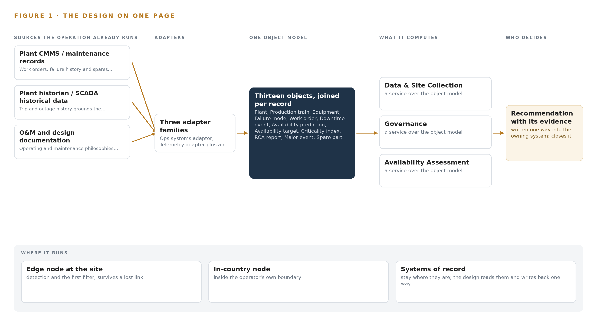
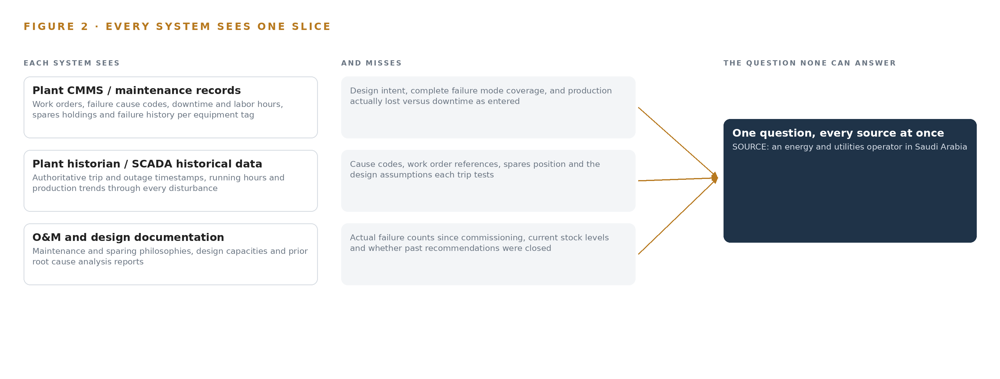
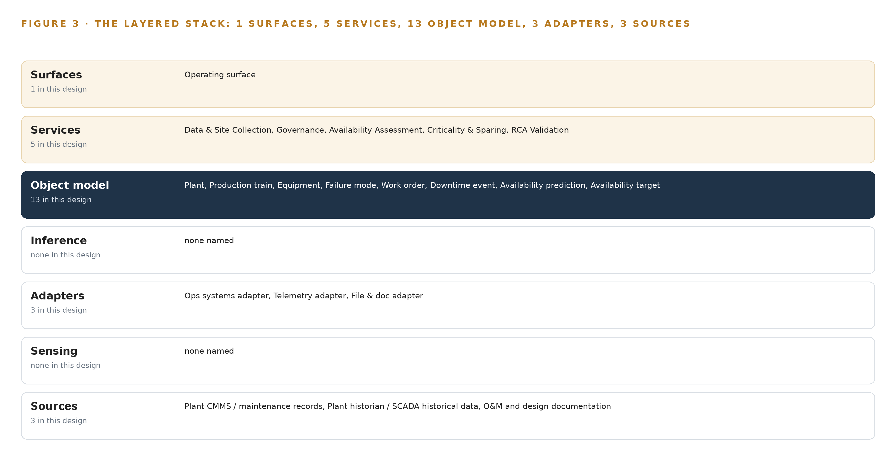
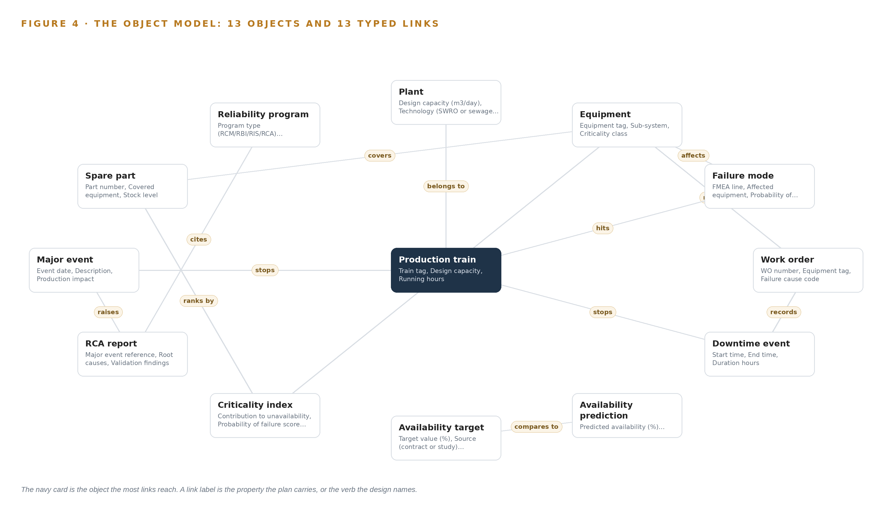
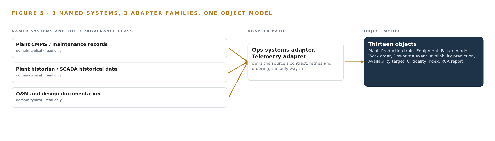
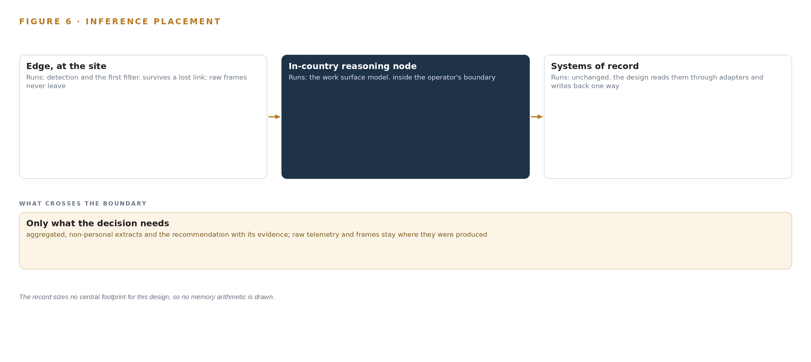
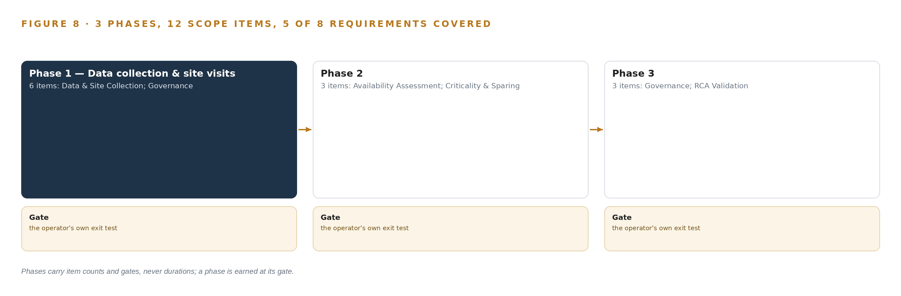
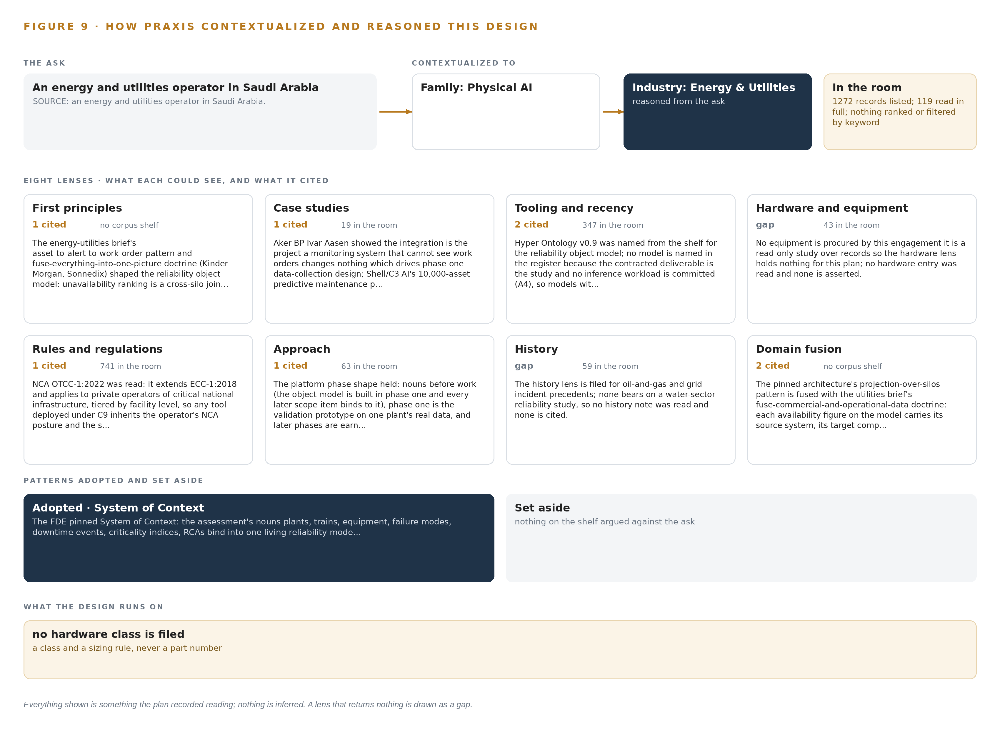

# Reliability Atlas: A Plant Reliability Assessment Study the Operator Can Audit

Canonical: https://codeatoms.ai/plant-reliability-assessment-saudi-arabia/
DOI: https://doi.org/10.5281/zenodo.23157965
PDF: https://codeatoms.ai/plant-reliability-assessment-saudi-arabia/paper/reliability-atlas-plant-reliability-assessment-saudi-arabia.pdf
License: CC BY 4.0
Publisher: CodeNinja Atoms (https://codeatoms.ai), a fully owned subsidiary of CodeNinja

VERTICAL-DRIVEN ARCHITECTURES · ENERGY & UTILITIES · DESIGNED WITH PRAXIS · OCTOBER 2026

# Reliability Atlas: A Plant Reliability Assessment Study the Operator Can Audit

A living reliability object model turns each plant's maintenance records, historian trips and design documents into auditable availability, criticality and root cause evidence for an energy and utilities operator in Saudi Arabia.

CodeNinja Engineering Team

For the asset management and reliability lead accountable for plant availability, the plant and project managers who own the data and the decisions, and the reliability, data and platform engineers who would build and run it.

---

Vertical-Driven Architectures is a CodeNinja series of system designs. Every design in the series is driven by a real-world problem and scenario in a single industry, and every one is designed on Praxis, CodeNinja's platform for designing physical AI systems. Operations are described by class, never by name.

At a glance

## An auditable plant reliability assessment in Saudi Arabia

**What this is.** An open reference architecture for system design in physical AI: a records-based reliability and availability assessment that joins each plant's work orders, trip history and design documents into one reliability object model the operator owns, so every availability figure, criticality rank and root cause finding traces to its source. It is written for the asset management and reliability lead and for the reliability, data and platform engineers who would build it. The operator is described by class, never by name.

**The answer in numbers.**

| Part | The design |
| --- | --- |
| Sources joined | 3 record sources (plant CMMS, plant historian, O&M and design documentation) through 3 read-only adapters, as exports rather than live interfaces |
| Object model | 13 typed objects and the typed links Figure 4 draws, published as JSON for reuse |
| Models | None: the register is empty by design because no inference workload is contracted |
| Method | Availability by Monte Carlo simulation on reliability block diagrams built from each plant's own failure study, auditable to ISO 55000 |
| Compute | No hardware bought; the study runs on the operator's own in-country servers |
| Three-year cost | No hardware line to price: the cost is the assessment work itself (Appendix A) |
| Human control | Predictions are accepted only by a named reviewer and RCA reports validated only by a named engineer |

**Reuse it.** The object model, the model register and the figures are free to reuse under CC BY 4.0. Cite as DOI <https://doi.org/10.5281/zenodo.23157965.>

**Made with.** Reasoned on [Praxis](<https://codeatoms.ai/praxis/>), CodeNinja's platform for designing physical AI systems. The object model imports into [Hyper Ontology](<https://codeatoms.ai/hyper-ontology/>), which turns it into a living system. Both are in beta; access by request.

ABSTRACT

## Availability Should Be Argued From One Joined Record, Not Assembled Report by Report

Which systems actually drive unavailability at each plant, whether installed sparing matches equipment criticality, and whether past root cause analyses (structured investigations into why major events happened) hold up under scrutiny: these are the questions the assessment must answer, and they cannot be answered today because each plant's work orders, trip history and design documents live in separate systems that were never joined, so every availability figure must be rebuilt by hand and defended without a traceable basis.

The design is a records-based reliability assessment anchored on one living reliability object model the operator owns: 3 source systems (plant CMMS, plant historian, O&M and design documentation) enter through 3 adapters (ops systems, telemetry and file and document families) into 13 objects spanning plants, trains, equipment, failure modes, work orders, downtime events, availability predictions and targets, criticality indices, spare parts, major events, RCA reports and reliability programs, served by 5 services (data and site collection, governance, availability assessment, criticality and sparing, RCA validation) on 1 operating surface, with 0 models in the register because no inference workload is contracted; everything runs in the operator's own in-country environment, and the deliverable is an auditable study per ISO 55000 rather than a rented tool.

The paper states the problem and its documented cost, shows why no single system can answer the availability question, then works through the constraints, the layered stack, the object model, ingestion, inference placement (none is contracted), the empty model register, the phased rollout gated on the requirement's own milestones, and who owns what the study builds, closing with the Praxis chapter that traces every design choice to its recorded reasoning.

---



Figure 1. Reliability Atlas on one page: the sources the operation already runs, one object model, what it computes, and the person who decides.

## Contents

Each chapter is tagged for the reader it serves most directly: Executive, Team Lead, FDE, Reference.

|  |  |  |
| --- | --- | --- |
|  | Abstract · Availability Should Be Argued From One Joined Record, Not Assembled Report by Report | Executive |
| PART I · THE PROBLEM | | |
| 1 | [Plant Reliability Is Judged From Evidence Nobody Joins](#ch1) | Executive |
| 2 | [Every Plant System Holds One Slice of the Record](#ch2) | ExecutiveTeam Lead |
| PART II · THE DESIGN | | |
| 3 | [Four Commitments Anchor the Reliability Study](#ch3) | Team Lead |
| 4 | [One Object Model Spans Records, Study and Deliverable](#ch4) | Team LeadFDE |
| 5 | [Thirteen Objects Turn Plant Records Into One Reliability Argument](#ch5) | FDE |
| 6 | [Every Record Enters Through an Adapter, Never Directly](#ch6) | FDE |
| 7 | [No Inference Tier Serves Until the Operator Commits](#ch7) | FDE |
| 8 | [The Model Register Stays Empty by Design](#ch8) | FDEExecutive |
| PART III · THE ROLLOUT | | |
| 9 | [Milestone Evidence, Not Calendar Hope, Gates Each Phase](#ch9) | Team LeadExecutive |
| 10 | [The Reliability Model Belongs to the Operator](#ch10) | Executive |
| PART IV · HOW IT WAS DESIGNED | | |
|  | Conclusion · An Assessment Worth Auditing Is One Worth Owning | Executive |
| 11 | [Every Choice Here Is Traceable to a Recorded Reason](#ch11) | Team LeadFDE |
|  | [Sources](#sources) | Reference |

PART I · CHAPTER 1

## Plant Reliability Is Judged From Evidence Nobody Joins

The operator needs one defensible answer on availability, criticality and root causes at each plant, and today the evidence for that answer sits in separate systems that were never designed to be read together.

The abstract set out the shape of the design: one reliability object model, three source systems, five services, and a study whose every figure can be traced to a record. This chapter establishes why that shape is needed, by stating the question the operator must answer, the cost of leaving it unanswered, and the operation as it actually runs.

### 1.1  The Question the Operation Needs Answered

The operator, an energy and utilities operator in Saudi Arabia, has asked for a reliability and performance assessment across its desalination and treatment portfolio: two seawater reverse osmosis plants and a third treatment site, each operated under a separate project company on a build-own-operate or build-own-operate-transfer contract. The question the operation needs answered is narrow and unforgiving: at each plant, what is the true production availability, what ranks as the dominant contribution to unavailability, are the installed spares matched to that ranking, and do the root cause analyses written after major events actually hold up against the plants' own history. Answering it requires three classes of data that today sit apart: maintenance records with work orders, failure cause codes, downtime hours and spares holdings; historical trip and outage data from the plant historian and supervisory control systems; and the operating and maintenance philosophies, design documents and prior root cause analysis reports that state what the plant was designed to do.

The regulatory ground is layered. The requirement itself demands that the study be traceable and auditable to ISO 55000, the international standard for asset management, which means every availability figure must carry its source, its method and its revision. The plants fall under the national cybersecurity authority's operational technology controls for critical national infrastructure, OTCC-1:2022, which applies to private operators of such infrastructure and tiers its requirements by facility level, so any tooling used near the plants inherits the operator's existing security posture. Above all of this sit the national Vision 2030 water targets, which the water ministry is charged with meeting and which make reliable supply a matter of public commitment, not only contract performance.

### 1.2  The Documented Cost of the Problem

The cost of fragmented reliability evidence is documented beyond this operator. Industry analysis argues that ambiguous terminology and disconnected data in energy and utility software carry a hidden cost, because adapting infrastructure to growth requires stakeholders to agree on what the core data terms mean, and disagreement surfaces as rework, delay and disputed figures (Utility Dive 2025). The safety dimension is starker: a utility worker was fatally shocked after touching a line he had been told was safely de-energized, and the family's suit turns on the gap between a recorded state and the physical truth (Hoodline 2026). A reliability regime built on records nobody joins fails the same way in slow motion: an availability number is asserted, a spare is assumed held, a root cause is accepted, and none of it is checked against the joined evidence.

### 1.3  The Operation as a Scenario

The operation runs three plants through separate project companies under long-term concession contracts spanning decades from their planned commercial operation dates. The desalination plants produce drinking water at a scale the requirement itself prints in the hundreds of thousands of cubic meters per day, and the printed figure for one plant carries an apparent typographical error that the study resolves from the plant's design documents rather than the requirement text. Each plant runs multiple production trains with sparing configurations, so availability is a designed property that erodes through failures, not a single number on a dashboard. The people in the loop are named by role: the operator's project manager who facilitates data access, the project companies' maintenance planners and operations staff, the assessment team's reliability engineers who build and defend the analysis, and the named people who sign the findings. The physical environments are coastal seawater intake and reverse osmosis halls and a treatment site, corrosive, continuous-duty, and unforgiving of a wrongly ranked failure. Three named source systems, three plants, and one question: the named systems count is three, the roles in the loop number four, and the places are the three project sites. The next chapter shows why no existing system can answer that question alone.

PART I · CHAPTER 2

## Every Plant System Holds One Slice of the Record

The CMMS knows the work orders, the historian knows the trips, the document packs know the design intent, and none of them alone can rank what actually causes unavailability.

Chapter 1 defined the question and the three classes of evidence it demands. This chapter walks through what each source system actually sees, what each one misses, and what the gaps cost when the assessment is attempted from any one of them. Figure 2 sets the three systems side by side against the question none can answer alone.

### 2.1  What Each System Sees and What It Misses

The plant's maintenance management system is the richest single slice. It sees work orders with equipment tags, failure cause codes, downtime hours and labor hours; it sees the spares held against each asset and the failure history count that hints at MTBF, the mean time between failures. What it misses is context: it does not know the design intent behind a sparing configuration, it cannot confirm that its cause codes form a complete failure mode taxonomy, and it records downtime as entered, not as the plant physically lost production.

The historian and supervisory control historical data hold the physical truth of operation. They see trip and outage events with authoritative timestamps, running hours, and the production trend through every disturbance, which grounds the availability baseline and validates the failure rates any simulation will consume. What they miss is the why and the what-next: no cause code, no work order reference, no spares position, no link to the design assumption the trip just falsified.

The operating, maintenance and design documentation holds the intent. It sees the maintenance philosophies, the sparing philosophy the designers assumed, the design capacities, and the prior root cause analysis reports written after major events. What it misses is everything that happened since the documents were signed: actual failure counts, current stock levels, whether the recommendations in an old report were ever closed.



Figure 2. Three systems, each seeing one part of the answer. the question needs all of them in one place at once.

### 2.2  What None of Them See Together

None of the three can produce the deliverables the requirement names. Unavailability ranking requires a join: downtime events from the historian, attributed through cause codes in the maintenance system, weighted by consequence from the design documents. Sparing confirmation requires comparing held spares against a criticality index that itself joins probability of failure with production consequence. Root cause validation requires reading a prior report against the failure history that accumulated after it was written. In practice this join is rebuilt by hand for every report, in spreadsheets whose lineage cannot satisfy an ISO 55000 audit, and whose terminology differs from system to system in ways the industry itself documents as a recurring cost (Utility Dive 2025). A figure asserted from one slice and never joined is the reliability version of trusting a de-energization record that was never verified against the wire (Hoodline 2026). The design that follows exists to make that join once, as a queryable object model, instead of once per report.

PART II · CHAPTER 3

## Four Commitments Anchor the Reliability Study

Auditability to ISO 55000, ownership of the model, read-only access to the plants and deliverables scoped to the requirement's own milestone list shape every downstream choice, and each commitment costs something the design accepts.

Chapter 2 showed that the deliverables live in the join, not in any single system. This chapter fixes the four commitments that shape how the join is built, states what each one costs, and records what the design chose against.

### 3.1  Auditability to ISO 55000

The requirement requires the study to be traceable and auditable to ISO 55000, the asset management standard that demands documented, repeatable methods behind every reported figure. This is hard in the water sector because reliability evidence arrives as exports in inconsistent formats and document packs in mixed languages, so a naive analysis buries its assumptions in spreadsheet cells nobody can re-derive. The design therefore makes every availability figure, criticality rank and root cause validation a property on the object model, carrying its source system, its method and its revision, so the audit trail is the data structure rather than an appendix.

### 3.2  The Operator Owns the Model

The reliability object model is built so the operator owns it outright, because the same assessment repeats across the plants and across the years, and a model that compounds beats a report that is read once. This is hard because consultancies traditionally deliver findings as documents, which keeps the method rented and the next assessment a fresh purchase. The cost the design accepts is that the ontology foundation layer must be built in phase one, before any availability number exists to show for it.

### 3.3  Read-Only Access to the Plants

The study reads each plant only through exports and document packs collected during site visits, crossing through the operating companies' own IT channels. This matters because the plants are critical national infrastructure under the national cybersecurity authority's operational technology controls, tiered by facility level, and any connection into a control network would import an entire compliance program the requirement never funded. The cost is that data is a snapshot per visit, never live, and the collection plan depends on facilitation by the operator's project manager rather than a contractual mandate.

### 3.4  Deliverables Bind to the Requirement's Milestones

Every scope item binds to the requirement's own milestone gates: data collection evidences the first payment milestone, and reports with comments closed evidence the second, while the contract caps delay penalties at 20 percent of contract value. This is hard because the schedule per project runs from purchase order and compresses badly under data access friction, so the phases are gated on evidence, not on calendar hope.

### 3.5  Scoping Decisions and Their Costs

Three decisions carry the design's shape, each bought at a stated price, as Table 1 records.

Table 1 · Scoping Decisions

| Decision | What it buys | What it costs |
| --- | --- | --- |
| One reliability object model as the study's spine | Every figure carries its source, method and revision, and the assessment can be re-run per project | The ontology is built in phase one, before the assessment numbers appear |
| Read-only access through exports and document packs | No connection touches any control network, so no new cybersecurity surface at critical infrastructure | Data is a snapshot per collection visit, not live |
| Agent work surface offered but not committed | No inference workload is contracted, so licensing and hardware stay simple | Analysts read findings from the model without an interactive assistant until the operator confirms it wants one |

### 3.6  What the Design Chose Against

Each rejection below was a live alternative, and each was set aside for a stated reason, as Table 2 records.

Table 2 · What the Design Chose Against

| Where | What was picked | Instead of, and why |
| --- | --- | --- |
| Availability method | Monte Carlo simulation on reliability block diagrams built from each plant's own failure and downtime data | A packaged availability tool, because the study must be traceable to ISO 55000 and the requirement makes any tool optional: a method the operator can re-run and audit outranks a rented black box |
| Study outputs | Objects on a living reliability object model the operator owns | Static report documents only, because the same assessment repeats per project and the model compounds while a report is read once |
| Data access | Exports and document packs through the operating companies' IT channels | Live integration into plant control systems, because no platform connection should touch a distributed control or supervisory network in a records-based study |
| Site verification | Engineer walkdowns | Cameras or new instrumentation, because no field equipment is procured and the evidence base is the plants' own records |
| Contracted scope | The assessment studies named in the requirement's scope section | Enterprise resource planning features, which the requirement's general terms penalize elsewhere but which this scope never included, recorded in the kick-off minutes |
| Out of scope | Reliability program implementation, historic data migration, third-party license fees, hardware and infrastructure | All left with the project companies and the operator, because the study assesses and recommends and does not execute |

PART II · CHAPTER 4

## One Object Model Spans Records, Study and Deliverable

The architecture is deliberately thin: systems of record stay untouched below, one reliability object model in the middle carries every finding as a queryable object, and the services and operating surface above produce the auditable studies.

Chapter 3 fixed the constraints: a read-only study over records, auditable to ISO 55000, that touches no plant system and installs no field hardware. This chapter shows the thin stack that carries those constraints, and why a records-based engagement earns its keep partly by what it deliberately leaves out.

### 4.1  The Three-Layer Pattern, Applied Thinly

The architecture follows the pattern the series designs on: systems of record below, one object model in the middle, applications and agents above. At the bottom sit the three source systems the study reads: each plant's computerized maintenance management system (CMMS), the plant historian holding SCADA historical data, and the O&M and design documentation packs. These systems are never replaced, never modified and never loaded with new software; the study reads exports from them and writes nothing back, and no platform connection ever touches a plant control network. In the middle sits one reliability object model, a projection over those silos rather than a shadow copy of any one of them, holding thirteen object types from plant down to reliability program. Above it run five services and one operating surface. The pattern fits this engagement because the contracted output is an auditable argument: every availability figure, criticality rank and root cause analysis (RCA) validation finding must carry its source system, its method and its review status, and that argument can only live where the silos join. Figure 3 shows the layered stack with the component count at each layer, and the deliberate emptiness of two layers, instrumented sensing and served inference, is part of the design rather than an omission.



Figure 3. The layered stack: 3 sources, 3 adapter families, 13 objects, 5 services and 1 surfaces.

### 4.2  The Stack Stage by Stage

Table 3 walks the stack in order and names the components at each stage. Three stages deserve comment beyond the table. Sources are exactly the three systems named in Chapter 6, read in place. Sensing is, in this scope, the engineer walkdown and the document pack collected on site: the stage exists in the pattern, and this study fills it with human observation rather than cameras or instruments, because site verification is a records exercise and no field hardware is procured. Inference is carried deliberately light: the analytic workload is a Monte Carlo availability simulation on reliability block diagrams built from each plant's own failure and downtime data, run inside the assessment tooling, and the model register is empty because the contracted study is the deliverable, not a predictive service. Services and surfaces carry the named components: five study services and one operating surface through which the operator's reviewers read, query and accept findings.

Table 3 · The Stack, Stage by Stage

| Stage | What it is responsible for | How |
| --- | --- | --- |
| Sources | Holding the evidence base: work orders, failure history, trip and outage history, O&M and design records | Read in place as exports and document packs during site visits; never modified |
| Sensing | Capturing physical verification at the plants | Engineer walkdowns and on-site document collection; no cameras or instruments in scope |
| Adapters | Mapping each source's native format into the object grammar | Three adapter families: ops systems adapter, telemetry adapter and file & doc adapter; all read-only |
| Object model | Carrying thirteen object types and their typed links as one queryable projection | An ontology store operated in-country, projected over the three source systems |
| Inference | Producing the availability and criticality computations the study contracts | Monte Carlo simulation on reliability block diagrams inside the assessment tooling; no served models |
| Services | Executing the five contracted workstreams | Data & Site Collection, Governance, Availability Assessment, Criticality & Sparing, RCA Validation |
| Surfaces | Giving reviewers and engineers one place to read, query and accept findings | One operating surface over the object model; no agent work surface committed |

PART II · CHAPTER 5

## Thirteen Objects Turn Plant Records Into One Reliability Argument

Plants, trains, equipment, failure modes, work orders, downtime events, availability predictions and targets, criticality indices, spare parts, major events, RCA reports and reliability programs bind into one queryable projection, and the human decision loop lives on the model's only write path.

Chapter 4 placed one reliability object model at the center of the stack. This chapter walks the model itself: thirteen object types, the typed links between them, where the human decision loop lives, and one object exactly as recorded.

### 5.1  Thirteen Objects and Their Typed Links

The model holds thirteen object types: Plant (a site), Production train and Equipment (assets), Failure mode, Work order and Availability prediction (records), Downtime event and Major event (events), Availability target and Criticality index (measures), Spare part (material), and RCA report and Reliability program (documents). Figure 4 shows every object and its typed links, with the Equipment object at the focal point because most of the argument runs through it. The links are typed and directional, so each one states what kind of fact it carries: a work order rides on an equipment tag, a downtime event loses production on a train, a spare part covers an equipment class, an availability prediction is compared against an availability target. What a query can reach across these links is exactly what no document store can: which closed work orders sit on equipment ranked above the criticality threshold, how much production their trains lost in downtime, and whether a spare was held for each, is a traversal across five links and three source silos, while a document store holds each report as a separate file with no way to traverse. A shared, explicit vocabulary for these nouns and facts is what makes such joins trustworthy, and ambiguity in energy and utility data terminology carries a documented cost when stakeholders each read the same term differently (Utility Dive 2025). The model is where that ambiguity is settled once, for all three plants.



Figure 4. The thirteen objects of the model and the typed links that let a query reach across them.

### 5.2  Where the Human Loop Lives

The model's only write path runs through named people, and the status vocabularies encode their decisions. An availability prediction moves from Drafted to Reviewed to Accepted only when a named reviewer accepts it; an RCA report moves from Under review to Validated to Recommendations closed only when a named engineer signs the validation; a major event moves from Open through Under investigation to Closed. Every object carries its source system, its method and its review status, so the traceability the audit demands is a property of the model itself rather than a reporting afterthought. The hosting posture follows the operator's own requirement: the model runs in-country in Saudi Arabia, identity and access are governed by the operator's existing directory and single sign-on rather than any new account system, and no external link leaves the model's boundary toward anything outside it. The adapters that feed it are read-only, so the model is the single place where anything in this engagement ever changes state.

### 5.3  One Object as Recorded

The equipment object shows the grammar at its most concrete: identity, label, kind, typed properties, a closed status vocabulary and the links that tie it to failure modes, work orders, spare parts and its criticality rank; the platform prints it below as recorded.

```
{
  "id": "plant",
  "label": "Plant",
  "kind": "site",
  "anchored_in": "",
  "properties": [
    "Design capacity (m3/day)",
    "Technology (SWRO or sewage treatment)",
    "Contract type",
    "25-year contract term",
    "Commercial operation date",
    "Location"
  ],
  "status_vocabulary": [],
  "links": []
}
```

PART II · CHAPTER 6

## Every Record Enters Through an Adapter, Never Directly

Three source systems of domain-typical provenance enter through three adapter families as exports and document packs collected during site visits, and nothing streams because no live feed crosses into this engagement.

Chapter 5 showed what the model holds and who writes to it. This chapter shows how records get into it, and why nothing about that path is live.

### 6.1  Three Sources, One Provenance Class

Three named source systems feed the model, and Figure 5 maps each one to its adapter path. The plant CMMS and maintenance records carry work orders, failure history, downtime records and spares holdings, and anchor the train, equipment, failure mode, work order and spare part objects. The plant historian, holding SCADA historical data, carries trip and outage history and grounds both the availability baseline and the failure rates fed to the simulation. The O&M and design documentation, a document pack rather than a system, carries operating and maintenance philosophies, design documents and prior RCA reports. All three share the same provenance class, domain-typical: they are described by function, not by vendor, because they are the systems any plant of this class operates, and the engagement reads them wherever they run. All three are read-only; nothing in this design writes back to any of them.



Figure 5. The 3 named systems, the adapter path each one takes, and the object model they all map into.

### 6.2  What the Adapter Tier Guarantees

Three adapter families cover the three sources: an ops systems adapter for the CMMS exports, a telemetry adapter for historian exports, and a file & doc adapter for the O&M and design packs. Each family guarantees the same four things. First, it is read-only and connects to nothing on any plant control network; data crosses as one-way exports through the O&M companies' own IT channels. Second, it maps each source's native fields into the object grammar, so that a downtime hour or a failure cause code means one thing across all three plants; this canonical mapping is where terminology risk is retired, since a shared data definition agreed once beats three implicit ones, a point regulators themselves have had to legislate for in energy data (Ofgem 2024). Third, it stamps every object it creates with its source system and collection date, so provenance travels with the finding. Fourth, it is idempotent: re-loading an export set produces the same model state, never a duplicate.

### 6.3  The Event Backbone, Stated as an Absence

Nothing streams, and the backbone is batch by design: no live feed crosses into this engagement, so there is no event log to order, buffer or replicate in the streaming sense. Ordering still holds a precise meaning: each export set travels with a collection manifest, and every downtime event arrives timestamped by its source system, so the study's ordering is deterministic without any message broker. Delivery is a versioned export set per site visit; where a set is incomplete, the fix is re-collection on the next visit, not a retry queue. Buffering is the document pack at rest in the engagement workspace. Replication is the operator's own document control holding the same export sets, which keeps a second copy inside the boundary without new infrastructure. For a three-month records study this is sufficient by construction, and the regulated character of utility communications practice (Federal Register 2024) reinforces the choice: keeping live interfaces out of scope means no new regulated communication surface is created. Live integration into plant systems is left to a confirmed follow-on, where the adapter tier would extend rather than change.

PART II · CHAPTER 7

## No Inference Tier Serves Until the Operator Commits

This design is honest about placement: the contracted deliverable is a study over records, so no edge node, site server or language model is sized, and inference enters only if the operator confirms it wants the agent work surface.

Chapter 6 closed the path into the design: three source systems enter through three adapter families, as exports and document packs rather than live feeds, and everything that lands does so on the reliability object model. That model invites the next question, which is where the reasoning that turns records into availability predictions and unavailability rankings should physically run. The honest answer under this requirement's scope is that almost none of it runs anywhere yet, and this chapter says so seat by seat rather than blurring it.

### 7.1  The Seats in Figure 6 and Who Sits in Them

Figure 6 draws the placement the series uses: an edge tier at each plant, a site tier in an in-country data center, an in-country language model tier behind the work surface, and a frontier cluster class reserved for large open-weight models. In this design three of those seats are empty on the record and the fourth is unsized. The edge tier is empty because nothing is watched: no cameras, no sensors, no positioning, and nothing moves in this design's frame, since the world is read through records. The site inference server is empty because no model is served at any plant; the study runs on the operator's own in-country servers and storage, which the operator already holds. The language model tier is empty because the agent work surface is offered, not committed, and the requirement confirms no such workload. The frontier cluster is unsized for the same reason.

The memory arithmetic that this chapter normally carries, weights against usable memory and the KV cache ceiling computed from context length and concurrency, has nothing to compute: no weights are registered, so no weight figure exists to place against any memory figure. The chapter states that plainly rather than filling the gap. If the operator confirms the work surface, the language model tier becomes real, and the arithmetic is then performed against the model chosen at that point, never assumed in advance of the confirmation.



Figure 6. Where each tier runs, what runs there, and the narrow set of outputs that cross the boundary.

### 7.2  Latency on a Human Clock

With no live inference there is no millisecond budget to defend, and the design does not invent one. The latency that governs this study is human: the interval between an export leaving a plant and an analyst reading it onto the object model, and the interval between an availability prediction drafted with status Drafted and the named reviewer who moves it to Reviewed and then Accepted. Both intervals are measured against the requirement's own milestone gates, which are evidence-based rather than streaming-based, so the budget is expressed in collection rounds and review cycles, not in queue depths or token throughput.

### 7.3  What Crosses, and What Fails

What crosses the boundary is read-only: work orders, downtime history, historian trip records, and O&M and design document packs, all crossing one-way through the O&M companies' existing IT channels. Nothing crosses back. No platform connection touches any plant's DCS, SCADA or control network, which stays untouched, so no data diode is procured by this scope. Utility communication practices are directly regulated in mature markets (Federal Register 2024), and keeping the crossing one-way and export-shaped is the conservative posture wherever a plant sits.

Failure is handled by shape rather than by redundancy. If the link fails, nothing is lost mid-flight, because nothing streams: export packs are versioned and simply re-issued. If a plant loses power, that plant's collection pauses while the model itself is unaffected, since it is a projection rebuilt from versioned artifacts and a pause corrupts nothing. If the update path fails, there is nothing to resynchronize: no weights exist, no model registry runs, and the study's artifacts are versioned under document control. One caution closes the chapter: a record can describe a state a system is not in, and the industry has seen a lineman die after touching a line he had been told was de-energized (Hoodline 2026). That is why site verification in this study rests on engineer walkdowns, never on records alone.

PART II · CHAPTER 8

## The Model Register Stays Empty by Design

No model is named because no inference workload is contracted, and an empty register recorded plainly outranks a speculative one that the scope cannot justify.

Chapter 7 emptied the inference seats and tied the one conditional seat to a confirmation only the operator can give. The register behind those seats is where that honesty is recorded, and this chapter reads it exactly as it stands.


Figure 7. The zero models, their placement, and the work each one does.

### 8.1  One Line Above the Object Model

Figure 7 draws the model stack as a single line: an empty register sitting above the reliability object model, and nothing above the register. The subsection that would normally name each model in prose, with its parameter count, architecture, precision, context window, language coverage, license and terms, has nothing to name, and this is that statement rather than an omission. The contracted deliverable is the assessment study over records, so no inference workload is contracted, and naming a model would place a speculative artifact where the requirement expects an auditable method. That method is Monte Carlo availability simulation on reliability block diagrams built from each plant's own failure and downtime data, and it needs no weights to run.

The register's plainness also has an economic argument. Industry publication Utility Dive argued that ambiguous energy software terminology carries a hidden cost, because coordinating stakeholders inherit the ambiguity (Utility Dive 2025). Naming a model with no workload behind it creates exactly that ambiguity between what the contract covers and what is merely offered. Even the meaning of core energy data terms is contested enough that a national regulator has consulted on redefining them (Ofgem 2024), which is why the nouns are fixed once on the ontology instead: plant, production train, equipment, failure mode, downtime event, each defined before any method binds to them. Licenses follow the same logic in reverse. With zero models there are no license triggers to state, yet the ownership principle still holds: the operator owns the object model outright, owns the study artifacts, and would own any fine-tune if the work surface is confirmed, at which point an open-weight license becomes the selection criterion so that the operator holds its own weights. A precedent read during design, a knowledge-graph-below, applications-above build in this sector, reinforced the same discipline of honest confidence bands and an asset ontology first.

### 8.2  What Table 4 Holds Instead

Table 4 is the model and equipment register, and with the model rows empty it carries what the design does stand on: the hardware classes and sizing rules, the sensing, the pattern it stands on, and the ground it runs on. Each row states what was picked and why here, so the register remains the single place a reviewer checks what the scope actually buys.

Table 4 · Model and Equipment Register

| The choice | What was picked | Why here |
| --- | --- | --- |
| Models | None: the register is empty by design | No inference workload is contracted; the deliverable is the study, and an empty register recorded plainly outranks a speculative entry the scope cannot justify |
| Hardware classes and sizing rules | None procured; the study runs on the operator's own in-country servers, storage and data center capacity | No field hardware, no edge compute and no serving runtime is installed under this scope |
| Sensing | No cameras, no sensors and no positioning; site verification is by engineer walkdowns | The world is read through records, so nothing is watched and nothing needs country legality stated |
| The pattern it stands on | System of context as the primary pattern, with the reliability object model as a projection over the three systems of record | Unavailability ranking, sparing confirmation and RCA validation are cross-silo joins that no single source system can produce alone |
| The ground it runs on | In-country hosting in Saudi Arabia, with identity through the operator's own directory and single sign-on, procured by class | The operator's requirement keeps data inside the country's boundary and under the operator's identity, which the operator already operates |

PART III · CHAPTER 9

## Milestone Evidence, Not Calendar Hope, Gates Each Phase

Three phases of six, three and three items run the plants in parallel behind the requirement's own gates, measure production availability against target, and carry requirement coverage with three gaps stated plainly.

Chapter 8 closed the design with a deliberately empty model register: the contracted output is a traceable assessment, not a served model, so this build's intelligence lives in its method and its object model rather than in weights. This chapter shows how that method reaches all three plants in parallel, what each phase must prove before the next begins, and where the work can fail.

### 9.1  Three Phases Behind the Requirement's Own Gates

The rollout runs three phases of six, three and three items, with their workstreams, gates and requirement coverage shown in Figure 8. Phase 1 carries six items across the Data & Site Collection and Governance workstreams: the ontology foundation layer, plant data collection at three sites, availability target confirmation with the operator, the per-plant data inventory, the access agreements with each project company, and the method baseline for the availability simulation. Its exit gate is evidence, not a date: a complete inventory and confirmed targets, or a derived basis signed off, matching what the requirement's data collection milestone reads at 40 percent. Phase 2 carries three items across the Availability Assessment and Criticality & Sparing workstreams: single points of failure identified, sparing confirmed against the criticality index, and the sensitivity of design alternatives modelled. Its gate is the requirement's reports milestone at 50 percent: draft assessment reports with reviewer comments closed. Phase 3 carries three items across the Governance and RCA Validation workstreams: major event root cause analyses revised and validated, the reliability programs assessed, and final assessment reports per project. Requirement coverage is stated plainly: of eight requirement lines, five are covered, zero are partial, and three are carried as declared gaps, the requirement's compliance, delay-damage and preamble clauses, legal boilerplate outside a technical study's reach, recorded with reasons rather than absorbed silently.



Figure 8. The three phases and their gates, and coverage of the 8 requirements across them.

### 9.2  What the Rollout Measures

The headline measure is production availability, in percent, with a nominal value of 96.0 and a breach when the attained figure falls below it; the fault it watches is the defining one, a desalination train trip dropping a plant below its target production. Around the headline, the rollout counts single points of failure identified and dispositioned, sparing positions reconciled against the criticality index, root cause analyses validated against closed recommendations, and requirement coverage against the eight lines. Every figure lands on the object model with its source system, its method and its confidence band, so the operator's reviewers, not the study team, turn a drafted prediction into an accepted one.

### 9.3  Where the Work Can Fail

The failure modes below are the ones the requirement's own structure creates: the custody chain, the compressed schedule and the printed record itself. Table 5 pairs each with what the design does about it.

Table 5 · Failure Modes

| What fails | What the design does |
| --- | --- |
| Data access at the three project companies stalls collection, since the operator facilitates it but no clause mandates it | The named data custodian and data list per plant are agreed at kick-off, and escalation runs through the operator's project manager within the first fortnight, not at the milestone |
| Availability targets are never supplied, leaving every prediction's comparison undefined | Targets are confirmed in phase 1; where the operator defers, derived targets with a recorded basis are proposed for sign-off before modelling starts |
| The systems at each plant, historian, CMMS or O&M records, are unstated, so collection effort cannot be priced tightly | The phase 1 data inventory is an output in its own right and collection is re-baselined after the first site visit |
| Three plants on a compressed schedule collide with data access friction | Plants run in parallel on shared method assets, each phase gated on the requirement's milestone evidence rather than calendar hope |
| The requirement prints one plant's design capacity with an apparent typographical error | Design capacity is confirmed from the plant's design documents before any simulation runs |
| The sanction clause on enterprise resource planning features invites scope creep at review | Kick-off minutes record that the contracted outputs are the assessment studies and no ERP scope exists under this requirement |

### 9.4  Lessons

**Data access is the critical path, so the first fortnight is about custodians, not tools.** The sector's consistent lesson is that an assessment which cannot see work orders and trip history changes nothing, which is why phase 1 spends its items on inventory, agreements and custodians before any modelling begins.

**Gate on milestone evidence, not on the calendar.** A compressed schedule across three plants plus data access friction is exactly where calendar hope breaks, so each phase proves the requirement's own milestone evidence before the next begins.

**Coverage is not an outcome.** A published predictive maintenance program across many thousands of assets reported activity metrics without a reliability outcome, so this rollout reports attained availability and validated analyses rather than volume of work done.

**Verify the record before the assessment believes it.** A lineman died in Texas in 2026 after touching a line he had been told was safely de-energized, and his family is suing the utility (Hoodline 2026); the analogue in a records study is blunt: a cause code, a printed capacity or a stated target is a claim, and the design confirms each against source documents before treating it as fact.

### 9.5  What Is Still Open

Three questions remain open. Whether the operator wants the agent work surface: a yes would add a served language model and a frontier compute class to the register, turning a records study into a serving build. Whether the availability targets arrive: settling them fixes the comparison column of every prediction and retires the derived-basis contingency. Which systems exist at each plant: settling the inventory re-baselines collection on facts rather than first-visit findings. A fourth question sits beneath all three: even core data terms lack settled meanings in this sector, as a regulator consultation on the definition of energy system data shows (Ofgem 2024), and ambiguous terminology carries a real cost when stakeholders must agree on what words mean (Utility Dive 2025), so the design pins its own definitions on the object model, plant by plant, where they can be argued with rather than assumed.

PART III · CHAPTER 10

## The Reliability Model Belongs to the Operator

The object model, the assessment method, the decision record and the data boundary all stay with the operator, which is exactly what makes the next assessment cheaper than the last.

Chapter 9 showed the phases, the gates and the measures. This chapter fixes who owns what those phases build, because in a study that binds three plants' records into one model, ownership is the difference between a compounding asset and a report that ages badly.

### 10.1  What the Operator Holds at the End

The object model is the operator's. The thirteen reliability objects, their typed links and the ontology instance they live on are handed over as a living projection over its own CMMS, historian and design records; the adapters read and never write, and the only write path is a named person's recorded acceptance. Weights and fine-tunes: none exist, and the design says so plainly; the model register is empty because no inference workload is contracted, so the transferable intelligence is the method itself, the reliability block diagrams, the simulation method, the criticality worksheets and the report structures, all owned by the operator and re-runnable without the study team. The decision record is the operator's too: every availability figure accepted, every criticality rank confirmed, every root cause analysis validated is stored against the model with its reviewer, date and basis, so the next assessment reads this year's reasoning instead of reconstructing it. The boundary is the operator's: data stays in-country on operator-side hardware, nothing connects into any plant's control network, records cross as one-way exports through the O&M companies' own IT channels, and access runs through the operator's existing directory and single sign-on, which it already operates.

### 10.2  The Offer Behind the Design

This is a CodeNinja design, produced on Praxis, the platform that reasons and records designs of this shape. The object model at its center is Hyper Ontology; the unavailability ranking, the sparing reconciliation and the availability predictions, each one decided by a named person at the operator, are Decision Systems in the strict sense; and the design's Sovereign Infrastructure character comes from running in-country, on the operator's own hardware, with no model weights and no external service crossing the data boundary.

PART IV · CONCLUSION

## An Assessment Worth Auditing Is One Worth Owning

The design reads three plants' existing records through adapters into one reliability object model the operator owns, and every availability figure, criticality rank and RCA validation on that model carries its source system, its target comparison and its audit trail, so the study's conclusions can be re-run, challenged and reused at the next assessment instead of being reassembled from silos.

Running the same shape elsewhere takes three commitments: treat data collection as the project rather than a prerequisite, keep the method traceable and auditable to ISO 55000 so the operator can re-run it without the assessor, and leave the object model as the compounding asset even when the contracted deliverable is a document, because the sector's own experience shows that ambiguous terminology across organizations carries a real cost (Utility Dive 2025) and that data definitions drift unless someone governs them (Ofgem 2024).

PART IV · CHAPTER 11

## Every Choice Here Is Traceable to a Recorded Reason

Praxis contextualized the ask, assigned the family and industry, and put eight lenses over the work, including two that returned nothing, so any design decision can be traced back to what justified it.

Chapter 10 fixed ownership of everything the design builds. This last chapter turns inward: it shows how the design itself was reasoned, so that any choice in the preceding ten chapters can be traced back to what justified it, on the record rather than in recollection. Every design in this series is produced on Praxis, and Figure 9 shows the trace for this one: the ask as received, the family and industry assigned, what was in the room, the eight lenses set over the work, the patterns adopted and the equipment classes, empty by design, where the reasoning lands.

### 11.1  Contextualizing the Ask

The ask, in the operator's own words, was a reliability and performance assessment study across three water plants held under build-own-operate and build-own-operate-transfer contracts: availability prediction, unavailability ranking, sparing confirmation and root cause analysis validation, traceable and auditable to ISO 55000. Praxis assigned the family as physical AI and the industry as energy and utilities; the pin is recorded as the engagement lead's own decision rather than a reasoned match, and the industry brief was still read as a reasoning input. What was in the room: 1,272 records listed, 119 read in full and 1,153 available on demand, including the full requirement text with its scope, evaluation method, general terms and bilingual contract clauses.



Figure 9. From the ask to the design: the family and industry Praxis assigned, the eight lenses and what each cited, the patterns adopted and set aside, and the equipment the design lands on.

### 11.2  The Eight Lenses

Table 6 sets out all eight lenses, what each could see, how many entries it cited and what it contributed. Two lenses, hardware and equipment and history, returned nothing for this shape of work, and the table shows them as gaps rather than padding them with borrowed claims. The rules lens read the national cybersecurity authority's operational technology control OTCC-1:2022 for the requirement's compliance clause.

Table 6 · The Lenses and What They Contributed

| Lens | Could see | Cited | What it contributed |
| --- | --- | --- | --- |
| First principles | The full brief, no shelf behind it | 1 | The asset-to-alert-to-work-order pattern and the fuse-everything doctrine shaped the reliability object model: unavailability ranking is a cross-silo join, never one system's report |
| Case studies | 19 records in the room | 1 | A North Sea operator's lesson that integration is the project drove the phase 1 data-collection design; a ten-thousand-asset predictive maintenance program warned that coverage is not a reliability outcome |
| Tooling and recency | 347 records in the room | 2 | the object model v0.9 was named for the object model; every serving layer was marked not needed because no inference workload is contracted |
| Hardware and equipment | 43 records in the room | 0 | A gap: nothing is procured by this read-only study, so no hardware entry was read and none is asserted |
| Rules and regulations | 741 records in the room | 1 | Tiered cybersecurity obligations for private operators of critical national infrastructure, with the safety carve-out as the route for controls that would threaten plant continuity |
| Approach | 63 records in the room | 1 | Nouns before work: the object model built in phase 1, every later item binding to it, and later phases earned through the requirement's milestone gates |
| History | 59 records in the room | 0 | A gap: the filed precedents concern oil-and-gas and grid incidents, none bearing on a water-sector reliability study |
| Domain fusion | The full brief, no shelf behind it | 2 | Projection-over-silos fused with the utilities doctrine of fusing commercial and operational data: every availability figure carries its source, target comparison and audit trail as ontology properties |

### 11.3  Patterns Adopted and Set Aside

One pattern was adopted, system of context, pinned by the engagement lead as the primary shape: three layers in fixed order, systems of record below that are never replaced, modified or loaded, the object model in the middle as a projection over them rather than a shadow copy, and applications above. Its grammar is deliberately small: nouns become objects, facts become properties, relationships become typed links, and actions change status. The set-aside list is empty, and that is itself a finding: because the work is a records-based study, the patterns a watched-site build would weigh, live streaming, video ingest, edge serving, tracking, container orchestration and model registries, were never candidates, so nothing was set aside so much as never invited.

### 11.4  Where the Reasoning Lands

The reasoning lands on an empty equipment register, and it lands there on purpose. No edge compute, no site inference server, no cameras, no enclosures, no site networking, no positioning, no synchronization hardware, no one-way transfer device and no frontier cluster: every hardware class was marked not needed because the study reads records, and the identity layer is bought by class from the operator's own directory rather than built here. That emptiness is the honest edge of the design. Everything shown in this paper, from the thirteen objects to the three-phase gate structure to the two lens gaps, was recorded reading: a clause, a precedent, a record in the room or a decision with a name on it. Nothing is inferred, and nothing needs to be.

Appendix A

## What It Costs

The design buys no hardware and serves no model. The assessment runs on the operator's own in-country servers and storage, the model register is empty by design, and the world is read through records rather than sensors, so there is no owned-versus-rented comparison to print. The cost of this design is the assessment work itself: data collection, reconciliation, availability modelling and the root cause reviews, carried on infrastructure the operator already pays for.

### A.1 What Would Change the Answer

| Line | When it appears | How to price it |
| --- | --- | --- |
| Document retrieval over the plant record | If the design document packs and work order history grow beyond what keyword lookup on the object model serves | One self-hosted embedding model on CPU or a single mid-range GPU card; a server of eight 48 GB class cards is about 85,000 dollars (Newegg 2026) |
| A generative work surface | If the operator later asks to query the reliability model in natural language | A frontier open-weight model on one node of eight 141 GB HBM-class GPUs, 320,000 to 420,000 dollars (Mercatus 2026), which ships to Saudi Arabia only under a US export licence |
| Live plant data | If a later phase replaces exports with live historian feeds | The operator's own OT integration and security programme, which this scope deliberately does not import |

### A.2 Sources for This Appendix

- Mercatus. 2026. H200 server price. <https://mercatus-ai.com/blog/h200-server-price>
- Newegg. 2026. Supermicro SYS-421GE-TNRT-02-G1. <https://www.newegg.com/p/N82E16859152404>

SOURCES

## Source Register

Hoodline. 2026. Texas City Lineman Death: Family Sues CenterPoint Energy. <https://hoodline.com/2026/08/texas-city-lineman-28-fatally-shocked-on-live-wire-family-sues-centerpoint/>

Ofgem. 2024. Changing the definition of Energy Systems Data in DBP. <https://www.ofgem.gov.uk/sites/default/files/2024-04/Consultation_on_changing_the_definition_of_Energy_Systems_Data_in_Data_Best_Practice.pdf>

Federal Register. 2024. Federal Register :: Standards for Business Practices and Communication Protocols for Public Utilities. <https://www.federalregister.gov/documents/2024/05/06/2024-09438/standards-for-business-practices-and-communication-protocols-for-public-utilities>

Utility Dive. 2025. The hidden cost of ambiguous energy software terminology Utility Dive. <https://www.utilitydive.com/news/when-everyone-speaks-energy-but-no-one-understands-the-hidden-cost-of-ambi/760063/>

---

### About CodeNinja

CodeNinja is a Middle Eastern-American artificial intelligence lab focused on building self-improving systems. We are reinventing knowledge work to close the loop between vertical AI use cases and the generalized intelligence that fuels it, accelerating the path toward organizational superintelligence.
