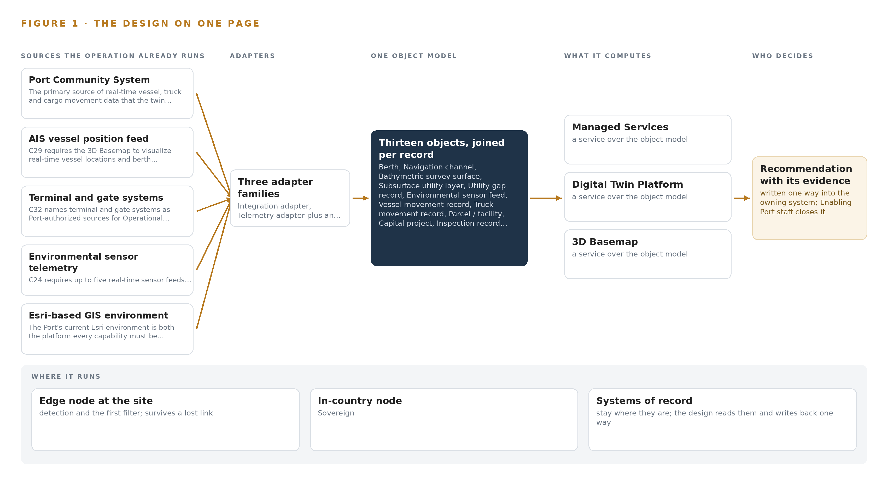
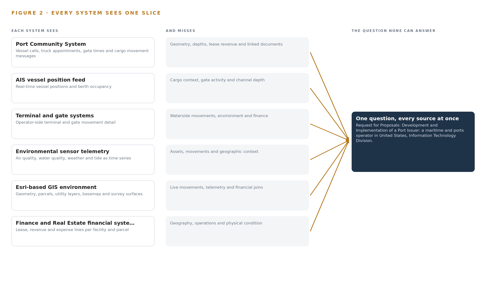
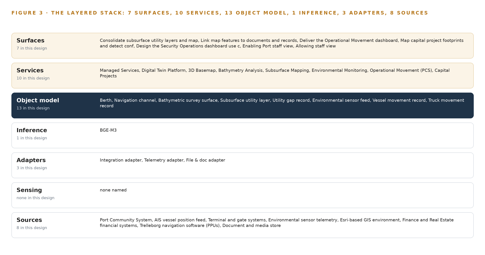
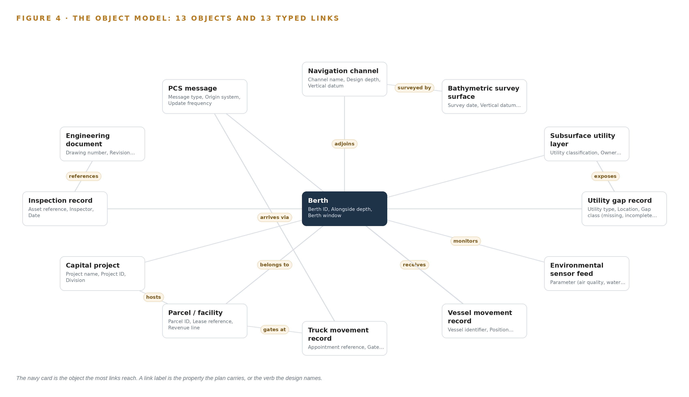
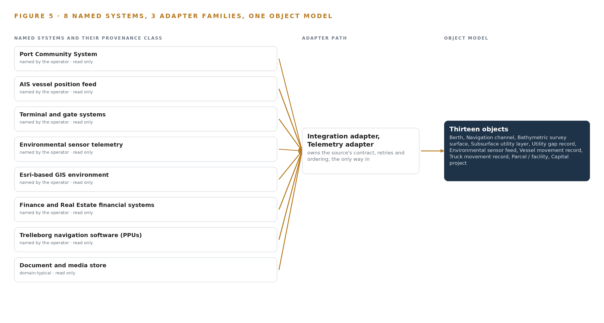
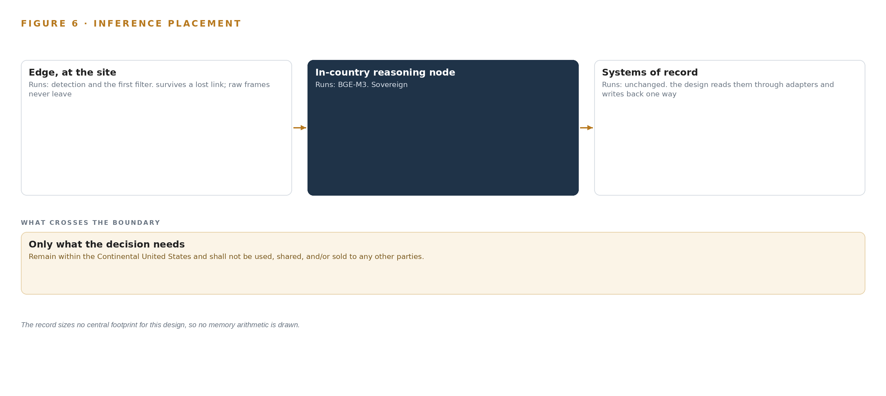
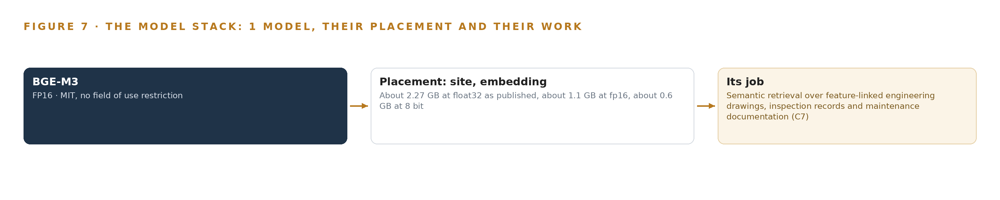
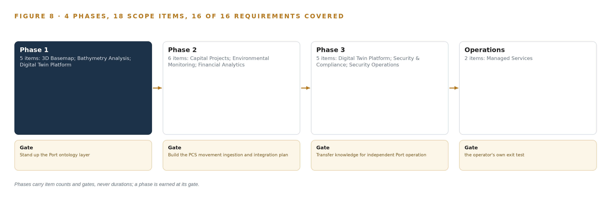
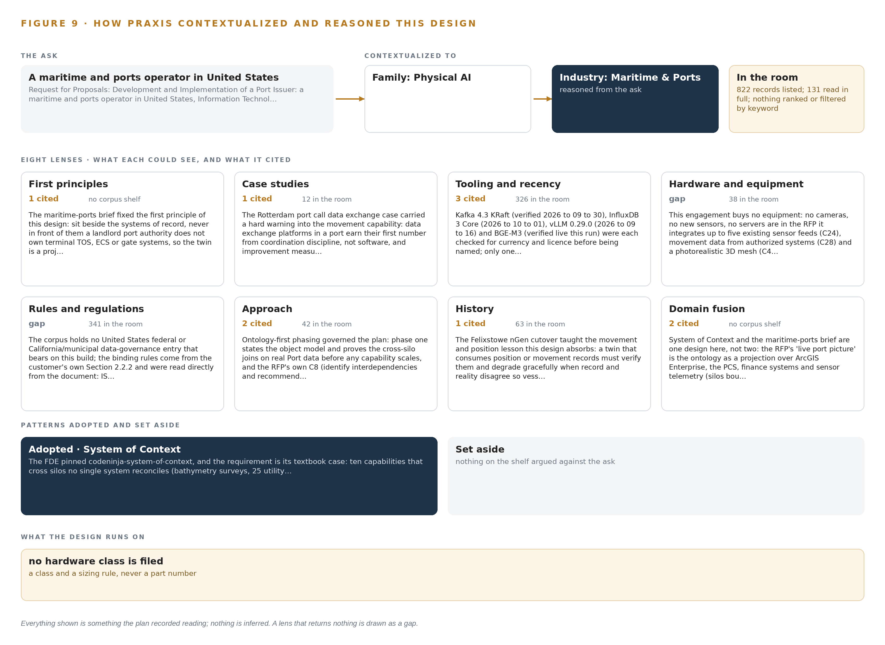

# Port Twin: One Governed Digital Twin for Every Asset, Feed and Dollar

Canonical: https://codeatoms.ai/port-digital-twin-us/
DOI: https://doi.org/10.5281/zenodo.23126431
PDF: https://codeatoms.ai/port-digital-twin-us/paper/port-twin-governed-digital-twin-landlord-port-authority-us.pdf
License: CC BY 4.0
Publisher: CodeNinja Atoms (https://codeatoms.ai), a fully owned subsidiary of CodeNinja

VERTICAL-DRIVEN ARCHITECTURES · MARITIME & PORTS · DESIGNED WITH PRAXIS · OCTOBER 2026

# Port Twin: One Governed Digital Twin for Every Asset, Feed and Dollar

A Port-owned system of context that binds eight operational systems, five live sensor feeds and one finance backbone into a single authoritative digital twin, self-hosted inside the Continental United States boundary the port's own requirements set.

CodeNinja Engineering Team

For the port's information technology director, the digital twin program lead and the GIS, integration and data engineers who would build and run it.

---

Vertical-Driven Architectures is a CodeNinja series of system designs. Every design in the series is driven by a real-world problem and scenario in a single industry, and every one is designed on Praxis, CodeNinja's platform for designing physical AI systems. Operations are described by class, never by name.

At a glance

## A governed digital twin for a landlord port authority in the United States

**What this is.** An open reference architecture for system design in physical AI: one authoritative digital twin that binds a port's operational systems, live sensor feeds and finance backbone into a thirteen-object ontology, self-hosted on the port's own virtual machines inside the continental United States. It is written for port information technology leaders and for the GIS, integration and data engineers who would build it. The operator is described by class, never by name.

**The answer in numbers.**

| Part | The design |
| --- | --- |
| Sources joined | 8 operational systems, 5 live sensor feeds and 1 finance backbone, including the port community system, the GIS estate, AIS vessel tracking, the gate system and environmental sensors |
| Object model | 13 typed objects and 13 links, with the berth as the focal object, published as JSON for reuse |
| Models | One self-hosted open model, BGE-M3, for document retrieval; no generative model and no token stream |
| Compute | No equipment bought: about 1.1 GB of fp16 weights on the port's existing enterprise virtual machines |
| Boundary | Everything runs inside the continental United States on infrastructure the port already operates; no hosted document AI service in the path |
| Three-year cost | No hardware line to price: the design adds software and integration work to servers the port already runs |
| Human control | The twin shows; pilots, berth planners, engineers and finance staff decide in their own systems, and nothing writes back into a system of record |

**Reuse it.** The object model, the model register and the figures are free to reuse under CC BY 4.0. Cite as DOI <https://doi.org/10.5281/zenodo.23126431.>

**Made with.** Reasoned on [Praxis](<https://codeatoms.ai/praxis/>), CodeNinja's platform for designing physical AI systems. The object model imports into [Hyper Ontology](<https://codeatoms.ai/hyper-ontology/>), which turns it into a living system. Both are in beta; access by request.

ABSTRACT

## A Port Should See Its Land, Water and Money in One Picture

The port needs one authoritative answer to a question it can only answer in fragments today: what is happening on its land and water right now, how deep the channel and berths really are, where every lease and expense lands, and which inspection, drawing or project belongs to which asset. The operation's own description of its problem is the honest one: critical information is spread across disconnected systems, maps, spreadsheets, databases and paper records, so every dashboard is a slice and every executive view is a reconciliation exercise performed by hand. No existing system holds the join, because each one was built to run a function, not to hold the port's shared picture.

The design is a system of context: one governed, Port-owned ontology of thirteen objects projected over the Port Community System, the Esri-based GIS environment, finance and real estate systems, an AIS feed, terminal and gate systems, environmental sensor telemetry, pilot navigation software and the document store, joined through three adapter families and one event backbone, and published back as ArcGIS services so all ten required capabilities arrive as ten services and seven surfaces the Port operates independently. Every component is self-hosted inside the Continental United States boundary the port's requirements themselves set, and the only model in the register is one open-weight embedding model that runs on existing enterprise virtualization, so there is no GPU cluster to buy and no data residency question to argue.

The paper follows the build in order: the industry problem and the join failure across the port's systems; the four constraints, the layered stack, the thirteen-object model, the adapter tier and event backbone, inference placement, and the single model and its license; then the four-phase rollout with its gates, requirement coverage and failure modes, and the ownership position that transfers everything to the Port; the conclusion, and finally the chapter on how Praxis contextualized and reasoned this design.

---



Figure 1. Port Twin on one page: the sources the operation already runs, one object model, what it computes, and the person who decides.

## Contents

Each chapter is tagged for the reader it serves most directly: Executive, Team Lead, FDE, Reference.

|  |  |  |
| --- | --- | --- |
|  | Abstract · A Port Should See Its Land, Water and Money in One Picture | Executive |
| PART I · THE PROBLEM | | |
| 1 | [A Port Cannot See Itself in One Place](#ch1) | Executive |
| 2 | [Every Port System Sees One Slice of the Waterfront](#ch2) | ExecutiveTeam Lead |
| PART II · THE DESIGN | | |
| 3 | [Four Constraints Shape a Landlord Port's Twin](#ch3) | Team Lead |
| 4 | [One system of context Sits Beside the Systems of Record](#ch4) | Team LeadFDE |
| 5 | [Thirteen Objects Turn Port Data Into One Picture](#ch5) | FDE |
| 6 | [Every Feed Enters Through an Adapter, Never Directly](#ch6) | FDE |
| 7 | [Retrieval Runs In-Country and Nothing Runs at the Edge](#ch7) | FDE |
| 8 | [One Open-Weight Model Is All the Twin Needs](#ch8) | FDEExecutive |
| PART III · THE ROLLOUT | | |
| 9 | [Four Phases Earn Each Capability From the Last](#ch9) | Team LeadExecutive |
| 10 | [The Port Owns the Twin After Closeout](#ch10) | Executive |
| PART IV · HOW IT WAS DESIGNED | | |
|  | Conclusion · A Twin Is a Projection Over the Record, Never a Copy of It | Executive |
| 11 | [How Praxis Contextualized and Reasoned This Design](#ch11) | Team LeadFDE |
|  | [Sources](#sources) | Reference |

PART I · CHAPTER 1

## A Port Cannot See Itself in One Place

Higher cargo volumes, expanding infrastructure and siloed records mean the port's safety, revenue and planning decisions are made against an incomplete picture.

The abstract holds the design in one view: eight source systems, three adapter families, thirteen objects, ten services and seven surfaces, all running inside the Port's own boundary. This chapter establishes why the Port asked for that shape, what the disconnected state it replaces is documented to cost, and who works inside the scenario the design must serve.

### 1.1  The Question the Port Needs Answered

The question the Port needs answered is deceptively simple: where is every asset, movement, depth, lease and capital project on this waterfront right now, and do those records agree with one another? The requirements answer that question with a digital twin, defined there as a dynamic, data-driven virtual representation of the Port's physical assets, processes and systems, spanning land and water: facilities, utilities, substructures, bathymetry and environmental zones. The answer requires data the Port already holds but holds apart: underwater depth surveys and their vertical datums; subsurface utility layers from the Port and its partners; up to five real-time environmental sensor feeds covering air quality, water quality, weather and tide; vessel, truck and cargo movement records from the Port Community System and an authorized AIS feed; lease, revenue and expense lines tied to parcels and facilities; capital project footprints; field inspection records; and the engineering drawings and maintenance documentation that map features must link to.

The regulatory ground is layered. The Port's own information technology division sets the binding security regime inside the requirements: alignment with ISO 27001 and 27002, identity assurance at NIST 800 to 63 IAL2/AAL2/FAL2, data resident inside the Continental United States only, DMZ, industrial control and administrative network segmentation, encryption in transit and at rest, and a 99.99 percent availability target. Around that internal regime sits federal maritime guidance: the Coast Guard's Maritime Cybersecurity Assessment and Annex Guide gives port and facility operators a structured way to assess their own cyber posture (USCG 2023), the International Maritime Organization's guidelines place cyber risk management alongside safety management for port communities (IMO 2026), and European guidance treats ports as critical infrastructure requiring a common level of cyber resilience, a framing that increasingly shapes practice everywhere (Europa n.d.).

### 1.2  The Documented Cost of Running a Port on Silos

The requirements describe the cost qualitatively: critical information spread across disconnected systems, maps, spreadsheets, databases and paper records, producing data silos and blind spots in decision-making. Public sources document how expensive those blind spots become when they intersect with cyber risk. In November 2023 a cyber attack on a major container terminal operator in Australia stole employee data and halted port operations, with warnings of freight delays stretching into the peak season (ABC 2023). A 2025 report from Booz Allen and the McCrary Institute warns of cyber sabotage risk at United States ports specifically, citing systemic weaknesses in operational technology and urging a zero trust approach to defense (Industrialcyber 2025). The exposure is growing fastest at the connected edge: attacks on satellite-linked edge devices accounted for 22 percent of maritime cyber incidents in 2025, up from earlier years (DIG 2025). A twin that consolidates the operational picture behind one governed, segmented, Port-owned architecture is therefore also a security decision: it gives the Port one place to see, segment and defend.

### 1.3  The Operation as a Scenario

The scenario is a landlord port authority in the United States. It owns the piers, berths, navigation channel, subsurface utilities and real estate portfolio, while terminal operators run their own operating systems, gate systems and equipment on Port land. The physical environments the twin must represent are the berth faces and quay walls, the navigation channel with its design and dredge target depths, the buried utility corridors beneath the terminal aprons, the landside gates and roadways, the survey craft working the channel, and the operations and administrative centers where staff consume the picture.

The people in the loop work by role rather than by title: harbor pilots using portable piloting units, navigation and dredging planners, environmental program staff tuning sensor alerts, field inspectors submitting mobile forms, finance and real estate analysts joining leases to parcels, capital project managers mapping footprints, and the information technology and security staff who own the boundary the design must respect. The scenario counts are fixed by the requirements themselves: eight named source systems, three adapter families, thirteen objects, ten services and seven surfaces, organized as sixteen requirements across four phases, engaging staff in several distinct roles across a single port footprint.

PART I · CHAPTER 2

## Every Port System Sees One Slice of the Waterfront

The community system knows movements, the GIS knows geometry, finance knows leases, and no system holds the join between them that every capability in the requirements depends on.

Chapter 1 established that the data exists but lives apart. This chapter walks each system the Port already runs, states the slice of the waterfront it sees, and shows why the join between the slices is the thing every capability in the requirements quietly depends on.

### 2.1  What Each System Sees Alone

The Port Community System is the operational heartbeat: it holds vessel calls, truck appointments, gate in and out times, terminal assignments and cargo movement messages. What it misses is everything spatial and financial: it knows a vessel is alongside a berth but not the surveyed depth under that berth, the lease revenue attached to the parcel behind it, or the drawing that shows the quay wall's as-built condition. The AIS vessel position feed sharpens the waterside slice with real-time positions and occupancy, but a position is not a context: it carries no cargo, no gate appointment and no channel depth. The terminal and gate systems extend the landside slice with operator-side movement detail, yet they belong to tenants and see nothing of the channel, the environment or the ledger.

The environmental sensor telemetry sees the water and air as time series: tide, weather, water and air quality at a reporting cadence. It sees no assets and no movements, so it cannot say which berth a rising tide threatens or which parcel an air quality reading sits over. The Esri-based GIS environment is the mirror image: it holds the geometry, parcels, utility layers and basemap, the strongest spatial slice in the estate, but it is largely static where operations are live, blind to movements and telemetry between updates, and silent on money. The finance and real estate systems see the ledger: lease references, revenue lines and expense lines per facility. They see no geography, so parcel-level profit and loss cannot be drawn on a map from them alone. The Trelleborg navigation software on the pilots' portable piloting units sees the channel from the pilot's seat, and the requirements ask the bathymetry capability to explore feeding it current depth data; today it sees none of the port-wide picture. The document and media store holds the engineering drawings, inspection records and maintenance documentation, but its contents are not linked to the map features they describe, so the record of a quay wall cannot be found from the quay wall.

### 2.2  The Join None of Them Hold

Figure 2 sets these eight slices side by side, and the join they all miss is the same one: no single place connects a vessel movement to its berth, that berth to its alongside depth and draft limit, that berth to the parcel and lease behind it, that parcel to its utilities, drawings and inspection history, all under one timestamp. Every capability in the requirements is an instance of that join: berth occupancy over depth, subsurface layers over field gaps, sensor thresholds over assets, profit and loss over footprints, project footprints over conflicting utilities. The cost in practice is the manual reconciliation the requirements name explicitly: duplicated records, rework, longer review cycles and decisions taken against a picture no one can see whole.



Figure 2. Eight systems, each seeing one part of the answer. the question needs all of them in one place at once.

PART II · CHAPTER 3

## Four Constraints Shape a Landlord Port's Twin

The port owns its picture but not its tenants' operating systems, so the design sits beside the systems of record, stays inside the port's boundary, publishes back as Esri services and leaves the Port independent after closeout.

Chapter 2 showed that the missing thing is the join, not the data. This chapter fixes the four constraints that make building that join hard in a landlord port specifically, then records what the design scoped in, what it deliberately chose against, and what it leaves out entirely.

### 3.1  Sit Beside the Systems of Record, Never in Front of Them

The Port is a landlord authority: it does not own the terminal operating systems, equipment control systems or gate systems its tenants run. The first constraint is therefore that the twin is a read-only projection over the systems of record, georeferencing and publishing what they already hold rather than becoming a new source of truth. This is hard in this industry because tenant data moves on an approval clock the Port does not control, and because any design that wrote back into a tenant's system would collapse the authority-operator boundary the requirements preserve. The subsurface consolidation of up to twenty-five utility layers from Port and partner sources carries the same constraint: each layer's owner, currency and quality sit outside the Port's control, so the design records them rather than assumes them.

### 3.2  Stay Inside the Port's Boundary

The requirements set the residency condition themselves: Port data stays inside the Continental United States, segmented across DMZ, industrial control and administrative zones, encrypted, and available at 99.99 percent. The constraint is hard because a port is an attack surface: United States port cyber risk is documented as systemic in operational technology (Industrialcyber 2025), edge-connected equipment is the fastest-growing incident class (DIG 2025), and one siloed operator's halted waterside operations in 2023 showed what a single intrusion costs (ABC 2023). The design answers by self-hosting everything, including the one model it uses, so no document, position or lease line crosses the boundary.

### 3.3  Publish Back as Esri Services

Every capability must be fully compatible with the Port's current Esri environment and is consumed as ArcGIS services and layers. The constraint is hard because it rules out any architecture that would replace the GIS estate: the design must earn its place inside it. That is why ingestion lands in an open backbone before publication, why bathymetry lives in versioned Esri-native surface datasets with scripted updates, and why the exact ArcGIS version and license inventory is verified before any surface is published.

### 3.4  Leave the Port Independent After Closeout

The Port must operate the twin itself after a bounded managed support period ends and full intellectual property transfers. The constraint is hard because the industry's default is rental: per-call interfaces and hosted intelligence that keep charging after the contract ends. Every choice in this design is tested against one question: does the Port own it at closeout?

### 3.5  Scoping Decisions

Three scoping decisions carry most of the weight, and Table 1 records what each buys and what each costs.

Table 1 · Scoping Decisions

| Decision | What it buys | What it costs |
| --- | --- | --- |
| Read-only projection over the systems of record | No tenant system is touched and no source of truth is duplicated | The twin's freshness is bound to each source's own update cadence |
| Security Operations as requirements, workshops and conceptual dashboard design only | Alignment with the Port's own security governance without procuring devices | No cameras, sensors or servers are bought anywhere in this scope |
| The agent work surface offered, not committed | A Port-built agent surface only if the Port confirms it wants one | No agentic workflows exist unless the Port asks for them |

### 3.6  What the Design Chose Against

Table 2 records the alternatives the design rejected and why, ending with what is out of scope altogether.

Table 2 · What the Design Chose Against

| Where | What was picked | Instead of, and why |
| --- | --- | --- |
| Ingestion | Apache Kafka 4.3.x in KRaft mode as the open backbone feeding ArcGIS services | Esri GeoEvent Server as the sole path: the Port would rent the backbone it could own outright, though GeoEvent remains available where a feed is Esri-native |
| Bathymetry | Versioned mosaic and surface datasets in the Port's own ArcGIS estate with scripted, documented updates | A third-party bathymetry suite: it would break the required Esri-native repeatability and the Port's independent operation |
| Document retrieval | A self-hosted BGE-M3 embedding model over the Port's drawings and records | A hosted document-AI API: it would move security-sensitive documents outside the Continental United States boundary and keep a per-call fee running after closeout |
| Forecasting | Calibrated deterministic Esri workflows and staff-tuned threshold alerting | Machine-learned arrival or congestion prediction: no acceptance criterion in the requirements can test it |
| Out of scope | Terminal operating system and equipment control integration, new hardware procurement, historic data migration and anything inside the navigation or crane control loop | Any path that would put the twin in front of a tenant's operating loop, buy equipment the requirements never ask for, or claim scope the acceptance criteria cannot reach |

PART II · CHAPTER 4

## One system of context Sits Beside the Systems of Record

The architectural pattern is sources below, one object model in the middle, capabilities published as services and surfaces above, with nothing ever replacing the system that owns the truth.

Chapter 3 fixed the scope: sit beside the systems of record rather than in front of them, publish into the Esri environment the Port already operates, and buy no hardware. This chapter gives those constraints their architecture, one stack that runs from the sources of truth up to the surfaces where Port staff decide.

### 4.1  The Architectural Pattern and Why It Fits

The pattern is three bands. Below sit the systems of record: the Port Community System owns movement truth, ArcGIS Enterprise owns spatial truth, the finance systems own lease and revenue truth, and each keeps doing so unchanged. In the middle sits one object model: thirteen governed object types that project those records into a single joinable picture, every object anchored in the system that owns it. Above, capabilities are published as ArcGIS services and consumed by dashboards, maps and views in the Port's own environment. Applications and agents, where the Port later wants them, read from the object model and never from a source directly.

This shape fits a landlord port authority for one reason: the Port does not own the terminal operating systems, gate systems or crane controllers, so a twin that replaced any system of record would be unbuildable. A projection is buildable. Each correction is made where the truth lives, and the object model follows on the next refresh, so there is exactly one write path to truth and many read paths from it. Figure 3 shows the layered stack with its counts: eight sources, three adapter families, one object model of thirteen objects, ten services, seven surfaces and one model. Nothing runs at an edge; every workload runs on Port-managed servers under the Port's own change management, inside the boundary the Port's own security requirements set.



Figure 3. The layered stack: 8 sources, 3 adapter families, 13 objects, 10 services and 7 surfaces.

### 4.2  The Stack Stage by Stage

Table 3 walks the stack from sources to surfaces, naming the components in each stage. Two stages are deliberately thin. Sensing is thin because the engagement buys no instruments: physical conditions arrive from up to five existing environmental sensor feeds and a sourced photorealistic 3D mesh. Inference is thin because only one model role exists: semantic retrieval over feature-linked engineering drawings, inspection records and maintenance documentation, served by an open-weight embedding model on the Port's existing virtualization; bathymetry and traffic analytics remain deterministic Esri workflows rather than learned models. Around the stages, Chrony keeps feed and GIS clocks aligned, Prometheus, Grafana and Loki observe the running system, Keycloak federates the Port's identity provider for access control, and a Harbor registry holds artifacts and model images for audit and replay.

Table 3 · The Stack, Stage by Stage

| Stage | What it is responsible for | How |
| --- | --- | --- |
| Sources | Holding the truth for movement, spatial, financial and document data | Eight named systems: Port Community System, AIS vessel position feed, terminal and gate systems, environmental sensor telemetry, the Esri-based GIS environment, Finance and Real Estate financial systems, Trelleborg navigation software on the pilots' portable piloting units, and the document and media store |
| Sensing | Bringing physical conditions into the picture without new instruments | Up to five existing environmental sensor feeds with threshold alerting and historical export, plus a sourced photorealistic 3D mesh; no camera, sensor or server is purchased |
| Adapters | Landing every feed in one auditable, replayable place before publication | Three adapter families: integration adapters for the PCS, AIS, terminal, finance and Trelleborg feeds; telemetry adapters for the sensor feeds; and the file and doc adapter for drawings and records |
| Object model | Making the Port one joinable picture | The Port ontology layer: thirteen objects anchored in their systems of record and joined by typed links, with InfluxDB 3 Core holding telemetry history and Chrony disciplining feed clocks |
| Inference | The single model role: retrieval over feature-linked documents | BGE-M3 embeddings, 568M parameters under MIT, served by vLLM on the Port's existing enterprise virtualization with no GPU server |
| Services | Publishing each capability as ArcGIS services and layers | Ten services from Digital Twin Platform and 3D Basemap through Bathymetry Analysis, Subsurface Mapping, Environmental Monitoring, Operational Movement, Capital Projects, Financial Analytics, Security Operations and Managed Services |
| Surfaces | Putting each capability in front of the staff who decide | Seven surfaces: the consolidated subsurface utility map, feature-to-document linking, the operational movement dashboard, capital project footprint mapping, the security operations dashboard use cases, and the Port staff views |

PART II · CHAPTER 5

## Thirteen Objects Turn Port Data Into One Picture

Berths, channels, surveys, utilities, sensor feeds, movements, parcels, projects, inspections, documents and messages, each anchored in the system that owns it and joined by typed links no document store can traverse.

Chapter 4 placed one object model in the middle of the stack. This chapter opens that model and shows what the thirteen objects hold, how they join, where people act on them, and how the whole picture is hosted inside the Port's own boundary.

### 5.1  Thirteen Objects and the Links Between Them

The model holds five assets, four records, three events and one document. The assets are berth, navigation channel, subsurface utility layer, environmental sensor feed and parcel or facility, each representing something physical the Port owns, operates or leases. The records are bathymetric survey surface, utility gap record, capital project and inspection record, each a dated statement about an asset with its own lifecycle. The events are vessel movement, truck movement and PCS message, each a timestamped fact that arrives continuously and is never edited. The document is the engineering document: drawing number, revision, media type and the map features it belongs to. Figure 4 draws every object and its typed links, with the berth as the focal object.

The value sits in the traversal. A query that starts at a berth can reach the vessel movements that touch it, the navigation channel it adjoins, the current bathymetric surface on that channel, and therefore the present under-keel condition a pilot or berth planner needs. A query that starts at a subsurface utility layer reaches the utility gaps raised against it and the inspection records that close them, so a field crew sees one worklist. A query that starts at a parcel reaches its lease reference and revenue and expense lines, the capital projects whose footprint overlaps it, and the inspections against its facilities. A document store answers none of these joins: it can retrieve a drawing by number, but it cannot traverse berth to channel to survey to depth zone, or parcel to lease to project footprint, because those relations are not documents and live in no single source.



Figure 4. The thirteen objects of the model and the typed links that let a query reach across them.

### 5.2  Where the Human Loop Lives and How It Is Hosted

The human loop lives in the status vocabularies. A utility gap moves from Open to In field verification to Closed by a Port engineer; an inspection record moves from Submitted to Reviewed to Closed by a named reviewer; a bathymetric surface becomes Current, Superseded or Archived by the hydrography owner; a capital project is Planned, Active or Complete on a project manager's word. The system proposes and timestamps; a named person decides, and the decision record carries their identity.

The hosting posture follows the Port's own security requirements: everything is self-hosted on Port-managed infrastructure inside the Continental United States boundary the requirements set, with the DMZ and Administrative segmentation the Port's network design already provides. Identity runs through Keycloak federating the Port's identity provider, so every surface access is a Port identity with role-based entitlements. No object carries an external link out of the boundary. The only write path into the ontology is the adapter tier feeding records plus the human status transitions above; no surface writes back to a system of record, so the PCS, ArcGIS Enterprise and the finance systems remain the sole owners of their truths.

### 5.3  One Object in Its Recorded Form

The berth object is the anchor for every movement, depth and occupancy question the twin answers, and it is recorded exactly as shown here.

```
{
  "id": "berth",
  "label": "Berth",
  "kind": "asset",
  "anchored_in": "Port Community System",
  "properties": [
    "Berth ID",
    "Alongside depth",
    "Berth window",
    "Occupancy state",
    "Vessel draft limit"
  ],
  "status_vocabulary": [
    "Occupied",
    "Reserved",
    "Available"
  ],
  "links": [
    {
      "to": "navigation-channel",
      "label": "adjoins"
    },
    {
      "to": "vessel-movement",
      "label": "receives"
    },
    {
      "to": "parcel-facility",
      "label": "belongs to"
    }
  ]
}
```

PART II · CHAPTER 6

## Every Feed Enters Through an Adapter, Never Directly

Three adapter families bring eight named sources into one Kafka backbone, so every record is timestamped, ordered and replayable before it is ever published as an ArcGIS service.

Chapter 5 defined the objects and their links. This chapter describes how data reaches them: eight named sources, each entering through one of three adapter families onto a single backbone, timestamped and ordered before anything is published.

### 6.1  Eight Sources, Their Provenance and Their Paths

Figure 5 maps every source, its provenance class and its adapter path. Seven sources are operator-authorized: data the Port itself holds and authorizes for this build. The Port Community System is the primary source of vessel, truck and cargo movement; the AIS vessel position feed supplies real-time positions and berth occupancy; terminal and gate systems extend movement data beyond the PCS; environmental sensor telemetry carries up to five real-time feeds for air quality, water quality, weather and tide; the Esri-based GIS environment is both a source of current spatial data and the destination every capability publishes into; the Finance and Real Estate financial systems supply lease, revenue and expense data, with the underlying system of record confirmed with the Port at kickoff; and the Trelleborg navigation software on the pilots' portable piloting units is the exploratory destination for bathymetric depth data. One source is domain-typical: the document and media store that holds engineering drawings, inspection records and maintenance documentation, named by class because the Port's requirement does not name the store, and the file and doc adapter is built against whatever it proves to be.



Figure 5. The 8 named systems, the adapter path each one takes, and the object model they all map into.

### 6.2  What the Adapter Tier Guarantees

Every adapter makes the same four guarantees. First, provenance: each record carries its source system, its original source timestamp and an ingestion timestamp, so a consumer can always tell when something happened and when the twin learned it. Second, ordering: records within a feed are ordered so a berth's occupancy state, a vessel's position sequence and a survey's version chain never arrive out of sequence. Third, idempotence: each record carries a deduplication key, so a replay or a duplicate push changes nothing. Fourth, staleness: a feed that stops reporting is flagged, and no surface presents data it cannot date. This last discipline matters because a port twin that consumes position and movement records must verify them and degrade gracefully when record and reality disagree. No surface connects to any source directly; the adapter tier and the backbone are the only entrance.

### 6.3  The Event Backbone

The backbone is Apache Kafka 4.3 in KRaft mode, with three dedicated controllers on a dynamic quorum. Records are partitioned by key, typically the asset or vessel identifier, so all events for one berth or one vessel keep their order on one partition. Delivery is at least once with idempotent consumers, which pairs with the adapters' deduplication keys to give effectively once-per-record behavior downstream. Buffering absorbs outages: if an ArcGIS publisher or a dashboard consumer stops, the sensor, AIS and PCS feeds continue to accumulate on the backbone and are consumed when it returns, so no gap is silently lost. Replication keeps every partition on more than one broker inside the Port's administrative segment. The guidance for ports treats them as critical infrastructure needing structured cyber risk management (Europa n.d.), and connected equipment carries a growing share of maritime cyber incidents (DIG 2025); an auditable, replayable, Port-owned backbone inside the Port's own boundary, rather than per-feed point integrations, is the design's answer to both.

PART II · CHAPTER 7

## Retrieval Runs In-Country and Nothing Runs at the Edge

The design places its single model on existing Port enterprise virtualization inside the Continental United States, and deliberately buys no edge compute, no cameras and no GPU cluster.

Chapter 6 showed how every source enters through an adapter and lands on one replayable backbone, ordered, buffered and replicated before anything reads it. This chapter places the computation: where the design runs its inference, why it deliberately runs nothing at the physical edge, and what the network boundary lets through in each direction. The short answer is that the design has exactly one model, it runs on machines the Port already owns, and the most consequential placement decisions in the system are refusals.

### 7.1  One Inference Tier, and It Sits on Port Virtualization

The design has a single inference tier, and Figure 6 shows it: one embedding model, served on the Port's existing enterprise virtualization inside the Continental United States boundary the requirements themselves set. Everything else in the system is deterministic software, Esri-native workflows and threshold logic that need no model at all. This shape is a deliberate counter-position to the one currently being sold across the maritime and ports sector, where quay-wall cameras, gate-side object trackers and language models at the waterside are offered as the default architecture. The design declines that default for three reasons. First, the requirements never ask for edge inference. Vessel and truck movement arrives as data from the Port Community System, the AIS feed and gate telematics, so there is no video stream to run detection on and no trajectory to forecast: the twin consumes records, not pixels. Second, the economic argument holds at this scale. A 568M-parameter embedding model does not justify a GPU server, let alone an edge compute estate. Third, the security argument cuts the same way: attacks on satellite-linked edge devices accounted for 22 percent of maritime cyber incidents in 2025, a share that has grown from earlier years, which means connected field equipment is now a leading attack surface in the sector (DIG 2025). A report on United States port cybersecurity reaches the same conclusion from the defensive side, citing systemic operational technology weaknesses and urging a zero trust posture (Industrialcyber 2025). Every edge box the design refuses to buy is one more device the Port never has to patch, monitor or defend. The memory arithmetic is short because the model is small and the serving pattern is simple. The registered model is BGE-M3 at 568M parameters. As published at float32 its weights occupy about 2.27 GB; at fp16, the precision the design runs, about 1.1 GB; at 8-bit quantization, about 0.6 GB. A fp16 weight set of roughly 1.1 GB fits comfortably in the memory of a standard enterprise virtual machine, which is exactly why no GPU server is justified or purchased. The KV cache term that dominates generative model sizing is absent here by construction: an embedding model encodes text into fixed vectors in a single forward pass and generates no token stream, so there is no growing cache to budget against usable memory. The memory question therefore reduces to weights plus short-lived activation, and activation scales with batch size, which is bounded by the scheduled corpus indexing jobs rather than by interactive load.



Figure 6. Where each tier runs, what runs there, and the narrow set of outputs that cross the boundary.

### 7.2  The Latency Budget

The budget has four clocks, and the model tier is the smallest of them. The feed clock is set by each source's own reporting cadence: sensor telemetry and movement records arrive at whatever interval their platforms publish, the backbone absorbs the bursts, and no component waits on a faster promise than the feed itself makes. The publication clock is the refresh of ArcGIS services and layers into the Port's GIS estate; dashboards are exactly as fresh as the last publication, and the automated update workflow in the basemap capability governs that interval. The retrieval clock covers the one place a model sits in an interactive path: a query is embedded in a single forward pass over a 568M-parameter model at fp16, then matched against the index with hybrid dense and sparse search. Bulk embedding of the document corpus runs as scheduled background work; query time embeds one query, not a library. The alerting clock is bound to ingestion, not to inference: threshold evaluation on the five environmental feeds happens as records land, so alert latency is feed cadence plus evaluation, never a model round trip. The structural property that matters is that no interactive path depends on a call to an external model provider. The longest term in the budget is the publication clock, and the model tier adds nothing measurable to dashboard freshness. A latency problem in retrieval degrades document search for one user; it cannot stall the operational picture.

### 7.3  What Crosses the Boundary, and What Happens When It Fails

Nothing crosses outward to a hosted model, a per-call API or any service outside the Port's control. The boundary conditions come from the requirements themselves: data residency inside the Continental United States, segmentation between the demilitarized zone, the operational technology zone and the administrative zone, encryption in transit, and an availability target of 99.99 percent. Movement and telemetry land in the demilitarized zone, are normalized onto the backbone, and the ontology, the services and the model serve from the administrative zone. The design takes this posture seriously because the sector's record demands it: international guidelines place cyber risk management squarely on port operators (IMO 2026), the United States Coast Guard publishes an assessment guide for exactly this exercise (USCG 2023), and a cyber attack on a major port operator in late 2023 halted operations and stole employee data, with freight delays following (ABC 2023). When the link fails, the adapter marks the affected feed degraded, records carry their source timestamps and staleness flags, and the dashboards never present a feed they cannot date. When power fails, the workloads go down with the Port's own infrastructure, because they run on Port-managed servers under Port change management; the design makes no independent power claim, and managed services operate to the agreed service levels once infrastructure recovers. When the update path fails, the system keeps running on its last known-good versions, held in the Harbor registry, and updates resume through the Port's own change process. In all three cases the failure mode is graceful staleness, not silence: the twin shows what it knew and when it knew it.

PART II · CHAPTER 8

## One Open-Weight Model Is All the Twin Needs

A 568M-parameter embedding model under an MIT license, small enough to run on the Port's own virtualization, covers the one model role the requirements state: feature-linked document retrieval.

Chapter 7 placed the design's single model on the Port's own virtualization and argued that nothing belongs at the edge. This chapter names that model, states what its license permits, and records every choice of model, hardware posture, pattern and ground in one register, so the Port can see exactly what it would own at closeout.



Figure 7. The one model, their placement, and the work each one does.

### 8.1  The Model Stack: One Model, One Runtime, One Registry

Figure 7 shows the model stack, and its brevity is the point. One registered model, BGE-M3; one serving runtime, vLLM 0.29.0, verified current and licensed for this use; one private artifact and model registry, the Harbor registry, holding versioned weights and containers for replay and rollback. There is no fine-tuning pipeline, because no model is trained in this scope: the embedding model runs off the shelf, bathymetry analysis is a deterministic Esri workflow, and movement analytics are configured dashboards and threshold logic, not machine-learned predictions. A stack with one model is not a reduced ambition; it is the honest count of model roles the requirements state.

### 8.2  BGE-M3, 568M Parameters, MIT Licensed

BGE-M3 is a 568M-parameter embedding model with a hybrid dense and sparse architecture, meaning it produces both a learned vector representation and a lexical representation of the same text in one pass. That hybrid is why it was chosen for the one model role the design has: semantic retrieval over the feature-linked engineering drawings, inspection records and maintenance documentation that the map must link to. Port document corpora are hostile to pure vector search, because users search for exact short identifiers such as drawing numbers, part marks and inspection IDs as often as they search for concepts, and a hybrid model keeps both queries answerable through one index. Its placement follows from its size. At fp16 the weights occupy about 1.1 GB, so the model serves on the Port's existing enterprise virtualization at the site tier, inside the Continental United States boundary, with no GPU server justified and no field equipment installed. Its license is MIT with no field of use restriction: the Port may hold, copy, modify and run the weights indefinitely, with no per-call fee and no limit on where or how the model is applied, and ownership of the model and its hardening passes to the Port at closeout. That license terms matter as much as accuracy here. A hosted document-AI API would put engineering and security-sensitive material outside the Port's boundary on every query, and would leave the Port renting, forever, the one capability it most needs to own. The design chose the self-hosted open model hardened on the Port's own drawings and records instead, for the boundary, for the cost structure and for ownership.

### 8.3  The Model and Equipment Register

Table 4 gathers the choices this chapter and Chapter 7 made into one register: the model and its serving runtime, the hardware posture and sizing rule, the sensing decision, the patterns the design stands on, and the ground it runs on. Each row states why it holds.

Table 4 · Model and Equipment Register

| The choice | What was picked | Why here |
| --- | --- | --- |
| The one model role | BGE-M3, 568M parameters, hybrid dense and sparse embeddings, run at fp16 | Covers feature-linked retrieval over drawings, inspection records and maintenance documentation; small enough that no GPU server is justified |
| Serving runtime | vLLM 0.29.0 on the Port's existing enterprise virtualization | Serves the embedding model inside the Continental United States boundary on infrastructure the Port already operates |
| Hardware classes | None purchased; existing enterprise virtual machines only | The requirements buy no equipment; about 1.1 GB of fp16 weights fit standard virtual machine memory |
| Sizing rule | Weights occupy about 2.27 GB at float32, about 1.1 GB at fp16, about 0.6 GB at 8 bit | The fp16 figure is the sizing basis; no KV cache applies because an embedding model generates no token stream |
| Sensing | No new sensing; up to five existing environmental sensor feeds plus movement data from authorized systems | The requirements integrate existing feeds and a sourced photorealistic 3D mesh; no cameras or field devices are purchased |
| Pattern: system of context | One Port-owned ontology projected over the systems of record | Silos are bound in place; the twin sits beside the systems of record, never in front of them |
| Pattern: adapter-mediated ingestion | Three adapter families across eight named sources | Every source enters through an adapter, never directly, so source change never reaches the ontology |
| Pattern: open backbone | Apache Kafka 4.3.x in KRaft mode with three dedicated controllers | The Port owns the ingest backbone outright, and every feed lands in one auditable, replayable place before publication as ArcGIS services |
| The ground | Port enterprise infrastructure inside the Continental United States, segmented into demilitarized, operational technology and administrative zones | Residency and segmentation are the boundary conditions the requirements themselves set, and the design adds no dependency outside them |

PART III · CHAPTER 9

## Four Phases Earn Each Capability From the Last

Phase one stands up the ontology and proves the cross-silo joins before anything scales, and each later phase carries its own item count and exit gate, ending in transition and closeout with full intellectual property transfer.

Chapter 8 fixed the model layer: one open-weight embedding model, one license, no GPU server. What remains is to earn that restraint in sequence. A build of this shape succeeds or fails on the order in which capabilities arrive, because every later capability reads the joins the first phase proves and every dashboard is only as good as the integration plan that names its feeds.

### 9.1  Four Phases, Four Gates, and a Closeout

The rollout runs as four phases and an operations phase, each carrying an explicit item count and an exit gate, and Figure 8 shows them with their requirement coverage. Phase one carries five items across the Digital Twin Platform, 3D Basemap, Bathymetry Analysis and Subsurface Mapping workstreams, and its gate is the Port ontology layer standing up with the cross-silo joins proven on the Port's own data: the photorealistic mesh sourced and staged, the 2D/3D basemap published with automated updates, bathymetry handed over as versioned surfaces with prior versions retained, and subsurface utility layers consolidated with each layer's owner, source and gap class recorded. Phase two carries six items across Capital Projects, Environmental Monitoring, Financial Analytics and Operational Movement (PCS), and its gate is the PCS movement ingestion and integration plan, which names every feed, its update frequency and its integration method before any dashboard is built against it; sensor feeds integrate incrementally up to the five-feed cap with staff-tuned alerting, and vessels and berth occupancy visualize live in 3D only once that plan is signed.

Phase three carries five items across the Digital Twin Platform, Security Operations, Traffic Modeling and Security & Compliance workstreams, and its gate is knowledge transfer for independent Port operation: the Security Operations dashboard use cases designed with Port staff, the calibrated impedance roadway network built, and closure and detour scenario analysis handed over as deterministic Esri workflows. The operations phase carries two items under Managed Services: operating the services to the agreed service levels and responsibility matrix, and executing transition and closeout with full intellectual property transfer to the Port. Requirement coverage closes at sixteen of sixteen requirements covered, none partial and none gapped, and each gate maps its phase's items back to the specific requirement each item satisfies, so coverage is claimed only where a gate has been passed.



Figure 8. The four phases and their gates, and coverage of the 16 requirements across them.

### 9.2  What the Rollout Measures

Five measurements run across the phases. First, the join proof: whether the ontology resolves one berth, one parcel, one channel across systems that never shared keys before, tested on real Port data in phase one. Second, feed health: every movement and telemetry record carries its source system and source timestamp, and staleness is flagged rather than smoothed, so a dashboard never presents a position it cannot date. Third, alert discipline: staff tune their own thresholds during phase two, and the measure is whether alerts route to a named person who acts, not how many fire. Fourth, financial reconciliation: the profit and loss by facility and parcel integration is accepted only when Finance validates the join against official records. Fifth, independence: the final measure is Port staff running the update workflows, publishing services and tuning alerts without the builder in the room, which is the phase three gate.

### 9.3  Failure Modes and What the Design Does About Them

The known unknowns are carried as named failure modes with designed responses, not as risks left to the phases to discover; Table 5 lists them.

Table 5 · Failure Modes

| What fails | What the design does |
| --- | --- |
| The port community system product, its operator and its available interfaces are unknown, yet four capabilities depend on its feeds | The integration plan is a phase two gate deliverable that names every feed, update frequency and method before dashboards are built against it |
| The financial system of record for lease, revenue and expense data is unnamed, and its extraction granularity is unconfirmed | Confirm with the Port at kickoff; design the join layer so only it changes when the system is named, with Finance validation as the acceptance test |
| The Port's GIS product versions and license levels are not stated, yet every capability must be fully compatible with the current environment | Verify the exact version and license inventory in phase one, before any surface is published |
| Environmental sensor count, types, platform and protocol are unknown, so the five-feed integration cannot be sized today | Deliver the monitoring requirements document from the workshops as the mapping artifact and integrate feeds incrementally to the cap |
| Subsurface consolidation depends on utility layers from Port and partner sources whose access and quality sit outside Port control, and partner approvals move on a slower clock | Run the data inventory and acquisition plan as a phase one work package, and make the validation scenario the proof that field conditions are reflected where data exists |
| The photorealistic 3D mesh is a large sourced dataset with its own procurement lead time and currency risk | Source and stage it in phase one, define its update workflow with the basemap's automated updates, and confirm 3D tool compatibility on the Port's own viewers before acceptance |

### 9.4  Lessons

**Prove the join before the capability.** Phase one exists because a digital twin that cannot resolve one berth across the port community system, the GIS estate and the financial systems will fail quietly in every later capability, and the failure surfaces as disputed numbers rather than as an error. The ontology layer is the cheapest place to learn that, and the gate makes the lesson mandatory.

**Name the feed before the dashboard.** The movement capability is the one most likely to be demoed early and regretted late, because the systems behind it are unnamed at kickoff. Making the integration plan the phase two gate costs schedule certainty on the dashboard and buys certainty on the data, which is the right trade when the dashboards are meant to be authoritative.

**The twin widens the surface it is meant to narrow.** A port's connected systems are an established target: a 2023 attack on a major container terminal operator halted operations and stole employee data (ABC 2023), satellite-linked edge devices accounted for a growing share of maritime cyber incidents in 2025 (DIG 2025), and a 2025 report warns of sabotage risk at United States ports and urges zero trust (Industrialcyber 2025). The design responds by sitting inside the Port's own segmented network, federating identity through the Port's provider, running under Port change management, and transferring the boundary itself at closeout; the Coast Guard's assessment guide and the international guidelines on maritime cyber risk management give the Port its review frame for the twin as connected infrastructure (USCG 2023; IMO 2026).

### 9.5  What Is Still Open

Six questions remain open, and each changes a different part of the design when it settles. Naming the port community system and its interfaces fixes the adapter effort in phase two and may change feed frequency assumptions in the movement dashboards. Naming the financial system of record fixes the extraction granularity and either confirms or reshapes the join layer, nothing else. The GIS version and license inventory decides whether specific extensions are available or must be licensed before surfaces publish. The sensor inventory sizes the telemetry adapter and the alerting configuration. Mesh procurement and currency determine how the basemap update workflow is sequenced. And the Port's confirmation on the offered agent work surface decides whether a fifth adapter family and a work surface join the design; until then, nothing agentic is built, and the eleven other capabilities are unaffected.

PART III · CHAPTER 10

## The Port Owns the Twin After Closeout

The object model, the adapters, the fine-tune-free model weights, the decision record and the boundary itself all transfer to the Port, which operates the system independently after the support period.

Chapter 9 ended with transition and closeout as a gate. This chapter states what that transition means in property terms: which layers of the design become the Port's, and what, if anything, stays with the builder.

### 10.1  Who Owns What the Design Builds

The object model transfers whole: thirteen objects with their typed links, status vocabularies and anchored provenance in the port community system, the GIS estate and the financial systems become Port property at closeout, together with the three adapter families that feed them and the ten services that publish from them. The weights transfer as well: the design registers one model, BGE-M3, a 568-million-parameter embedding model under an MIT license with no field-of-use restriction, used off the shelf with no fine-tune, so the Port holds it outright and no trained artifact beyond it exists to divide. The decision record belongs to the Port by construction: threshold alerting is tuned by the Port's own staff, every alert routes to a named person who decides, and the trail of who decided what on which evidence sits in Port systems, not in the builder's. The boundary transfers as a configuration rather than a dependency: continental United States residency, the demilitarized, industrial control and administrative network segmentation, encryption in transit and at rest, and identity federated through the Port's own provider, all administered by Port staff after knowledge transfer. After the support period the Port operates every surface, adapter and service independently, and no per-call or per-seat payment to the builder remains anywhere in the architecture.

### 10.2  The Offer Behind the Design

The offer behind the design is CodeNinja's. The thirteen-object model is Hyper Ontology; the ranking, reconciliation and recommendations that named Port people decide, from berth occupancy and movement attribution to parcel-level financial analysis, are Decision Systems; the open-weight license, the in-country operation inside the continental United States boundary on the Port's own hardware make the build Sovereign Infrastructure; and Praxis is the platform on which the design was contextualized, reasoned and recorded. CodeNinja's role ends at closeout by design, because the ownership described above is the product: a twin the Port runs, extends and accounts for on its own.

PART IV · CONCLUSION

## A Twin Is a Projection Over the Record, Never a Copy of It

In one view, the design is a governed projection: thirteen objects anchored in the systems that already own the truth, fed by three adapter families through one replayable backbone, published as ten ArcGIS services and seven surfaces, with one open-weight model doing the only inference the requirements ask for, all inside the port's own segmented network and boundary.

Running the same shape elsewhere takes a landlord-style authority that owns its picture but not its tenants' operating systems, a GIS estate worth projecting into rather than replacing, a named system of record for each object, and the discipline to earn each phase from the one before it; given those, the ontology, adapters and surfaces transfer with the objects renamed and the adapters re-aimed.

PART IV · CHAPTER 11

## How Praxis Contextualized and Reasoned This Design

Every choice in this paper traces back to the recorded reading of the port's requirements and the eight reasoning lenses Praxis applied, and this chapter shows the trace.

Chapter 10 closed the ownership question. This final chapter opens the design's own record: how the ask was read, which lenses were applied, and where each choice in the paper traces back to what justified it. Every design in this series is produced on Praxis, the platform that contextualizes the ask, assigns it a family and industry, reads what is in the room and reasons through eight lenses. This chapter is the trace: any choice in the paper can be followed back to the recorded reading that justified it, and Figure 9 shows that path from ask to family to lenses to the equipment classes the design finally carries.

### 11.1  Contextualizing the Ask

The ask is the operator's own solicitation: a request for proposals from the information technology division of a maritime and ports operator in the United States, published with a defined term and a scope of ten capabilities for a port digital twin, running from a photorealistic 3D basemap and bathymetry analysis through subsurface utility mapping, environmental monitoring, operational movement, capital projects, financial analytics and a security operations design study. Praxis assigned it to the system-of-context family in the maritime and ports industry, with the United States fixed by the operator's own requirement rather than by inference. What was in the room is the solicitation itself, read in full: its project description, scope of work, technical and security requirements, and operations and support sections, together with the records it references; the list of records read is held and available on request. The binding constraints came from the operator's own security section read directly, not from an external corpus: alignment with recognized information-security management standards, strong identity assurance levels, continental United States data residency, network segmentation across three zones, encryption, and a high availability target.



Figure 9. From the ask to the design: the family and industry Praxis assigned, the eight lenses and what each cited, the patterns adopted and set aside, and the equipment the design lands on.

### 11.2  The Eight Lenses

Table 6 records each lens: what it could see, how many of its findings were cited into the design, and what it contributed. Two lenses returned nothing applicable and are recorded as gaps rather than omitted.

Table 6 · The Lenses and What They Contributed

| Lens | Could see | Cited | What it contributed |
| --- | --- | --- | --- |
| First principles | held in the brief | 1 | The twin sits beside the systems of record, never in front of them: a landlord authority does not own terminal operating or gate systems, so the design is a projection over the port community system, the GIS estate and partner data, and its value is measured on the Port's own clock of safe under-keel clearance, dredging decisions and incident response |
| Case studies | 12 | 1 | The Rotterdam port call data exchange case carried a hard warning into the movement capability: coordination discipline earns the first number, and value measured on a selected tail overstates the whole, so the dashboards carry data-dictionary and feed-health discipline instead of optimiztic value claims |
| Tooling and recency | 326 | 3 | Each named product was checked for currency and license before it was named: the streaming backbone, the telemetry store, the serving runtime and the embedding model; one model role exists in this design and one is registered |
| Hardware and equipment | 38 | 0 | A gap: the engagement buys no equipment, so every hardware layer is marked not needed with the requirement's own words as the reason |
| Rules and regulations | 341 | 0 | A gap: the corpus holds no United States federal, state or municipal data-governance entry bearing on this build; the binding rules came from the operator's own security section, read directly from the document |
| Approach | 42 | 2 | Ontology-first phasing governed the plan: phase one states the object model and proves the cross-silo joins before any capability scales, and the landlord-versus-operator approval split shaped the subsurface plan |
| History | 63 | 1 | The container terminal cutover case taught the movement lesson this design absorbs: verify position records against reality, flag staleness, and never present a feed the dashboard cannot date |
| Domain fusion | held in the brief | 2 | System of context and the maritime brief are one design here: the live port picture is the ontology as a projection over the estate, binding silos in place rather than migrating them |

### 11.3  Patterns Adopted and Set Aside

Three patterns were adopted and three were set aside, each with a recorded reason. Adopted: adapter-mediated ingestion into one open backbone the Port owns outright, with the GIS-native event path kept available where a feed is Esri-native; versioned Esri-native surfaces with scripted update over a third-party bathymetry suite, because a separate suite would break both repeatability and independent Port operation; and self-hosted open embedding retrieval over a hosted document application programming interface, because feature-linked documents include engineering and security-sensitive material that must stay inside the boundary and a per-call rental is exactly the part closeout should end. Set aside: agentic workflows, offered to the Port and built only on confirmation, because the solicitation never asks for them; machine-learned arrival and congestion prediction, because the acceptance criteria test configured dashboards, staff-tuned alerting and calibrated scenario analysis, not learned forecasts; and video ingest with edge tracking, because no cameras are purchased and every vessel and truck position arrives as data.

### 11.4  Where the Reasoning Lands

The reasoning lands as a map of what is deliberately not bought. No edge compute, because nothing runs at a physical edge; no graphics processing server, because the single registered model runs on the Port's existing enterprise virtualization; no satellite-disciplined time hardware, because GIS timelines and feed ordering need network time discipline, not grandmaster clocks; no one-way transfer hardware, because the boundary condition is residency and segmentation, both satisfied by the Port's own network design. The equipment classes the design does carry are enterprise ones: streaming controllers, telemetry storage, the ontology store, observability, identity federation and an artifact registry. The chapter closes on the standing rule of the series: everything shown here was recorded reading, every count and license was checked against the record, and nothing in this paper is inferred.

Appendix A

## What It Costs

The design buys no hardware. The requirement asks for no cameras, sensors or servers, and the only model in the register, the BGE-M3 embedding model, occupies about 1.1 GB of weights at fp16, which fits a standard enterprise virtual machine the port already operates. There is therefore no owned-versus-rented comparison to print: the cost of this design is integration and software work on infrastructure the port already pays for, and a closed document AI service was set aside on boundary grounds, not price.

### A.1 What Would Change the Answer

| Line | When it appears | How to price it |
| --- | --- | --- |
| Virtual machine capacity | If the twin's event backbone and GIS services outgrow the existing cluster | The port's own virtualisation cost per core and per gigabyte, which no public list price captures |
| Document retrieval at scale | If the drawing and inspection corpus grows into the millions of pages | Embedding throughput on CPU is the limit; one mid-range GPU card (48 GB class, about 85,000 dollars for a server of eight, Newegg 2026) removes it |
| A generative work surface | If the port later asks questions in natural language over the twin | A frontier open-weight model on one node of eight 141 GB HBM-class GPUs, 320,000 to 420,000 dollars (Mercatus 2026), priced in the series' other papers |

### A.2 Sources for This Appendix

- Mercatus. 2026. H200 server price. <https://mercatus-ai.com/blog/h200-server-price>
- Newegg. 2026. Supermicro SYS-421GE-TNRT-02-G1. <https://www.newegg.com/p/N82E16859152404>

SOURCES

## Source Register

DIG. 2025. Maritime cyber risk in satellite-linked edge devices increases to 22% of the maritime cyber incidents in 2025 Digital Watch Observatory. <https://dig.watch/updates/maritime-cyber-risk-linked-edge-devices-i>

ABC. 2023. DP World Australia confirms employee data was stolen during cyber attack, warns of further freight delays ahead of Christmas rush , ABC News. <https://www.abc.net.au/news/2023-11-28/dp-world-australia-employee-data-stolen-cyber-attack-freight/103161588>

IMO. 2026. GUIDELINES ON MARITIME CYBER RISK MANAGEMENT. <https://wwwcdn.imo.org/localresources/en/OurWork/Security/Documents/MSC-FAL.1-Circ.3-Rev.4.pdf>

Europa. n.d.. CYBER RISK. <https://www.enisa.europa.eu/sites/default/files/publications/ENISA%20Guidelines%20-%20Cyber%20Risk%20Management%20for%20Ports.pdf>

USCG. 2023. Maritime Cyber Assessment & Annex Guide (MCAAG). <https://www.dco.uscg.mil/Portals/9/CG-FAC/Documents/Maritime%20Cyber%20Assessment%20%20Annex%20Guide%20(MCAAG)_released%2023JAN2023.pdf>

Industrialcyber. 2025. Booz Allen, McCrary report warns of cyber sabotage risk at US ports, urges zero trust amid systemic OT weaknesses , Industrial Cyber. <https://industrialcyber.co/reports/booz-allen-mccrary-report-warns-of-cyber-sabotage-risk-at-us-ports-urges-zero-trust-amid-systemic-ot-weaknesses/>

---

### About CodeNinja

CodeNinja is a Middle Eastern-American artificial intelligence lab focused on building self-improving systems. We are reinventing knowledge work to close the loop between vertical AI use cases and the generalized intelligence that fuels it, accelerating the path toward organizational superintelligence.
