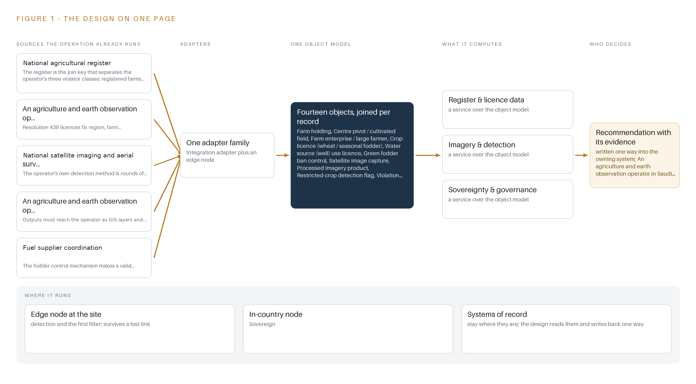
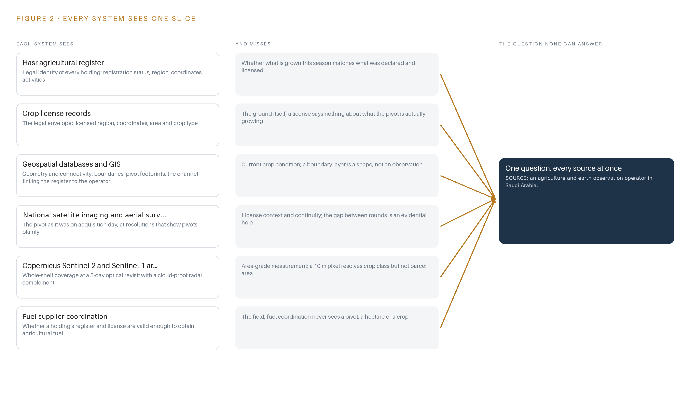
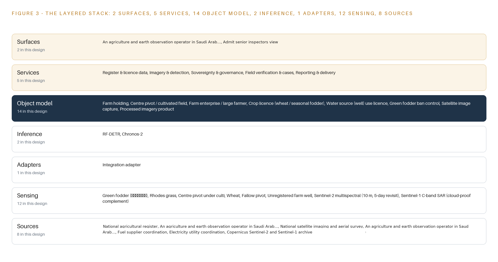
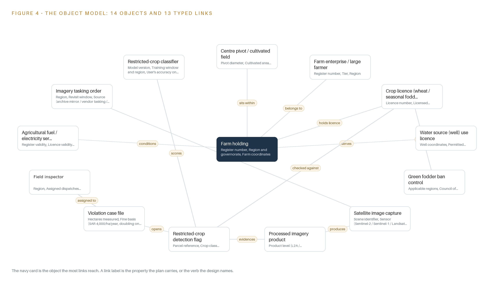
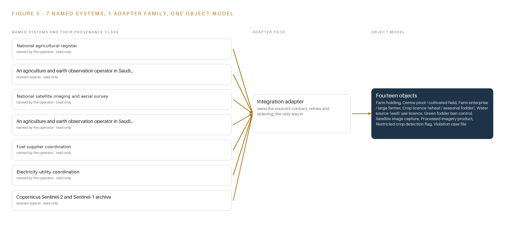
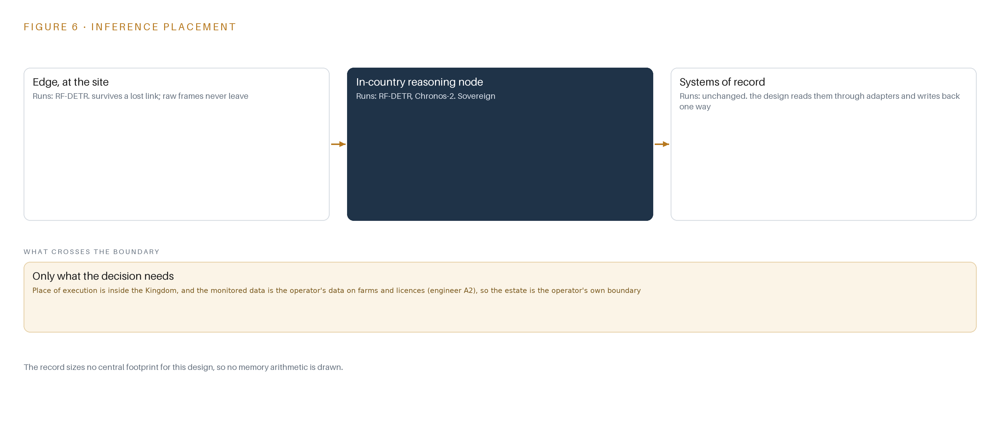
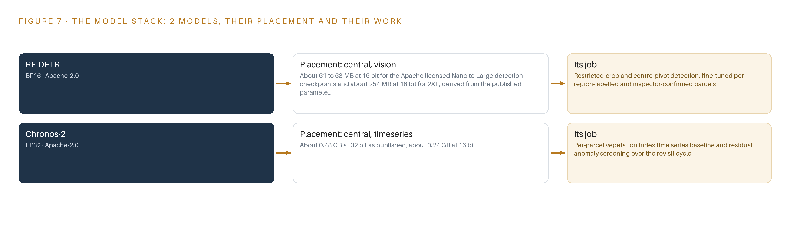
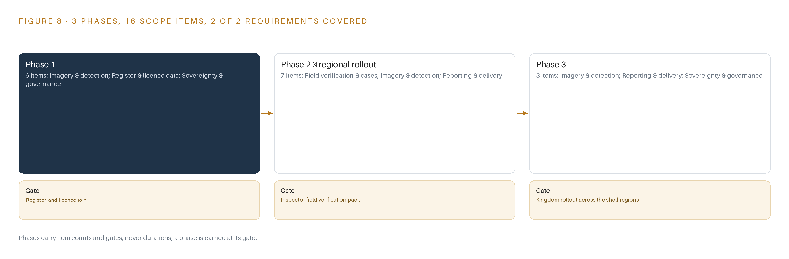
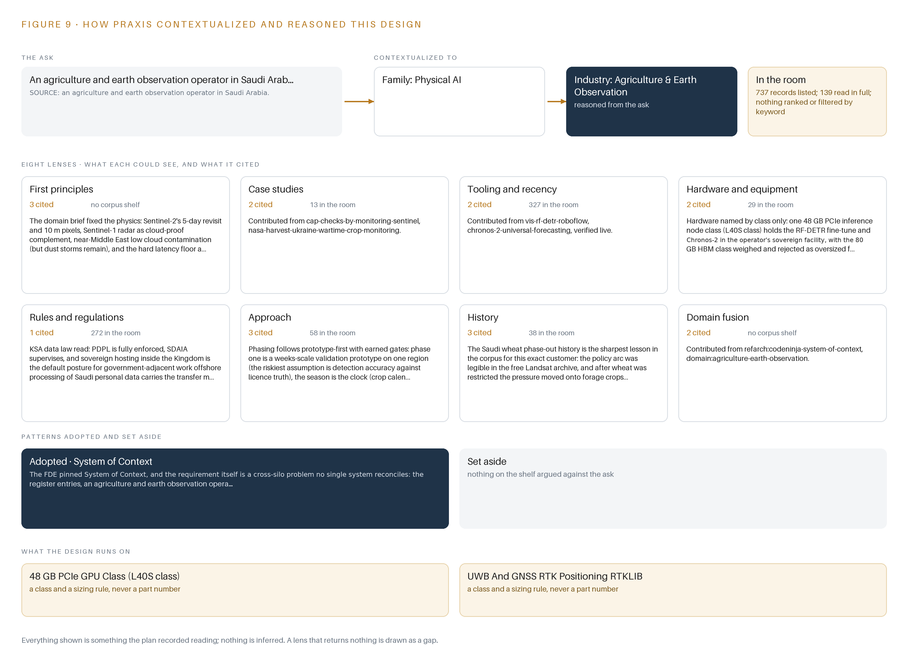

# Fodder Watch: Earth Observation That Turns Restricted-Crop Detections Into Enforceable Case Files

Canonical: https://codeatoms.ai/restricted-crop-monitoring-saudi-arabia/
DOI: https://doi.org/10.5281/zenodo.23186675
PDF: https://codeatoms.ai/restricted-crop-monitoring-saudi-arabia/paper/fodder-watch-restricted-crop-earth-observation-saudi-arabia.pdf
License: CC BY 4.0
Publisher: CodeNinja Atoms (https://codeatoms.ai), a fully owned subsidiary of CodeNinja

VERTICAL-DRIVEN ARCHITECTURES · AGRICULTURE & EARTH OBSERVATION · DESIGNED WITH PRAXIS · OCTOBER 2026

# Fodder Watch: Earth Observation That Turns Restricted-Crop Detections Into Enforceable Case Files

An 18-month sovereign monitoring service that turns satellite and aerial imagery rounds into license-checked detections of restricted green fodder and unlicensed cultivation for an agriculture and earth observation operator in Saudi Arabia.

CodeNinja Engineering Team

For the enforcement and compliance lead of an agriculture and earth observation operator in Saudi Arabia, their regional superintendents, and the geospatial, data and platform engineers who would build and run it.

---

Vertical-Driven Architectures is a CodeNinja series of system designs. Every design in the series is driven by a real-world problem and scenario in a single industry, and every one is designed on Praxis, CodeNinja's platform for designing physical AI systems. Operations are described by class, never by name.

At a glance

## Restricted-crop monitoring from orbit in Saudi Arabia

**What this is.** An open reference architecture for system design in physical AI: an 18-month earth observation service that screens every parcel for restricted green fodder and cultivation beyond the licensed area, checks each detection against the holding's licence, and turns the confirmed ones into case files an inspector can act on. It is written for the enforcement and compliance lead and for the geospatial, data and platform engineers who would build it. The operator is described by class, never by name.

**The answer in numbers.**

| Part | The design |
| --- | --- |
| Sources joined | 8 source systems, from the national agricultural register and licence records to a mirrored Sentinel-2, Sentinel-1 and Landsat archive, through 1 integration adapter family |
| Object model | 14 typed objects, from farm holding and licence to detection flag and case file, published as JSON for reuse |
| Models | RF-DETR fine-tuned per region and Chronos-2 zero-shot, both Apache-2.0, about 0.55 GB of weights together |
| Compute | One 48 GB L40S-class inference node inside the Kingdom; the card class needs a US export licence |
| Three-year cost | About 15,200 dollars to own the node, about two thirds the deepest three-year AWS commitment, and renting would move the data outside the Kingdom (Appendix A) |
| Human control | Every flag is verified on the ground by a named field inspector before a case file opens |

**Reuse it.** The object model, the model register and the figures are free to reuse under CC BY 4.0. Cite as DOI <https://doi.org/10.5281/zenodo.23186675.>

**Made with.** Reasoned on [Praxis](<https://codeatoms.ai/praxis/>), CodeNinja's platform for designing physical AI systems. The object model imports into [Hyper Ontology](<https://codeatoms.ai/hyper-ontology/>), which turns it into a living system. Both are in beta; access by request.

ABSTRACT

## A Violation Should Be Seen From Orbit, Not at the Fuel Pump

Which holdings are growing restricted green fodder or cultivating beyond the area their license allows, how many hectares are involved, and which of the three violator classes each holding falls into, so that penalties and the fuel and electricity conditions can be applied? The operator cannot answer this today because the national register, the crop license records and rounds of satellite and aerial imagery live in systems that never meet, and photo-interpretation reviews a sample of scenes rather than the whole sedimentary shelf.

The design joins eight named source systems, from the national agricultural register and license records to the mirrored Sentinel-2, Sentinel-1 and Landsat archive, through one integration adapter family onto an ontology of fourteen objects, which five services and two inspector-facing surfaces read. Two open-weight models, an RF-DETR fine-tune and a zero-shot Chronos-2, run on a 48 GB GPU class inside the operator's in-Kingdom facility, screening every parcel and triaging so only the flagged minority reaches a human inspector, ending in verified case files and GIS layers published to the operator's own enforcement channel.

The paper opens with the industry problem and the join failure, then gives the constraints, the stack, the object model, ingestion, inference placement and the models and licenses in Part II. Part III gives the rollout in three phases with their gates and the ownership of everything the design builds. Part IV closes with how Praxis contextualized and reasoned the design, tracing every choice back to what was recorded.

---



Figure 1. Fodder Watch on one page: the sources the operation already runs, one object model, what it computes, and the person who decides.

## Contents

Each chapter is tagged for the reader it serves most directly: Executive, Team Lead, FDE, Reference.

|  |  |  |
| --- | --- | --- |
|  | Abstract · A Violation Should Be Seen From Orbit, Not at the Fuel Pump | Executive |
| PART I · THE PROBLEM | | |
| 1 | [A Restricted Crop Grows Faster Than an Inspector Can Walk](#ch1) | Executive |
| 2 | [Every Register and Every Image Sees One Slice](#ch2) | ExecutiveTeam Lead |
| PART II · THE DESIGN | | |
| 3 | [Licenses, Imagery, Accuracy and Sovereignty Shape the Design](#ch3) | Team Lead |
| 4 | [One Stack Runs From Orbit to the Case File](#ch4) | Team LeadFDE |
| 5 | [Fourteen Objects Turn Imagery Into an Enforceable Case](#ch5) | FDE |
| 6 | [Every Source Enters Through One Adapter, Never Directly](#ch6) | FDE |
| 7 | [All Inference Stays Inside the Kingdom](#ch7) | FDE |
| 8 | [The License Decides What the Kingdom Can Own](#ch8) | FDEExecutive |
| PART III · THE ROLLOUT | | |
| 9 | [Shadow Rounds Come Before Any Flag Is Trusted](#ch9) | Team LeadExecutive |
| 10 | [The Ontology and the Weights Stay with the Operator](#ch10) | Executive |
| PART IV · HOW IT WAS DESIGNED | | |
|  | Conclusion · The Same Shape Watches Any Regulated Ground | Executive |
| 11 | [Every Choice Traces Back to a Recorded Reading](#ch11) | Team LeadFDE |
|  | [Sources](#sources) | Reference |

PART I · CHAPTER 1

## A Restricted Crop Grows Faster Than an Inspector Can Walk

Restricted green fodder keeps being grown on unlicensed ground, and the cost is measured in liquid fuel, aquifer draw and penalties of SAR 4,000 per hectare.

The abstract stated the shape of the service: an 18-month sovereign monitoring contract that turns satellite and aerial imagery rounds into license-checked detections, triages them so only the flagged minority reaches a human, and hands verified case files and GIS layers to the operator's own enforcement. This chapter establishes what question that service exists to answer, what the problem is documented to cost, and what the operation it serves actually looks like on the ground.

### 1.1  The Question the Operation Needs Answered

The question is narrow and it is per holding: on a given date, is a specific center pivot growing restricted green fodder, meaning berseem (البرسيم) and Rhodes grass, without a license, and if the grower holds a license, is the cultivated area inside it? The operator's policy recognizes three violator classes, and every detection must be sorted into one of them: a registered farm growing fodder without a fodder license, an unregistered farm growing fodder at all, or a licensed farm exceeding its licensed area. The answer must name the holding, the parcel, the hectares measured and the observation dates on both sides of the change, because each of those fields becomes evidence if the case is disputed.

Answering it requires data the operation already holds or already collects. The national agricultural register is the join key that separates the three violator classes; crop license records issued under Resolution 439 fix the region, farm coordinates, licensed area and crop type that every detection is checked against; well use licenses fix permitted abstraction; and imagery that resolves pivots shows what is actually on the ground. The regulatory ground is set by the Council of Ministers resolutions 66/1437 that restrict green fodder in the applicable regions, by the Resolution 439 licensing regime, by national water policy expressed through well use licenses, and by the service-condition mechanism that makes a valid register entry and a valid license a condition for obtaining agricultural fuel and electricity.

### 1.2  What the Problem Costs on the Record

The documented penalty is SAR 4,000 per hectare per year, doubling on repeat, under the operator's own published enforcement policy, and a violation measured late is a season of unlicensed cultivation that no penalty retroactively prevents. Behind the penalties sit the costs named in the requirement's own title: liquid fuel consumed by unlicensed agricultural activity, and the fossil aquifer draw that irrigated fodder on the sedimentary shelf implies. The wider stakes are the ones the agro-geoinformatics literature frames: integrating geospatial technologies into agricultural management is critical for tackling food insecurity, climate variability and resource pressure (ScienceDirect n.d.). The cost of knowing is equally documented: on-site observations remain difficult to obtain, access and reuse, which is precisely what keeps verification walking-paced and inspection sampled rather than complete (ESA 2026).

### 1.3  The Operation as a Scenario

The operation runs national-scale crop control over the sedimentary shelf: rounds of satellite imaging of center pivot farms, aerial survey of the shelf, penalty cases against named farms, and coordination that ties register and license validity to fuel and electricity services. Its scale is banded: a register of farm holdings across several agricultural regions, with holdings tiered at 50 hectares and below, 50 to 100 hectares, and above 100 hectares, watched from orbit at a 10 m optical baseline with radar as complement. The physical is hostile to casual observation: open desert shelf, dust and haze that mask optical scenes, remote pivots reached by track, and summer heat. The people in the loop are two roles: field inspectors who carry GNSS tablets and verify flagged parcels on the ground, and senior inspectors who review referred case files. The regulatory ground combines the fodder ban, the license regime, water abstraction licenses and the fuel and electricity service conditions. The design that follows counts seven named source systems, one adapter family, fourteen objects, five services, two surfaces and two models, all running in one in-Kingdom sovereign facility.

PART I · CHAPTER 2

## Every Register and Every Image Sees One Slice

The register, the license records, the geospatial databases and the imagery archive each hold one slice of every holding, and none of them can answer whether a specific pivot is licensed, in-region and within its area on a given date.

Chapter 1 defined the question the service must answer per holding and per date, and the data it needs to answer it. This chapter walks the systems the operator already runs and shows that each holds one slice of every holding, which is why the answer does not exist in any one of them today.

### 2.1  What Each System Sees and What It Misses

The national agricultural register sees the legal identity of the estate: who is registered, in which region and governorate, at what coordinates, with which crop and livestock activities. It misses everything that happens in a season: whether what is actually grown matches what was declared, and whether a registered farm holds the fodder license its crop requires.

The crop license records see the legal envelope for cultivation: the licensed region, the farm coordinates, the licensed area in hectares, the crop type and the irrigation efficiency. They miss the ground entirely; a license says nothing about whether the pivot inside it is planted, fallow, or planted with something never licensed.

The operator's geospatial databases and GIS see geometry and connectivity: farm boundaries, pivot footprints and the channel that links the register to the operator and related bodies. They miss current crop condition, because a boundary layer is a shape, not an observation.

The national satellite imaging and aerial survey products see the pivot as it was on the day of acquisition, at resolutions that show center pivots plainly across the shelf. They miss license context and continuity: a scene carries no register number, and the gap between rounds is an evidential hole the moment a dispute asks what was there.

The Copernicus Sentinel-2 and Sentinel-1 archive sees the whole shelf on a 5-day optical revisit with a cloud-proof radar complement, at no per-scene fee and no foreign processing dependency. It misses area-grade measurement: a 10 m pixel resolves crop class on a pivot but is unsuited to measuring the parcel area a penalty is computed on.

Fuel supplier coordination and electricity utility coordination see the policy hook itself: whether a holding's register and license are valid enough to obtain fuel or power for agricultural activity. They miss the field completely; neither ever sees a pivot, a hectare or a crop.

Figure 2 sets these seven systems side by side, each with its slice and its blind spot.



Figure 2. Seven systems, each seeing one part of the answer. the question needs all of them in one place at once.

### 2.2  What None of Them See Together

None of them can answer whether a specific pivot is licensed, in-region and within its licensed area on a given date, because that answer is a join across register, license, geometry and imagery that no single system performs. The cost in practice is structural: inspection is sampled where the law applies to the whole population, a detection checked against the wrong license becomes either a false accusation against a named farm or a missed season of unlicensed cultivation, and area evidence arrives too weak to survive appeal. The design's response is to hold all the slices in one object model so the question becomes a join rather than an investigation.

PART II · CHAPTER 3

## Licenses, Imagery, Accuracy and Sovereignty Shape the Design

License fidelity, per-parcel accuracy, dust-proof sensing and in-Kingdom custody of data and weights are the four constraints every later choice answers to.

Chapter 2 left the design with one obligation: hold every slice in one object model so the per-holding, per-date question becomes a join rather than an investigation. Four constraints decide how that model is built, how it is sensed, and where it is allowed to run.

### 3.1  License Fidelity Comes Before Detection

A detection is a legal act, not a map pixel: it is checked against a named license, a licensed area and a region, and if the join is wrong the accusation is wrong. That makes license fidelity the first constraint. The register and license records are the authoritative sources, the geometry behind every penalty is the register's geometry, and field boundaries, which are usually wrong or missing, are treated as a funded reconciliation workstream rather than an assumption. Every boundary in the object model carries its source and capture date, so a disputed case can always be traced to the geometry the penalty was computed on.

### 3.2  Accuracy Is Judged Per Parcel, Not Per Region

A false positive is a SAR 4,000-per-hectare accusation against a named farm, and the closest published checks-by-monitoring precedent got about a quarter of individually mapped parcels wrong even while the regional total looked right. The constraint is therefore per-parcel user's accuracy against an independent reference sample, not regional agreement. Producer's and user's accuracy are published separately, every reported area is error-adjusted, and a flag leaves the pipeline only with corroboration in time or in sensor. The bottleneck the literature names, that on-site observations are hard to obtain and reuse (ESA 2026), is answered by making the inspector visits themselves the labeled corpus that retrains the detector each season.

### 3.3  Sensing Must Survive Dust, Not Just Cloud

Over the sedimentary shelf the optical channel's real attacker is dust and haze, not cloud, and a masked pixel is not a clean absence. The design stands on Sentinel-1 radar as the standing complement, treats the scene classification layer as evidence rather than truth, and requires two consecutive screened observations or a second sensor before any flag is raised. Revisit cadence and coverage per region are settled explicitly in the imagery commissioning, with vendor tasking metered where commercial confirmation imagery is bought.

### 3.4  Data and Weights Stay Inside the Kingdom

Sovereignty is the operator's requirement, not a preference: imagery, register data, detections and model weights all stay in-Kingdom, in the operator's own facility. The design mirrors the free Sentinel archive in-Kingdom rather than processing abroad, and it holds only open-weight models under Apache-2.0 licenses so the operator owns its fine-tuned weights outright, with no field-of-use restriction and no foreign processing dependency anywhere in the pipeline.

### 3.5  Scoping Decisions and What Each Costs

Three scoping decisions shape everything downstream, and each buys something real at a stated price, as Table 1 records.

Table 1 · Scoping Decisions

| Decision | What it buys | What it costs |
| --- | --- | --- |
| One abstracted imagery source behind a single adapter: archive mirror, national imagery products or supplier tasking | The pipeline trains and runs whichever imagery answer the contract settles | An imagery commissioning item in phase one must size revisit, storage and tasking budget before the prototype trains |
| Free Sentinel-2, Sentinel-1 and Landsat baseline mirrored in-Kingdom, with commercial tasking bought only per confirmation need | A sovereign backbone with no foreign processing dependency and no per-scene fee at screening scale | The baseline resolves crop class but not parcel area, so area evidence needs an aerial or tasking confirmation round |
| Traffic-light triage so only the flagged minority reaches a human | Whole-population screening at an operating cost a photo-interpretation desk cannot match | The service's accuracy is now judged per parcel, because a flag is a SAR 4,000 accusation against a named farm |

### 3.6  What the Design Chose Against

Each rejection is a deliberate trade with a stated reason, recorded in Table 2, ending with the boundary of the service itself.

Table 2 · What the Design Chose Against

| Where | What was picked | Instead of, and why |
| --- | --- | --- |
| Detection method | Per-parcel index time series with traffic-light triage | Instead of a photo-interpretation desk reviewing scenes farm by farm: the closest published checks-by-monitoring precedent flagged only 2.9 to 11.2% of parcels while screening the whole population |
| Imagery backbone | Free Sentinel-2, Sentinel-1 and Landsat scenes mirrored in-Kingdom | Instead of commercial tasking as the backbone or a commissioned constellation: a 10 m pixel resolves pivots for crop class but is unsuited to measuring parcel area, so high-resolution evidence is bought only where a case needs it |
| Model licensing | Apache-2.0 checkpoints only: RF-DETR Nano to Large and Chronos-2 | Instead of the RF-DETR XL and 2XL checkpoints, which sit under a platform license that would restrict what the operator can hold: the operator must own its fine-tuned weights outright |
| Dust resilience | Sentinel-1 radar as the standing complement, with a two-observation screen before any flag | Instead of an optical-only cadence: dust, not cloud, is the optical channel's attacker over the sedimentary shelf |
| Verification | GNSS field tablets at 3 to 5 m grade with an arrival-coordinate buffer check | Instead of trusting visits without position evidence: the check files a not-reached visit and removes phantom false alarms |
| Scope | Monitoring, triage and verified case files only | Instead of penalty assessment and collection, fuel and electricity service gating, on-farm hardware, yield forecasting and grower advisories, hardware and infrastructure, third-party license fees, historic data migration, estate-wide training, round-the-clock support and regulatory sign-off, which stay with the operator |

PART II · CHAPTER 4

## One Stack Runs From Orbit to the Case File

A single layered stack runs from the registers and the mirrored archive, through adapters and one object model, to the services and the two inspector surfaces.

Chapter 3 fixed the four constraints and priced the scoping decisions that honour them: read-only access to the registers, imagery mirrored inside the Kingdom, automated triage before any human is involved, and every verdict left to a named inspector. This chapter lays those constraints onto one layered stack and names the component that carries each stage.

### 4.1  The Pattern and Why It Fits

The stack follows the pattern the series uses for physical operations: systems of record below, one object model in the middle, applications and agents above. Below sit the systems the operation already runs: the national agricultural register, the crop license records, the geospatial databases and GIS, the fuel and electricity coordination channels, and the satellite archives. In the middle, fourteen objects with typed links hold the join between them. Above, five services and two inspector surfaces do the work the contract names. The pattern fits because the enforcement question is a join: a detection only becomes a case when a pixel meets a license, a license meets a holding, and a holding meets a register entry. A document store cannot hold that join as first-class structure; a graph-backed object model can, and it is the layer the rest of the design reads and writes through.

Around that spine run the shared machinery: Apache Kafka 4.3 in KRaft mode with three dedicated controllers as the event backbone, a Harbor registry holding signed artefacts in the air-gapped facility, Keycloak for identity, Prometheus, Grafana and Loki for observability, and a Kubernetes-class container platform of the K3s distribution pinned at design. Time discipline is business-grade: satellite products carry UTC acquisition stamps and internal hosts hold synchronisation on a chrony-class service, so an acquisition is never silently reordered against a license event. Figure 3 shows the layered stack with the component count per layer.



Figure 3. The layered stack: 8 sources, 1 adapter family, 14 objects, 5 services and 2 surfaces.

### 4.2  The Stack Stage by Stage

Table 3 walks the stack from orbit to case file, naming what each stage is responsible for and the components that carry it. Two layers the series usually sizes are deliberately absent: no video ingest exists because the land is watched from orbit and by aerial survey, so imagery lands as GeoTIFF and COG products through STAC rather than as streams; and no edge serving exists because there is no site, everything runs in the in-Kingdom facility and nothing gates on a farm's connectivity.

Table 3 · The Stack, Stage by Stage

| Stage | What it is responsible for | How |
| --- | --- | --- |
| Sources | Hold the legal and physical truth every case stands on | national agricultural register; crop license records; the operator's geospatial databases and GIS; fuel supplier coordination; electricity utility coordination; the national imaging and aerial survey program; the Copernicus Sentinel-2 and Sentinel-1 archive; the Landsat 8/9 archive |
| Sensing | Turn orbit and aerial passes into measurements a pipeline can read | Sentinel-2 multispectral at 10 m on a 5-day revisit; Sentinel-1 C-band radar as the cloud-proof complement; Landsat 8/9 for archive depth; Sentinel-2 scene classification layers; national aerial survey products; GNSS field tablets at 3 to 5 m grade on inspector visits |
| Adapters | Form the only door into the platform, never a direct write | One integration adapter family: scheduled read-only extracts from the register and the license records, OGC API, WFS and ArcGIS REST into the GIS, and STAC cataloguing of mirrored scenes, each named in the integration register with its mechanism and cadence |
| Object model | Hold the fourteen objects, their typed links and status vocabularies | The graph-backed ontology store, with per-parcel vegetation index series on a columnar time-series store of the InfluxDB 3 Core and TimescaleDB class, retention set by the audit requirement |
| Inference | Detect restricted crops and screen the anomalies against license truth | The RF-DETR fine-tune per region and Chronos-2 zero-shot residual screening, side by side on the 48 GB PCIe inference GPU class (L40S class), air-cooled in the in-Kingdom facility |
| Services | Carry the five duties the contract names | Register & license data; imagery & detection; sovereignty & governance; field verification & cases; reporting & delivery |
| Surfaces | Put every decision in front of a named person | The operator's field inspector view and the senior inspectors view, both behind Keycloak identity, both reading and writing only through the object model |

PART II · CHAPTER 5

## Fourteen Objects Turn Imagery Into an Enforceable Case

Fourteen objects, anchored in the register and the license records, hold the typed links that turn a pixel into an attributable, appealable case.

Chapter 4 placed the stages of the stack and named the component at each one. This chapter opens the middle layer and shows what the fourteen objects hold, how the typed links turn a pixel into an attributable case, and where the human loop and the hosting boundary sit.

### 5.1  Every Object and Its Typed Links

The fourteen objects fall into four families. Holdings and actors: farm holding, center pivot / cultivated field, and farm enterprise / large farmer, each anchored in the register and the operator's geospatial databases. Legal records: the crop license for wheat and seasonal fodder, the water source (well) use license, the green fodder ban control that records the council resolutions behind the restriction, and the agricultural fuel / electricity service condition record that ties register and license validity to service access. The observation chain: imagery tasking order, satellite image capture and processed imagery product, the provenance trail from a planned acquisition to a citable scene. The enforcement chain: restricted-crop detection flag, violation case file and the operator's field inspector as a person object, plus the restricted-crop classifier itself, held as an object so its version, training window and accuracy on the reference sample are queryable alongside the flags it produced. Figure 4 draws every object and its typed links, with the detection flag as the focal object.

The links are what make a query enforceable. From one detection flag, a query crosses to the license it was checked against, from the license to the holding by farm coordinates, from the holding to the enterprise and its violator class, and from the flag forward to the case file and the inspector who verified it. A document store can store all of these records but cannot traverse them; here the path from pixel to penalty basis is a graph walk, and every hop carries its own status vocabulary and timestamp domain.



Figure 4. The fourteen objects of the model and the typed links that let a query reach across them.

### 5.2  Where the Human Loop Lives

The human loop lives on the detection flag. Its status vocabulary, raised, triaged, dispatched, scouted, confirmed, refuted, artefact, unresolved, is the triage contract: only the flagged minority is dispatched, and every transition is made by a named inspector whose identity comes from Keycloak. Field truth is the scarce resource; earth observation for agriculture is bottlenecked by on-site observations, which remain difficult to obtain and reuse (ESA 2026), so the inspector visit, with its recorded arrival coordinates compared against the flagged polygon, is the design's ground-truth instrument and the labelled corpus that retrains the classifier each season. The hosting posture follows: everything runs in the in-Kingdom facility, mirrored scenes never leave the boundary, the register is read-only, the fuel and electricity condition record is the only external link and it moves through the operator's coordination channel, and the only write path into the object model is the status transition on a flag or case by a named person.

### 5.3  One Object in Its Recorded Form

The restricted-crop detection flag is the object that carries the whole argument, because it is where imagery, license truth and human decision meet, and its recorded form is printed below with the screening rule that cleared it and the observation dates on both sides of the change.

```
{
  "id": "farm-holding",
  "label": "Farm holding",
  "kind": "site",
  "anchored_in": "national agricultural register",
  "properties": [
    "Register number",
    "Region and governorate",
    "Farm coordinates",
    "Area tier (50 ha and below / 50 to 100 ha /\u2026",
    "Crop and livestock activities"
  ],
  "status_vocabulary": [
    "Registered",
    "Unregistered",
    "Under review"
  ],
  "links": [
    {
      "to": "farm-enterprise-large-farmer",
      "label": "belongs to"
    },
    {
      "to": "crop-licence-wheat-seasonal-fodder",
      "label": "holds licence"
    },
    {
      "to": "agricultural-fuel-electricity-service-condition-record",
      "label": "conditions"
    }
  ]
}
```

PART II · CHAPTER 6

## Every Source Enters Through One Adapter, Never Directly

Eight named sources enter through one integration adapter family onto an event backbone that keeps acquisition order, register order and case order intact.

Chapter 5 defined what the object model holds and who may write to it. This chapter describes how data gets into it: the eight named sources, the guarantees of the single adapter family they enter through, and the event backbone that keeps every order intact.

### 6.1  Eight Sources, Two Provenance Classes

Eight named sources feed the platform, each tagged with its provenance class and read direction, as Figure 5 shows. Five are operator-held, read from systems the operator already runs: the national agricultural register, the national satellite imaging and aerial survey program, the geospatial databases and GIS, the fuel supplier coordination channel, and the electricity utility coordination channel. Three are domain-typical, held under the same class because the sources are public or industry-standard rather than operator-specific: the crop license records that Resolution 439 licensing fixes, the Copernicus Sentinel-2 and Sentinel-1 archive, and the Landsat 8/9 archive, whose combined 8-day cadence reaches back decades. Every source is read-only; nothing in the design writes back into a system of record, and the integration register names each source with its mechanism and cadence.



Figure 5. The 8 named systems, the adapter path each one takes, and the object model they all map into.

### 6.2  What the Adapter Tier Guarantees

Every source enters through one integration adapter family, never directly into the object model. The adapter tier guarantees four things. First, provenance: every record arrives tagged with its source, its provenance class and an acquisition timestamp in UTC, so a scene is never silently reordered against a license event. Second, discipline: extracts from the register and the license records are scheduled and read-only, geospatial exchange runs over OGC API, WFS and ArcGIS REST, and imagery lands as GeoTIFF and COG products catalogd through STAC, not as streams. Third, idempotence: a replayed batch makes no duplicate holding, license or flag. Fourth, quarantine: a schema change in any source is held in a dead-letter path for review instead of corrupting the model, which matters because the register and the license records are living administrative systems whose vocabularies can change mid-season.

### 6.3  The Event Backbone

Apache Kafka 4.3 in KRaft mode, with three dedicated controllers, is the backbone every adapter writes into and every service reads from. Ordering is by key: holding reference for register and license events, parcel reference for detections, so all events for one holding or one parcel keep acquisition order through the pipeline. Delivery is at-least-once with idempotent consumers, which pairs with the adapters' replay guarantee. Buffering absorbs the shape of the workload, because a mirroring round lands the scenes for a whole region in a burst while case transitions trickle in all day. Replication stays inside the in-Kingdom facility, keeping the sovereignty posture intact, and retention is set so that any flag can be traced back to the exact scenes and register extracts that raised it, for the life of the audit requirement.

PART II · CHAPTER 7

## All Inference Stays Inside the Kingdom

Detection and time-series screening run on a 48 GB GPU class inside the operator's in-Kingdom facility, and nothing needs to think in the desert.

Chapter 6 closed the integration story: every scene, register extract and license event enters through one adapter family onto an ordered, replayable event backbone, so the computation that follows never reads a source system directly. This chapter places that computation. The placement is deliberately simple, and the chapter is short for that reason: one inference tier, one facility, and no compute in the desert.

### 7.1  One Inference Tier Inside the Facility

The design carries exactly one inference tier, a central one, running inside the operator's in-Kingdom sovereign facility on the 48 GB PCIe GPU class (L40S class), air-cooled alongside the rest of the pipeline under a Kubernetes-class container platform. There is no edge tier, and the omission is principled rather than deferring: fields and pivots do not move, so there is no trajectory problem; no farm-side hardware exists to serve; and nothing in the pipeline gates on a farm's connectivity. Figure 6 shows the tier, what runs on it, and the single boundary it sits behind.

Two models run side by side on the node: the fine-tuned RF-DETR detector for restricted-crop and center-pivot detection, and the zero-shot Chronos-2 forecaster for per-parcel vegetation index baselines. The memory arithmetic is untroubled. The Apache-licensed RF-DETR Nano to Large detection checkpoints occupy about 61 to 68 MB at 16 bit in BF16; Chronos-2 as published is about 0.48 GB at FP32, or about 0.24 GB at 16 bit. At the stated serving precisions the combined resident weights sit under roughly 0.55 GB, around one percent of the 48 GB class. Usable memory runs somewhat below the nameplate once the operating system and serving runtimes take their share, but the attention KV cache ceiling is not the binding constraint here: with weights this small the cache ceiling sits close to the usable total, so batches of independent per-parcel index series scale to the workload rather than to a memory wall. On-site observations remain difficult to obtain, access and reuse (ESA 2026), which is why the design pulls its ground truth from inspector GNSS visits rather than field sensors, and lets the central node carry all of the thinking.



Figure 6. Where each tier runs, what runs there, and the narrow set of outputs that cross the boundary.

### 7.2  The Latency Budget

The budget runs from satellite acquisition to a dispatched flag, and it is dominated by orbital cadence, not by compute: Sentinel-2 revisits optically every 5 days, Sentinel-1 carries the radar complement between optical passes, and Landsat 8/9 add an 8-day combined archive view reaching back decades. The pipeline's own stages, scene mirroring, cloud and artefact screening, detection, the license join, and flag triage, are budgeted to complete comfortably inside one revisit interval, so a flag never waits on the GPU; the binding constraint is when the next scene lands, not how fast the node thinks. A Sentinel-1 confirmation acquired between two optical passes is consumed by the two-sensor corroboration rule within the same cycle, and inspector dispatch latency starts at the flag, not at the compute.

### 7.3  What Crosses the Boundary, and What Fails

What crosses the facility boundary is data in both directions and weights in neither: inward, scene products as GeoTIFF/COG through STAC plus scheduled read-only register and license extracts; outward, GIS layers over OGC services, reports, and the fuel and electricity compliance extracts. Model weights enter only through the air-gapped Harbor registry and never leave. If the imagery link fails, the event backbone buffers, scenes already mirrored stay available, and screening resumes on replay, so a disrupted cycle delays detections by one revisit rather than losing them. If facility power fails, the node re-serves on restoration and in-flight batches re-run from stream offsets, so no flag is silently dropped. If the update path fails, the serving model version keeps serving; each restricted-crop classifier version carries a named rollback target, rehearsed in phase one, so an update is never half-applied and a regression is one rollback away.

PART II · CHAPTER 8

## The License Decides What the Kingdom Can Own

Two Apache-2.0 models, a fine-tuned RF-DETR and a zero-shot Chronos-2, stay owned outright inside the Kingdom because their licenses carry no field-of-use restriction.

Chapter 7 showed that one 48 GB node inside the Kingdom holds every model this design runs, with weights near an afterthought of its memory. This chapter names those two models, states their licenses in full, and argues that the license, more than the architecture, is what lets the operator own its intelligence outright.



Figure 7. The two models, their placement, and the work each one does.

### 8.1  The Model Stack

Figure 7 shows the stack: two models, both Apache-2.0, both on the central tier, one fine-tuned and one zero-shot. The thesis of the chapter is contractual as much as technical. Apache-2.0 carries no field-of-use restriction, so the weights, including the operator's own regional fine-tunes, are owned outright and may be held inside the Kingdom past the end of the 18-month contract. That matters because this is regulatory monitoring over agricultural holdings: the discipline of integrating earth observation with farm-level records is exactly what the field calls agro-geoinformatics, and its value compounds only when the operator, not a foreign processing chain, holds the models and the evidence together (ScienceDirect n.d.).

### 8.2  The Detector and the Forecaster

RF-DETR is the restricted-crop and center-pivot detector, fine-tuned per region on labelled and inspector-confirmed parcels, served in BF16 on the central node. It is an Apache-2.0 detector whose Nano and Large checkpoints carry no field-of-use restriction, and the Nano-to-Large span covers both the detection and segmentation sizes the per-parcel pipeline needs; the fine-tuned weights occupy about 61 to 68 MB at 16 bit. The XL and 2XL checkpoints, at about 254 MB at 16 bit for 2XL, are excluded because they sit under Roboflow's Platform Model License, which would compromise the ownership rule, and the excluded size is not needed for 10 m per-parcel work. Where the vendor quotes latency on its own hardware, the design treats the footprint, not the part number, as the sizing truth.

Chronos-2 is the time-series forecaster, a roughly 120M parameter model that runs zero-shot over the thousands of independent per-pivot vegetation index series, with no fine-tuning in the plan. Served at FP32 at about 0.48 GB as published, about 0.24 GB at 16 bit, it sets each parcel's expected index trajectory over the revisit cycle and screens residuals against thresholds, giving the cloud and artefact screen a second, independent sensor view before any flag leaves the pipeline. It was chosen because zero-shot behavior on a central GPU fits the per-parcel population without a labelling dependency, and Apache-2.0 keeps its weights in-Kingdom beside the detector.

### 8.3  The Model and Equipment Register

Table 4 gathers the register: each model, the hardware classes and sizing rules, the sensing, the patterns the design stands on, and the ground it runs on.

Table 4 · Model and Equipment Register

| The choice | What was picked | Why here |
| --- | --- | --- |
| Detector | RF-DETR, Apache-2.0, fine-tuned per region, BF16, about 61 to 68 MB at 16 bit | No field-of-use restriction, so the operator owns the fine-tuned weights outright |
| Forecaster | Chronos-2, Apache-2.0, zero-shot, about 120M parameters, FP32, about 0.48 GB | Thousands of independent per-parcel index series with no fine-tuning dependency |
| Checkpoint exclusions | RF-DETR XL and 2XL under Roboflow's Platform Model License, excluded | Field-of-use terms would compromise in-Kingdom weight ownership |
| Inference node | 48 GB PCIe GPU class (L40S class), air-cooled, in the sovereign facility | Footprint rule: combined weights under 0.55 GB leave batch and cache headroom |
| Positioning | RTKLIB class GNSS with optional site base station, field tablets at 3 to 5 m grade | Arrival coordinate checked against the flagged polygon, so phantom visits file as not-reached |
| Optical sensing | Sentinel-2 multispectral, 10 m, 5-day revisit | Resolves center pivots for crop class without a foreign processing dependency |
| Radar sensing | Sentinel-1 C-band SAR | Cloud-proof complement; dust and haze, not cloud, are the optical channel's real attacker |
| Archive sensing | Landsat 8/9, 8-day combined, archive reaching back decades | History for per-parcel baseline series |
| Cloud evidence | Sentinel-2 scene classification and cloud probability layer | Treated as evidence, not truth, in the screening rule |
| Aerial sensing | national aerial survey products | Rounds over the sedimentary shelf, matching the operator's existing method |
| Field truth | GNSS field tablets on inspector visits | Confirmed and refuted visits become the labelled corpus for each season's retraining |
| Pattern: triage | Per-parcel signature time series with traffic-light triage | Only the flagged minority reaches a human inspector |

PART III · CHAPTER 9

## Shadow Rounds Come Before Any Flag Is Trusted

Three phases with sixteen items gate on the register join, the inspector verification pack and the Kingdom-wide shelf rollout, and shadow rounds precede any trusted flag.

Chapter 8 fixed the two models, their Apache-2.0 licenses and the inference node class that holds them inside the operator's facility. This chapter fixes the order in which the system earns the right to raise a flag that carries a penalty: the register join first, the inspector verification pack second, the shelf-wide rollout last.

### 9.1  Three Phases, Sixteen Items, Three Gates

Figure 8 shows the rollout as three phases carrying sixteen items in total, each phase closing on a gate that can stop the work cheaply, and no phase carrying a duration. Phase 1 carries six items across three workstreams, imagery and detection, register and license data, and sovereignty and governance, including the sedimentary shelf ontology build, the register and license join, and the imagery baseline and STAC catalog. Its exit gate is the register and license join itself, because no detection can be checked against a license until holdings, pivots and licenses resolve to one key. Phase 2 carries seven items across field verification and cases, imagery and detection, and reporting and delivery, including the cloud, haze and artifact screening, the detection-to-case workflow, and the inspector field verification pack, which is its exit gate. Phase 3 carries three items, the fuel and electricity linkage extracts, the Kingdom rollout across the shelf regions, and the contract end handover and exit pack, and its gate is the Kingdom rollout itself. Requirement coverage closes at two requirements covered, none partial and none open, so every requirement the notice states traces to named items and gates in Figure 8.



Figure 8. The three phases and their gates, and coverage of the 2 requirements across them.

### 9.2  What the Rollout Measures

The rollout measures detection quality as two numbers published separately, producer's accuracy and user's accuracy, and user's accuracy against an independent reference sample gates each phase transition, because a flag is an accusation against a named farm and the operator's published penalty is SAR 4,000 per hectare per year, doubling on repeat. It measures area as error-adjusted hectares rather than raw pixel counts, corroboration as the share of flags supported by two consecutive screened observations or a second sensor, and visit integrity as the share of arrival coordinates that fall inside the flagged polygon's buffer, with the rest filed as not reached. It measures triage discipline as the distribution of flags across the eight status values from raised to unresolved, and model health as per-region validation against inspector ground truth each season, with rollback rehearsed in phase 1 before any version serves.

### 9.3  Failure Modes

Table 5 lists what fails and what the design does about it; each row is a recorded risk in this domain, not a hypothetical.

Table 5 · Failure Modes

| What fails | What the design does |
| --- | --- |
| Imagery supply is unresolved: the notice is silent on whether the service consumes the operator's and national imagery products or brings its own imagery | One abstracted imagery source behind a single adapter, archive mirror, national imagery delivery or supplier tasking, settled in the phase 1 imagery commissioning before the prototype trains |
| A false positive is a SAR 4,000 per hectare accusation, and about a quarter of individually mapped parcels were wrong in the closest published precedent even when the regional total looked right | Producer's and user's accuracy published separately, user's accuracy gating the rollout, every reported area error adjusted, and two consecutive screened observations or a second sensor required before a flag leaves the pipeline |
| Field boundary geometry is wrong or missing, yet geometry is the legal source of the area a penalty is computed on | Boundary capture treated as a funded project item reconciled against register geometry, register geometry kept authoritative, each boundary's source and capture date recorded |
| Dust and haze, not cloud, are the optical channel's real attacker over the shelf, and a masked pixel is not a clean absence | Sentinel-1 radar as the cloud-proof complement, the scene classification layer treated as evidence rather than truth, and the two-observation corroboration rule |
| Revisit cadence and coverage are not stated in the notice, which changes tasking budget, storage sizing and how fast a violation becomes a case | A revisit and coverage schedule per region agreed with the operator in phase 2, with commercial tasking quotas metered where confirmation imagery is bought |
| A classifier trained on one region's pivots and seasons fails on another's, and drifts as the roster of satellites and seasons changes | Per-region validation against inspector ground truth each season, versioned models with rollback rehearsed in phase 1, and a named retraining cadence owned by the operator after handover |

### 9.4  Lessons

**Shadow the flags before anyone trusts them.** Every flag runs the full pipeline and the case workflow in shadow, triaged and dispatched but carrying no weight, until the inspector verification pack passes its gate; the first trusted flag is earned, never switched on. Publish accuracy as two numbers, never one. Producer's accuracy flatters a system that finds most violations but accuses the wrong farms, so user's accuracy, the share of flags that survive a visit, is the number that gates the rollout. A masked pixel is not a clean absence. Dust and haze remove evidence rather than create it, which is why the radar channel and the corroboration rule exist before the first flag is raised. Ground truth comes from visits, and visits are the hard part. Earth observation for agriculture is bottlenecked by field data because on-site observations remain difficult to obtain and reuse (ESA 2026), which is why the GNSS arrival check and the not-reached filing are first-class items, not afterthoughts.

### 9.5  What Is Still Open

Three questions remain open. The imagery sourcing question, whether the service consumes the operator's and national imagery products or procures its own, changes the adapter configuration and the tasking budget, and settling it in the phase 1 commissioning locks both. The revisit and coverage question per region changes storage sizing and how fast a violation becomes a case. The work surface question, whether the operator takes the agent-building surface, changes whether a language model enters the register and a serving tier is sized; until then the design keeps that tier open and ships nothing that depends on it.

PART III · CHAPTER 10

## The Ontology and the Weights Stay with the Operator

The object model, the fine-tuned weights, the decision record and the boundary stay with the operator that produced the evidence.

Chapter 9 set the gates the system passes before any flag is trusted. This chapter states who holds what the design builds once those gates are behind it: the answer is the operator, on every layer that matters.

### 10.1  What the Operator Owns

The object model is the operator's: the fourteen objects, from farm holding through crop license and detection flag to violation case file, with their typed links, stay with the operator as its own model of holdings, licenses and cases, anchored in the register and the geospatial databases and extended only through the single write path. The weights are the operator's: the fine-tuned RF-DETR checkpoints carry Apache-2.0 terms with no field-of-use restriction on the Nano-to-Large detection checkpoints, so the per-region fine-tunes and their rollback targets are held outright, alongside the Chronos-2 weights used for the per-parcel index series, all inside the Kingdom. The decision record is the operator's: every flag's status from raised through confirmed, refuted or artifact, and every case file with its evidence pack reference, hectares measured and referred date, is kept as a record the next season's triage reads. The boundary is the operator's: everything runs inside the operator's own facility, the register and the license records are read through scheduled read-only extracts, imagery is mirrored rather than processed abroad, and identity is held on site in Keycloak.

### 10.2  The Offer Behind the Design

This design is produced on Praxis, CodeNinja's platform for designing physical AI systems, and it maps to CodeNinja's offer where the matching element exists. The satellite, aerial and GNSS sensing with detection and forecasting of physical behavior across the shelf regions is Adaptive Operations; the triage that ranks the flagged minority for a named inspector to decide is Decision Systems; the fourteen-object model of holdings, licenses, flags and cases is Hyper Ontology; the kept record of decisions and outcomes, the flag lifecycle and the verified case files, that the next season's triage reads is Hyper Engram, an agentic memory that informs the next decision without touching model weights; and the open-weight Apache-2.0 licenses held on the operator's own hardware inside the Kingdom are Sovereign Infrastructure.

PART IV · CONCLUSION

## The Same Shape Watches Any Regulated Ground

Fodder Watch is a sovereign monitoring service that joins a register and license records to mirrored Sentinel and Landsat imagery through one ontology of fourteen objects, screens every parcel with per-parcel index series and a detector fine-tune, escalates only the flagged minority to a human inspector, and ends in verified case files the operator enforces under its own published policy of SAR 4,000 per hectare per year, doubling on repeat, all inside the Kingdom.

Any regulator that holds a register, a license rule and revisitable imagery over its ground can run the same shape: the work is the join, the per-parcel time series and the accuracy gate that separates a real change from a cloud, a dust event or an artefact, not the satellites themselves.

PART IV · CHAPTER 11

## Every Choice Traces Back to a Recorded Reading

Praxis recorded the ask, the eight lenses, the patterns adopted and set aside, and the equipment classes behind every choice in this design.

Chapter 10 placed the ontology, the weights, the decision record and the boundary in the operator's hands. This closing chapter shows how the design itself was reasoned, so that any choice in the preceding chapters traces back to what justified it. Every design in this series is produced on Praxis, the design team platform for designing physical AI systems, and this chapter is the audit trail: the ask as recorded, the lenses consulted, the patterns adopted and set aside, and the equipment classes the reasoning landed on. Figure 9 shows how Praxis reasoned this design end to end.

### 11.1  Contextualizing the Ask

The ask, in the operator's own published words, is monitoring services for restricted crops, to reduce liquid fuel consumption by unlicensed agricultural activities. Praxis assigned it to the regulatory monitoring family in the agriculture and earth observation industry, a problem class where the evidence a penalty rests on must survive appeal. In the room were the verbatim public notice fields as recorded on the government procurement portal, and the issuer's own published policy facts that define the monitoring problem: the green fodder ban and the council resolutions behind it, the resolution that fixes crop licenses by region, coordinates, area and crop type, the published penalty basis of SAR 4,000 per hectare per year doubling on repeat, and the obligations that tie fuel and electricity services for agricultural activity to a valid register and license. Each record was read in full and is available on request; the priced booklet sits behind supplier registration, so the design was built to survive the open questions only it answers.



Figure 9. From the ask to the design: the family and industry Praxis assigned, the eight lenses and what each cited, the patterns adopted and set aside, and the equipment the design lands on.

### 11.2  The Lenses

Table 6 lists the eight lenses Praxis read the ask through, what each could see, what it cited, and what it contributed; the history lens returned nothing usable in the recorded room and is shown as a gap.

Table 6 · The Lenses and What They Contributed

| Lens | Could see | Cited | What it contributed |
| --- | --- | --- | --- |
| First principles | The minimum evidence a penalty-grade accusation needs: a license to check against, a measured area, a change corroborated in time or in sensor | Not cited externally | The license-check join, the two-observation corroboration rule and the error-adjusted area |
| Case studies | How agro-geoinformatics integrates earth observation into agricultural management at scale, and why it matters for resource control | (ScienceDirect n.d.) | The per-parcel time series framing and the detection-to-case workflow |
| Tooling and recency | Current choices for streaming, the ontology store, registries, identity and observability | Not cited externally | Kafka with KRaft, the Hyper Ontology v0.9 store, Harbor, Keycloak and the Prometheus, Grafana and Loki stack |
| Hardware and equipment | What compute the pipeline needs and, as importantly, what it does not | Not cited externally | The 48 GB PCIe inference node class, and the ruling out of every field and edge hardware class |
| Rules and regulations | The resolutions and license regime that define the three violator classes | Not cited externally | The green fodder ban control and crop license objects, and the penalty basis the case files carry |
| Approach | Why field data, not satellites, bottlenecks agricultural earth observation | (ESA 2026) | The inspector verification pack and the GNSS arrival check as first-class items |
| History | Prior monitoring rounds and their records | Gap | Flagged as a gap: whether prior rounds' records exist to seed the baseline is carried as an open item |
| Domain fusion | Where remote sensing meets enforcement practice on one working surface | (ScienceDirect n.d.) | Fusing imagery signals with register, license and visit evidence into one ontology rather than an image catalog |

### 11.3  Patterns Adopted and Set Aside

The design adopted per-parcel signature time series with traffic-light triage, so only the flagged minority reaches a human, over a photo-interpretation desk reviewing scenes farm by farm: the closest published precedent measured that automated screening moves inspection from a sample to the whole population while flagging only a small minority of parcels, which is an operating cost a human desk cannot match. It adopted a free Sentinel-2, Sentinel-1 and Landsat baseline mirrored in-Kingdom, with commercial tasking bought per confirmation need, over commercial tasking as the backbone. It set aside farm-side hardware, edge serving and pivot control entirely, because the estate is watched from orbit and by aerial survey. It set aside a frontier language model serving tier, because the work surface is offered rather than committed and no language model is in this run's register; the tier opens only if the unlock question is answered.

### 11.4  Where the Reasoning Lands

The reasoning lands on equipment classes, not part numbers: the 48 GB PCIe inference GPU class, air-cooled in the operator's facility, holding the detector fine-tune and the forecaster side by side with real KV headroom; the GNSS positioning class for inspector tablets at field grade, with an optional base station; the lightweight Kubernetes-class container orchestration; the columnar time-series store class for per-pivot index series; and the open labelling-tool class that turns inspector-confirmed and refuted visits into the corpus that retrains the detector each season. Everything shown in this chapter was recorded reading: the ask, the room, the lenses, the patterns and the classes were noted as they were read, and nothing is inferred.

Appendix A

## What Ownership Costs Over Three Years

The design runs both of its models, the RF-DETR detector and the Chronos-2 forecaster, on one 48 GB L40S-class inference node in the operator's own facility inside the Kingdom. This appendix prices that node against renting the same card from a cloud region. Every input is a public price, dated and cited, and the arithmetic is shown so any reader can rerun it with a written quote. A closed model priced by the token is not compared, because neither model is a language model and no hosted service offers this detector and forecaster pair.

### A.1 The Answer

Owning the inference node costs about **15,200 US dollars over three years**, inside a range of 14,600 to 15,800. Renting one L40S card around the clock costs **22,600 to 60,000 dollars** over the same period. Against the deepest three-year commitment listed (AWS, three-year EC2 Instance Savings Plan, all upfront, in the UAE region), ownership is **about two thirds** the cost. No rented option can sit inside the Kingdom today: AWS's Saudi region opens in December 2026 (Channel Insider 2026), and every option below would move imagery, register data and detections across the border, which the design's sovereignty constraint rules out.

### A.2 What Owning Costs

| Line | Basis | Three-year cost (USD) |
| --- | --- | --- |
| Inference node | One L40S-class card with its share of host, memory and power supply, priced as one eighth of an eight-card L40S server at 85,271 dollars (Newegg 2026); the card alone lists at 7,709 dollars (esaitech 2026) | 10,700 |
| Support | 8 to 12 percent of hardware value a year (Introl 2026) | 2,600 to 3,800 |
| Power | 0.6 kW average draw for the card and its host share (an assumption: the L40S is rated at 350 W) at a power usage effectiveness of 1.6 (Uptime Institute 2025), 25,229 kWh at the industrial tariff of 0.20 riyals per kWh (ECRA 2025) at 3.75 riyals to the dollar | 1,300 |
| **Total** |  | **14,600 to 15,800, typical 15,200** |

One card is enough because the two models together hold about 0.55 GB of weights (Table 4); the 48 GB class leaves room for batching every parcel in a screening round.

### A.3 What Renting Costs

The same card, rented without a break for three years, because screening rounds follow the imagery and the season, not office hours.

| Option | Basis | Three-year cost (USD) |
| --- | --- | --- |
| AWS, UAE region, on demand | g6e.xlarge, one L40S, at 2.283 dollars an hour in me-central-1 (AWS 2026a); outside the Kingdom | 60,000 |
| AWS, UAE region, three-year EC2 Instance Savings Plan, all upfront | g6e.xlarge at 0.858 dollars an hour, the deepest three-year plan in the region (AWS 2026b); outside the Kingdom | 22,600 |
| Specialist GPU cloud, on demand | 18.00 dollars an hour for eight L40S cards, 2.25 per card (CoreWeave 2026); outside the Kingdom | 59,100 |

Egress, storage of the mirrored archive and the network link to the region are excluded, so every rented figure is a floor.

### A.4 What the Price Does Not Include

- **An export licence.** The L40S is an advanced computing item under ECCN 3A090, and its export to Saudi Arabia needs a licence from the Bureau of Industry and Security (NVIDIA 2023; eCFR 2026), granted case by case. The order date for the node is therefore a phase one checkpoint on the licence timeline.
- **The imagery itself**: Sentinel-2, Sentinel-1 and Landsat are free; commercial confirmation tasking is bought per need and priced by the supplier.
- **Field tablets and GNSS equipment** for inspectors, which the operator already issues.
- **Customs duty and 15 percent VAT** on the hardware, which a written quote delivered to the Kingdom settles.
- **People, facilities and implementation**, which both sides carry.

### A.5 Sources for This Appendix

- AWS. 2026a. Amazon EC2 on-demand prices, Middle East (UAE), Linux, g6e.xlarge. <https://aws.amazon.com/ec2/pricing/on-demand/>
- AWS. 2026b. EC2 Instance Savings Plans price file, me-central-1, version 20261005200132. <https://pricing.us-east-1.amazonaws.com/savingsPlan/v1.0/aws/AWSComputeSavingsPlan/current/region_index.json>
- Channel Insider. 2026. AWS cloud region launch, Saudi Arabia. <https://www.channelinsider.com/infrastructure/news-aws-cloud-region-launch-emea-saudi-arabia/>
- CoreWeave. 2026. Pricing. <https://www.coreweave.com/pricing>
- eCFR. 2026. 15 CFR Part 740, Supplement No. 1, Country Groups. <https://www.ecfr.gov/current/title-15/part-740/appendix-Supplement%20No.%201%20to%20Part%20740>
- ECRA. 2025. Electricity tariff, effective 28 May 2025, as reported. <https://clenergize.com/ksa-electricity-tariff-changes-in-2025-is-your-business-ready/>
- esaitech. 2026. PNY NVIDIA L40S 48 GB GDDR6 PCIe. <https://esaitech.com/products/pny-technologies-nvl40stcgpu-kit-nvidia-l40s-4-port-48gb-gddr6-graphic-card>
- Introl. 2026. GPU infrastructure TCO model. <https://introl.com/blog/gpu-infrastructure-tco-model-5-year-enterprise-ai-deployment>
- Newegg. 2026. Supermicro SYS-421GE-TNRT-02-G1. <https://www.newegg.com/p/N82E16859152404>
- NVIDIA. 2023. Form 8-K, 17 October 2023. <https://www.sec.gov/Archives/edgar/data/1045810/000104581023000217/nvda-20231017.htm>
- Uptime Institute. 2025. Global Data Center Survey 2025. <https://uptimeinstitute.com>

SOURCES

## Source Register

ESA. 2026. Earth observation for agriculture requires more than. <https://sciencehub.esa.int/2026/06/04/earth-observation-for-agriculture%F0%9F%8C%B1-requires-more-than-satellites>

ScienceDirect. n.d.. Empowering agro-geoinformatics with earth observation. <https://www.sciencedirect.com/science/article/pii/S0168169925014541>

---

### About CodeNinja

CodeNinja is a Middle Eastern-American artificial intelligence lab focused on building self-improving systems. We are reinventing knowledge work to close the loop between vertical AI use cases and the generalized intelligence that fuels it, accelerating the path toward organizational superintelligence.
