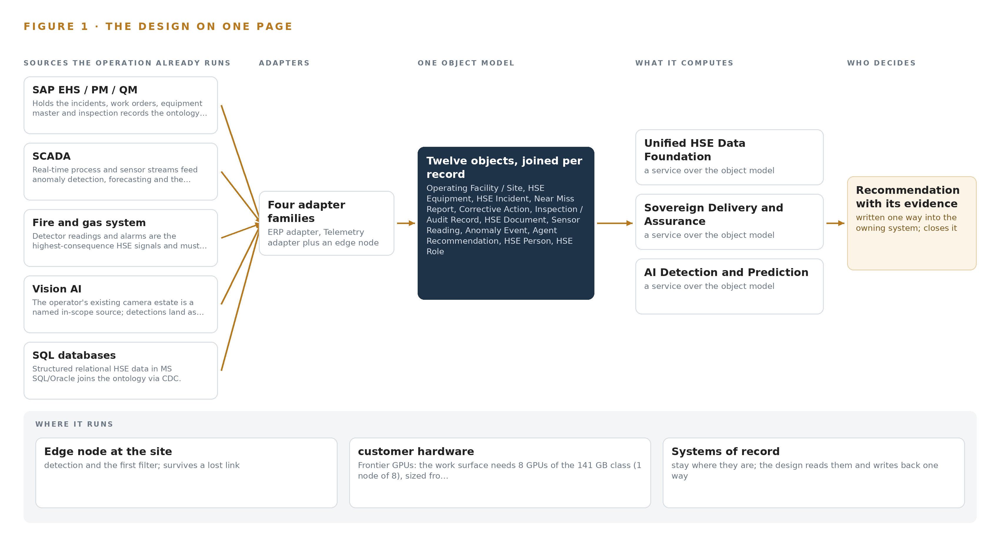
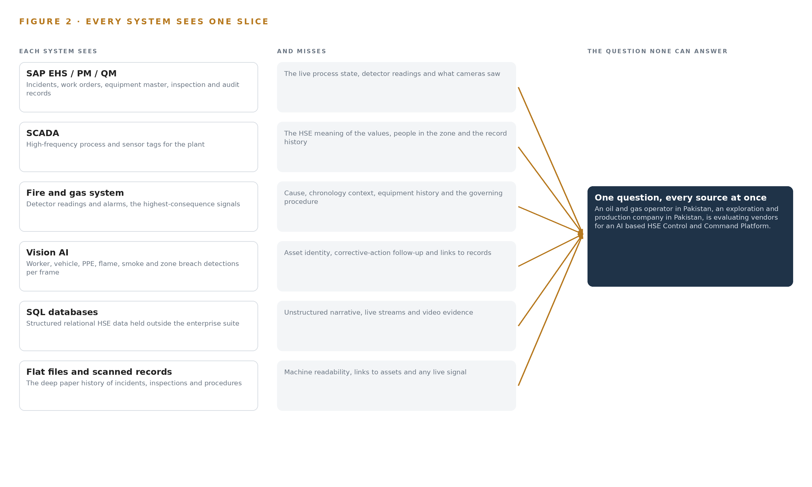
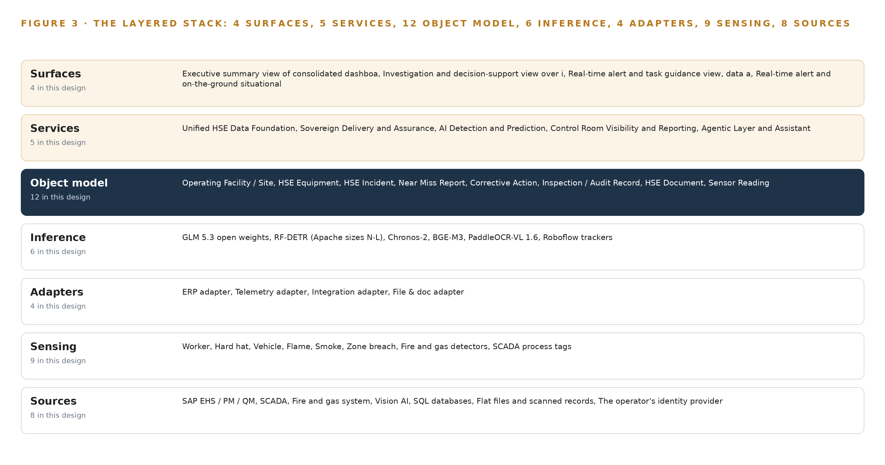
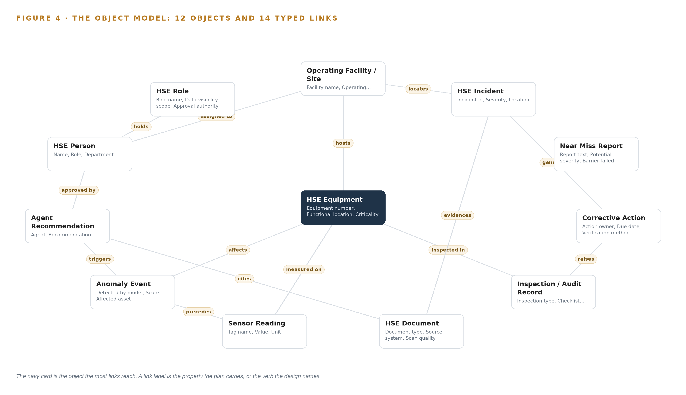
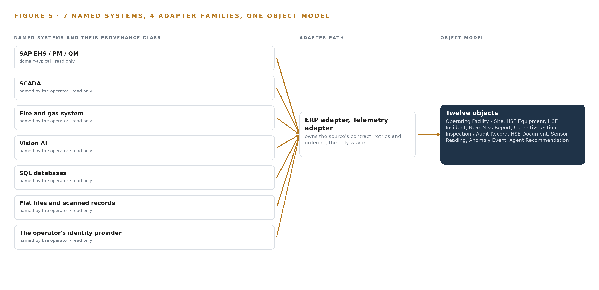
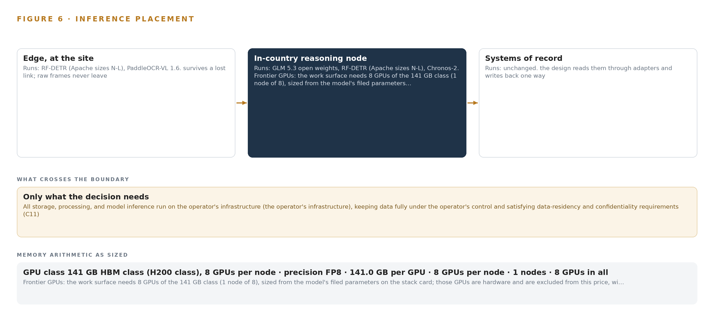
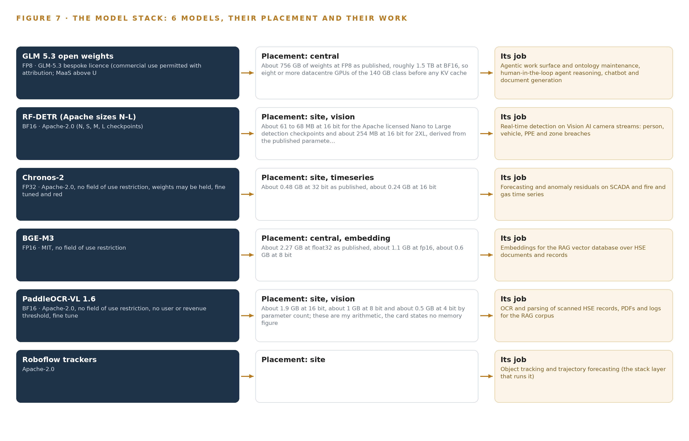
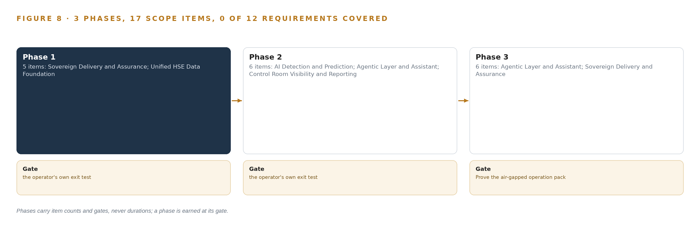
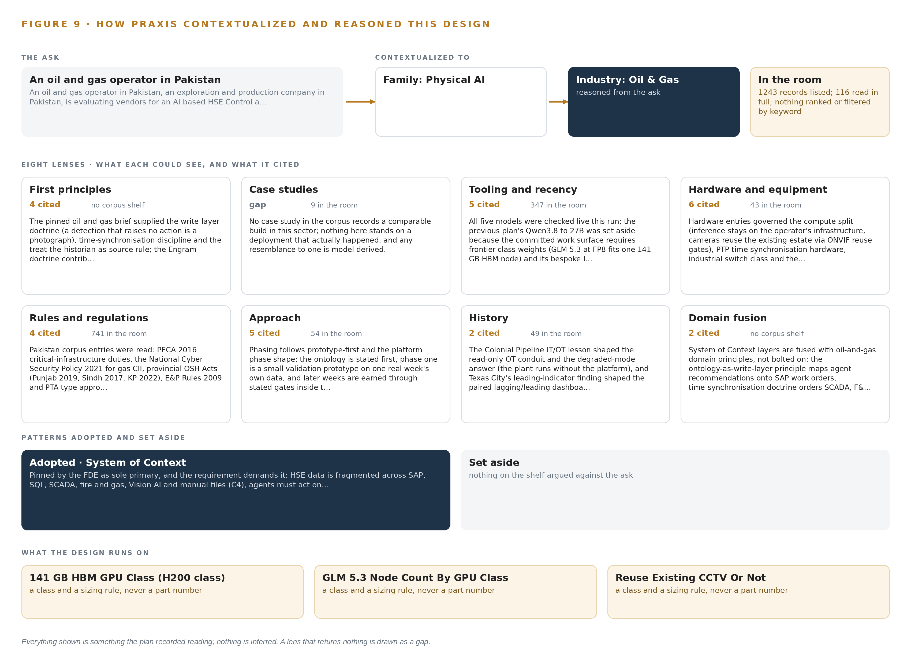

# Sovereign HSE Watch: A Reference Architecture for Predictive Health, Safety and Environment Intelligence in Pakistan's Oil and Gas Operations

Canonical: https://codeatoms.ai/sovereign-hse-pakistan/
DOI: https://doi.org/10.5281/zenodo.23119714
PDF: https://codeatoms.ai/sovereign-hse-pakistan/paper/sovereign-hse-platform-pakistan-oil-and-gas.pdf
License: CC BY 4.0
Publisher: CodeNinja Atoms (https://codeatoms.ai), a fully owned subsidiary of CodeNinja

VERTICAL-DRIVEN ARCHITECTURES · OIL & GAS · DESIGNED WITH PRAXIS · OCTOBER 2026

# Sovereign HSE Watch: Predictive Risk and Early Warning on an HSE Control and Command Platform

A sovereign, on-premises HSE control and command platform that unifies an oil and gas operator's fragmented safety data across Pakistan into one living ontology, turning incidents, sensors, cameras and documents into predictive early warnings, cited guidance and human-approved action.

CodeNinja Engineering Team

For the HSE director, department leads and site superintendents, and the data, platform, OT and machine learning engineers who would build and run it.

---

Vertical-Driven Architectures is a CodeNinja series of system designs. Every design in the series is driven by a real-world problem and scenario in a single industry, and every one is designed on Praxis, CodeNinja's platform for designing physical AI systems. Operations are described by class, never by name.

At a glance

## A sovereign health, safety and environment (HSE) platform for oil and gas in Pakistan

**What this is.** An open reference architecture for predicting HSE incidents at an oil and gas operator in Pakistan, on the operator's own hardware, with no data leaving the country and no third-party AI service in the serving path. It is written for HSE heads and for the engineers who would build it.

**The answer in numbers.**

| Part | The design |
| --- | --- |
| Sources joined | 8 systems: SAP EHS, PM and QM; SCADA; fire and gas; Vision AI cameras; SQL databases; scanned files; the identity provider |
| Object model | 12 typed objects and their links, published as JSON for reuse |
| Models | 6 self-hosted open-weight models, including GLM 5.3 (reasoning), Chronos-2 (forecasting), RF-DETR (vision), BGE-M3 (retrieval in English and Urdu) and PaddleOCR-VL 1.6 (scans) |
| Frontier compute | One node of eight 141 GB HBM-class GPUs holds GLM 5.3 at FP8 (753 GB of weights, 904 GB with headroom) |
| Three-year cost, owned | About 670,000 US dollars with support and power at Pakistan's industrial tariff |
| Three-year cost, rented | 1.1 to 2.8 million US dollars for the same GPUs in the nearest cloud region; no hyperscaler runs a region in Pakistan |
| Human control | Every recommendation is approved or rejected by a named person; nothing executes on equipment |
| The hard dependency | 141 GB-class accelerators need a US export licence for Pakistan (Country Group D:4); the rollout's first gate confirms installed hardware first |

**Reuse it.** The object model, the model register and the figures are free to reuse under CC BY 4.0. Cite as DOI <https://doi.org/10.5281/zenodo.23119714.>

**Made with.** Reasoned on [Praxis](<https://codeatoms.ai/praxis/>), CodeNinja's platform for designing physical AI systems. The object model imports into [Hyper Ontology](<https://codeatoms.ai/hyper-ontology/>), which turns it into a living system. Both are in beta; access by request.

ABSTRACT

## HSE Risk Should Be Predicted Daily, Not Reconstructed After the Incident

The question the HSE department needs answered every day is which emerging risks are forming across its facilities and where the next incident is most likely, so that prevention happens before the event rather than investigation after it. Today it cannot be answered: HSE information sits fragmented across enterprise systems, relational databases, real-time control streams and manual files, so emerging risks surface slowly, incidents cannot be predicted from precursor signals, and lessons from past events are hard to retrieve at the moment a similar condition reappears.

The design is a sovereign HSE control and command platform built entirely on the operator's own infrastructure as a system of context: eight named sources, including the ERP suite of environment, health and safety, maintenance and quality modules, the SCADA historian, the fire and gas system, the existing Vision AI camera estate, SQL databases, flat files and scanned records, and the operator's identity provider, enter only through four adapter families into one HSE ontology of twelve typed objects, above which run five services and four surfaces: anomaly detection and forecasting on site GPUs beside the cameras and historian, a cited retrieval assistant grounded in the operator's own policies and recognized standards, a control room dashboard, and an agentic work surface whose frontier reasoning model runs on one eight-GPU node inside the same Pakistani boundary, so weights, footage, embeddings and audit logs never leave it.

The paper opens with the industry problem and the join failure across existing systems, then presents the design in six chapters: constraints, the layered stack, the object model, ingestion through adapters, inference placement and the latency budget, and the models and licenses that decide what the operator can own; Part III covers the three-phase rollout with its seventeen items and exit gates, and ownership of everything the design builds; it closes with the conclusion and Chapter 11, which explains how Praxis contextualized and reasoned the design.

---



Figure 1. Sovereign HSE Watch on one page: the sources the operation already runs, one object model, what it computes, and the person who decides.

## Contents

Each chapter is tagged for the reader it serves most directly: Executive, Team Lead, FDE, Reference.

|  |  |  |
| --- | --- | --- |
|  | Abstract · HSE Risk Should Be Predicted Daily, Not Reconstructed After the Incident | Executive |
| PART I · THE PROBLEM | | |
| 1 | [HSE Risk Emerges Before Any System Sees It](#ch1) | Executive |
| 2 | [Every Enterprise System Sees One Slice of Safety](#ch2) | ExecutiveTeam Lead |
| PART II · THE DESIGN | | |
| 3 | [Four Constraints Shape a Sovereign HSE Design](#ch3) | Team Lead |
| 4 | [One Stack Runs From Systems of Record to Control Room](#ch4) | Team LeadFDE |
| 5 | [Twelve Objects Turn Fragmented HSE Data Into One Argument](#ch5) | FDE |
| 6 | [Every Source Enters Through an Adapter, Never Directly](#ch6) | FDE |
| 7 | [Detection Belongs on Site and Reasoning In-Country](#ch7) | FDE |
| 8 | [Licenses Decide What the Operator Can Own](#ch8) | FDEExecutive |
| PART III · THE ROLLOUT | | |
| 9 | [Shadow Mode Comes Before Any Alert Is Trusted](#ch9) | Team LeadExecutive |
| 10 | [The Intelligence Should Stay with the Operator That Produced It](#ch10) | Executive |
| PART IV · HOW IT WAS DESIGNED | | |
|  | Conclusion · Sovereignty Is an Architecture, Not an Address | Executive |
| 11 | [How Praxis Contextualized and Reasoned This Design](#ch11) | Team LeadFDE |
|  | [Sources](#sources) | Reference |

PART I · CHAPTER 1

## HSE Risk Emerges Before Any System Sees It

In oil and gas the precursor signals of a major HSE event already exist across incident records, process sensors, cameras and files, and investigations from Texas City to Macondo show the cost of assembling them too late.

The abstract stated the assembly: eight source systems, four adapter families, twelve ontology objects, five services, four surfaces and six models, all inside one sovereign boundary. This chapter establishes why that assembly is the minimum the problem demands, what the operation needs to be able to answer, and what the public record shows it costs when the answer arrives after the event.

### 1.1  The Question and the Data It Requires

The question the HSE department needs answered is not whether an incident occurred but whether risk is emerging now, where it is concentrating, and what action would arrest it. Answering it requires joining incident, near miss, corrective action and inspection records with continuous process measurements, fire and gas detector readings, camera detections of workers, vehicles, hard hats, flame, smoke and zone breaches, and the scanned paper history that predates every digital system. It also requires the governance corpus itself: internal policies, procedures, standards and risk criteria, read together with the external frameworks the operator is measured against.

The regulatory ground has three layers. National HSE regulation in Pakistan applies at every site. Industry practice sets the measurement standard: the International Association of Oil and Gas Producers defines, in its Report 456 recommended practice, the process safety performance indicators upstream companies should use to manage process safety (Veiligheidvoorop 2018). Prescriptive codes such as OSHA and NFPA govern specific hazards, and the duty to prevent major accidents and limit their consequences is codified for dangerous substances in the UK's Control of Major Accident Hazards Regulations (HSE 2015). A platform that cannot cite the clause it judged against cannot support compliance monitoring, so the governance corpus enters the design as a source system, not as background reading.

### 1.2  The Documented Cost

The public record prices the failure to join precursor signals. At Texas City in March 2005 an explosion and fire killed 15 workers and injured 180; the US Chemical Safety Board found a safety culture leaning on lagging injury metrics while process safety indicators worsened out of view (CSB 2005). Five years later the Deepwater Horizon explosion at the Macondo well killed 11 workers, injured 17 and caused serious environmental damage, with warnings again distributed across systems and organizations (CSB 2010). That same year a heat exchanger at the Tesoro refinery in Anacortes ruptured and killed seven workers after a known damage mechanism went untracked as a live risk (CSB 2010b). Where no one dies, regulators still price the gap: the UK regulator fined Esso one million pounds after a structural collapse released around 2,400 kg of highly flammable liquefied petroleum gas at Fawley, and fined Shell UK 560,000 pounds for a major hydrocarbon release traced to poorly maintained pipework (HSE 2026; HSE 2025). Each is a join failure: the readings, the history and the governing standard all existed, and no single view assembled them in time.

### 1.3  The Operation as a Scenario

The operation is an oil and gas operator in Pakistan running an upstream exploration and production business: a gas processing plant with classified process areas, dispersed wellhead pads, a workshop and its gate, control room operator desks and site overview coverage. The physical environments differ in hazard character: the process area concentrates hydrocarbon risk, the wellhead pads are remote and exposed, and the workshop concentrates vehicle and human activity. The camera estate spans these location classes, and the detections in scope are worker presence, hard hat compliance, vehicle movement, flame, smoke and zone breach.

The people in the loop, by role, are HSE department leadership who own the risk-based view, site HSE supervisors who receive alerts and approve actions, investigation leads who reconstruct events, control room operators who act on real-time warnings, maintenance engineers who close the loop into equipment records, and executive management who read the consolidated picture. The design holds this scope in fixed counts: eight named source systems, four adapter families, twelve ontology objects, five services, four surfaces and six models, arranged in three rollout phases carrying seventeen items against twelve recorded requirements. Several operating sites sit inside the boundary, and every place is described by class, never by name.

PART I · CHAPTER 2

## Every Enterprise System Sees One Slice of Safety

Incident management, process control, fire and gas detection, cameras and file archives each hold one true slice of the operation, and the cost of the problem lives in the seams between them.

Chapter 1 established the question, the data it requires and the price of joining them too late. This chapter walks the existing systems one by one and shows the slice each holds; Figure 2 sets the slices side by side.

### 2.1  What Each System Sees and What It Misses

SAP EHS, PM and QM anchor the record side. They see incidents with severity and status, work orders and the equipment master, and inspection and audit findings with their checklists. They miss the live plant entirely: nothing in an incident record says what the process tags did in the hour before, what the detectors read, or what a camera faced at the moment of the event.

SCADA and its historian see the process itself, tag by tag at high frequency. They miss the HSE meaning of what they carry: a pressure excursion is a number, not a precursor, until someone connects it to the barrier that failed and the near miss reported last month. The fire and gas system sees the highest-consequence signals, detector readings and alarms. It misses everything around the alarm: the equipment's maintenance history, the people in the zone, and the procedure that governs the response.

The Vision AI estate sees people, vehicles and zone breaches frame by frame. It misses asset identity and history: a detection lands as a clip and a timestamp with no link to the work order, the open corrective action or the clause of the standard that was breached. The SQL databases see structured relational HSE data that sits beside the enterprise suite; the flat files and scanned records see the deep history, digitized but unstructured, unreadable by any model until it passes through OCR. Both miss the live plant. The identity provider sees who the people are and what roles they hold, without seeing anything they did.

### 2.2  What None of Them See Together

What none of them see together is one chronology: a detector alarm, the process tags in the minutes around it, the camera's view of the zone, the equipment's maintenance and inspection history, the corrective actions still open from the last similar event, and the clause of the internal standard or external framework that defines what should have happened. Building that chronology by hand is what investigations do today, after the fact; that is why lessons arrive after the next event, why near miss patterns stay invisible until they become incidents, and why a risk-based view of performance has to be assembled manually for every management review. Figure 2 shows each system's slice converging on the question none of them can answer alone: which risk is emerging, where, and what action arrests it.



Figure 2. Seven systems, each seeing one part of the answer. the question needs all of them in one place at once.

PART II · CHAPTER 3

## Four Constraints Shape a Sovereign HSE Design

Data residency inside the operator's infrastructure, ownership of the model layer, an alert volume supervisors can actually absorb, and a first gate that can stop the work cheaply fix every downstream choice.

Chapter 2 showed that every source holds one true slice and that the value of the design lives in the join. This chapter fixes the four constraints that decide how the join may be built, then records what the design scoped in, what each scope decision bought and cost, and what it chose against.

### 3.1  Data Residency Inside the Boundary

The first constraint is that every weight, embedding, video frame and audit log stays on the operator's own infrastructure inside Pakistan, the requirement the ask itself states. This is hard in this industry because HSE data spans the information technology and operational technology sides of the plant, video is voluminous and personally sensitive, and the convenient path, a hosted AI API, would move exactly the material the sovereignty requirement protects out of the boundary. Residency also has a procurement dimension: the high-memory accelerator class the frontier tier needs is export-controlled for delivery into Pakistan, so the constraint shapes not only the architecture but the purchasing path, which the design names openly rather than working around silently.

### 3.2  Ownership of the Model Layer

The second constraint is that the operator owns the model layer, and licenses decide what it may own. A detector released under a copyleft license would force source disclosure of the whole serving stack, which a closed sovereign platform cannot accept; a language model whose license triggers on hosted service review may be perfectly lawful for purely internal use on-premises. The design therefore records, for every model, its license, its trigger conditions and why those conditions permit the operator to hold the weights. This is hard because license terms change between versions and checkpoints of the same model family, so the register names the exact checkpoints in the serving path, not just the model family.

### 3.3  An Alert Budget Supervisors Can Absorb

The third constraint is that detection produces more than humans can treat seriously. Anomaly detection on noisy sensor streams and continuous camera inference will fire far more often than a site supervisor can absorb, and alert fatigue quietly kills adoption before any model quality problem would. The design negotiates an alert budget with HSE supervisors before any threshold is set: everything below the budget enters a ranked queue rather than an alarm channel, and time to acknowledge, ignore rate and action rate are reported from the first week so the budget is managed as a live number, not a one-time setting.

### 3.4  A First Gate That Can Stop the Work Cheaply

The fourth constraint is that the first phase must be able to stop the work cheaply if the ground does not hold. Phase one reconstructs one real week of HSE history from the named sources, and its gate measures capture cost and OCR illegibility rates as real numbers before any digitization pipeline is priced; if degraded scans cannot ground the assistant, the design stops or rescores there. The same gate verifies that the operator's infrastructure can hold the frontier node class, so both the data question and the capacity question are settled at the cheapest point in the program.

### 3.5  Scoping Decisions

Three scope decisions fix the shape of everything downstream. Table 1 states each with what it buys and what it costs.

Table 1 · Scoping Decisions

| Decision | What it buys | What it costs |
| --- | --- | --- |
| Reuse the operator's existing Vision AI camera estate, with gaps priced as new class purchases | Coverage of every camera location class in scope without a new camera program, with reuse gated on measured density, angle and stream evidence | Some zones may fail the reuse gate, and a mixed estate means two detection paths to maintain |
| State the frontier tier as one node class, a single 8 x 141 GB HBM node, verified in the phase-one survey | The agentic work surface is sized honestly before procurement, with the export-license approval path named as the fallback | Capacity stays unverified until the survey, and the fallback path adds approval lead time |
| Abstract every SAP connection behind a connector layer until the exact landscape is confirmed | Connector build can start before the ECC or S/4HANA question settles after award | One abstraction tier must be tested against both access patterns before it finalizes |

### 3.6  What the Design Chose Against

Table 2 records the choices the design made against, with the reason for each, ending with what sits outside the baseline altogether.

Table 2 · What the Design Chose Against

| Where | What was picked | Instead of, and why |
| --- | --- | --- |
| Frontier language model | GLM 5.3 open weights at FP8, self-hosted on the operator's infrastructure | A hosted AI API, which breaks residency, or a quiet downsize to a mid-size dense model, which would not carry the agentic work surface the department committed to |
| Vision detector | RF-DETR Apache-2.0 checkpoints, nano through large | Ultralytics YOLO26: its AGPL-3.0 license would force source release of the whole serving stack, which a closed sovereign platform cannot accept |
| MLOps platform | Red Hat OpenShift AI in a disconnected install | Hand-rolled scripts on a bare cluster: the disconnected install ships model serving, a registry and pipelines with a documented air-gapped procedure |
| People and vehicle positioning | Out of scope for this design | A fleet telematics or positioning layer: no positioning source is named in the requirement, and zone logic over the existing camera estate covers the safety rules in scope |
| One-way data transfer | Reserved for a future phase | A hardware data diode now: the whole platform lives inside one boundary, so a read-only conduit through a demilitarized zone enforces the operational technology separation, and a diode waits for any phase where that policy demands one |
| Vendor qualification material | Out of scope for this design | Corporate profiles, prior-work references and commercial commitments: these are procurement matters outside a system design, which carries the weekly in-country review cadence as a plan fact instead |

PART II · CHAPTER 4

## One Stack Runs From Systems of Record to Control Room

A system of context pattern places the systems of record below, one living HSE ontology in the middle, and the detection, prediction, assistant and agent applications above, all on the operator's own hardware.

Chapter 3 fixed the constraints that bound this design: the platform runs entirely on the operator's own infrastructure inside Pakistan, every decision stays with a named person, no system of record is replaced, and the first gate can stop the work cheaply. Constraints do not choose technologies; they choose a shape. This chapter states that shape, explains why it fits an HSE problem that is fundamentally about joining data rather than generating it, and then walks the stack stage by stage so an engineer can place every named component.

### 4.1  Systems of Record Below, One Ontology in the Middle

The design follows a system of context pattern. At the bottom sit the systems of record where HSE truth already lives and stays: SAP EHS, PM and QM for incidents, work orders, equipment master and inspections; the SCADA historian for process tags; the fire and gas system for detector readings and alarms; the operator's identity provider for who may see and approve what; and the relational databases and file archives that hold the long tail of HSE records. These systems remain authoritative. The platform reads them continuously and writes back along one governed path only: an approved recommendation recorded into SAP as the owning system. In the middle sits one object model, a living HSE ontology of twelve typed objects that Chapter 5 defines. Above it sit the applications the ask calls for: anomaly detection, forecasting, a cited natural-language assistant, dashboards and an agent work surface, all consuming ontology state rather than raw extracts.

The pattern fits because the stated problem is fragmentation, not absence: the data exists across enterprise systems, databases and manual files but cannot be joined, so emerging risks surface late and lessons from past events fade before they change practice. Extract-and-copy integration would multiply copies and let them diverge; the ontology joins in place, carries provenance on every object, and admits a new source by mapping it rather than rebuilding the model. Figure 3 shows the layered stack with the named component count at each layer: eight sources, four adapter families, twelve objects, five services and four surfaces, all on operator hardware.



Figure 3. The layered stack: 8 sources, 4 adapter families, 12 objects, 5 services and 4 surfaces.

### 4.2  The Stack Stage by Stage

Table 3 walks the same stack in data-flow order: a physical signal enters through sensing, crosses an adapter, lands on an ontology object, is enriched by inference, is exposed by a service, and reaches a named person through a surface. Reading the table top to bottom is reading one gas detection from sensor to decision. Two stages deserve emphasis. The inference stage names the models that Chapters 7 and 8 place and size in full: detection and tracking at the site edge, forecasting on the historian streams, embeddings and document parsing beside them, and a frontier language model on the central tier for assistant and agent reasoning. The services stage carries the five named services, each a governed capability with an owner, not a directory of dashboards.

Table 3 · The Stack, Stage by Stage

| Stage | What it is responsible for | How |
| --- | --- | --- |
| Sources | Holds HSE truth where it already lives, unchanged and authoritative | SAP EHS, PM and QM; SCADA historian; fire and gas system; Vision AI camera estate; SQL databases; flat files and scanned records; the identity provider; the HSE governance document corpus |
| Sensing | Converts physical site state into time-aligned signals | Existing IP cameras; fire and gas detectors; SCADA process tags; ambient environmental readings; a GNSS grandmaster clock synchronizing every signal |
| Adapters | Move every source into typed events without modifying the source | ERP adapter for SAP; telemetry adapter for SCADA, fire and gas and Vision AI streams; integration adapter for SQL change data capture and APIs; file and document adapter with OCR |
| Object model | Holds one living HSE ontology as the single joined view of operations | Twelve typed objects with typed links and status vocabularies, fed by the event backbone and replayable end to end |
| Inference | Detects, forecasts, retrieves, parses and reasons | RF-DETR detection and Roboflow trackers at the edge; Chronos-2 forecasting; BGE-M3 embeddings; PaddleOCR-VL parsing; GLM 5.3 served through vLLM on the central tier |
| Services | Turn ontology state into governed capabilities with named owners | Unified HSE Data Foundation; Sovereign Delivery and Assurance; AI Detection and Prediction; Control Room Visibility and Reporting; Agentic Layer and Assistant |
| Surfaces | Put each decision in front of the named person who owns it | Executive summary view; investigation and decision-support view; real-time alert and task guidance view; real-time site situational awareness view |

PART II · CHAPTER 5

## Twelve Objects Turn Fragmented HSE Data Into One Argument

Twelve typed objects, each anchored in the system where its truth already lives, let one query reach from a gas detector reading through the incident it preceded to the corrective action it eventually justified.

Chapter 4 placed one object model at the middle of the stack and promised twelve objects. This chapter defines them: what each object holds, how typed links join them into one traversable argument, where the human approval loop lives, and one object exactly as the platform records it.

### 5.1  Every Object and the Links Between Them

The twelve objects fall into five kinds. Sites and assets: facility, the operating site with its area classification and shift pattern, and hse\_equipment, safety-relevant equipment anchored in SAP PM with criticality and running hours. Records: hse\_incident anchored in SAP EHS, near\_miss with its potential severity and failed barrier, corrective\_action with owner and closure evidence, and inspection\_record anchored in SAP QM. Documents: hse\_document, any policy, scan or report with its OCR status. Measurements and events: sensor\_reading anchored in the SCADA historian, anomaly\_event raised by a detection model, and agent\_recommendation raised by an agent. People and authority: hse\_person and hse\_role, both anchored in the operator's identity provider. Every link is typed and directed, as Figure 4 shows: a facility hosts equipment and locates records; a sensor\_reading is measured on equipment and precedes an anomaly\_event; an anomaly\_event affects equipment and triggers a recommendation; a recommendation cites a document, names an approver and, on approval, becomes a corrective action in SAP; an incident generates actions; an inspection raises findings as actions; a document evidences an incident.

The reach is the point. One query starts at a gas detector reading, walks to the equipment, to every anomaly detected on it, to the incident that followed, to the corrective actions that incident generated, and to the person who verified closure, with every step carrying its own provenance. A document store returns pages that match keywords; it cannot traverse from a measurement to the action it eventually justified. That traversal is what investigations otherwise reconstruct by hand from scattered records after the event, as the Macondo inquiry had to do (CSB 2010), and what leading-indicator practice in process safety assumes when it reads barrier health together with lagging outcomes (Veiligheidvoorop 2018).



Figure 4. The twelve objects of the model and the typed links that let a query reach across them.

### 5.2  Where the Human Loop Lives and How the Platform Is Hosted

The human loop lives on the two event objects. An anomaly\_event moves through detected, acknowledged, approved or dismissed, and an agent\_recommendation moves through proposed, under review, approved or rejected; no anomaly becomes a task and no recommendation becomes a write-back without a named person on one of those transitions. Approval authority is an attribute of a role, not a person: hse\_role carries an approval authority and a data visibility scope, so a supervisor sees the sites their role covers and approves what their role permits, enforced at every surface through single sign-on against the operator's identity provider, federated through Keycloak on site.

The hosting posture follows from the sovereign constraint fixed in Chapter 3. All weights, footage, embeddings, ontology state and audit logs stay on the operator's own infrastructure inside Pakistan; nothing crosses the boundary, no external link leaves the object model, and the assistant's citations point inward to the operator's own documents and records. The only write path into a system of record is an approved agent\_recommendation recorded into SAP as the owning system; every other interaction with a source is read-only.

### 5.3  One Object in Its Recorded Form

The corrective\_action object, printed below in its recorded form, shows the full pattern: identity, kind, properties, a status vocabulary that ends in verified rather than merely closed, and the typed links that tie it to the incident that generated it and the person who owns it.

```
{
  "id": "facility",
  "label": "Operating Facility / Site",
  "kind": "site",
  "anchored_in": "",
  "properties": [
    "Facility name",
    "Operating area",
    "Area classification",
    "Shift pattern"
  ],
  "status_vocabulary": [],
  "links": [
    {
      "to": "hse_equipment",
      "label": "hosts"
    },
    {
      "to": "hse_incident",
      "label": "locates"
    }
  ]
}
```

PART II · CHAPTER 6

## Every Source Enters Through an Adapter, Never Directly

Eight named sources reach the ontology only through four adapter families that guarantee provenance, ordering and a replayable event backbone, so the chronology of any incident or near miss can be reconstructed.

Chapter 5 defined the twelve objects and the links that join them. Nothing reaches those objects directly from a source: this chapter describes the eight named sources, the four adapter families that alone may touch them, the guarantees the adapter tier makes, and the event backbone that carries every event into the ontology.

### 6.1  Eight Named Sources and Their Provenance Classes

Figure 5 maps the eight sources to their adapters, and each source carries a provenance class: a label stating where that source's truth originates and how much the platform must verify before trusting an event from it. SAP EHS, PM and QM is the system of record for incidents, work orders, equipment master and inspections, classed as domain-typical because its data model follows the sector's enterprise pattern; the exact landscape and its OData availability are confirmed after award before connector build finalizes. SCADA and the fire and gas system are operational telemetry and safety instrumentation respectively, and the detector alarms are the highest-consequence signals in the design. The Vision AI camera estate is derived sensing: detections land as events on ontology objects, not video, with footage retained on site under the operator's own retention rules. SQL databases are relational records entering through change data capture. Flat files and scanned records are an unstructured archive requiring OCR and parsing. The identity provider is the identity system of record. The eighth source is the operator's HSE governance corpus: its policies, procedures, standards, instructions and risk criteria, together with applicable regulatory requirements and recognized international frameworks such as IOGP Report 456 (Veiligheidvoorop 2018), which ground the assistant's citations.



Figure 5. The 8 named systems, the adapter path each one takes, and the object model they all map into.

### 6.2  What the Adapter Tier Guarantees

The adapter tier guarantees five things to every source. It extracts read-only: no adapter modifies a source system, and the single write-back path runs through the agentic layer into SAP as the owning system. It stamps provenance: every event carries its source system, provenance class, capture timestamp and adapter version, so any object in the ontology can state where each fact came from. It preserves order: capture timestamps come from one site-wide clock discipline, linuxptp and chrony driven by an OCP Time Card GNSS grandmaster with holdover, so a detector alarm, a camera detection and a process excursion sit in one chronology against the same clock. It degrades honestly: a scanned page with low OCR confidence lands in a needs review state rather than silently entering the retrieval corpus. And it is idempotent: replaying an adapter's events cannot double-count an incident or duplicate an alarm.

### 6.3  The Event Backbone: Ordering, Buffering, Replication

The event backbone is Apache Kafka 4.3 in KRaft mode with three dedicated controllers, running as a small cluster inside the operator's data center. Each source publishes to its own topics, partitioned by asset or facility key, so ordering holds within an asset's event stream; consumers commit offsets, so processing is at-least-once with idempotent handling on the ontology side. Brokers buffer while a source or a consumer is down, replication across brokers keeps the stream alive through a broker loss, and retention is set long enough that the ontology can be rebuilt by replay, which is exactly how phase one reconstructs one real week of HSE history as its first proof. The discipline matters because the alternative is forensic reconstruction: after the Texas City refinery explosion, investigators had to assemble the timeline from instrument and control-system records after the fact (CSB 2005). This backbone makes the chronology continuous, so the reconstruction an investigation needs is already sitting on the objects.

PART II · CHAPTER 7

## Detection Belongs on Site and Reasoning In-Country

Camera detection and time series forecasting run beside the streams they watch, the frontier reasoning model runs on one sovereign node in-country, and only events and citations, never raw footage, move between tiers.

Chapter 6 brought every source through an adapter onto one event backbone, ordered by a single site clock. This chapter places the compute that turns those streams into detections, forecasts and decisions: close to the cameras and sensors for everything that must not wait, and on one sovereign node in-country for everything that must reason across the whole operation.

### 7.1  Two Tiers and Their Arithmetic

Figure 6 places the platform's inference in two tiers. The site tier runs beside the streams it watches: RF-DETR detection checkpoints served through KServe on the operator's NPU and GPU edge compute, sized from measured stream and decode load, with Roboflow trackers holding identity across frames; Chronos-2 reading the SCADA and fire and gas historian for anomaly residuals and forecasts; and PaddleOCR-VL parsing scanned records at about 1.9 GB at 16 bit. The detection checkpoints are small, about 61 to 68 MB at 16 bit for the Apache-licensed Nano to Large sizes, so a single edge node holds detector, trackers and forecaster together. The central tier is one node in an in-country data center: eight GPUs of the 141 GB HBM class serve GLM 5.3 at FP8 through vLLM, and BGE-M3 produces the embeddings behind the retrieval assistant at about 1.1 GB at 16 bit.

The arithmetic for the frontier tier is the binding one. GLM 5.3 carries 753 billion filed parameters; at FP8, one byte per parameter, that is 753 GB of weights. The design applies a planning factor of 1.2 for key-value cache and activations, so the node must hold 904 GB. One node of eight 141 GB GPUs provides 1,128 GB of usable memory, leaving 375 GB beside the weights against the 151 GB the factor reserves as the KV cache ceiling. The site tier is sized the other way, bottom up: the design states its requirement as a compute class, and the phase-one survey verifies it against measured stream counts and decode load.



Figure 6. Where each tier runs, what runs there, and the narrow set of outputs that cross the boundary.

### 7.2  The Latency Budget

The budget is written per hop rather than as one number, because the three hops fail differently. Hop one is detection to event at the edge, where camera stream, detector and tracker share a node, so the budget is decode plus inference plus tracker association. Hop two is event to alert across the Kafka backbone, where the budget is queueing plus the dashboard's render path, and where the alert budget negotiated with HSE supervisors caps what enters at all; everything below the budget enters a ranked queue instead. Hop three is question to cited answer at the frontier node, where vLLM's batching sets the ceiling. Two disciplines keep the whole budget honest: time synchronization under linuxptp and chrony, driven by an OCP Time Card grandmaster with holdover, keeps detections, detector alarms and process tags in one defensible chronology, and process safety indicators are only as good as the timestamps beneath them (Veiligheidvoorop 2018).

### 7.3  What Crosses the Boundary and What Breaks

Only events and citations move between tiers. Detections, anomaly scores, forecast residuals, parsed document text and their references travel from the site tier to the central node; recommendations, their rationales and their citations travel back. Raw footage never leaves the site, and the frontier weights never leave the country.

Three failures have standing answers. If the link between site and center fails, the edge keeps detecting and Kafka buffers, replaying in order on reconnection so the chronology survives the gap. If power fails, Network UPS Tools watch the IP-rated enclosures, and hardened fanless switches with redundant DC feeds hold the read-only OT conduit through the DMZ. If the update path is the concern, there is no live pull to fail: the platform runs disconnected under OpenShift AI, and artifacts move as signed bundles through Harbor, so a stalled update stops work rather than silently shipping an unverified model into the sovereign boundary.

PART II · CHAPTER 8

## Licenses Decide What the Operator Can Own

Every weight the platform runs carries a license that lets the operator hold, fine tune and redeploy it inside its own boundary, which is why license terms, not leaderboards, decided the six-model stack.

Chapter 7 fixed where each model runs and what its memory costs. This chapter fixes what each model is allowed to be: the license terms that let the operator hold the weights, fine tune them and redeploy them inside its own boundary, which is why the stack was chosen against licenses first and leaderboards second.



Figure 7. The six models, their placement, and the work each one does.

### 8.1  The Frontier Work Surface

Figure 7 stacks the six models against the tiers they serve. GLM 5.3 open weights anchor the stack: a mixture-of-experts model with 753 billion filed parameters, about 756 GB of weights at FP8 as published and roughly 1.5 TB at BF16, so it needs eight or more datacenter GPUs of the 141 GB class before any KV cache. It runs on the central node through vLLM and carries the agentic work surface, ontology maintenance, human-in-the-loop agent reasoning, the natural-language assistant and document generation. Its bespoke license permits commercial use with attribution and exempts purely internal use from the security-review trigger that applies to model-as-a-service offerings, which is exactly the posture an operator running everything inside its own boundary needs. It was chosen as the strongest open agentic model, and chosen against a hosted API, which would break data residency, and against a mid-size dense model standing in silently for the frontier class the work surface commits to.

### 8.2  The Site Tier

RF-DETR is the real-time detector on the Vision AI camera streams, finding workers, hard hats, vehicles, flame, smoke and zone breaches. Its Apache-2.0 Nano to Large checkpoints run at BF16 at about 61 to 68 MB, and the Plus XL and 2XL checkpoints are excluded from the serving path. It was chosen against Ultralytics YOLO26, whose AGPL-3.0 license would force source release of the whole serving stack on an operator that must own a closed sovereign product. Roboflow trackers supply Apache-2.0 motion tracking, keeping stable identity across frames for zone dwell and crossing rules without reintroducing copyleft behind an Apache detector. Chronos-2 is the Apache-2.0 universal forecaster, about 0.48 GB at 32 bit as published and about 0.24 GB at 16 bit, which handles multivariate and covariate-informed streams zero-shot, fitting mixed-quality HSE sensor series without per-tag training; it carries no field-of-use restriction, so the operator may hold, fine tune and redistribute the weights. PaddleOCR-VL 1.6 is the Apache-2.0 vision-language parser, about 0.9 billion parameters and about 1.9 GB at 16 bit, strong on degraded multilingual scans and small enough to run on a single site GPU beside the other models.

### 8.3  Retrieval and the Register

BGE-M3 is the embedding model behind the retrieval corpus: MIT licensed, with dense plus sparse plus multi-vector retrieval in one pass and an 8,192-token window, at about 2.27 GB at float32 as published, about 1.1 GB at 16 bit and about 0.6 GB at 8 bit. It was chosen because part numbers, tag names and error codes survive intact across a multilingual corpus of policies, standards and incident records. Table 4 then registers the full set: each model, the hardware classes and sizing rules, the sensing, the patterns the design stands on and the ground it runs on.

Table 4 · Model and Equipment Register

| The choice | What was picked | Why here |
| --- | --- | --- |
| Frontier reasoning model | GLM 5.3 open weights at FP8, self-hosted | Strongest open agentic model; the bespoke license exempts purely internal use from the model-as-a-service security-review trigger |
| Detector | RF-DETR, Apache-2.0 Nano to Large checkpoints, BF16 | The practical sovereign answer to the AGPL gate; Plus XL and 2XL excluded from the serving path |
| Forecaster | Chronos-2, Apache-2.0, about 0.48 GB at 32 bit | Zero-shot multivariate forecasting with no field-of-use restriction; weights may be held, fine tuned and redistributed |
| Embeddings | BGE-M3, MIT, FP16 | Dense plus sparse plus multi-vector retrieval in one pass with an 8,192-token window |
| Document parsing | PaddleOCR-VL 1.6, Apache-2.0, about 0.9B parameters, BF16 | Strong on degraded multilingual scans; no user or revenue threshold; fine tuning permitted |
| Tracking | Roboflow trackers, Apache-2.0 | Stable identity across frames without reintroducing copyleft after an Apache detector |
| Frontier node class | One node of 8 x 141 GB HBM GPUs (H200 class) | 1,128 GB holds the 904 GB FP8 footprint with KV cache headroom |
| Edge compute class | The operator's NPU/GPU accelerators, sized from measured stream and decode load | Sizing is stated as a requirement and verified at the phase-one survey |
| Cameras | The existing Vision AI IP camera estate, reused subject to ONVIF reuse gates | Reuse on measured density, angle and stream evidence, with gaps priced as new class purchases |
| Time synchronization | OCP Time Card GNSS grandmaster with holdover, driving linuxptp and chrony | One defensible chronology across detectors, cameras and process tags |
| Edge orchestration | Red Hat OpenShift AI self-managed, disconnected install | Documented disconnected procedure for model serving, registry, pipelines and workbenches |
| Serving runtimes | KServe at the edge, vLLM on the central node | Model serving matched to each tier's load |

PART III · CHAPTER 9

## Shadow Mode Comes Before Any Alert Is Trusted

Three phases with seventeen items and explicit gates put a reconstructed real week of HSE history in shadow ahead of any live alert, and user acceptance sign-off, not a calendar date, is the binding exit.

Chapter 8 fixed the model stack and the licenses that let the operator hold every weight inside its own boundary. This chapter fixes the order in which those models earn the right to speak: nothing raises a live alert until it has first run in shadow against a reconstructed real week of the operator's own HSE history, and nothing ends the work except the department's own sign-off.

### 9.1  Three Phases and Their Gates

The rollout runs as three phases carrying seventeen items, sequenced so the data foundation precedes detection, detection precedes agency, and agency precedes any write-back into the systems of record (Figure 8). Phase 1 carries five items across two workstreams, Sovereign Delivery and Assurance and Unified HSE Data Foundation: agree the HSE object model and the source inventory, stand up the sovereign ingestion connectors across the four adapter families, reconstruct one real week of HSE history from the SAP records, SCADA and fire and gas streams, the SQL databases and the scanned files, and verify the 141 GB HBM class node requirement against the site's capacity. Its exit gate is the first real proof: the reconstructed week reconciles against the systems of record, and the department signs off the object model that everything downstream will read. Phase 2 carries six items across three workstreams, AI Detection and Prediction, Agentic Layer and Assistant, and Control Room Visibility and Reporting: train the anomaly and predictive models on the reconstructed streams, stand up Vision AI detection on the camera estate behind the ONVIF reuse gates, and build the control and command dashboard. Its exit gate is shadow sign-off: every detector and forecaster has run against the reconstructed week without raising a live alert, and the alert budget has been negotiated with HSE supervisors before any threshold goes live. Phase 3 carries six items across two workstreams, Agentic Layer and Assistant and Sovereign Delivery and Assurance: stand up the agentic layer under human approval, open the agent work surface to the operator's own HSE teams, close the recommendation loop into SAP workflows, and prove the air-gapped operation pack. Its exit gate is user acceptance: the department's personnel sign off inside the platform, and that sign-off, not a calendar date, is the binding end of the program. Weekly on-site reviews re-baseline the plan as integration discovery lands, because the SAP landscape, data volumes and concurrent user counts are confirmed only after award. Twelve requirements map onto these gates. The baseline claims none as closed on paper; each requirement is tied to the phase whose gate proves it, and the final set closes only at user acceptance.



Figure 8. The three phases and their gates, and coverage of the 12 requirements across them.

### 9.2  What the Rollout Measures

The rollout measures from the first week, before any model is trusted: reconciliation deltas between ontology objects and their systems of record; OCR capture and illegibility rates on the scanned records; anomaly precision as judged by the supervisors who acknowledge; time-to-acknowledge, ignore rate and action rate per alert source; forecast residual error on the SCADA and fire and gas series; and approval latency on agent recommendations. The indicator structure follows the process safety performance indicators recommended for upstream operators, which pair leading measures of barrier health with lagging outcomes (Veiligheidvoorop 2018). The design reports leading measures first, because a leading measure is the only kind a supervisor can act on the same shift.

### 9.3  What Fails and What the Design Does

Table 5 sets the failure modes the design carries explicitly and the behavior each one triggers.

Table 5 · Failure Modes

| What fails | What the design does |
| --- | --- |
| Frontier GPU capacity is unverified before award | The phase-one sizing survey states the requirement as one node of eight 141 GB HBM class GPUs; if the site cannot hold it, the frontier model proceeds through the export-license approval path or a dedicated in-country facility, never a silent swap to a smaller model. |
| The SAP generation and OData availability are unknown | The connector layer abstracts the extraction mechanism; the landscape is confirmed before connector build finalises. |
| OCR quality on degraded scans cannot ground retrieval | The reconstructed week measures capture cost and illegibility as real numbers before digitisation is priced; low-confidence documents carry a needs-review state instead of silent ingestion. |
| Alerts exceed what supervisors can treat seriously | The alert budget is negotiated before any threshold is set; overflow enters a ranked queue, and ignore and action rates are reported from week one. |
| Integration discovery collides with the milestone plan | The reconstructed week surfaces where truth actually lives; weekly reviews re-baseline, and user acceptance, not the calendar, is the binding gate. |

### 9.4  Lessons

**Shadow the flags before anyone trusts them.** Every detector, forecaster and agent recommendation runs against the reconstructed week before it can raise anything live. Shadow mode converts model quality from a vendor claim into a number a supervisor has already seen, and it is the reason phase 2 cannot close on a schedule. Measure the scans before pricing the pipeline. Digitisation of degraded HSE records is priced only after the reconstructed week has produced real capture and illegibility rates. A needs-review state keeps illegible documents out of the retrieval corpus rather than letting them poison answers silently. Negotiate the alert budget before the thresholds. Anomaly alerts that exceed what supervisors can treat seriously would quietly kill adoption. The budget is agreed with HSE supervisors first, everything below it enters a ranked queue, and the ignore rate is reported from the first week so the budget stays honest. A gate is a proof, not a date. Each phase ends when its evidence exists: a reconciled week, a shadow run supervisors accept, an air-gapped pack and a signed acceptance. Milestones describe what must be true, and the calendar follows the evidence.

### 9.5  What Is Still Open

Three questions stay open at baseline. Whether the operator's data center can hold the frontier node changes the hardware order: settling it early converts the sizing requirement into a confirmed placement or an export-license path. Which SAP generation runs and whether OData is exposed changes the connector build: settling it finalises the ERP adapter. What the OCR legibility rate actually is on the scanned corpus changes the digitisation scope: settling it sizes the human review effort that keeps the retrieval corpus clean. Each is assigned to the phase-one survey or the reconstructed week, so all three close on measured readings rather than assumptions.

PART III · CHAPTER 10

## The Intelligence Should Stay with the Operator That Produced It

The object model, the fine-tuned weights, the decision record and the boundary itself belong to the operator, and CodeNinja's role maps only to the elements the design actually contains.

Chapter 9 ended at user acceptance, the moment the department's own people sign that the platform behaves as designed. This chapter states who owns what that signature covers: the model, the weights, the record of decisions and the boundary itself.

### 10.1  What the Operator Owns

The object model is the operator's. The twelve HSE objects, their typed links and their status vocabularies are defined with the department and held in the operator's graph store, and the model evolves under the operator's change control rather than a vendor's release train. The weights are the operator's: every model in the stack carries an open license, Apache-2.0 or MIT for the detectors, forecasters, embedder and parser, and the frontier model's bespoke license, whose terms permit purely internal commercial use, so any fine-tune trained on the operator's own incident and near-miss corpus is the operator's property on the operator's hardware. The decision record is the operator's: every acknowledgment, approval, rejection and dismissal is kept with its rationale and citations, and the next decision reads that record, which makes it the operator's evidence in any audit. The boundary is the operator's: identity, network segmentation, the read-only OT conduit and the air-gapped operation pack run on the operator's infrastructure under the operator's accounts.

### 10.2  The Offer Behind the Design

CodeNinja designed this system on Praxis, its platform for designing physical AI systems, and the design maps to its offer element by element: Adaptive Operations is the sensing, detection and forecasting of physical behavior across the camera estate, fire and gas detectors and process telemetry; Decision Systems is the recommendation layer in which a named approver decides every proposed action; Hyper Ontology is the twelve-object model that turns fragmented HSE data into one argument; Hyper Pragma is the work surface where the operator's own HSE teams build and run their agents; and Sovereign Infrastructure is the whole posture of open-weight licenses held on the operator's own, in-country, air-gappable hardware.

PART IV · CONCLUSION

## Sovereignty Is an Architecture, Not an Address

In one view the design is a single living HSE ontology over eight sources, fed by four adapter families that guarantee provenance and ordering, with detection and forecasting running beside the cameras and the historian, a cited assistant answering against the operator's own policies and standards, agents that recommend under human approval, and every weight, embedding and decision record held inside one national boundary where a named person owns each decision.

Running the same shape elsewhere takes an operator whose data already lives inside one boundary it controls, a phase-one survey that sizes the frontier node from filed parameter counts before anything is priced, an alert budget negotiated with supervisors before any threshold is set, and the willingness of the operator's own people to build and maintain their agents on the work surface; where those hold, the pattern transfers without redesign.

PART IV · CHAPTER 11

## How Praxis Contextualized and Reasoned This Design

Every choice in this paper traces to a recorded read of the operator's requirement and intake answers, eight reasoning lenses, and the patterns and equipment classes those lenses returned, with nothing inferred.

Chapter 10 placed ownership of the model, the weights, the decision record and the boundary with the operator. This chapter turns to the design process itself and shows how any choice in this paper can be traced back to what justified it. Every design in this series is produced on Praxis, and the point of recording the reasoning is traceability: a reader who disagrees with a choice can find the record that produced it. Figure 9 sets out the ask, the lenses that read it, the patterns they returned and the equipment those patterns settled on.

### 11.1  Contextualizing the Ask

Praxis read the operator's requirement in full: an exploration and production company in Pakistan evaluating a sovereign, on-premises HSE control and command platform that consolidates fragmented data, turns it into predictive analysis and early warnings, grounds its guidance in the operator's own policies and in recognized frameworks including IOGP and OSHA, and supports its people through anomaly detection, a natural-language assistant and agents acting under human approval. Praxis assigned the ask to the sovereign physical operations family, oil and gas industry, and the country boundary came from the operator's own requirement. What was in the room: the requirement document, the attached scope and technical architecture, and the intake answer set, each listed in the register, read in full and available on request.



Figure 9. From the ask to the design: the family and industry Praxis assigned, the eight lenses and what each cited, the patterns adopted and set aside, and the equipment the design lands on.

### 11.2  The Lenses

Table 6 shows the eight lenses Praxis applied, what each could see, what it cited and what it contributed. One lens returned nothing, and the table shows that gap rather than papering over it.

Table 6 · The Lenses and What They Contributed

| Lens | Could see | Cited | What it contributed |
| --- | --- | --- | --- |
| First principles | The pinned brief and the doctrine shelf | 4 | The write-layer doctrine, time synchronisation discipline and the historian-as-source rule; the alert contract and verifier-first rules where their preconditions hold |
| Case studies | 9 sector case records, none comparable | 0 | Gap: no recorded build of this shape in this sector, so nothing here stands on a prior operation |
| Tooling and recency | 347 records | 5 | Every model and product checked live: the streaming backbone, the disconnected-install orchestration, the Apache-licensed detector sizes and the open forecaster |
| Hardware and equipment | The equipment register | several | The 141 GB HBM node class and its sizing arithmetic, edge compute sized from measured streams, camera reuse gates, the time card and the enclosure classes |
| Rules and regulations | The regulatory and standards corpus | several | The data residency posture, the zones-and-conduits read path and alignment of the indicator set with recommended process safety practice |
| Approach | The method records | a narrow set | Shadow-before-live sequencing and milestone gates that carry proofs rather than dates |
| History | The recorded accident record | several | Industry disasters traced to signals that reached no decision maker in time, which fixed early warning as the design's first duty |
| Domain fusion | Cross-sector records | a narrow set | Joining vision detections, detector alarms and process telemetry on one chronology under one object model |

### 11.3  Patterns Adopted and Set Aside

The reasoning adopted three patterns. The write-layer doctrine holds that a detection which raises no action is a photograph, so every anomaly and recommendation lands on the object model with a recommended action and a named approver. The historian is treated as a first-class source, so sensor readings join the same chronology as camera events under disciplined time. And the accident record, in which refinery and rig disasters turned on signals that never reached a decision maker in time (CSB 2005; CSB 2010), fixed the ordering: detection and prediction before agency, agency before write-back. The reasoning set aside three. A people and vehicle positioning layer was dropped because no named source requires it and zone logic over the existing camera estate covers the safety rules in scope. A hardware data diode was reserved rather than specified, because the whole platform sits inside one sovereign boundary and the OT read path runs as a constrained read-only conduit. The case-study pattern was set aside because no comparable build exists in the record, and the paper says so.

### 11.4  Where the Reasoning Lands

The reasoning lands on equipment classes, not part numbers: one node of eight 141 GB HBM class GPUs for the frontier tier, with the sizing arithmetic shown in full; edge NPU and GPU compute sized from measured stream and decode load and verified by a phase-one survey; hardened fanless industrial switches for the plant-side drops; a GNSS grandmaster time card with holdover driving site-wide time; IP-rated enclosures on UPS power; and reuse of the existing camera estate subject to ONVIF gates, with any gaps priced as new class purchases. Every one of these was recorded reading: a count from the register, a license from its terms, a class from arithmetic the reader can repeat. Nothing in this design is inferred.

Appendix A

## What Ownership Costs Over Three Years

*Version 2, 3 October 2026. Version 1 compared ownership with AWS's Compute Savings Plan (26 percent off) and printed "about one third"; AWS's deepest three-year plan makes it about three fifths. Every other number is unchanged.*

The design runs on the operator's own hardware. This appendix prices that choice against the two ways an operator in Pakistan could otherwise get the same capability: renting the same accelerators from the nearest hyperscaler region, or buying a closed frontier model by the token. Every input is a public price, dated and cited. The arithmetic is shown so any reader can rerun it with a written quote.

### A.1 The Answer

Owning the stack this design specifies costs about **670,000 US dollars over three years**, inside a range of 580,000 to 770,000. Renting the same capacity around the clock from the nearest hyperscaler region costs **1.1 to 2.8 million dollars** over the same period. Ownership is therefore between about one quarter and three fifths of the cost of renting, and **about three fifths** against the deepest three-year commitment, an AWS EC2 Instance Savings Plan paid up front. None of the rented options keeps the data in Pakistan, because no hyperscaler operates a region inside the country (Alskyline 2026).

### A.2 What Owning Costs

Table A1 prices the hardware the design names and three years of running it.

| Line | Basis | Three-year cost (USD) |
| --- | --- | --- |
| Frontier tier | One server of eight 141 GB HBM-class cards, 320,000 to 420,000 dollars, typical 370,000 (Mercatus 2026) | 320,000 to 420,000 |
| Site tier | One PCIe inference server, priced at the upper bound of eight 48 GB cards, 85,271 dollars (Newegg 2026); its three models weigh under 4 GB | 85,271 |
| Edge | An allowance of six fanless industrial nodes at 4,000 dollars each (Eurotech 2026); the design reuses the operator's NPU compute where it exists | 24,000 |
| Support | 8 to 12 percent of hardware value a year (Introl 2026) | 103,000 to 191,000 |
| Power | 10.9 kW average IT load at a power usage effectiveness of 1.6 (Uptime Institute 2025), 456,641 kWh at the industrial B3 average of 27 rupees per kWh plus the fixed kW charge (Dawn 2026), at 277.38 rupees to the dollar (SBP 2026) | 47,269 |
| **Total** |  | **580,000 to 767,000, typical 670,000** |

The average load assumes the frontier server draws 7 kW of its 10.2 kW maximum (NVIDIA 2026), the site server 3.5 kW and each edge node 60 W. The frontier tier fits one node because the design's reasoning model, GLM 5.3, is 753 GB at FP8 and needs 904 GB with headroom, against 1,128 GB on eight 141 GB cards.

### A.3 What Renting Costs

The same frontier server and site server, rented without a break for three years, because HSE monitoring does not stop at night. The edge nodes stay on site in every option.

| Option | Basis | Three-year cost (USD) |
| --- | --- | --- |
| AWS, UAE region, on demand | p5en.48xlarge at 75.96 dollars an hour in me-central-1, g6e.48xlarge at 30.13 (Vantage 2026) | 2.82 million |
| AWS, three-year EC2 Instance Savings Plan | all upfront in me-central-1: 28.56 dollars an hour for p5en.48xlarge, 13.90 for g6e.48xlarge (AWS 2026) | 1.14 million |
| Specialist GPU cloud, on demand | 50.44 dollars an hour for eight H200 cards, 18.00 for eight L40S (CoreWeave 2026) | 1.83 million |
| Oracle, three-year commitment | 40 dollars an hour for eight H200 cards (Economize 2026), site tier as AWS reserved | 1.42 million |

Egress, storage, and the network link from Pakistan to the region are excluded, so every rented figure is a floor.

### A.4 What Closed Models Cost by the Token

A closed frontier model replaces the frontier tier rather than the whole stack, and it is priced by use. At 50 HSE users, each running the equivalent of five agents at 2.4 billion tokens a year, with four input tokens to every output token and half the input served from cache, three years is 360 billion tokens.

| Model | List price per million tokens, input and output | Three-year cost (USD) |
| --- | --- | --- |
| Claude Sonnet 5.5 | 2 and 10 (Anthropic 2026) | 1.04 million |
| Gemini 3.1 Pro | 2 and 12 (Google 2026) | 1.18 million |
| Claude Opus 5.5 | 4 and 20 (Anthropic 2026) | 2.07 million |
| GPT-5.5 | 5 and 30 (OpenAI 2026) | 2.95 million |

At this volume even the cheapest closed model costs about one and a half times the whole owned stack, and the largest cost three to four and a half times as much. Token volume is the assumption that moves this comparison most: it scales linearly with users, and ownership does not. Every one of these options also sends HSE records, which carry personal data and investigation findings, to a third-party AI service outside the boundary, which the design's first constraint rules out.

### A.5 What the Price Does Not Include

- **Import duty, sales tax, freight and insurance** on the hardware, which a written quote delivered to Pakistan settles.
- **An export license.** Pakistan sits in US Country Group D:4, so 141 GB HBM-class accelerators need a license from the Bureau of Industry and Security (eCFR 2026). Approved channels have delivered more than 3,000 accelerators to a Pakistani operator (The News 2026). The design's Phase 0 checkpoint confirms the operator's actual inventory before anything is bought, and holds a downgrade path to a mid-size model on accelerators already installed.
- **People, facilities and implementation**, which both sides carry.
- **Price movement.** Cloud prices rose as well as fell in 2026; AWS raised its H200 capacity block price about 15 percent in January (Gigazine 2026).

### A.6 Sources for This Appendix

- Alskyline. 2026. Cloud regions in Saudi Arabia, 2026 guide. <https://alskyline.com/kb/cloud-regions-saudi-arabia-2026-guide>
- Anthropic. 2026. Pricing. <https://claude.com/pricing>
- AWS. 2026. Compute and EC2 Instance Savings Plans price file, me-central-1, 3 October 2026. <https://pricing.us-east-1.amazonaws.com/savingsPlan/v1.0/aws/AWSComputeSavingsPlan/current/region_index.json>
- CoreWeave. 2026. Pricing. <https://www.coreweave.com/pricing>
- Dawn. 2026. NEPRA notifies new industrial tariffs. <https://www.dawn.com/news/1973828>
- eCFR. 2026. 15 CFR Part 740, Supplement No. 1, Country Groups. <https://www.ecfr.gov/current/title-15/subtitle-B/chapter-VII/subchapter-C/part-740>
- Economize. 2026. OCI BM.GPU.H200.8 pricing. <https://www.economize.cloud>
- Eurotech. 2026. ReliaCOR 33-11. <https://buy.eurotech.com/products/reliacor-33-11>
- Gigazine. 2026. AWS raises EC2 Capacity Blocks prices. <https://gigazine.net>
- Google. 2026. Gemini API pricing. <https://ai.google.dev/gemini-api/docs/pricing>
- Introl. 2026. GPU infrastructure TCO model. <https://introl.com/blog/gpu-infrastructure-tco-model-5-year-enterprise-ai-deployment>
- Mercatus. 2026. H200 server price. <https://mercatus-ai.com/blog/h200-server-price>
- Newegg. 2026. Supermicro SYS-421GE-TNRT-02-G1. <https://www.newegg.com/p/N82E16859152404>
- NVIDIA. 2026. DGX H200. <https://www.nvidia.com/en-us/data-center/dgx-h200/>
- OpenAI. 2026. API pricing. <https://developers.openai.com/api/docs/pricing>
- SBP. 2026. Conversion rates, 4 September 2026. <https://www.sbp.org.pk>
- The News. 2026. Data Vault Pakistan GPUs. <https://www.thenews.com.pk>
- Uptime Institute. 2025. Global Data Center Survey 2025. <https://uptimeinstitute.com>
- Vantage. 2026. EC2 instance prices. <https://instances.vantage.sh>

SOURCES

## Source Register

CSB. 2010. INVESTIGATION REPORT. <https://www.csb.gov/assets/1/20/macondo_vol3_final_20160527.pdf>

CSB. 2005. INVESTIGATION REPORT. <https://www.csb.gov/assets/1/20/csbfinalreportbp.pdf>

CSB. 2010. Tesoro Anacortes 2014-May-1. <https://www.csb.gov/assets/1/7/tesoro%5Fanacortes%5F2014-may-01.pdf>

HSE. 2015. The Control of Major Accident Hazards Regulations 2015. Guidance on Regulations L111. <https://www.hse.gov.uk/PUBNS/priced/l111.pdf>

Veiligheidvoorop. 2018. Safety Performance Indicators. <https://www.veiligheidvoorop.nu/wp-content/uploads/2023/07/IOGP-PSE-2022pe.pdf>

---

### About CodeNinja

CodeNinja is a Middle Eastern-American artificial intelligence lab focused on building self-improving systems. We are reinventing knowledge work to close the loop between vertical AI use cases and the generalized intelligence that fuels it, accelerating the path toward organizational superintelligence.
