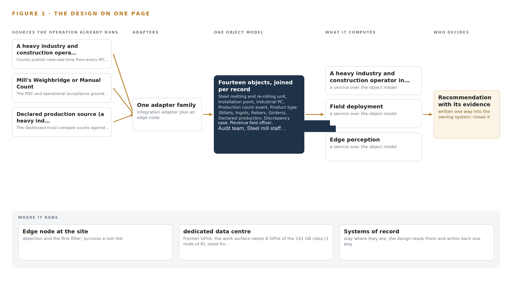
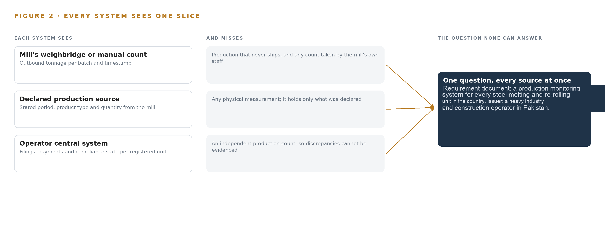
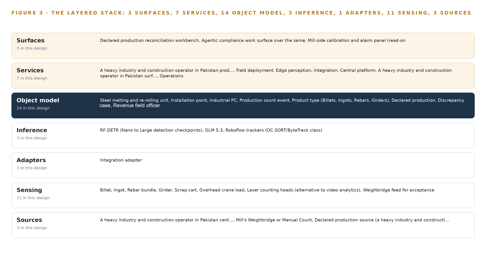
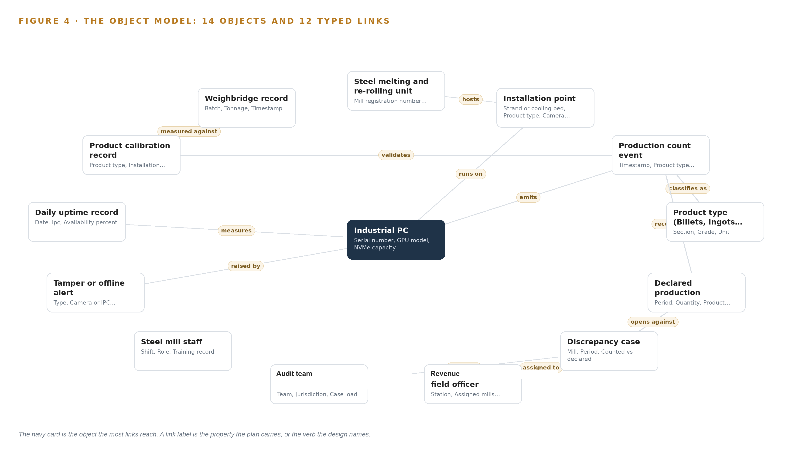
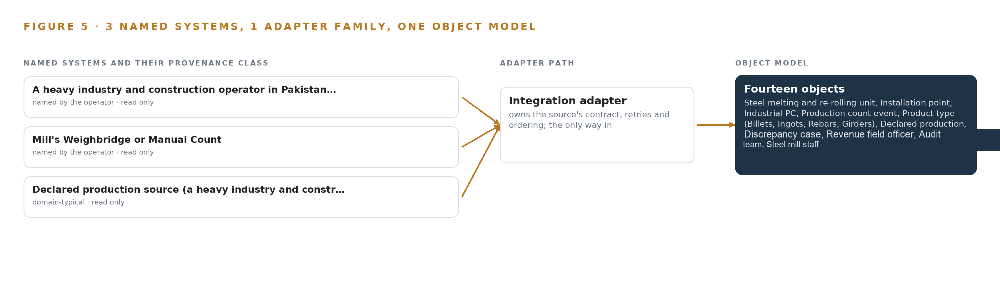
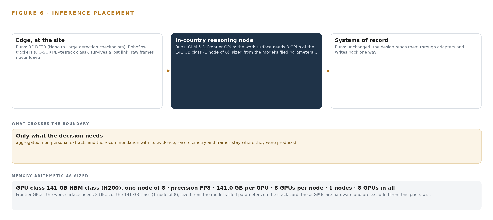
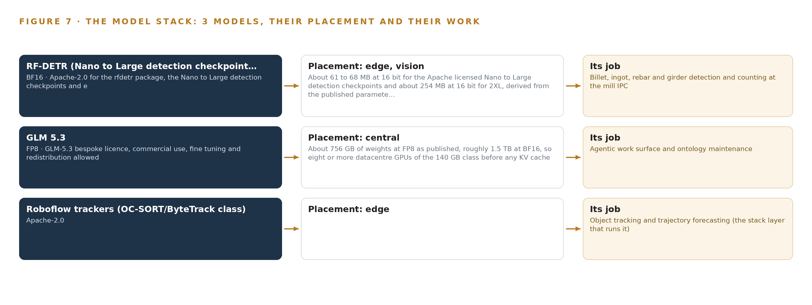
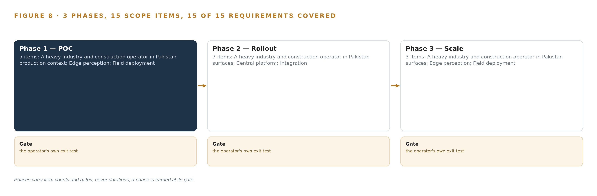
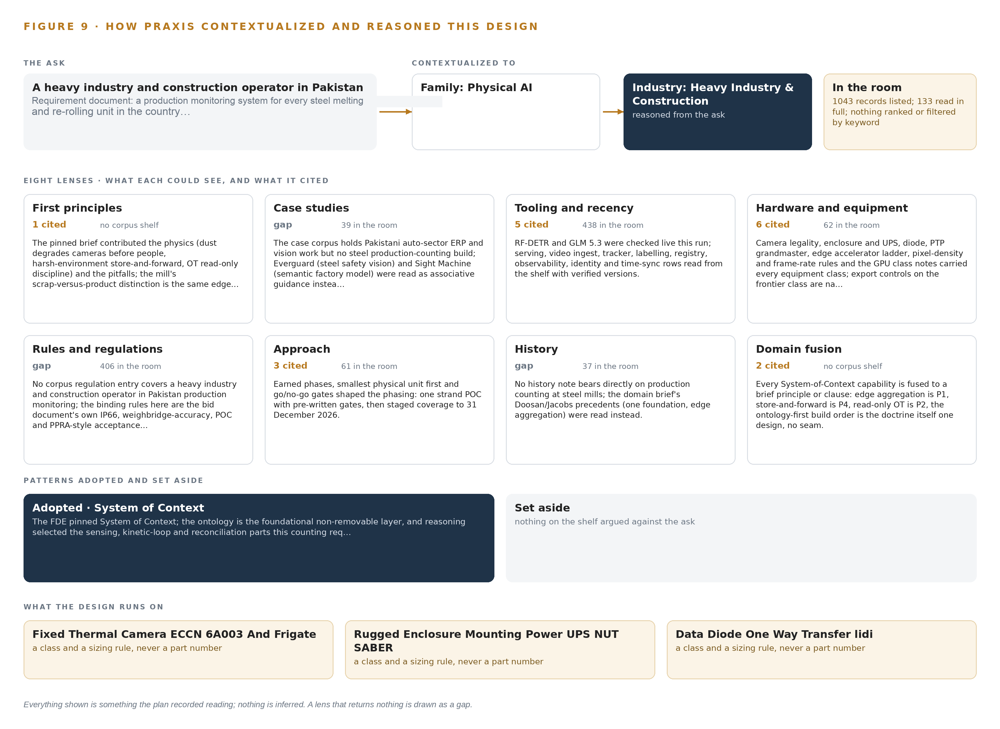

# Steel Count Ledger: Independently Counted Production for Every Steel Mill in Pakistan

Canonical: https://codeatoms.ai/steel-production-count-pakistan/
DOI: https://doi.org/10.5281/zenodo.23126563
PDF: https://codeatoms.ai/steel-production-count-pakistan/paper/steel-count-ledger-production-monitoring-steel-mills-pakistan.pdf
License: CC BY 4.0
Publisher: CodeNinja Atoms (https://codeatoms.ai), a fully owned subsidiary of CodeNinja

VERTICAL-DRIVEN ARCHITECTURES · HEAVY INDUSTRY & CONSTRUCTION · DESIGNED WITH PRAXIS · OCTOBER 2026

# Steel Count Ledger: Independently Counted Production for Every Steel Mill in Pakistan

An ontology-anchored production monitoring system that counts billets, ingots, rebars and girders at the point they are made, publishes the counts into one operator-owned record, and lets revenue officers reconcile counted against declared production for a heavy industry and construction operator in Pakistan.

CodeNinja Engineering Team

For the director of the operator's audit unit, the revenue field officers and audit leads who decide discrepancies, and the edge, vision and platform engineers who would build and run it.

---

Vertical-Driven Architectures is a CodeNinja series of system designs. Every design in the series is driven by a real-world problem and scenario in a single industry, and every one is designed on Praxis, CodeNinja's platform for designing physical AI systems. Operations are described by class, never by name.

At a glance

## Independently counted production for every steel mill in Pakistan

**What this is.** An open reference architecture for system design in physical AI: cameras and a GPU industrial PC at every casting strand and cooling bed count billets, ingots, rebars and girders as they are made, publish the counts through a one-way link into one record the authority owns, and let revenue officers reconcile counted against declared production. It is written for the director accountable for production monitoring and for the edge, vision and platform engineers who would build it. The operator is described by class, never by name.

**The answer in numbers.**

| Part | The design |
| --- | --- |
| Sources joined | The counting estate itself, the weighbridge, declared production filings and the authority's case system, through one adapter family |
| Object model | 14 typed objects and 12 links, with the production count event as the focal object, published as JSON for reuse |
| Models | 3 self-hosted open models: RF-DETR (detection, fine-tuned per product type and mill), Roboflow trackers (identity across camera fields), GLM 5.3 (compliance work surface) |
| Edge | One sealed GPU industrial PC and IP66 HDR cameras per installation point; counting survives a slow wide-area link |
| Frontier compute | One node of eight 141 GB HBM-class GPUs holds GLM 5.3 at FP8 (753 GB of weights, 904 GB with headroom), in a dedicated data center behind an export licence checkpoint |
| Three-year cost, owned | About 4,445,000 US dollars for 300 installation points, of which the counting kits are 2,832,000 and cannot be rented; owning the frontier node costs about 686,000 against 751,000 on AWS's deepest three-year plan |
| Closed model break-even | The cheapest closed model matches the owned node at about 33 users; above that, ownership is cheaper |
| Human control | Every discrepancy case is judged by a named revenue field officer; the system counts and reconciles, it never assesses, and the mill never edits a count |
| The hard dependency | 141 GB-class accelerators need a US export licence for Pakistan (Country Group D:4); the node is ordered only once a licence naming the end user holds |

**Reuse it.** The object model, the model register and the figures are free to reuse under CC BY 4.0. Cite as DOI <https://doi.org/10.5281/zenodo.23126563.>

**Made with.** Reasoned on [Praxis](<https://codeatoms.ai/praxis/>), CodeNinja's platform for designing physical AI systems. The object model imports into [Hyper Ontology](<https://codeatoms.ai/hyper-ontology/>), which turns it into a living system. Both are in beta; access by request.

ABSTRACT

## A Production Count Should Be Observed at the Point of Making, Not Taken on Trust

How much steel did each melting and re-rolling unit in Pakistan actually produce this shift, this week, this filing period? The bid behind this design exists because the question cannot be answered today: production figures reach the authority as declarations from the mills themselves, the sector's structural gaps in tax compliance and revenue leakage are documented in the requirement's own background, and no independent instrumentation stands between the caster and the tax return. Once a bundle of rebars leaves the cooling bed, the only count that exists is the one the producer volunteers.

The design is an ontology-anchored production monitoring system built around three sources, one adapter family, fourteen objects, seven services, three surfaces and three models. IP66 cameras and GPU industrial PCs at every installation point count product on edge detection models the operator owns, with tracker models keeping one billet from counting twice; counts publish near-real-time over VPN through a hardware data diode into a single operator-owned production model; laser counting heads and the weighbridge feed serve as alternative sensing and acceptance ground truth; and revenue officers and audit teams reconcile counted against declared production on a workbench and an agentic work surface, the latter served by a frontier open-weight model in a dedicated data center because the GPU class it needs is export controlled for Pakistan.

The paper opens with the industry problem and the join failure across mill-side systems, states the constraints the bid and the mill floor impose, then walks the layered stack, the fourteen-object model, ingestion through adapters and the event backbone, inference placement from the installation point to the data center, and the models and licenses that decide what the operator can own. Part three sets out the rollout in three phases with item counts and exit gates, ownership of what the design builds, and the paper closes with the chapter on how Praxis contextualized and reasoned the design.

---



Figure 1. Steel Count Ledger on one page: the sources the operation already runs, one object model, what it computes, and the person who decides.

## Contents

Each chapter is tagged for the reader it serves most directly: Executive, Team Lead, FDE, Reference.

|  |  |  |
| --- | --- | --- |
|  | Abstract · A Production Count Should Be Observed at the Point of Making, Not Taken on Trust | Executive |
| PART I · THE PROBLEM | | |
| 1 | [Production That Nobody Counts Is Revenue That Leaks](#ch1) | Executive |
| 2 | [Every Mill System Sees One Slice of Production](#ch2) | ExecutiveTeam Lead |
| PART II · THE DESIGN | | |
| 3 | [The Bid's Own Gates Set the Design's Discipline](#ch3) | Team Lead |
| 4 | [One Stack Runs From the Mill Floor to the Workbench](#ch4) | Team LeadFDE |
| 5 | [Fourteen Objects Turn Mill Counts Into One Argument](#ch5) | FDE |
| 6 | [Every Count Enters Through an Adapter, Never Directly](#ch6) | FDE |
| 7 | [Counting Runs at the Point and Reasoning Runs Central](#ch7) | FDE |
| 8 | [Licenses Decide Whether the Operator Owns the Counter](#ch8) | FDEExecutive |
| PART III · THE ROLLOUT | | |
| 9 | [Shadow the Counts Before Anyone Trusts Them](#ch9) | Team LeadExecutive |
| 10 | [The Count Should Belong to the Authority, Not the Vendor](#ch10) | Executive |
| PART IV · HOW IT WAS DESIGNED | | |
|  | Conclusion · One Count Ledger Serves Any Output the State Must Measure | Executive |
| 11 | [How Praxis Contextualized and Reasoned This Design](#ch11) | Team LeadFDE |
|  | [Sources](#sources) | Reference |

PART I · CHAPTER 1

## Production That Nobody Counts Is Revenue That Leaks

Pakistan's iron and steel sector produces through melting and re-rolling units whose output reaches the tax system only as self-declared figures, so the authority's digitalization program begins with the need for an independent count at every mill.

The abstract set out the shape of the design: a counting system that runs at the mill, publishes through a one-way path into one operator-owned record, and reconciles counted against declared production on a work surface where named people decide. This chapter establishes the problem that shape answers, what the operation is, and what it already costs the country when production goes uncounted.

### 1.1  The Question, the Data and the Regulatory Ground

The question the operator needs answered is narrow and unforgiving: how much steel did each melting and re-rolling unit actually produce, counted independently of the mill itself, near enough to real time that a discrepancy can be raised while the shift that produced it is still identifiable. Self-declaration cannot answer it, because the party holding the number is the party whose tax depends on it. The design brief for the program states the aim directly: real-time visibility into total production at every iron and steel facility, ensuring accurate reporting, transparent audits and correct tax payments on billets, ingots, rebars and girders. Answering the question needs three classes of data, and the bid names all three. First, an independent physical count at the point where product leaves the process: units on the caster strand, the cooling bed or the ejection path, captured by video analytics, laser counting heads or equivalent sensing. Second, the production the mill declares, whether through the operator's tax filing channels or manual entry, so the two can be placed side by side per period and per product type. Third, a ground truth for accepting that the counter itself is honest: the mill's weighbridge record, read at commissioning and at acceptance, since tonnage and unit count can be checked against each other within known tolerances. The regulatory ground is layered. The tax regime is the point of the program: production counts feed compliance and audit under the authority's revenue function, with its audit teams handling discrepancy cases. The procurement regime governs how the system is bought: public competitive bidding with staged evaluation, electronic submission, and staged coverage milestones written into the contract itself. Finally, the system must satisfy integrity conditions the bid makes explicit, notably a proof-of-concept stage whose counting accuracy is tested against the weighbridge before any wider coverage is authorized.

### 1.2  The Documented Cost of Unverified Counts

When the quantity of physical material leaving a site is never independently counted, the loss is not hypothetical, and public record shows the pattern at scale. On a major highway program in the United States, a materials supplier admitted systematically understating the quantity and quality of aggregate handed over, and agreed to plead guilty and pay 50 million dollars in cash with up to 75 million dollars more in insurance coverage; the scheme worked because deliveries were accepted on the supplier's own paperwork (Justice 2007). The mechanism is identical to the one this program targets: whoever controls the count controls the payment, and no downstream record can expose a number that was never measured. Procurement authorities treat this as a structural risk rather than a one-off. The Organization for Economic Co-operation and Development has issued a formal legal recommendation on enhancing integrity in public procurement, setting out what governments must do to keep buying decisions honest across the contract lifecycle (OECD n.d.), and dedicated counter-fraud guidance treats the pre-contract stage, before a contract is signed, as a recognized point where fraud enters public programs (NHS 2025). A monitoring system whose every sensor the supplier owns and whose every figure the taxpayer declares sits exactly on that boundary.

### 1.3  The Operation as a Scenario

The scenario runs across the whole steel sector of the country. The facilities are melting and re-rolling units: electric furnaces cast billets or ingots, and re-rolling stands convert them into rebars and girders. The scale is banded, never itemized: hundreds of mills nationwide, covered in cumulative bands of about a fifth by the end of August 2026, half by the end of October 2026, and the full estate by 31 December 2026, with coverage measured in lines, meaning individual casting strands and cooling beds rather than whole sites. The people in the loop fall into four roles. Revenue field officers own assigned mills, judge declared production against the counted record and raise discrepancy cases. Audit teams carry jurisdiction-wide case loads and handle escalations. Mill staff run continuous shifts, support calibration at their installation points and dispute counts they believe are wrong. Vendor field engineers install, commission and maintain the equipment, operating under the bid's maintenance and support obligations. The physical environment is a mill at temperature: caster strands and cooling beds wrapped in dust, scale and radiant heat, ejection paths where moving bundles pass at production speed, electrical cabinets exposed to vibration and electromagnetic interference from furnace and rolling-stand drives. Cameras and enclosures are specified sealed and wide-temperature for exactly this reason, and workers, scrap carts and crane loads cross the frame constantly and must be excluded as noise rather than counted. The regulatory ground within the operation itself has three layers: the tax compliance regime that consumes the counts, the public procurement rules that govern staged acceptance, and the proof-of-concept clauses that make weighbridge-verified counting accuracy a condition of wider rollout. The design must hold three named source systems in one view: the operator's central record, the mill's weighbridge or manual count, and the declared production source, with one adapter family, one object model and three surfaces serving the roles above. That the operator's own systems cannot already provide this view is the subject of the next chapter.

PART I · CHAPTER 2

## Every Mill System Sees One Slice of Production

The weighbridge sees tonnage, mill records see declarations, and the operator's central systems see filings, but no existing system holds the counted physical production that would let any of them be checked against the others.

Chapter 1 defined the question, the three data classes it needs and the layered regulatory ground the counting system must satisfy. This chapter examines what the existing systems on each side of that ground actually see, and shows why the answer has never been available to any of them.

### 2.1  What Each System Sees, and What It Misses

The mill's weighbridge and manual counts see mass leaving the site: every truck passes over a calibrated bridge, and the record carries a batch, a tonnage and a timestamp. What the weighbridge misses is production that never becomes a shipment. Billets that go from caster to re-rolling mill and rebars that are bundled and staged for later dispatch never cross the bridge, so the weighbridge record can verify outbound tonnage without ever seeing what was made, and a manual count taken by mill staff inherits the same interest as the declaration it is meant to support. The declared production source, whatever form it takes, sees what the mill chooses to state: a period, a product type, a quantity and the identity of the declarer. It is administratively clean and legally load-bearing, which is precisely its weakness. It sees nothing physical at all. A declaration can be internally consistent, filed on time and matched to prior periods, and still be wrong by any margin, because no number in it was measured by anything outside the mill. The operator's central systems see the tax life of that declaration: filings, payments, audit history and the compliance state of each registered unit. They can flag statistical anomalies across hundreds of mills, but an anomaly in a filing is not evidence of underproduction. Without an independent count, every discrepancy the central system could raise dissolves into an argument between a declaration and a suspicion, and the field officer has nothing in hand to resolve it. Figure 2 sets the three systems side by side, each with its slice and its blind edge: tonnage without production, statements without measurement, filings without physics.



Figure 2. Three systems, each seeing one part of the answer. the question needs all of them in one place at once.

### 2.2  What None of Them See Together, and What That Costs

No existing system holds the counted physical production that would let the other three be checked against each other, and the join failure is precisely that: three records, each defensible alone, that cannot be placed in one argument. The weighbridge cannot be joined to a declaration because it measures a different quantity at a different point; the declaration cannot be joined to a count because no count exists; the central system cannot join anything because its inputs are the other two. The cost in practice is the cost Chapter 1 documented running quietly at every mill: unreported production passes through the gap between tonnage seen and production declared, discrepancies are unresolvable, and audit becomes negotiation. The documented pattern on public programs is that when deliveries are accepted on the supplier's own paperwork, the fraud is discovered only at scale and after years, with penalties measured in tens of millions of dollars (Justice 2007), and that procurement authorities now treat unverified reporting as a structural integrity risk to be designed against rather than audited after the fact (OECD n.d.). Closing the gap needs one new record: a count event, measured at the installation point, timestamped, typed by product and published by the operator rather than the mill. What it takes to build that record honestly is the subject of Chapter 3.

PART II · CHAPTER 3

## The Bid's Own Gates Set the Design's Discipline

Harsh mill environments, read-only discipline around operational technology, a vendor panel that must aggregate into one record, and the bid's staged coverage milestones and proof-of-concept tests shape every downstream choice.

Chapter 2 showed that the missing record is the count event, measured at the mill and owned by the operator, and that every existing system defers to the mill's own paper for it. This chapter sets the four constraints the bid and the mill floor place on building that record, the scoping decisions they force, and what the design deliberately chose against.

### 3.1  Count at the Harshest Point

The count must be taken where product is produced: the caster strand, the cooling bed, the ejection path. This is the hardest electronics environment in the scenario. Dust and mill scale foul lenses on a schedule nobody controls, radiant heat from hot billets blinds visible-light cameras, furnace and rolling-stand drives put electromagnetic interference on every signal, and vibration works mounts loose. The constraint is hard because the bid's own acceptance clauses make it unforgiving: counting accuracy is verified against the weighbridge at proof of concept, and again at acceptance, before any wider coverage is authorized. A system that counts cleanly in a lab and drifts on a dusty strand fails its own gates, so sealed wide-temperature equipment, cleaned-air enclosures and drift telemetry are not upgrades but entry conditions.

### 3.2  Observe the Mill, Never Operate It

The system must be read-only against mill operations. Furnaces, casters and rolling-stand control sit on operational technology networks where availability is a safety property and a stalled write can stop production. The constraint is hard because the easiest engineering path, integrating with mill systems for line speed and batch context, crosses exactly the boundary the industry treats as inviolable. The design holds the discipline of observing and counting only: camera and laser sensing on a segmented zone, a one-way publish path out, and no write path back into mill control under any failure mode.

### 3.3  One Record From a Panel of Vendors

The bid authorizes a panel of multiple vendors installing video analytics, laser counting or equivalent systems across the sector, while the operator requires one central record. The constraint is that panel members ship different hardware, different firmware and different native data formats, so every vendor feed into its own dashboard would fragment the record the program exists to create. Integrity guidance for public procurement treats keeping the buying and reporting chain coherent as a design obligation, not an aspiration (OECD n.d.), and the only mechanism that satisfies it here is one published count-event schema over a standard interface, conformance-tested before a vendor is authorized, so any panel member's counts aggregate without rework.

### 3.4  Prove on One Line Before Staging Nationwide

The bid's staged milestones, about a fifth of lines by the end of August 2026, half by the end of October and the full estate by 31 December 2026, leave no room for a rollout that discovers its counting model does not generalize across product types, mills and lighting conditions mid-program. The constraint is that steel mills differ in layout, product mix and ambient conditions, so a detector calibrated on one strand is not automatically valid on the next. The design therefore proves the whole loop, sensing through counting through publishing through acceptance, on one strand against the bid's proof-of-concept tests first, and stages coverage only behind gates the bid itself defines.

### 3.5  Scoping Decisions

Table 1 records the three decisions that shape everything downstream, each with what it buys and what it costs.

Table 1 · Scoping Decisions

| Decision | What it buys | What it costs |
| --- | --- | --- |
| Counting runs on operator-owned edge compute at each installation point | Counts survive link drops, no mill system is trusted, models are adaptable per product type | GPU-class hardware and a retraining loop at every covered line |
| One published count-event schema for the whole vendor panel | Any authorized vendor's counts aggregate into one operator record without rework | Conformance testing becomes a condition of panel authorization |
| Hardware data diode on the publish path to the operator's ingest edge | The record cannot be written back into, and mill networks stay isolated from the tax side | No remote write path to mill-side equipment, so configuration pushes need a separately managed channel |

### 3.6  What the Design Chose Against

Each rejection below is a place where a plausible shortcut was declined and why. Table 2 sets them out, ending with the work the design leaves out of scope entirely.

Table 2 · What the Design Chose Against

| Where | What was picked | Instead of, and why |
| --- | --- | --- |
| Detection and counting | Fine-tuned open-weight detectors the operator owns, one per product class | A packaged video analytics appliance |
| Panel integration | One REST count-event schema on every vendor's equipment | Each vendor's native feed into its own dashboard |
| Mill systems | Read-only sensing from a segmented camera zone per IEC 62443 zoning | Integration with furnace, caster or mill control systems for line context |
| Declared-production source | Build the adapter only once the operator confirms the source at kickoff | Assume tax filings and build reconciliation against them now |
| Out of scope | Weighbridge automation, worker surveillance features, mill process control, historic data migration and estate-wide end user training | Any of these as part of this program |

PART II · CHAPTER 4

## One Stack Runs From the Mill Floor to the Workbench

The design keeps systems of record below, one production model in the middle, and perception services and officer surfaces above, so a count made at a cooling bed arrives unchanged at a reconciliation case.

Chapter 3 fixed the constraints: the counts belong to the operator, the mills' own control systems stay read-only, and the build has to survive heat, dust and a panel of competing vendors. This chapter turns those constraints into one stack that runs from the mill floor to the officer's workbench.

### 4.1  The Pattern and Why It Fits

The design follows a layered pattern: systems of record at the bottom, one production model in the middle, services and officer-facing surfaces above. A heavy industry and construction operator in Pakistan holds the central count record; each mill holds its weighbridge; the declared production source holds the tax-side figure. The design reads all three and rewrites none. In the middle, a graph store holds fourteen typed objects from steel mill to discrepancy case, and it is the only place where a count, a calibration and a declared figure meet. Above it, seven services turn the model into running capability and three surfaces put it in front of the people who decide. Figure 3 shows the layers with their counts: three sources, one adapter family, fourteen objects, three models, seven services and three surfaces.

The pattern fits because the bid authorizes a vendor panel rather than a single vendor. If each vendor published into its own dashboard, the operator would hold as many versions of production as it has vendors; with one model in the middle, every count event carries the same schema, the same provenance and the same status vocabulary, so a discrepancy case can cite any mill on identical terms. The layering also enforces the read-only discipline: nothing above the object model writes to a furnace, a caster or mill control, and the only write path into the operator's record is the published count event itself.



Figure 3. The layered stack: 3 sources, 1 adapter family, 14 objects, 7 services and 3 surfaces.

### 4.2  The Stack Stage by Stage

Table 3 walks the stack from sources to surfaces and names the components at each stage. Two placement choices deserve emphasis before the table: inference is split by tier, with detection and tracking on each industrial PC at the installation point so counting survives a slow wide-area link, and language reasoning on one frontier node in a dedicated data center, because the export-controlled GPU class that holds the frontier weights cannot ship to Pakistan without a license.

Table 3 · The Stack, Stage by Stage

| Stage | What it is responsible for | How |
| --- | --- | --- |
| Sources | Holding the records the design reads and never rewrites | The operator's central count record, each mill's weighbridge or manual count, and the declared production source, all read-only |
| Sensing | Turning motion on the mill floor into machine-readable signals | IP66/67 HDR cameras on the caster strand, cooling bed and ejection path, laser counting heads where hot billets blind visible cameras, the weighbridge feed, UPS and cabinet temperature telemetry, and PTP time from a grandmaster with GNSS holdover |
| Adapters | Moving counts into the operator boundary and nothing back out | One integration adapter family publishing one REST-over-VPN count-event schema through a hardware data diode |
| Object model | Holding the fourteen typed objects as the single production model | A graph store inside the operator's boundary carrying every link from steel mill to discrepancy case |
| Inference | Counting product and reasoning over the model | RF-DETR detectors and OC-SORT/ByteTrack class trackers served on Triton at each IPC, Frigate and MediaMTX for video ingest, and GLM 5.3 served by vLLM in a dedicated data center |
| Services | Running the capability as seven named services | Production context, Field engineering, Edge perception, Integration, Central platform, Surfaces and Operations |
| Surfaces | Putting the record where named people decide | The declared-production reconciliation workbench, the agentic compliance work surface over the same model, and the mill-side calibration and alarm panel |

PART II · CHAPTER 5

## Fourteen Objects Turn Mill Counts Into One Argument

From steel mill to count event to discrepancy case, fourteen typed objects hold the whole chain of evidence, and the human loop lives where declared production meets the counted record.

Chapter 4 placed one production model in the middle of the stack. This chapter opens that model: the fourteen objects, the typed links between them, the point where people act, and one object as it is actually recorded.

### 5.1  Fourteen Objects and Their Typed Links

The model groups its fourteen objects into four families. Sites and assets: steel mill, installation point and industrial PC, the physical chain from district to camera mount. The counting chain: count event, product type, calibration and weighbridge record, which together make one billet or rebar bundle into evidence that can survive an audit. The declared side: declared production and discrepancy case, the two objects where tax filings meet the counted record. Actors and health: revenue field officer, audit team and mill staff, plus tamper alert and daily uptime record, which say whether the counting estate itself was honest and awake. Figure 4 draws every object and its typed links, with count event as the focal object.

The typed links are what make the model more than a document store. Starting at a single count event, one traversal reaches the product type it classifies, the calibration record that validates the detector version that counted it, the weighbridge record that measured that calibration's accuracy, the installation point and mill it came from, the declared production for the same period, and the field officer who owns any discrepancy it raised. A document store would need a hand-built join for every such question and would silently drift when one document omitted a field; here the links are typed and the traversal is the query, so the chain of evidence from hot strand to reconciliation case is one argument the graph can walk on demand.



Figure 4. The fourteen objects of the model and the typed links that let a query reach across them.

### 5.2  Where the Human Loop Lives

The human loop lives at the discrepancy case. A field officer judges declared production against the counted record and writes findings and resolution; the audit team escalates cases beyond a station's jurisdiction; mill staff see calibration and tamper alarms on the mill-side panel and keep the cameras clean. Every judgment is made by a named person and recorded against the case object, so the model holds both the machine's count and the officer's decision.

The hosting posture keeps that loop inside the operator's boundary. The object model and the platform services run in-country; identity is handled by Keycloak with named accounts per officer and team; the only external links are the read-only declared-production adapter and the VPN publishing path from the mills. The only write path into the operator's record is the count event through the data diode, and the only writes people make are decisions on the work surface against the model. Nothing in the design writes to furnace, caster or mill control.

### 5.3  One Object in Its Recorded Form

The count event is the object every other object either produces, consumes or judges, and the platform prints it in its recorded form below: identifier, label, kind, properties from timestamp to dedup decision, and its status vocabulary from counted to disputed.

```
{
  "id": "steel_mill",
  "label": "Steel melting and re-rolling unit",
  "kind": "site",
  "anchored_in": "",
  "properties": [
    "Mill registration number",
    "Furnace count",
    "Product types",
    "District"
  ],
  "status_vocabulary": [
    "Onboarded",
    "Installation pending",
    "Live",
    "Suspended"
  ],
  "links": [
    {
      "to": "installation_point",
      "label": "hosts"
    }
  ]
}
```

PART II · CHAPTER 6

## Every Count Enters Through an Adapter, Never Directly

One integration adapter family, one published count-event schema and an event backbone with ordered, buffered delivery are what let a panel of vendors feed a single authoritative record.

Chapter 5 showed the objects that hold the chain of evidence. This chapter shows how a count made on the mill floor enters those objects without ever bypassing the adapter tier, and what keeps the flow ordered when a link drops.

### 6.1  Three Sources and Their Provenance Classes

Figure 5 maps the three named source systems and the path each takes into the model. The operator's central system is the destination record: counts publish near-real-time from every industrial PC into one record the operator owns, and the design reads it back for reconciliation. Each mill's weighbridge or manual count is the acceptance ground truth: POC test one and operational acceptance measure counting accuracy against it, so it enters as weighbridge records linked to calibrations. The declared production source, whether the operator's tax filing or manual entry, carries the declared side of every reconciliation; the bid does not name the source system, so it is confirmed at kickoff and the adapter is built then, as an open question carried forward deliberately. Each source carries a provenance class: operator-held for the central record and the weighbridge, meaning the record originates inside the operator's boundary, and domain-typical for declared production, meaning the class of source is known from the sector but the named system is confirmed at kickoff.



Figure 5. The 3 named systems, the adapter path each one takes, and the object model they all map into.

### 6.2  What the Adapter Tier Guarantees

The adapter tier is one family with one job: no source reaches the object model directly. Its guarantees follow from the vendor panel the bid authorizes. Every count event conforms to one published schema, mill, line, product type, quantity, timestamp, confidence and dedup decision, and conformance against that schema is tested at the POC as a condition of panel authorization, so a second vendor cannot silently fork the record. Each event carries an idempotency key, so a replayed event counts once; each carries its provenance stamp, so the model can always say which system produced a figure. The flow is one-way: events cross a hardware data diode into the operator boundary, and no adapter writes anything toward the mill, which keeps the read-only discipline from Chapter 3 intact at the wire level.

### 6.3  The Event Backbone

The backbone is Apache Kafka 4.3 in KRaft mode with three controllers, chosen so the count stream has ordered, replicated delivery without a separate coordination layer. Events are partitioned by mill and installation point, so every event for one strand arrives in the order it was counted, which is what lets dedup verdicts stay stable. Delivery is at-least-once with idempotent consumers, and replication across brokers means a broker loss loses nothing already acknowledged. Upstream of the backbone, each IPC holds a store-and-forward buffer sized to a survival window: when a mill's connectivity drops, counts accumulate locally and replay preserves both order and dedup verdicts, so the record loses coverage, not correctness. Telemetry such as uptime and latency flows to QuestDB on the same path, and PTP synchronization from the site grandmaster keeps camera, IPC and weighbridge timestamps comparable to the millisecond, so a counted billet can be matched against a weighbridge batch without argument about clocks.

PART II · CHAPTER 7

## Counting Runs at the Point and Reasoning Runs Central

Detection and tracking inference lives on each industrial PC because counting must survive link loss and mill conditions, while frontier language inference runs in a dedicated data center behind an export licensing checkpoint.

Chapter 6 carried every source through its adapter onto the event backbone, with ordering, buffering and replication guarantees stated per hop. This chapter places the inference itself: what runs on each industrial PC at the installation point, what runs centrally, and what the network between them is allowed to carry. The placement follows one rule: counting must survive link loss, dust and power cuts at the mill, while the reasoning that reconciles counts against declared production runs where its hardware and license permit it to run.

### 7.1  Two Inference Tiers and the Memory That Fixes Them

Figure 6 shows the two tiers. The edge tier is one GPU-accelerated industrial PC per installation point, sealed and wide-temperature rated, running detection and tracking inside containers orchestrated by MicroShift and served through NVIDIA Triton Inference Server. The detection model is RF-DETR fine-tuned per product type and per mill; the tracker is the Roboflow trackers implementation of the OC-SORT and ByteTrack class, which holds identity across frames so that one billet crossing two camera fields counts once, not twice. The footprints are small against the IPC's NVMe: the Apache-licensed Nano to Large detection checkpoints occupy about 61 to 68 MB at 16 bit, and the 2XL checkpoint about 254 MB. The design buys no mid-tier site inference server, because all perception runs per-IPC at the point where the camera sees the strand.

The central tier serves GLM 5.3 for the agentic work surface, and its placement is fixed by memory arithmetic rather than preference. The model is a 753B parameter mixture of experts as filed in the register; at FP8, one byte per parameter, the weights alone are 753 GB. A factor of 1.2 over weights for the KV cache and activations lifts the requirement to 904 GB. One node of eight GPUs at 141 GB of HBM each holds 1,128 GB, so the node carries the weights, the cache ceiling and activations with headroom, served through vLLM. That GPU class is export controlled for Pakistan, so the node runs in a dedicated data center behind a licensing checkpoint rather than on operator premises, and the design does not silently swap it for a smaller model that would change what the work surface can reason over.



Figure 6. Where each tier runs, what runs there, and the narrow set of outputs that cross the boundary.

### 7.2  The Latency Budget

The budget splits along the two paths in Figure 6. The count-event path runs camera decode, detection, tracking, the deduplication decision and publish entirely on the IPC, because a count that waits on a wide-area link is a count a mill outage can lose; the budget for that path is therefore spent locally and verified per installation point. The reconciliation path, where declared production meets the counted record on the workbench, tolerates seconds rather than frames, so the frontier model's central position does not tax counting. The design treats dashboard latency as a recorded measurement: each daily uptime record carries availability and the latency to dashboard as typed properties, so the budget is a number the system holds per installation point rather than an assumption. The budget is set against the proof-of-concept acceptance test on one strand, where counted quantities are judged against the mill's weighbridge or manual count, because an accurate count handed over late fails the same gate as a fast wrong count.

### 7.3  What Crosses the Boundary and What Fails When It Does

What crosses the network boundary is deliberately small: count events as typed records, tamper and offline alerts, UPS and cabinet temperature telemetry, and daily uptime records, published over the VPN tunnel through a hardware data diode at the ingest edge so the flow is one-way. Raw video stays on the IPC, mill control traffic never leaves the IEC 62443 camera zone, and nothing writes into mill systems. When the link fails, the IPC-side store-and-forward buffer holds count events for a survival window sized per site, and replay preserves both ordering and deduplication verdicts, so the central record stays one record. When power fails, the UPS carries the IPC through a clean shutdown, monitored by NUT so a failing cooler or battery is caught before the enclosure cooks the machine. When the update path fails, each IPC keeps running its last-known-good containers, and new models and artifacts reach it only from the air-gapped Harbor and MLflow registry; time resynchronizes from the PTP grandmaster once the link returns.

PART II · CHAPTER 8

## Licenses Decide Whether the Operator Owns the Counter

Apache-licensed detection and tracking models let the operator hold, fine-tune and retrain the counting stack itself, while the work surface's frontier model runs where its license and export rules permit.

Chapter 7 fixed where inference runs and what the memory arithmetic allows. This chapter names the models that inference runs, the licenses that govern them, and the reason the license question decides the design: a packaged counting appliance would rent the operator its own evidence, while open weights let the operator hold, fine-tune and retrain the counter itself.



Figure 7. The three models, their placement, and the work each one does.

### 8.1  Three Models and the Terms That Govern Them

Figure 7 shows the model stack: two Apache-licensed vision models at the edge and one frontier language model centrally. RF-DETR is the detection and counting model, run from the Nano to Large checkpoints at about 61 to 68 MB at 16 bit, with the 2XL checkpoint at about 254 MB where a crowded cooling bed needs it. It is real-time on edge GPUs and fine-tuned per product type and per mill, which is the property that matters here: billets, ingots, rebars and girders each get their own calibrated detector, adapted by the operator's own people. Its license is Apache-2.0 on both the package and the checkpoints, so the operator holds the weights outright. The YOLO family was set aside on exactly this ground, because AGPL exposure on a served model is a compliance risk a tax-evidence system should not carry. Roboflow trackers, the OC-SORT and ByteTrack class implementation, supplies tracking continuity and is likewise Apache-2.0, keeping the edge serving container one clean license surface.

GLM 5.3 is the work surface model: a 753B parameter mixture of experts as filed, at FP8 about 756 GB of weights as published, roughly 1.5 TB at BF16. Its bespoke license permits commercial use, fine-tuning and redistribution, which is what makes the operator's compliance agents genuinely its own. The 141 GB HBM class needs a US export licence for Pakistan, with no large scale licence pathway, so the frontier node is ordered only once a licence naming the end user is granted.

### 8.2  The Model and Equipment Register

Table 4 registers every choice the design stands on, from models to the ground they run on.

Table 4 · Model and Equipment Register

| The choice | What was picked | Why here |
| --- | --- | --- |
| Detection model | RF-DETR, Nano to Large checkpoints, BF16, Apache-2.0 | Real-time on edge GPUs and fine-tuned per product type and per mill; open weights the operator owns, where YOLO members carry AGPL exposure and were set aside |
| Tracking model | Roboflow trackers, OC-SORT and ByteTrack class, Apache-2.0 | Track continuity stops one billet counting twice; one clean license surface on the serving container |
| Work surface model | GLM 5.3, 753B parameter mixture of experts, FP8 | Frontier open weights for the operator's compliance agents; 904 GB against one node of 1,128 GB; bespoke license allows commercial use, fine-tuning and redistribution |
| Edge compute | GPU-accelerated industrial PC class, sealed, wide temperature, cooled enclosure | Sized from stream decode plus inference with headroom, hardened for mill heat, dust and electromagnetic interference |
| Frontier node | One node of eight 141 GB HBM GPUs, H200 class, in a dedicated data center | The class is export controlled for Pakistan, so the node runs where an export license naming the end user holds, checked at the phase one licensing checkpoint |
| Cameras | IP66/67 HDR industrial camera class, chosen from the pixel-density table per installation point; thermal, ECCN 6A003, only where hot billets blind visible cameras | Survives the mill environment while meeting country legality per model |
| Enclosures and power | Closed-loop cooled enclosures, vibration-damping mounts, surge protection, UPS with clean shutdown under NUT monitoring | A failing cooler is caught before the industrial PC cooks |
| Site networking | Hardened PoE industrial switches, VPN tunnel, IEC 62443 zoning | The camera zone stays segmented from mill control |
| Time synchronization | PTP grandmaster with GNSS and OCXO holdover, linuxptp per site | Count events reconcile across systems only on one clock |
| One-way transfer | Hardware data diode at the ingest edge | Counts cross in one direction only |
| Sensing | Caster strand, cooling bed, ejection path and enclosure cameras; laser counting heads as the alternative; weighbridge feed for acceptance; UPS and cabinet telemetry; furnace surge monitor | Matches the bid's allowance of video analytics, laser counting or equivalent technologies |
| Pattern | System of Context | The ontology is the foundational layer; edge aggregation, store-and-forward and read-only discipline map to it |

PART III · CHAPTER 9

## Shadow the Counts Before Anyone Trusts Them

Three phases, from a one-strand proof of concept against the bid's own accuracy tests to staged nationwide coverage, each gated on measurements rather than dates, keep the authority's trust ahead of the estate.

Chapter 8 fixed the models, their licenses and the hardware classes beneath them, including the export-controlled node that carries the agentic work surface. This chapter sets out the order in which that estate gets built and proven: three phases, each closed by a gate that is a measurement, never a date.

### 9.1  Three Phases, Each Closed by a Measurement

Rollout runs in three phases, shown in Figure 8, each with a fixed item count, named workstreams and exit gates written as acceptance tests rather than calendar promises. Phase 1, the proof of concept, carries 5 items across three workstreams: production context (the production ontology and its 14 objects), edge perception (per-product detection and counting models), and field installation (survey, camera positions and IPC mount on one casting strand or cooling bed at one mill). Its gate is the bid's own accuracy test: counted quantity must match the mill's weighbridge record per product type, workers and scrap carts must be excluded as noise rather than counted, and every published count must conform to the single count-event schema. Phase 2 carries 7 items across four workstreams: the operator's surfaces, the central platform, integration and operations. It builds the count-event API over the VPN, the Kafka event backbone and telemetry store, the live production dashboard, and the daily uptime and tamper discipline. Its gate is end to end: a count raised at an installation point must appear on the operator's dashboard ordered and deduplicated, and a simulated link failure must replay buffered events without loss or duplicate. Phase 3 carries 3 items: the agentic compliance work surface, the staged nationwide rollout against the bid's cumulative coverage milestones running to 31 December 2026, and the operator-adapted retraining loop. Its gate is operational: discrepancy cases must close through a named officer's decision with a complete record, and retraining must be run by operator staff rather than the vendor. Requirement coverage stands at 15 of 15 covered, none partial and none in gap, asserted at each gate rather than once at the end.



Figure 8. The three phases and their gates, and coverage of the 15 requirements across them.

### 9.2  What the Rollout Measures

The rollout measures five things, and each maps to an object the design already carries. Counting accuracy per product type is measured against the mill's weighbridge record at acceptance and re-measured on a schedule thereafter, because accuracy is the bid's primary test and the figure any dispute will turn on. Drift telemetry per camera and input measures how dust, heat and lens fouling pull accuracy away from that acceptance floor. Availability percent and latency to the dashboard are recorded daily in the uptime record, so a mill can see whether a missing count is a detection problem or a network problem. The store-and-forward survival window is measured by deliberately cutting the link at the proof-of-concept mill and verifying replay. Reconciliation itself is measured as the rate of counted-versus-declared discrepancies and the time a field officer needs to close a case.

### 9.3  Failure Modes and What the Design Does About Them

Each failure mode below was carried as a risk through the design and answered inside it; Table 5 lists the five that shape the rollout most.

Table 5 · Failure Modes

| What fails | What the design does |
| --- | --- |
| Counting accuracy degrades as dust, heat and lens fouling accumulate after acceptance | Acceptance is treated as a floor: drift telemetry per camera and input, cleaning interval as a design parameter, and an operator-run retraining loop on labeled frames |
| Panel vendors publish inconsistent counts that break the single operator record | One published count-event schema, conformance-tested at the proof of concept, is a condition of panel authorization |
| Connectivity drops at remote mills lose count events | IPC-side store-and-forward buffer sized to a survival window; replay preserves order and dedup verdicts |
| The frontier GPU node is blocked by export licensing timelines | A licensing checkpoint sits in phase 1 at the dedicated data center; the work surface phases after the edge system is proven, so the program does not stall |
| The declared-production source stays undefined, blocking reconciliation | The open question is carried to kickoff; the workbench builds against the ontology so the adapter lands late without rework |

### 9.4  Lessons

**A gate that cannot be measured is a date in disguise.** The bid's milestones are dates, and a vendor under date pressure has every incentive to declare success early. The design converts each milestone into a test with a number attached, which is also the posture public procurement integrity guidance recommends for keeping buying decisions honest and documented (OECD n.d.).

**The bidding stage is where trust is cheapest to test.** Procurement fraud guidance treats the pre-contract stage as a recognized point where fraud concentrates (NHS 2025), so the design conformance-tests the count-event schema from every panel vendor before authorization rather than after.

**Shadow the counts before anyone trusts them.** During phase 2 the dashboard runs alongside the operator's declared figures with no enforcement attached; discrepancies are observed, not actioned, until the proof-of-concept accuracy has held long enough for the field officers themselves to treat the count as evidence.

### 9.5  What Is Still Open

Three questions remain open. The declared-production source is undefined in the bid; settling it fixes the adapter class and the reconciliation semantics, and until then the workbench builds against the ontology so the adapter lands without rework. The export license for the 141 GB GPU class sets the work surface's home; settling it decides whether the frontier model runs in the dedicated data center from phase 3 or waits on the unrestricted class. The per-point need for thermal cameras, warranted only where hot billets blind visible optics, is settled mill by mill at survey; settling it changes the bill of materials, not the architecture.

PART III · CHAPTER 10

## The Count Should Belong to the Authority, Not the Vendor

The object model, the fine-tuned weights, the count-event schema and the boundary are built so the operator owns them, and this chapter maps that ownership to CodeNinja's offer.

Chapter 9 ended with gates that hand the running system to the operator's own people. This chapter states who owns each layer the design builds, because ownership, not capability, is what separates monitoring from dependence.

### 10.1  Who Owns What the Design Builds

Four layers, four owners, and the owner is the operator in every case. The object model, 14 objects and their typed links held in the operator's own ontology store, is the operator's production context; the vendor maintains it on the operator's terms during the contract and hands it over in its recorded form. The weights and fine-tunes are the operator's property by license: the RF-DETR detection checkpoints carry Apache-2.0, so the per-product and per-mill fine-tunes trained on the operator's own frames belong to the operator outright, and the Apache-licensed tracking components keep the serving containers one clean license surface. The decision record, count events, calibration records, tamper alerts and reconciliation cases with their findings and resolutions, is kept as the operator's evidence, so the next audit reads the last decision rather than re-arguing it. The boundary, the hardware data diode at the ingest edge, the VPN tunnels and the segmented camera zone, is specified, owned and administered by the operator; counts cross it one way, and nothing from the operator's estate ever reaches mill control.

### 10.2  The Offer Behind the Design

CodeNinja designed this system on Praxis, the platform that produced this paper and every choice recorded in it, as a sovereign system by construction: Adaptive Operations is the sensing, detection and drift forecasting at the installation points; Hyper Ontology is the 14-object production model the whole estate hangs from; Decision Systems is the reconciliation and attribution that ends in a named field officer's decision; Hyper Pragma is the agentic work surface where revenue and audit staff build their own reconciliation agents against that model; and Sovereign Infrastructure is the posture that makes ownership real: open-weight licenses the operator holds, edge hardware the operator owns, and a one-way boundary under the operator's administration.

PART IV · CONCLUSION

## One Count Ledger Serves Any Output the State Must Measure

The design is one shape: sense the physical event where it happens, count it on models the operator owns, push the count through a one-way boundary into a single ontology-anchored record, and leave every judgment about discrepancies to a named officer on a surface built for that judgment. Nothing replaces a system of record, nothing leaves the boundary uncontrolled, and the first gate, a proof of concept on one casting strand against the bid's own acceptance tests, can stop the work cheaply.

Running the same shape elsewhere takes three commitments: harsh-environment discipline at the sensing layer, because dust, heat and fouling degrade every counter that is not maintained as a design parameter; one published event schema, because a panel of vendors without a shared contract aggregates into rework; and licensing clarity before hardware is ordered, because the frontier model that powers the work surface is export controlled and the placement decision follows the license, not the other way round. Any sector where a state must measure physical output it cannot observe directly, from minerals to timber to finished goods, can carry the same ledger.

PART IV · CHAPTER 11

## How Praxis Contextualized and Reasoned This Design

Every design in the series is produced on Praxis, and this closing chapter lets a reader trace each choice in the counting system back to the records and lenses that justified it.

Chapter 10 mapped the design's ownership onto the offer that stands behind it. This closing chapter turns to the design process itself, so a reader can trace any choice in the counting system back to the records and lenses that justified it. Every design in the series is produced on Praxis, and Figure 9 shows how this one was reasoned: the ask as pinned, the family and industry assigned, the records that were in the room, the eight lenses and the patterns they settled. Nothing in the chapters above is asserted without an entry on that figure.

### 11.1  The Ask, the Family and the Room

The ask arrived as a requirement document from a heavy industry and construction operator in Pakistan: a production monitoring and counting system, based on video analytics, laser counting or equivalent technologies, covering every steel melting and re-rolling unit in Pakistan against staged milestones, with accuracy tests and acceptance clauses written into the scope. Praxis assigned the design to the Physical AI family and the heavy industry and construction industry, and the assignment held: the hard parts of this problem are physical, dust and heat and optics and power, before any of them are computational. The room held 1,043 records, of which 133 were read in full and 910 were available on demand; the bid document itself, read in full, contributed the accuracy tests, the acceptance clauses and the staged milestones that became the gates in Chapter 9.



Figure 9. From the ask to the design: the family and industry Praxis assigned, the eight lenses and what each cited, the patterns adopted and set aside, and the equipment the design lands on.

### 11.2  The Eight Lenses

Table 6 lists all eight lenses with what each could see, how many records it cited and what it contributed. Three lenses returned nothing that bore on the problem and are recorded as gaps rather than padded: no case study in the corpus covers a steel production-counting build, no regulation entry covers production monitoring in this sector, and no history note bears on counting at mills.

Table 6 · The Lenses and What They Contributed

| Lens | Could see | Cited | What it contributed |
| --- | --- | --- | --- |
| First principles | The pinned design brief | 1 | Dust, heat and vibration degrade cameras before people notice; harsh-environment store-and-forward; read-only discipline on mill control |
| Case studies | 39 case records | 0 | Gap: no steel production-counting build in the corpus; Everguard and Sight Machine read as associative guidance only |
| Tooling and recency | 438 tooling records | 5 | RF-DETR and GLM 5.3 checked live; serving, video ingest, tracking, labeling, registry, observability, identity and time sync rows from the shelf with verified versions |
| Hardware and equipment | 62 equipment records | 6 | Camera legality, enclosures and UPS, the data diode, the PTP grandmaster, the edge accelerator ladder, pixel-density rules and export controls on the frontier class |
| Rules and regulations | 406 regulation records | 0 | Gap: no corpus entry covers production monitoring in this sector; the bid's own accuracy, proof-of-concept and acceptance clauses bind instead |
| Approach | 61 approach records | 3 | Earned phases, smallest physical unit first and go/no-go gates: one strand, then staged coverage |
| History | 37 history records | 0 | Gap: no history note bears directly on counting at mills; the brief's precedents on one foundation and edge aggregation were read instead |
| Domain fusion | The pinned design brief | 2 | Every capability fused to a brief principle: edge aggregation, store-and-forward, read-only operational technology, ontology-first build order |

### 11.3  Patterns Adopted and Set Aside

System of Context was pinned as the primary pattern, with the ontology as the foundational layer and the sensing, kinetic-loop and reconciliation parts selected around it. Three practices were adopted with it: edge aggregation, so counts are reduced at the IPC before they cross the boundary; store-and-forward, so a lost link costs nothing counted; and read-only discipline on operational technology, so the system observes mill control and never touches it. An equal number were set aside: packaged video analytics appliances, because a boxed product rents its counting model and cannot be adapted per product type by operator staff; per-vendor native feeds, because a vendor panel needs one schema to aggregate; people and vehicle positioning, because workers in frame are a noise class to exclude, not subjects to track; a mid-tier site GPU server, because every inference has a home at the installation point or in the data center; and YOLO-class detectors, because their AGPL terms contaminate a serving estate the operator must own.

### 11.4  Where the Reasoning Lands

The reasoning lands on equipment classes, not part numbers: a sealed wide-temperature GPU IPC class sized from stream decode plus inference with headroom; an IP66/67 HDR camera class chosen from pixel-density tables per installation point, with thermal units stated with their export control classification only where hot billets blind visible optics; a hardware data diode; a PTP grandmaster with satellite timing and holdover; and one node of eight 141 GB accelerators in a dedicated data center for the frontier model. Every one of these is a recorded reading from the lens tables and the room's records, checked against the bid's clauses; nothing shown in this paper is inferred, and where a question could not be settled from the record, it was carried forward as an open question rather than answered quietly.

Appendix A

## What Ownership Costs Over Three Years

The design runs on hardware the authority owns: a counting kit at every installation point, and one frontier node in a dedicated data center where an export licence holds. This appendix prices that choice against renting the frontier node from a cloud region and against buying a closed frontier model by the token. Every input is a public price, dated and cited. The arithmetic is shown so any reader can rerun it with a written quote. The paper names the scale only in bands, hundreds of mills covered line by line, so the installation point count below is an assumption, stated where it is used.

### A.1 The Answer

Owning the stack this design specifies costs about **4,445,000 US dollars over three years** for 300 installation points, inside a range of 4,191,000 to 4,705,000. The counting kits are 2,832,000 of that and cannot be rented: cameras and industrial PCs sit at the mill in every option. The one line a cloud can replace is the frontier node, and owning it costs about **686,000 dollars** over three years against **0.75 million** on AWS's deepest three-year commitment, so ownership of the node is about the same as the cheapest rental. Renting that node also moves the counted record of every mill in the country outside Pakistan, which the design's first constraint rules out; no hyperscaler runs a region inside the country.

### A.2 What Owning Costs

| Line | Basis | Three-year cost (USD) |
| --- | --- | --- |
| Counting kit, per installation point | Advantech MIC-733-AO5A1, a fanless Jetson AGX Orin 32 GB industrial PC (Advantech 2026), 4,646; two Basler ace 2 IP67 5 MP GigE cameras at 699 dollars (Basler 2026); two Basler IP67 housings at 216.49 dollars (Basler 2026); one Advantech EKI-7708G-4FPI managed PoE industrial switch at list (Avendor 2026); one APC Smart-UPS SRT1500XLA double-conversion UPS (APC Guard 2026) | 9,441 each |
| Counting kits, 300 points | 300 installation points, one per casting strand or cooling bed: the paper's "hundreds of mills" covered line by line, taken here as an assumption | 2,832,000 |
| Frontier node | One server of eight 141 GB HBM-class cards, 320,000 to 420,000 dollars, typical 370,000 (Mercatus 2026) | 320,000 to 420,000 |
| Dedicated data center | One rack at a Gulf colocation guide rate of 18,000 dirhams a month, about 4,901 dollars (UAE Free Zone Finder 2026); Pakistani operators publish no rate, a quote settles it | 176,000 |
| Support | 8 to 12 percent of hardware value a year (Introl 2026) | 757,000 to 1,171,000 |
| Power | 30 kW across the kits at the mills plus 7 kW at the node at a power usage effectiveness of 1.6 (Uptime Institute 2025), 1,082,736 kWh at the industrial B3 average of 27 rupees per kWh (Dawn 2026), at 277.38 rupees to the dollar (SBP 2026) | 105,000 |
| **Total** |  | **4,191,000 to 4,705,000, typical 4,445,000** |

The frontier tier fits one node because GLM 5.3 is 753 GB at FP8 and needs 904 GB with headroom, against 1,128 GB on eight 141 GB cards. Each kit is sized at 100 W: an Orin class industrial PC at 60 W, two cameras and a switch.

### A.3 What Renting the Frontier Node Costs

The node, rented without a break for three years, because counts reconcile every filing period and the work surface answers through the day. The counting kits stay at the mills in every option and are included in each total at 3,759,000 with their support and power.

| Option | Basis | Node alone | Three-year cost with the kits (USD) |
| --- | --- | --- | --- |
| AWS, UAE region, on demand | p5en.48xlarge at 75.96 dollars an hour in me-central-1 (Vantage 2026) | 2.00 million | 5.76 million |
| AWS, UAE region, three-year EC2 Instance Savings Plan | all upfront, 28.56 dollars an hour (AWS 2026) | 0.75 million | 4.51 million |
| Specialist GPU cloud, on demand | 50.44 dollars an hour for eight H200 cards (CoreWeave 2026) | 1.33 million | 5.08 million |
| Oracle, three-year commitment | 40 dollars an hour for eight H200 cards (Economize 2026) | 1.05 million | 4.81 million |

Egress, storage and the network link from Pakistan to the region are excluded, so every rented figure is a floor.

### A.4 What Closed Models Cost by the Token

A closed frontier model replaces the frontier node rather than the kits, and it is priced by use. At 60 users (an assumed count across the revenue field officers and audit staff the paper names; it scales with the mills each officer owns), each running the equivalent of five agents at 2.4 billion tokens a year, with four input tokens to every output token and half the input served from cache, three years is 432 billion tokens.

| Model | List price per million tokens, input and output | Three-year cost (USD) |
| --- | --- | --- |
| Claude Sonnet 5.5 | 2 and 10 (Anthropic 2026) | 1.24 million |
| Gemini 3.1 Pro | 2 and 12 (Google 2026) | 1.42 million |
| Claude Opus 5.5 | 4 and 20 (Anthropic 2026) | 2.49 million |
| GPT-5.5 | 5 and 30 (OpenAI 2026) | 3.54 million |

The cheapest closed model costs about 21,000 dollars per user over three years, so it matches the owned node at about **33 users**; above that, ownership is cheaper and the gap grows with every user. Every closed option also sends the counted and declared production of every mill to a third-party AI service outside the boundary, which the design rules out.

### A.5 What the Price Does Not Include

- **Enclosure cooling, mounts, cabling and installation** at each point. No vendor publishes a list price for an actively cooled IP67 camera enclosure, so the kit prices the passive housings only; a written quote settles the rest.
- **An export licence.** Pakistan sits in US Country Group D:4, so the 141 GB HBM-class accelerators need a licence from the Bureau of Industry and Security (eCFR 2026); the design's licensing checkpoint confirms it before the node is ordered.
- **Import duty, sales tax, freight and insurance** on the hardware.
- **People, facilities and implementation**, which both sides carry.

### A.6 Sources for This Appendix

- Advantech. 2026. MIC-733-AO5A1. <https://buy.advantech.com/>
- Anthropic. 2026. Pricing. <https://claude.com/pricing>
- APC Guard. 2026. APC Smart-UPS SRT1500XLA. <https://apcguard.com/srt1500xla.asp>
- Avendor. 2026. Advantech EKI-7708G-4FPI-AE. <https://avendor.com/products/4g-4sfp-with-poe-wide-temp>
- AWS. 2026. EC2 Instance Savings Plans price file, me-central-1, 3 October 2026. <https://pricing.us-east-1.amazonaws.com/savingsPlan/v1.0/aws/AWSComputeSavingsPlan/current/region_index.json>
- Basler. 2026. ace 2 a2A2448-23gcIP67 and the ace 2 GigE camera housing. <https://www.baslerweb.com/>
- CoreWeave. 2026. Pricing. <https://www.coreweave.com/pricing>
- Dawn. 2026. NEPRA notifies new industrial tariffs. <https://www.dawn.com/news/1973828>
- eCFR. 2026. 15 CFR Part 740, Supplement No. 1, Country Groups. <https://www.ecfr.gov/current/title-15/part-740/appendix-Supplement%20No.%201%20to%20Part%20740>
- Economize. 2026. OCI BM.GPU.H200.8 pricing. <https://www.economize.cloud>
- Google. 2026. Gemini API pricing. <https://ai.google.dev/gemini-api/docs/pricing>
- Introl. 2026. GPU infrastructure TCO model. <https://introl.com/blog/gpu-infrastructure-tco-model-5-year-enterprise-ai-deployment>
- Mercatus. 2026. H200 server price. <https://mercatus-ai.com/blog/h200-server-price>
- OpenAI. 2026. API pricing. <https://developers.openai.com/api/docs/pricing>
- SBP. 2026. Conversion rates, 4 September 2026. <https://www.sbp.org.pk>
- UAE Free Zone Finder. 2026. UAE cloud computing and data center guide. <https://uaefreezonefinder.com/uae-cloud-computing-data-center-guide-2026>
- Uptime Institute. 2025. Global Data Center Survey 2025. <https://uptimeinstitute.com>
- Vantage. 2026. EC2 instance prices. <https://instances.vantage.sh>

SOURCES

## Source Register

Justice. 2007. USDOJ: US Attorney's Office , District of Massachusetts. <https://www.justice.gov/archive/usao/ma/news/BigDig/AggregatePleaPR.html>

OECD. n.d.. Recommendation of the Council on. <https://legalinstruments.oecd.org/public/doc/131/131.en.pdf>

NHS. 2025. Pre-contract procurement fraud and corruption. <https://cfa.nhs.uk/resources/downloads/guidance/fraud-awareness/quick-reference-guides/NHSCFA_Pre-contract_procurement_fraud_guidance.pdf>

---

### About CodeNinja

CodeNinja is a Middle Eastern-American artificial intelligence lab focused on building self-improving systems. We are reinventing knowledge work to close the loop between vertical AI use cases and the generalized intelligence that fuels it, accelerating the path toward organizational superintelligence.
