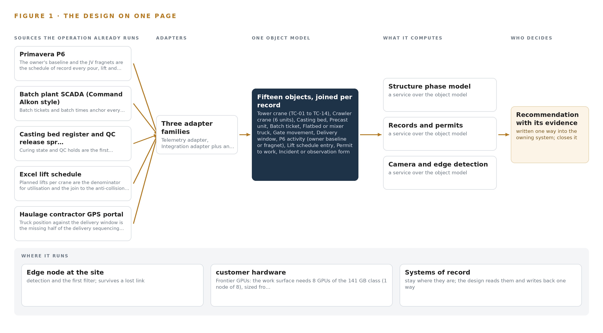
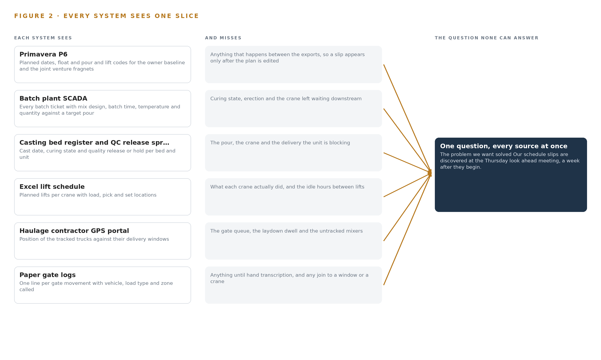
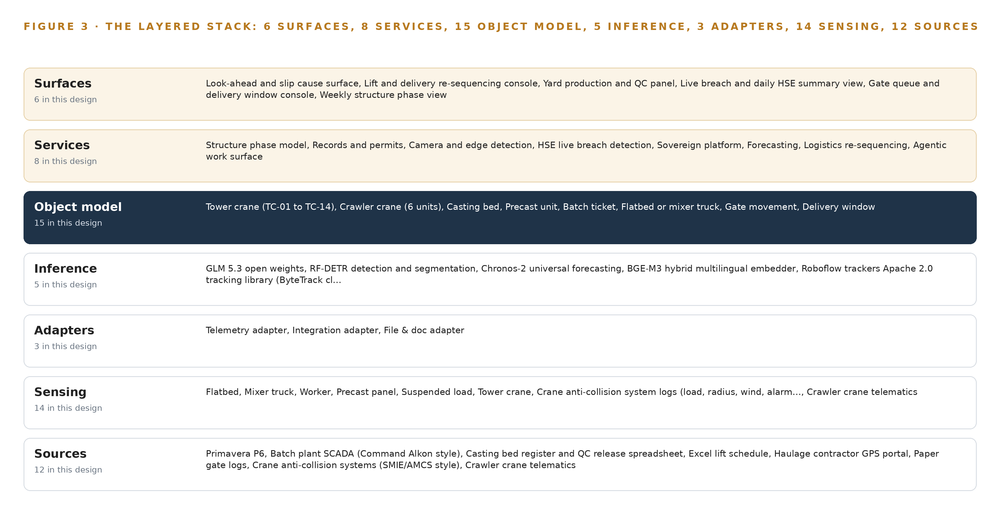
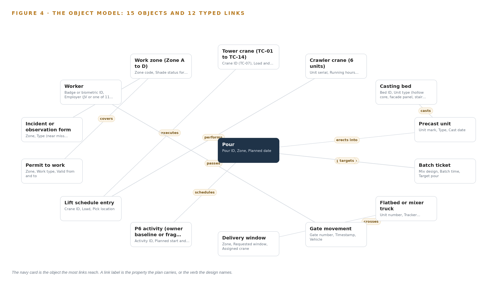
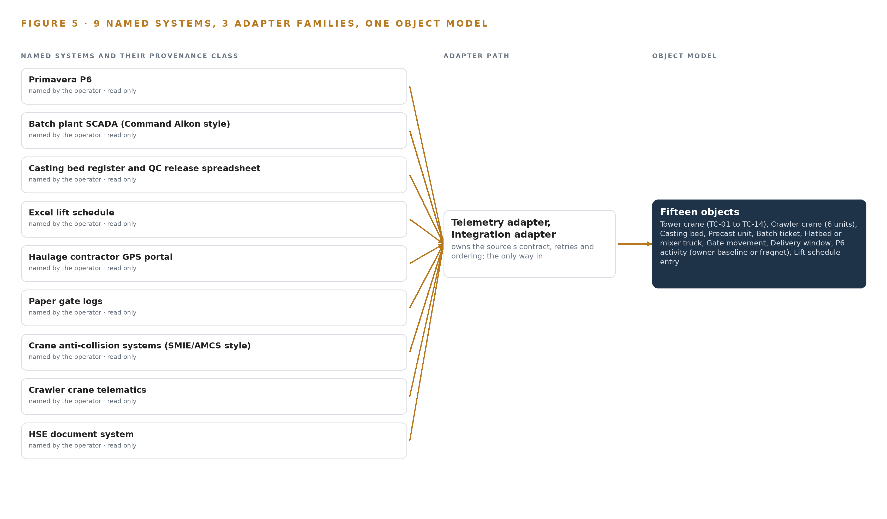
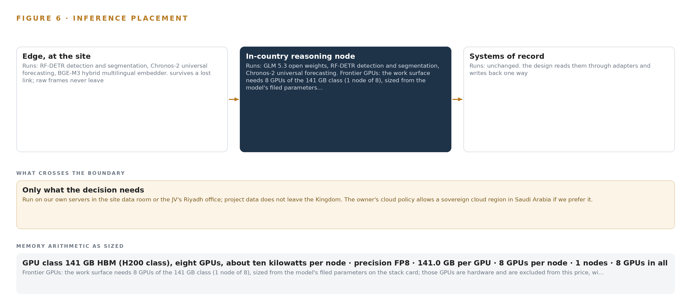
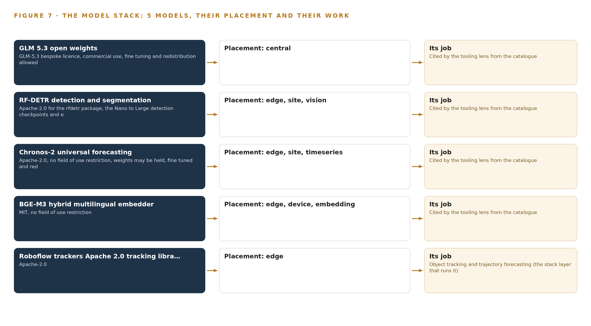
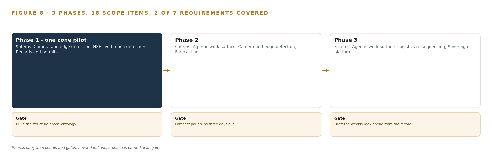
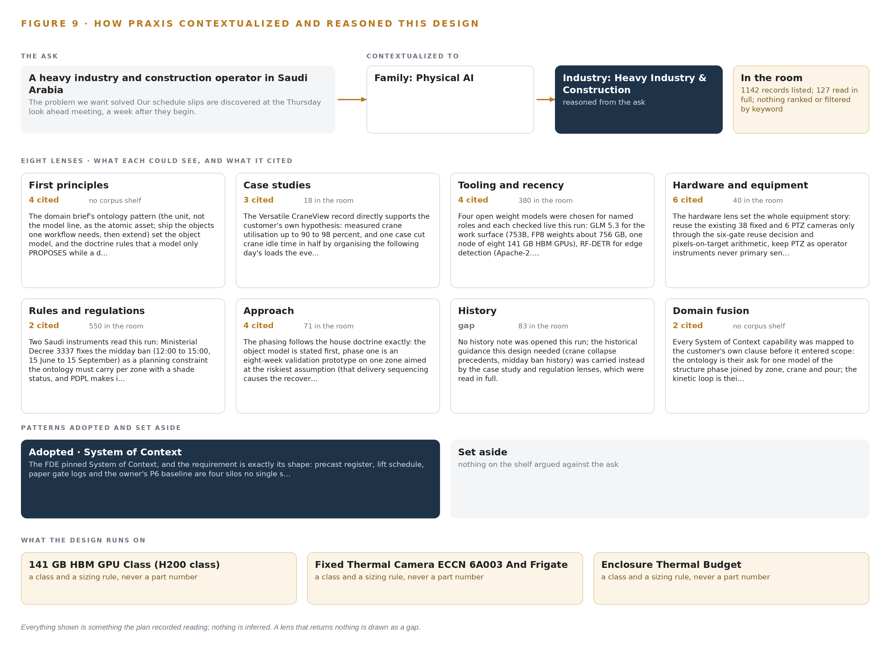

# Structure Phase Watch: Live Production, Crane and Delivery Evidence for Every Pour on a Construction Site

Canonical: https://codeatoms.ai/structure-phase-construction-saudi-arabia/
DOI: https://doi.org/10.5281/zenodo.23126448
PDF: https://codeatoms.ai/structure-phase-construction-saudi-arabia/paper/structure-phase-watch-construction-saudi-arabia.pdf
License: CC BY 4.0
Publisher: CodeNinja Atoms (https://codeatoms.ai), a fully owned subsidiary of CodeNinja

VERTICAL-DRIVEN ARCHITECTURES · HEAVY INDUSTRY & CONSTRUCTION · DESIGNED WITH PRAXIS · OCTOBER 2026

# Structure Phase Watch: Live Production, Crane and Delivery Evidence for Every Pour on a Construction Site

One live model of the structure phase that joins precast production, crane utilisation and truck flow into a single picture, forecasts schedule slips three days out and shows safety breaches as they happen, for a heavy industry and construction operator in Saudi Arabia.

CodeNinja Engineering Team

For the construction director accountable for the structure phase, the planning, crane coordination and HSE leads beside them, and the platform, data integration and computer vision engineers who would build and run it.

---

Vertical-Driven Architectures is a CodeNinja series of system designs. Every design in the series is driven by a real-world problem and scenario in a single industry, and every one is designed on Praxis, CodeNinja's platform for designing physical AI systems. Operations are described by class, never by name.

At a glance

## Three-day schedule slip forecasts for a construction site in Saudi Arabia

**What this is.** An open reference architecture for system design in physical AI: one live model of a construction site's structure phase that forecasts schedule slips three days out and shows safety breaches as they happen, on the contractor's own hardware inside the Kingdom. It is written for construction directors and for the engineers who would build it. The operator is an illustrative scenario, not a CodeNinja customer.

**The answer in numbers.**

| Part | The design |
| --- | --- |
| Sources joined | 12 systems, including Primavera P6, batch plant SCADA, the casting bed register, the lift schedule, crane anti-collision logs, haulage GPS, gate logs and biometric turnstiles |
| Object model | 15 typed objects and 12 links, published as JSON for reuse |
| Models | 5 self-hosted open models: GLM 5.3 (reasoning), Chronos-2 (forecasting), BGE-M3 (multilingual retrieval), RF-DETR (vision), Roboflow trackers |
| Frontier compute | One node of eight 141 GB HBM-class GPUs holds GLM 5.3 at FP8 (753 GB of weights, 904 GB with headroom) |
| Edge | Five Jetson Orin class nodes in solar powered enclosures at the gate, laydown, crane slew zone, batch plant and haul road |
| Three-year cost, owned | About 642,000 US dollars with support and power at the Saudi industrial tariff |
| Three-year cost, rented | 1.41 million to 2.81 million US dollars for the same GPUs around the clock; ownership is about one half the cheapest three-year commitment |
| Closed model break-even | The cheapest closed model matches the owned stack at about 31 users; above that, ownership is cheaper and the gap grows with every user |
| Human control | Every re-sequencing is a recommendation a named planner approves; every breach alert is confirmed, dismissed or escalated by the HSE officer |

**Reuse it.** The object model, the model register and the figures are free to reuse under CC BY 4.0. Cite as DOI <https://doi.org/10.5281/zenodo.23126448.>

**Made with.** Reasoned on [Praxis](<https://codeatoms.ai/praxis/>), CodeNinja's platform for designing physical AI systems. The object model imports into [Hyper Ontology](<https://codeatoms.ai/hyper-ontology/>), which turns it into a living system. Both are in beta; access by request.

ABSTRACT

## A Slip Should Be Forecast Three Days Out, Not Found at the Thursday Meeting

Why is the structure phase slipping, and where is the struck by and dropped load exposure that causes both delay and injury? Today the joint venture cannot answer either question while it can still act: precast curing state lives in a casting bed spreadsheet, planned lifts live in a separate Excel schedule, truck movements live on paper gate logs, and the owner's Primavera P6 baseline lives with the planning team, so a slip is discovered at the weekly look ahead meeting a week after it begins, and near misses reach HSE on incident forms filed the next day.

The design joins twelve source systems through three adapter families into fifteen objects the joint venture owns: the precast register, the lift schedule, the gate flow, the crane logs and the owner's baseline become one live model of the structure phase, watched by edge cameras at the gate, laydown areas and crane zones. Eight services and six surfaces run on joint venture servers in the site data room, with detection at solar powered edge nodes and reasoning in country, so a slip is forecast three days early, a breach is seen while it happens, five models carry the load, and every re-sequencing output stays a recommendation a named person approves.

The paper opens with the problem and the join failure that keeps four systems blind together, then lays out the constraints, the stack, the object model, ingestion, inference placement and the model and equipment register, before turning to rollout in three phases with gates, ownership of everything the design builds, and the closing chapter on how Praxis contextualized and reasoned the design.

---



Figure 1. Structure Phase Watch on one page: the sources the operation already runs, one object model, what it computes, and the person who decides.

## Contents

Each chapter is tagged for the reader it serves most directly: Executive, Team Lead, FDE, Reference.

|  |  |  |
| --- | --- | --- |
|  | Abstract · A Slip Should Be Forecast Three Days Out, Not Found at the Thursday Meeting | Executive |
| PART I · THE PROBLEM | | |
| 1 | [A Slip Shows a Week After It Begins](#ch1) | Executive |
| 2 | [Every Site System Sees One Slice of the Phase](#ch2) | ExecutiveTeam Lead |
| PART II · THE DESIGN | | |
| 3 | [Four Constraints Shape the Live Structure Phase Model](#ch3) | Team Lead |
| 4 | [One Stack Runs From Gate Log to Look Ahead](#ch4) | Team LeadFDE |
| 5 | [Fifteen Objects Turn Site Data Into One Argument](#ch5) | FDE |
| 6 | [Each Source Enters Through an Adapter](#ch6) | FDE |
| 7 | [Detection Runs at the Edge and Reasoning Stays in Country](#ch7) | FDE |
| 8 | [The License Decides What the Operator Can Own](#ch8) | FDEExecutive |
| PART III · THE ROLLOUT | | |
| 9 | [Shadow Mode Comes Before Any Flag Is Trusted](#ch9) | Team LeadExecutive |
| 10 | [The Record Stays with the Fleet That Produced It](#ch10) | Executive |
| PART IV · HOW IT WAS DESIGNED | | |
|  | Conclusion · One Live Picture, Built From Records the Site Already Holds | Executive |
| 11 | [Every Choice Traces Back to a Recorded Reading](#ch11) | Team LeadFDE |
|  | [Sources](#sources) | Reference |

PART I · CHAPTER 1

## A Slip Shows a Week After It Begins

The joint venture discovers schedule loss and safety exposure after they have already cost the program, because the evidence of both is captured but never joined.

The abstract states the design in one paragraph and Figure 1 sets the whole shape on one page. This chapter opens the problem that shape answers: the question the joint venture needs answered continuously, the documented cost of answering it a week late, and the operation, described by class, that holds the evidence.

### 1.1  The Question, the Data and the Regulatory Ground

The operation needs one question answered every morning: is the structure phase about to slip, and where is the exposure that will cause the next injury? Answering it requires joining four streams that today never meet: precast production against the pour sequence, which means cast dates, curing state and quality release for every unit; crane utilisation against the lift plan, which means planned lifts per crane set against the loads, radii, wind stops and alarms the cranes actually logged; truck flow, which means gate movements, queue depth at each gate, and tracker position against each assigned delivery window; and the people and equipment conflicts, which means permits, workforce presence by zone, and entry into a crane slew radius or an exclusion zone under a suspended load. Beneath all four sits the schedule of record: planned dates, float and pour and lift codes in the owner's baseline and the joint venture's own fragments of it. The regulatory ground is layered. Work must satisfy the Saudi Building Code, the occupational safety regulations of the ministry responsible for labor and social development, and the project owner's HSE standard, which the joint venture works to contractually. The summer midday work ban, from noon to mid afternoon between mid June and mid September, removes three working hours from every outdoor crew, which tightens every delivery window the sequencing logic will touch and makes morning surges unavoidable. Data discipline itself is becoming a formal regime on projects of this class: industry guidance now expects a written data management plan before project data is collected and shared (AGS 2024), and major public owners treat data management for investigation and monitoring data as an explicit contractual requirement (ARMY 2025). A design that leaves the record fragmented inherits those obligations without the controls that satisfy them.

### 1.2  The Documented Cost

The cost of fragmented site data is documented, and it lands twice. First as schedule loss that compounds quietly: a slip that begins on a Monday and surfaces at the Thursday look ahead has already consumed its curing time, its idle crane hours and its queue delay, and the evidence of why it began has been cleared away with the queue. Second as legal and regulatory exposure over data the firm already held. A court in the United States sanctioned a civil construction contractor with an adverse inference for failing to preserve electronic data from five custodians, converting an operational dispute into a case outcome the contractor could not defend (Minerva26 2023). A privacy watchdog in South Korea fined a construction equipment firm over an employee data leak, a penalty that attaches to the handling of workforce records rather than to any physical failure (YNA 2026). Both failures are of the kind this design is built to prevent: evidence captured but never joined, kept or controlled.

### 1.3  The Operation as a Scenario

The scenario is a precast and site logistics joint venture on a giga project in the Riyadh region: a mixed use district of roughly two square kilometers in its heavy civil and structure phase. The joint venture runs one precast yard casting hollow core slabs, facade panels and stair units; one batching plant; more than a dozen tower cranes and half a dozen crawler cranes spread across four work zones; a fleet of flatbed and mixer trucks in the tens on a single internal haul road a few kilometers long; and a workforce in the thousands across its own crews and about a dozen subcontractors. Six role groups live inside this evidence every day: a planning manager with a small planning team owning the look ahead; a crane coordinator with lift supervisors; a yard manager with a quality lead; an HSE manager with officers; a logistics controller working the gates; and the subcontractor supervisors whose crews occupy the zones. The physical environments are demanding: open air zones with dust, glare and summer ambient heat that degrades lenses and electronics; gates and laydown areas where mains power is scarce, so sensing runs from solar powered enclosures; and tower crane slew zones whose suspended loads cross the same ground the workforce occupies. The counts that size the design are twelve named source systems, six role groups, and a place set of four work zones, one precast yard, one batching plant, the main gates, the laydown areas and the haul road.

PART I · CHAPTER 2

## Every Site System Sees One Slice of the Phase

Each existing system holds a true fragment of the structure phase, and the answer to the slip and exposure question lives in the fragments none of them share.

Chapter 1 defined the question and the operation that holds the evidence. This chapter shows why the operation cannot answer the question today: every system holds a true fragment of the structure phase, and the answer lives in the fragments none of them share. Figure 2 sets each system's sees and misses side by side.

### 2.1  What Each System Sees, and What It Misses

The schedule of record, Primavera P6, sees planned dates, float and pour and lift codes for the owner's baseline and the joint venture's fragnets; it misses everything that happens between exports, so a slip exists there only after someone edits the plan to match reality. The precast register spreadsheet sees cast dates, curing state and quality release for every bed and unit; it misses the pour and the crane waiting on the unit, so a curing delay looks like a yard number with no downstream consequence. The batch plant SCADA sees every ticket, with mix design, batch time, temperature and quantity against a target pour; it misses erection, so a slow pour cycle leaves no trace of the delivery chain that caused it. The Excel lift schedule sees planned lifts per crane; it misses what the cranes actually did, which lives in the anti-collision systems' logs of load, radius, wind state and alarms. The haulage contractor's GPS portal sees where the tracked trucks are against their windows; it misses the gate queue and the untracked mixers. The paper gate logs see one line per movement; they miss anything until a hand transcribes them, and no process joins them to a window or a crane. Crawler crane telematics sees hours, location and fault codes but has no planned-lift denominator. The HSE document system sees yesterday's forms, never a live breach. The biometric turnstiles see presence at the main gates but not which zone, permit or load path each worker was exposed to. The weather station sees wind and temperature but not which lift each reading stopped. The paper permits see who may work in a zone but not the conflicts between overlapping permits and crane operations.



Figure 2. Twelve systems, each seeing one part of the answer. the question needs all of them in one place at once.

### 2.2  What None of Them See Together

What none of them see is the same event three times: panel curing running behind at the yard, a tower crane idle through a large fraction of its shift waiting for deliveries, and the haul road gate backed up with a queue of trucks because two zones called the same delivery window. Those are three records of one failure in delivery sequencing, and no existing system can hold them together. The cost in practice is precise: the slip is discovered at the Thursday look ahead a week after it began, and HSE learns of a crane or truck near miss from a form filed the next day, when the laydown area that produced it has already reset for the next morning's surge.

PART II · CHAPTER 3

## Four Constraints Shape the Live Structure Phase Model

Sovereignty over the record, no replacement of systems of record, decisions reserved to named people, and a cheap first gate define what the design may do before any architecture is chosen.

Chapter 2 showed the fragments and the cost of never joining them. This chapter fixes the four constraints the join must respect before any architecture is chosen, because each one is hard in this industry for a specific reason.

### 3.1  The Record Stays Sovereign

Every weight, every detection and every decision record stays on joint venture hardware in the site data room, inside the Kingdom, beside the record it reasons over. This is hard because the convenient path runs the other way: hosted model services and off-site analytics are one contract signature away, and the temptation grows with every capability the design adds. It is also hard because the record is personal: biometric turnstile data identifies individual workers across about a dozen subcontractors, and workforce data handling now carries regulatory penalty exposure in this industry, as a recent fine over an employee data leak at a construction equipment firm shows (YNA 2026). Contracts on projects of this class increasingly carry explicit data safeguarding duties, which makes the boundary a contractual fact as much as a technical one (Acquisition n.d.).

### 3.2  No System of Record Is Replaced

The design reads every source and writes back to none of them. Primavera P6 stays the planning team's tool with the owner's baseline untouched; the casting register stays the yard's spreadsheet until the joint venture itself decides otherwise; the paper permit keeps its legal force. This is hard because a read-only posture must still earn daily use from people whose own tools keep working, and because data management guidance treats source systems as governed records whose custody and quality are owned, not bypassed (AGS 2024). The only write path in the whole design is the object model the joint venture owns, which accumulates the joined record without editing a single source.

### 3.3  Every Decision Stays with a Named Person

Re-sequencing deliveries, accepting a slip forecast and closing a breach all end at a named person: the crane coordinator, the planning manager, the HSE manager. This is hard because the moment of value is the 06:00 delivery surge, exactly when a human approval loop is most tempting to automate away, and because a recommendation that arrives without a clear owner tends to be either ignored or obeyed blindly, and neither is accountability.

### 3.4  The First Gate Must Be Cheap to Stop

Phase one proves the joint venture's own hypothesis, that recoverable loss is crane idle time caused by delivery sequencing rather than crane count, on one zone, across nine items, behind one exit gate. This is hard because construction pilots habitually scale before they prove, and a design that cannot be stopped cheaply at its first gate has not been scoped honestly.

### 3.5  Scoping Decisions

Three decisions set the boundaries within which the rest of the design follows. Table 1 states what each buys and what each costs.

Table 1 · Scoping Decisions

| Decision | What it buys | What it costs |
| --- | --- | --- |
| Everything runs on joint venture servers in the site data room | The weights, the detections and the decision record stay inside the Kingdom beside the record | The joint venture buys, powers and cools its own GPUs, including the frontier node |
| Read-only integration with all twelve source systems | No change orders against the schedule, the plant or the yard, and no risk to any system of record | The picture is as fresh as the exports, daily for the schedule of record |
| Phase one proves the hypothesis on one zone | A cheap first gate: the work can stop after nine items if the evidence contradicts the hypothesis | The other three zones and any automation of gate windows wait behind the gate |

### 3.6  What the Design Chose Against

Each rejection below was made for a stated reason, not by omission, and the last row records what is out of scope entirely. Table 2 sets them out.

Table 2 · What the Design Chose Against

| Where | What was picked | Instead of, and why |
| --- | --- | --- |
| Camera detection | Fine tuned open vision model on site footage, served on joint venture edge nodes | Packaged site safety vision product: the joint venture must own the weights and keep detections inside the site data room, and a packaged product rents exactly that part |
| Schedule integration | Daily XER or XML file exports from the planning team | Direct Primavera P6 API access: owner consent is not confirmed, so files carry the design and the API stays an upgrade behind a consent checkpoint |
| Language model serving | One self hosted node in the site data room holding the frontier weights | Hosted model services or early migration to the owner's sovereign cloud region: the weights must sit beside the record they reason over, and migration stays a later option the joint venture may take |
| Gate automation at go live | Re-sequencing outputs as recommendations a named person approves | Direct gate booking and subcontractor notification: automation waits for the one zone trial, under rules the crane coordinator sets |
| Out of scope | No procurement of new cranes or trucks, no physiological wearables, no network build | The design works the existing crane and truck fleets as they are, uses the existing private LTE and fibre with buffered edge uplinks, and keeps field facing output as schedule constraints and translated alerts |

PART II · CHAPTER 4

## One Stack Runs From Gate Log to Look Ahead

Systems of record sit below, one object model holds the middle, and the services and surfaces the planners and HSE officers use sit above, so a single pattern carries the whole design.

Chapter 3 fixed the four constraints the design must honor: the twelve systems of record stay in place untouched, every byte stays inside the joint venture's own perimeter, every re-sequencing output remains a recommendation a named person approves, and the first gate can stop the work cheaply on one zone. This chapter shows the single architectural pattern that satisfies all four at once, and names the components at every stage of the stack.

### 4.1  Records Below, One Model in the Middle, Decisions Above

The design is a three-layer pattern. Below sit the systems of record: the owner's Primavera P6 baseline, the batch plant SCADA, the casting bed register, the lift schedule, the gate logs and the rest, all left exactly where they are and all read only. In the middle sits one object model that holds the fifteen typed objects of the structure phase and the links between them. Above sit the eight services that read that model and the six surfaces where the planning team, the crane coordinator, the yard manager and the HSE officers make their calls. Figure 3 shows the layered stack with the component counts per layer: twelve sources, three adapter families, fifteen objects, eight services and six surfaces, on JV hardware in the site data room. The pattern fits because the problem defined in Chapter 2 is a join failure, not a missing feature in any one system. Point-to-point integrations would multiply the join problem by pairing systems two at a time; a shared object model pairs every system once, against the model. The same pattern also serves the sovereignty constraint: because the middle layer is the only place systems meet, the perimeter needs only one defended interior rather than a mesh of connections, and because no adapter ever writes back to a source, the systems of record carry no new risk.



Figure 3. The layered stack: 12 sources, 3 adapter families, 15 objects, 8 services and 6 surfaces.

### 4.2  The Stack Stage by Stage

Each stage of the stack owns one job and hands a defined artifact to the stage above it, from raw records at the bottom to the six decision surfaces at the top. Table 3 names the components at every stage and states what each is responsible for and how it does it.

Table 3 · The Stack, Stage by Stage

| Stage | What it is responsible for | How |
| --- | --- | --- |
| Sources | Holding the records every judgement is checked against: the owner's Primavera P6 baseline and fragnets, batch plant SCADA, the casting bed register and QC release spreadsheet, the Excel lift schedule, the haulage contractor GPS portal, paper gate logs, crane anti-collision logs, crawler crane telematics, the HSE document system, biometric turnstiles, the site weather station and paper permits to work | Read only; no component in the stack ever writes back to a source |
| Sensing | Capturing the physical reality the records miss: truck queues at the gate, exclusion zone entry, workers inside a slew radius, laydown dwell | Five camera streams on solar powered Jetson Orin edge nodes running Frigate NVR and ONNX Runtime, with RF-DETR detections tracked by the Roboflow trackers library of the ByteTrack class; plus anti-collision logs, telematics, GPS, weather and turnstile feeds |
| Adapters | Turning twelve heterogeneous inputs into one ordered event stream, tagged with provenance and aligned to one clock | Three adapter families, telemetry, integration and file and doc, publishing to Apache Kafka 4.3.x in KRaft mode with three dedicated controllers, time aligned by Linuxptp and chrony against an OCP Time Card GNSS grandmaster |
| Object model | Holding the fifteen typed objects and their links as the one live model of the structure phase | The graph store of the object model beside InfluxDB 3 Core for telemetry history, both inside the JV perimeter |
| Inference | Detecting breaches at the edge, forecasting slips, embedding records and reasoning over the model | RF-DETR on the edge nodes; Chronos-2 and BGE-M3 on an eight by L40S class server; the frontier work surface model on one node of eight 141 GB HBM GPUs served by vLLM; versions held in Harbor and MLflow, labels in CVAT |
| Services | Running the eight named services: structure phase model, records and permits, camera and edge detection, HSE live breach detection, sovereign platform, forecasting, logistics re-sequencing and the agentic work surface | Containers on K3s inside the JV perimeter, observed through Prometheus, Grafana and Loki, with identity and access through Keycloak |
| Surfaces | Presenting the six decision surfaces where planners, the crane coordinator, the yard manager and HSE officers decide | Look-ahead and slip cause surface, lift and delivery re-sequencing console, yard production and QC panel, live breach and daily HSE summary view, gate queue and delivery window console, weekly structure phase view |

PART II · CHAPTER 5

## Fifteen Objects Turn Site Data Into One Argument

Cranes, units, tickets, trucks, permits, workers, zones and pours become typed objects whose links let one query reach the story behind any slip, with every write passing through a person.

Chapter 4 placed one object model in the middle of the stack. This chapter opens that model: the fifteen objects it holds, the typed links that let a query cross from a delayed pour to the crane that waited for it, the place a person sits in every write, and the hosting posture that keeps the whole thing inside the joint venture's boundary.

### 5.1  Fifteen Objects and the Typed Links Between Them

The model holds fifteen objects in five kinds. Four are assets that do the work: tower\_crane for the 14 tower cranes and crawler\_crane for the 6 crawler cranes, casting\_bed and precast\_unit for the yard's output, and truck for the 60 vehicle fleet. Four are records: batch\_ticket from the plant SCADA, p6\_activity from the owner's baseline and the joint venture's fragnets, permit from the paper permit to work system, and hse\_observation from the incident and observation forms. Four are events: gate\_movement, delivery\_window, lift\_plan\_entry and pour. One is a person, worker, anchored in the biometric turnstiles, and one is a place, zone, covering the four work zones. Figure 4 draws every object and every typed link between them, with the pour as the focal object because the pour is where schedule and safety meet. The links are what make the model an argument rather than an archive. Start at a pour showing status Delayed and the query reaches the batch tickets behind it, the precast units and their casting beds and curing state, the p6\_activity that carries the float, the delivery\_window objects and the trucks and gate\_movements that explain whether the delay arrived by road, and the tower cranes and lift\_plan\_entries that show what idled while it waited. The same query continues into the zone, the permits active there and the workers present, which is the exposure picture an HSE officer needs. A document store can hold each of these records but cannot traverse between them, so each answer would be a separate search in a separate system; here one query reaches the whole story, which is exactly what the Thursday look-ahead meeting cannot do today.



Figure 4. The fifteen objects of the model and the typed links that let a query reach across them.

### 5.2  Where the Human Loop Lives and How the Model Is Hosted

The human loop sits at the only write path into the model that changes an operational plan. Every re-sequencing output, every proposed delivery window and every recommended look-ahead draft is a recommendation; the planner or the crane coordinator approves it, and the approval, the approver and the reasoning are recorded with the decision. Breach detections behave the same way: the system raises the alarm while it happens, and the HSE officer confirms, dismisses or escalates it, so the model never closes a gate or stops a lift on its own. The hosting posture follows the constraint set in Chapter 3. All fifteen objects live on the joint venture's own servers in the site data room, with the Riyadh office as the second site and the owner's sovereign cloud region held as a later alternative, so no object, clip or embedder output leaves the Kingdom. Identity runs through Keycloak with a role per surface, and the employee data the model holds is exactly the class of record whose leakage draws regulator fines elsewhere in the industry (YNA 2026), which is why the perimeter, the roles and the retention rules are design constraints rather than settings. External links are bounded: camera clips are referenced by identifier and stored inside the perimeter, and the only outbound integration is the read of the owner's P6 export. The data management discipline the model enforces, one schema, one clock, one provenance tag per record, follows the same structured plan-first practice published for engineered projects (AGS 2024).

### 5.3  One Object in Its Recorded Form

The tower crane object shows the recorded form the other fourteen follow: an identifier, a label, a kind, typed properties, a closed status vocabulary of five states from Planned lift to Out of service, and links to the lift schedule entries and anti-collision events that feed its utilisation figure.

```
{
  "id": "tower_crane",
  "label": "Tower crane (TC-01 to TC-14)",
  "kind": "asset",
  "anchored_in": "Excel lift schedule",
  "properties": [
    "Crane ID (TC-07)",
    "Load and radius from the anti-collision system",
    "Wind interlock state",
    "Alarm events",
    "Shift utilisation"
  ],
  "status_vocabulary": [
    "Planned lift",
    "Lifting",
    "Idle waiting for delivery",
    "Wind stopped",
    "Out of service"
  ],
  "links": [
    {
      "to": "lift_plan_entry",
      "label": "executes"
    }
  ]
}
```

PART II · CHAPTER 6

## Each Source Enters Through an Adapter

Twelve systems of record enter through three adapter families onto one event backbone, so a paper gate log and a batch ticket arrive with the same guarantees.

Chapter 5 defined what the object model holds and who may write to it. This chapter describes how data reaches it: which twelve systems enter, what the three adapter families guarantee on the way in, and what the event backbone does with every event once an adapter has published it.

### 6.1  Twelve Sources, One Integration Map

Twelve named systems feed the model, and Figure 5 maps each one to its adapter path. The owner's Primavera P6 baseline and the joint venture's fragnets arrive as daily XER or XML exports from the planning team, with the REST API held as an upgrade behind an owner consent checkpoint. The batch plant SCADA of the Command Alkon style is integrated as a read-only historian mirror on the joint venture's own network, so no OT zone is crossed. The casting bed register and QC release spreadsheet, the Excel lift schedule and the paper gate logs enter through the file and doc adapter family, the gate logs after the one zone's paper digitisation in phase one. The haulage contractor GPS portal and the 20 proposed trackers for the untracked mixers enter through the telemetry family, as do the crane anti-collision systems of the SMIE and AMCS style, the crawler crane telematics, the site weather station and the biometric turnstiles. The HSE document system and the paper permits to work enter through the integration and file and doc families respectively. Every source carries the same provenance class, an operator system of record, and every integration is read only, so the design changes no system it depends on.



Figure 5. The 12 named systems, the adapter path each one takes, and the object model they all map into.

### 6.2  What the Adapter Tier Guarantees

Each adapter family makes the same five guarantees regardless of what it reads. It normalizes its source into the one schema of the target object, so a paper gate log line and a GPS ping both become events a single query language can join. It stamps every event with a source timestamp resynchronized against the site grandmaster clock, because a join between crane alarms and gate times is worthless if the two clocks disagree by minutes. It carries provenance on every event: source system, adapter family and the record identifier in the origin system, so any figure on any surface can be traced back to the record it came from, the traceability that formal data management guidance for monitored works demands (ARMY 2025). It replays idempotently, so re-reading a day of P6 exports or a resubmitted spreadsheet produces no duplicate objects. And it handles schema drift in the spreadsheets explicitly, quarantining a malformed register rather than silently mis-typing a curing date.

### 6.3  The Event Backbone

Everything an adapter publishes lands on Apache Kafka 4.3.x running in KRaft mode with three dedicated controllers inside the site data room. Ordering is by event key, so all events for one crane, one truck unit or one gate arrive in sequence and the utilisation and queue calculations never see time run backwards. Delivery is at least once with idempotent consumers, which pairs with the adapters' replay guarantee to make the backbone safe to restart. Buffering follows the failure mode the project itself named: the edge nodes buffer hours of private LTE disconnection before forwarding, sized generously, so a patchy link under a crane zone delays a stream rather than losing it. Replication keeps three copies of every topic across the data room cluster with retention long enough that the Thursday look-ahead can replay the full week, and because the whole estate sits inside one joint venture perimeter, no event crosses a boundary on its way from a gate log to a planner's screen.

PART II · CHAPTER 7

## Detection Runs at the Edge and Reasoning Stays in Country

Camera detection and counting run on solar powered edge nodes where the connection is weakest, forecasting and the work surface run on the operator's own servers, and only compact events cross the boundary.

Chapter 6 closed the path from source to backbone: every system enters through an adapter and lands as ordered events on the streaming layer. This chapter places the compute that watches those events, because where a model runs decides whether a breach alert survives a dropped link.

### 7.1  Three Tiers, Each Placed Where Its Work Is Cheapest

Figure 6 shows the three inference tiers. The lowest tier is the edge: Jetson Orin industrial edge class compute in solar powered IP66 enclosures with NUT managed UPS and sunshields, placed at the main gate truck queue, laydown area east, the crane TC-07 slew zone, the batch plant loading bay and the haul road junction. Each node runs detection and tracking locally under K3s: RF-DETR served through ONNX Runtime finds flatbeds, mixer trucks, workers, precast panels, suspended loads and tower cranes, and the ByteTrack class tracker holds identity across frames for queue counts, dwell and slew radius entry. Frigate NVR records beside it. The edge exists because private LTE coverage at laydown areas and under crane zones is patchy: detection at the point of risk must not depend on a stream that drops. The middle tier is the site inference server in the site data room, eight L40S class PCIe GPUs of 48 GB class each. It runs Chronos-2 forecasting over the series held in InfluxDB 3 Core, BGE-M3 embeddings for retrieval across permits, forms and work surface queries, and the cross zone aggregation behind live breach detection. The top tier is one node of eight 141 GB HBM GPUs (H200 class) serving GLM 5.3 for the agentic work surface. The arithmetic is the register's: 753 billion parameters at FP8, one byte per parameter, give 753 GB of weights; multiplied by 1.2 for KV cache and activations, the node must hold 904 GB; its 1,128 GB holds that, leaving about 224 GB of headroom that covers concurrent planner sessions rather than weights. The frontier weights sit on JV hardware inside the Kingdom beside the record they reason over, and the 141 GB HBM class ships to Saudi Arabia only under a US export licence, so the frontier node's order date is a phase one checkpoint on the licence timeline.



Figure 6. Where each tier runs, what runs there, and the narrow set of outputs that cross the boundary.

### 7.2  The Latency Budget

Three clocks govern the design, and each is set where its work runs. The breach clock is an edge clock: camera frame cadence at the node, alarm raised locally, the uplink notified afterwards, so no network condition delays an alert about a worker inside a slew radius. The forecast clock is a site clock: Chronos-2 refreshes the slip picture daily against the P6 export and continuously against the streaming telemetry, and a three day horizon only has to beat the Thursday look ahead, not the second hand. The reasoning clock is a local area network clock: work surface prompts round trip to the H200 node in the same building as the object model, with no public internet hop, which is what makes an interactive session over a 753 billion parameter model practical on JV hardware.

### 7.3  What Crosses the Boundary and What Fails

What crosses from edge to data room is compact: detections, counts, tracker identities, alarm states and buffered telemetry samples, not continuous video. Video stays on the node, and a clip leaves only as a referenced artifact on an HSE form. When the link fails, the buffered uplink is sized for hours of disconnection and then doubled; local inference continues, so the gate keeps counting a queue it cannot yet report. When power or heat fails, the NUT managed UPS rides through interruptions, the enclosure thermal budget including solar gain is engineered before installation, and internal enclosure temperature is monitored as a first class signal, because dust, glare and 50 C summer ambient present as accuracy loss before they present as outages. When the update path fails, nothing breaks: Harbor holds container images and MLflow holds model versions in the air gapped registry, nodes run the last promoted version, and a new model reaches the edge only through that registry, never through the internet.

PART II · CHAPTER 8

## The License Decides What the Operator Can Own

Five models carry the design, and each is chosen so the joint venture can hold its weights, fine tune them and keep every output inside the site data room.

Chapter 7 placed the compute: detection at the edge, forecasting and aggregation in the data room, one frontier node for reasoning. This chapter names the models that run there and the licenses that make owning them possible.



Figure 7. The five models, their placement, and the work each one does.

### 8.1  The Frontier Language Model and Its License

Figure 7 shows the model stack. GLM 5.3 open weights is the register's one frontier class model, at 753 billion parameters filed, run at FP8 on the single H200 class node in the site data room. Its role is the agentic work surface and ontology maintenance: the planning manager and four planners, the crane coordinator and lift supervisors, the yard manager and QC lead, and the HSE manager and officers build and run their own checks and daily agents on the live structure phase model, for example a daily agent naming every crane under 50 percent utilization and its cause. The license is a bespoke GLM-5.3 license that permits commercial use, fine tuning and redistribution, which is what lets the JV hold and improve its own copy. Its one trigger, a security review for a model as a service business above USD 10 billion group revenue in twelve months, does not apply to internal JV use; the corporate group position is confirmed at contracting and the attribution notice is recorded.

### 8.2  Vision, Tracking, Forecasting and Retrieval

Four open models carry the rest. RF-DETR is the detection and segmentation model, Apache-2.0 licensed across the rfdetr package and its Nano to Large detection checkpoints, fine tuned on site footage and served on the edge nodes through ONNX Runtime and at the site tier: it finds the flatbeds, mixer trucks, workers, precast panels, suspended loads, tower cranes and truck queues the design watches. It was chosen against a packaged site safety vision product because the packaged product rents the exact weights the sovereignty clause requires the JV to own and harden. The Roboflow trackers library, a ByteTrack class tracker under Apache-2.0, supplies motion only identity for queue counts, laydown dwell and slew radius entry, chosen over the BoxMOT collection to avoid AGPL exposure. Chronos-2 is the universal forecasting model, Apache-2.0 with no field of use restriction, so weights may be held, fine tuned and redistributed; it turns the InfluxDB series into the three day pour slip forecast, gate queue projections and utilization trajectories. BGE-M3 is the hybrid multilingual embedder under MIT, running from the device tier to the site tier: a workforce whose records carry language tags across the JV and its 11 subcontractors needs retrieval that spans permits, HSE forms and work surface questions in more than one language. Holding worker records inside the boundary is more than a preference; a privacy regulator fined a construction equipment maker 73.5 million won over an employee data leak (YNA 2026).

### 8.3  The Model and Equipment Register

Table 4 collects the register: each model, each hardware class and sizing rule, the sensing the design stands on, the patterns it follows, and the ground it runs on. The discipline the register records is the one public guidance asks of engineered projects: state what data exists, who holds it and under what terms (AGS 2024).

Table 4 · Model and Equipment Register

| The choice | What was picked | Why here |
| --- | --- | --- |
| Language model | GLM 5.3 open weights, 753B parameters filed, FP8, bespoke license | The only frontier class model in the register; commercial use, fine tuning and redistribution are permitted, so the JV holds its weights on its own node |
| Detection and segmentation | RF-DETR fine tuned on site footage | Apache-2.0 from package to checkpoints; the JV owns and hardens weights a packaged safety product would rent |
| Tracking | Roboflow trackers, ByteTrack class | Apache-2.0 motion only identity without the AGPL exposure of the BoxMOT collection |
| Forecasting | Chronos-2 universal forecasting | Apache-2.0 with no field of use restriction; weights may be held, fine tuned and redistributed on site |
| Embedding | BGE-M3 hybrid multilingual embedder | MIT with no field of use restriction; multilingual retrieval across a workforce tagged by language |
| Frontier hardware | One node of eight 141 GB HBM GPUs (H200 class) | 1,128 GB holds the 904 GB of FP8 weights, KV cache and activations with headroom for sessions |
| Edge compute | Jetson Orin industrial edge class in solar powered enclosures | Detection survives patchy private LTE coverage at gates and laydown areas |
| Site inference server | Eight L40S class PCIe GPUs, 48 GB class | Forecasting, embedding and breach aggregation on JV hardware in the site data room |
| Camera class | Fixed visible cameras, Frigate ready ONVIF Profile S/T; thermal at 9 Hz or less | The existing 38 fixed cameras serve where a reuse survey holds; the 9 Hz ceiling keeps US origin thermal units outside the 6A003.b.4.b export license to Saudi Arabia |
| Sizing rules | Enclosure thermal budget including solar gain, with a cleaning interval as a design parameter | Dust, glare and 50 C summer ambient fail as accuracy problems unless the thermal budget is engineered first |
| Sensing | Crane anti-collision logs, crawler telematics, haulage GPS for 40 tracked trucks plus proposed trackers for 20 mixers, weather station, biometric turnstiles, batch plant SCADA | Ground truth of what cranes, trucks and crews actually did, joined through the adapters |
| Pattern | Adapter tier, one object model, recommendation with a named approver | Every source enters through an adapter, never directly, and every re-sequencing output stays a recommendation a person approves |

PART III · CHAPTER 9

## Shadow Mode Comes Before Any Flag Is Trusted

Three phases with counted items and hard gates prove the slip forecast and the breach detection against the record before anyone acts on a flag.

Chapter 8 fixed the models, their licenses and the hardware classes they run on. This chapter sets out how the design earns the right to be trusted: three phases with counted items, workstreams and hard exit gates, so the slip forecast and the breach detection are proven against the record before anyone acts on a flag, and the work can be stopped cheaply if a gate does not hold.

### 9.1  Three Phases, Counted and Gated

Figure 8 shows the rollout as three phases with item counts, workstreams and exit gates. No phase carries a duration; each phase ends when its gate is met, not when a calendar page turns. Phase 1 is a one zone pilot carrying nine items across five workstreams: camera and edge detection, HSE live breach detection, records and permits, the sovereign platform and the structure phase model. The items integrate Primavera P6, the yard register and the batch plant feeds, digitise one zone's paper records, mount the first edge nodes and stand up the ontology. The exit gate is the built structure phase ontology: every object from Chapter 5 instantiated for one zone, with its sources joined and its provenance classes recorded. Phase 2 carries six items across five workstreams: the agentic work surface, camera and edge detection, forecasting, logistics re-sequencing and records and permits. Its exit gate is the forecast: pour slips predicted three days out against the P6 record, shadowed so planners see the forecast but the schedule of record is untouched. The delivery re-sequencing console and the work surface launch inside this phase, both in recommendation-only mode. Phase 3 carries three items across three workstreams: the agentic work surface, logistics re-sequencing and the sovereign platform. Its exit gate is the drafted weekly look ahead: the Thursday meeting reads its first draft from the record rather than assembling it from four systems by hand. Model governance and retraining become standing operations here. Requirement coverage is counted, not asserted: of the seven recorded requirements, two are covered by the gates above, none is partial, and five sit outside this baseline as later scope the JV may take up.



Figure 8. The three phases and their gates, and coverage of the 7 requirements across them.

### 9.2  What the Rollout Measures

The rollout measures five things against the record. First, slip forecast quality: every three day forecast is scored against what P6 shows happened, by pour and by zone. Second, crane idle time and its attributed cause: the share of a shift each tower crane spends idle waiting for delivery, and how much of it the re-sequencing console removes when its recommendations are accepted. Third, gate flow: queue depth counted by camera against the paper log baseline, so the digitised record can be audited against what the gate actually did. Fourth, breach detection: every live flag is reviewed by an HSE officer, giving precision per detection class and the time from breach to alert. Fifth, exposure during the delivery surge: worker and suspended load co-presence in laydown areas between 06:00 and 08:00, counted before and after re-sequencing goes live.

### 9.3  What Fails and What the Design Does

Table 5 lists the failure modes the design carries and its answer to each.

Table 5 · Failure Modes

| What fails | What the design does |
| --- | --- |
| Private LTE coverage at laydown areas and under crane zones cannot stream video back to the data room | Solar powered edge nodes run detection locally and buffer to an uplink sized for hours of disconnection, then doubled |
| Owner consent for direct Primavera P6 API access is not confirmed | The design runs on daily XER or XML file exports; the API sits behind a consent checkpoint as an upgrade |
| The haulage contractor's GPS feed format is unconfirmed | Format confirmed in phase 1; gate camera queue counting is the fallback for affected trucks |
| The existing 38 fixed cameras were mounted for human review and lack detection density at zone edges | A six gate reuse survey runs per camera; purpose-placed fixed cameras are added only where pixels on target fail |
| The GLM 5.3 license carries a security review trigger for a model as a service business above USD 10 billion group revenue in twelve months | Internal JV use does not trigger it; the corporate group position is confirmed at contracting and the attribution notice recorded |
| Dust, glare and summer ambient degrade lenses and edge compute, presenting as an accuracy problem | Every enclosure carries a thermal budget including solar gain, filtered or sealed cooling, a cleaning interval as a design parameter and monitored internal temperature |

### 9.4  Lessons

**Shadow the flags before anyone trusts them.** Every flag in phase 2 is advisory: the forecast is scored against P6, the breach detection is scored by HSE review, and the re-sequencing console proposes while the crane coordinator decides. Trust is earned per detection class, and a class that cannot hold its precision stays shadowed. Data management discipline from adjacent engineering practice supports this: plan the record before the analysis, so every flag can be traced to the data that produced it (AGS 2024). The gate camera is the fallback, not the other way round. The GPS feed is richer than pixels, but its format is unconfirmed, so the design treats camera queue counting as the guaranteed floor and the feed as the upgrade. A design that needs an unconfirmed feed on the critical path is a design that stops on the first integration surprise. A license trigger is a contracting question, not an engineering one. The GLM 5.3 review trigger turns on a business model the JV does not run, but the corporate group position still has to be confirmed and recorded at contracting, with the attribution notice filed beside the model registry.

### 9.5  What Is Still Open

Five questions remain open. Whether the owner consents to direct P6 API access: settled, it would raise the schedule join from daily files to near live and let the fragnet read flow both ways. Whether the GPS feed arrives in a usable format: settled, it would remove the camera fallback for 40 tracked trucks and tighten delivery window attribution. Whether the reuse survey passes at zone edges: settled, it would cut new camera count and phase 1 cost. Whether the corporate group position triggers the GLM 5.3 review clause: settled, it would either confirm self hosting as designed or force a substitute frontier model into the register. Each is a checkpoint, not a blocker: the design holds its shape either way, and the cost of settling each is a meeting, not a rebuild.

PART III · CHAPTER 10

## The Record Stays with the Fleet That Produced It

The object model, the weights, the decision record and the boundary all belong to the joint venture, so the intelligence compounds for the operation that generated it.

Chapter 9 showed how the design proves itself through counted phases and gates. This chapter states who owns what those phases build, because a live model of the structure phase is only worth building if the joint venture keeps it.

### 10.1  What the Joint Venture Owns

The object model is the JV's: the 15 objects, their typed links and their status vocabularies live in the JV's own instance, on JV servers in the site data room, and they outlive any single project system. The weights and fine tunes are the JV's: the RF-DETR checkpoints fine tuned on site footage, the Chronos-2 forecasts tuned on the yard's own pour history and the BGE-M3 embeddings over its own records all carry Apache 2.0 or MIT terms, so the operator holds them outright, and the GLM 5.3 bespoke license permits commercial use, fine tuning and redistribution for internal work. The decision record is the JV's: every re-sequencing recommendation, the person who approved or rejected it and the outcome that followed are kept as objects the next decision reads, a record whose preservation matters precisely because unmanaged data has cost other contractors dearly in litigation (Minerva26 2023). The boundary is the JV's: every stream, weight and decision stays inside the Kingdom on hardware the JV controls, and worker data is stewarded under the operator's own accountability, a duty regulators elsewhere have enforced with real penalties (YNA 2026).

### 10.2  The Offer Behind the Design

CodeNinja designed this system on Praxis, its platform for designing physical AI systems, and the design maps directly onto its offer: Adaptive Operations is the sensing, detection and forecasting of physical behavior, from edge cameras and crane logs to the three day slip forecast; Decision Systems is the ranking, attribution and re-sequencing that a named planner or crane coordinator approves; Hyper Ontology is the object model at the center of Chapter 5; Hyper Pragma is the agentic work surface where planners, the crane coordinator and HSE officers build their own daily agents; Hyper Engram is the kept record of decisions and outcomes that each re-sequencing recommendation reads before it is made; and Sovereign Infrastructure is the posture the JV chose, its own hardware, open-weight licenses and operation inside the Kingdom.

PART IV · CONCLUSION

## One Live Picture, Built From Records the Site Already Holds

Structure Phase Watch is a single live model of a construction structure phase: fifteen objects spanning cranes, units, trucks, permits, workers, zones and pours, fed by twelve systems through three adapter families, hardened at the edge for dust and heat, sized for sovereign operation on the operator's own servers, and arranged so that a forecast slip and a live breach both arrive as evidence a named planner, crane coordinator or HSE officer decides on.

The same shape runs wherever an operation keeps a schedule of record, a production register and a gate or flow log that no one has joined: swap the objects for that industry's assets, place detection where the connection is weakest, place reasoning in the jurisdiction that must hold the record, and keep every recommendation at the desk of a person whose name the record carries.

PART IV · CHAPTER 11

## Every Choice Traces Back to a Recorded Reading

Produced on Praxis, the design keeps its reasoning on the record: the ask, the room, eight lenses and the patterns they surfaced, so any choice can be traced to what justified it.

Chapter 10 established that the record of decisions belongs to the joint venture. This chapter applies the same discipline to the design itself: produced on Praxis, every choice in this paper keeps its reasoning on the record, so a reader can trace any decision back to what justified it. Figure 9 shows that path from the ask to the equipment classes.

### 11.1  Contextualizing the Ask

Every design in the series is produced on Praxis, and this chapter is the audit trail. The ask, in the operator's words, was one live picture of the structure phase: precast production against the pour sequence, crane utilisation and lift plan compliance, truck flow through gates and laydown areas, and the people and equipment conflicts that cause both delay and injury, with warnings before a slip reaches the look ahead and breach detection while it happens. Praxis assigned the design to the physical operations family in heavy industry and construction. What was in the room and read in full, listed here and available on request: the operator's written requirement and its hypothesis about crane idle time and laydown exposure; the inventory of 12 named systems and their data; the object and link plan; the stack cards with their tooling and hardware readings; the model catalog entries; the risk register; and the phase plan with its gates. Nothing in this paper rests on a conversation that was not written down.



Figure 9. From the ask to the design: the family and industry Praxis assigned, the eight lenses and what each cited, the patterns adopted and set aside, and the equipment the design lands on.

### 11.2  The Eight Lenses

Table 6 records what each lens could see, what it cited and what it contributed. Seven lenses returned readings; one returned nothing and is shown as a gap.

Table 6 · The Lenses and What They Contributed

| Lens | Could see | Cited | What it contributed |
| --- | --- | --- | --- |
| First principles | The physical chain from a delivery window to crane idle to a slipped pour | None | The recoverable-loss hypothesis: delivery sequencing, not crane count |
| Case studies | How contractors have fared when electronic records were not managed | Minerva26 2023 | Keep the decision record defensibly; sanctions follow unmanaged data |
| Tooling and recency | The current state of streaming, graph, video, tracking, forecasting and serving tools | Apache Kafka 4.3.x, Frigate NVR, ONNX Runtime, vLLM, RF-DETR, Chronos-2, BGE-M3, Roboflow trackers, K3s, Harbor and MLflow, CVAT, Keycloak, InfluxDB 3 Core, P6 EPPM export | The entire software stack and the five model choices |
| Hardware and equipment | Compute rated for a dusty, hot, solar powered site and the memory arithmetic behind it | Jetson Orin industrial edge class, eight by L40S class GPUs, one node of eight 141 GB HBM GPUs, OCP Time Card grandmaster | Edge nodes at gates and laydown areas, the site inference server, the frontier node sizing and time synchronisation |
| Rules and regulations | The midday work ban, building code duties, camera export control and privacy enforcement | 6A003.b.4.b at 9 Hz or less for thermal units, YNA 2026 | Camera class specification, in-country operation, worker data stewardship |
| Approach | Data management disciplines from adjacent engineering practice | AGS 2024, ARMY 2025 | Adapter and provenance discipline, plan the record before the analysis, shadow mode before action |
| History | Precedent designs for joining construction schedule and safety data | None | Gap: no recorded precedent joined these four streams; the design argues from first principles instead |
| Domain fusion | What happens when schedule, logistics, safety and workforce data share one object model | None | The pour, lift, gate, permit and worker joins that no single system can make |

### 11.3  Patterns Adopted and Set Aside

The lenses surfaced patterns the design adopted and patterns it refused. Adopted: an adapter tier with provenance classes so every object carries its origin; file based schedule integration over an API whose consent was unconfirmed; open weights self hosted so the JV owns its own detections; shadow mode before any flag is acted on; Apache licensed tracking to avoid the copyleft exposure of the alternative collection. Set aside: packaged site safety vision products, because they rent the exact weights the sovereignty requirement obliges the JV to own; direct P6 API access as the baseline, for the consent reason above; a hardware data diode, because the whole estate sits inside one JV perimeter and the batch plant historian is mirrored read-only on the same network; and sovereign cloud migration, which the owner's policy permits but the engineer placed behind the JV's own servers as a later option.

### 11.4  Where the Reasoning Lands

The reasoning lands on four equipment classes and their sizing rules: the 141 GB HBM GPU class that holds the frontier weights of the work surface, 753 GB at FP8 with headroom for KV cache and activations inside one node; the fixed thermal camera class, specified at 9 Hz or less to stay outside the export license to Saudi Arabia; the enclosure thermal budget, sized for dust, solar gain and summer ambient with cleaning as a design parameter; and the reuse-or-not camera decision, settled by a six gate pixels-on-target survey per existing unit. Each class traces back through Table 6 to the lens that cited it and the room where it was read. That is the point of this chapter: everything shown in this paper was recorded reading, and nothing is inferred.

Appendix A

## What Ownership Costs Over Three Years

The design runs on the operator's own hardware. This appendix prices that choice against the two ways an operator in Saudi Arabia could otherwise get the same capability: renting the same accelerators from a cloud region, or buying a closed frontier model by the token. Every input is a public price, dated and cited. The arithmetic is shown so any reader can rerun it with a written quote. The operator in this design is an illustrative scenario, so the user count and the edge allowance below are assumptions, stated where they are used.

### A.1 The Answer

Owning the stack this design specifies costs about **642,000 US dollars over three years**, inside a range of 552,000 to 739,000. Renting the same capacity around the clock costs **1.41 million to 2.81 million dollars** over the same period. Against the cheapest three-year commitment listed (Oracle, three-year commitment), ownership is **about one half** the cost. Only one of the rented options can sit inside the Kingdom today: no hyperscaler GPU region with H200-class machines is live there, and AWS's Saudi region opens in December 2026 (Channel Insider 2026).

### A.2 What Owning Costs

| Line | Basis | Three-year cost (USD) |
| --- | --- | --- |
| Frontier tier | One server of eight 141 GB HBM-class cards, 320,000 to 420,000 dollars, typical 370,000 (Mercatus 2026) | 320,000 to 420,000 |
| Site tier | One PCIe inference server of eight 48 GB L40S-class cards, as the paper specifies, 85,271 dollars (Newegg 2026) | 85,000 |
| Edge | Five Jetson Orin industrial edge nodes in solar powered enclosures, one at each camera location the paper names at 4,000 dollars each (Eurotech 2026) | 20,000 |
| Support | 8 to 12 percent of hardware value a year (Introl 2026) | 102,000 to 189,000 |
| Power | 10.8 kW average IT load at a power usage effectiveness of 1.6 (Uptime Institute 2025), 454,118 kWh at the industrial tariff of 0.20 riyals per kWh (ECRA 2025) at 3.75 riyals to the dollar | 24,000 |
| **Total** |  | **552,000 to 739,000, typical 642,000** |

The average load assumes the frontier server draws 7 kW of its 10.2 kW maximum (NVIDIA 2026), the site server 3.5 kW and each edge node 60 W. The frontier tier fits one node because GLM 5.3 is 753 GB at FP8 and needs 904 GB with headroom, against 1,128 GB on eight 141 GB cards.

### A.3 What Renting Costs

The same frontier server and site server, rented without a break for three years, because breach detection runs while crews work and forecasts refresh through the night. The edge nodes stay on site in every option and are included in each total.

| Option | Basis | Three-year cost (USD) |
| --- | --- | --- |
| AWS, UAE region, on demand | p5en.48xlarge at 75.96 dollars an hour in me-central-1, g6e.48xlarge at 30.13 (Vantage 2026); outside the Kingdom | 2.81 million |
| Specialist GPU cloud, on demand | 50.44 dollars an hour for eight H200 cards, 18.00 for eight L40S (CoreWeave 2026); outside the Kingdom | 1.82 million |
| Oracle, three-year commitment | 40 dollars an hour for eight H200 cards at Oracle's single global price (Oracle 2026), listed for Riyadh and Jeddah by a third party (Northflank 2026); site tier at AWS reserved 13.02 | 1.41 million |

Egress, storage and the network link to the region are excluded, so every rented figure is a floor.

### A.4 What Closed Models Cost by the Token

A closed frontier model replaces the frontier tier rather than the whole stack, and it is priced by use. At 30 users (an assumed count across the planning, crane coordination and HSE leads the paper writes for), each running the equivalent of five agents at 2.4 billion tokens a year, with four input tokens to every output token and half the input served from cache, three years is 216 billion tokens.

| Model | List price per million tokens, input and output | Three-year cost (USD) |
| --- | --- | --- |
| Claude Sonnet 5.5 | 2 and 10 (Anthropic 2026) | 0.62 million |
| Gemini 3.1 Pro | 2 and 12 (Google 2026) | 0.71 million |
| Claude Opus 5.5 | 4 and 20 (Anthropic 2026) | 1.24 million |
| GPT-5.5 | 5 and 30 (OpenAI 2026) | 1.77 million |

The cheapest closed model costs about 21,000 dollars per user over three years, so it matches the whole owned stack at about **31 users**. Below that, renting a closed model by the token is cheaper; above it, ownership is, and the gap widens linearly with users while the owned cost stays flat. Every closed option also sends worker biometric data, site footage and the owner's schedule to a third-party AI service outside the boundary, which the design's constraints rule out.

### A.5 What the Price Does Not Include

- **Solar enclosures, batteries, sunshields and private LTE**; the edge line prices the compute only.
- **The project's own data room and its fit-out**, which the joint venture already runs.
- **An export licence.** Saudi Arabia sits in US Country Groups D:3 and D:4 (eCFR 2026), so 141 GB HBM-class accelerators need a licence from the Bureau of Industry and Security, granted case by case; BIS guidance of May 2026 confirms no blanket exemption (Holland & Knight 2026).
- **Customs duty and 15 percent VAT** on the hardware, which a written quote delivered to the Kingdom settles.
- **People, facilities and implementation**, which both sides carry.

### A.6 Sources for This Appendix

- Anthropic. 2026. Pricing. <https://claude.com/pricing>
- Channel Insider. 2026. AWS cloud region launch, Saudi Arabia. <https://www.channelinsider.com/infrastructure/news-aws-cloud-region-launch-emea-saudi-arabia/>
- CoreWeave. 2026. Pricing. <https://www.coreweave.com/pricing>
- ECRA. 2025. Electricity tariff, effective 28 May 2025, as reported. <https://clenergize.com/ksa-electricity-tariff-changes-in-2025-is-your-business-ready/>
- Eurotech. 2026. ReliaCOR 33-11. <https://buy.eurotech.com/products/reliacor-33-11>
- Google. 2026. Gemini API pricing. <https://ai.google.dev/gemini-api/docs/pricing>
- Holland & Knight. 2026. BIS guidance on licence requirements for advanced computing items. <https://www.hklaw.com/en/insights/publications/2026/06/bis-publishes-guidance-license-requirements-advanced-computing-items>
- Introl. 2026. GPU infrastructure TCO model. <https://introl.com/blog/gpu-infrastructure-tco-model-5-year-enterprise-ai-deployment>
- Mercatus. 2026. H200 server price. <https://mercatus-ai.com/blog/h200-server-price>
- NVIDIA. 2026. DGX H200. <https://www.nvidia.com/en-us/data-center/dgx-h200/>
- Newegg. 2026. Supermicro SYS-421GE-TNRT-02-G1. <https://www.newegg.com/p/N82E16859152404>
- Northflank. 2026. OCI BM.GPU.H200.8 regions. <https://northflank.com/cloud/oci/instances/BM.GPU.H200.8>
- OpenAI. 2026. API pricing. <https://developers.openai.com/api/docs/pricing>
- Oracle. 2026. Cloud pricing. <https://www.oracle.com/cloud/pricing/>
- Uptime Institute. 2025. Global Data Center Survey 2025. <https://uptimeinstitute.com>
- Vantage. 2026. EC2 instance prices. <https://instances.vantage.sh>
- eCFR. 2026. 15 CFR Part 740, Supplement No. 1, Country Groups. <https://www.ecfr.gov/current/title-15/part-740/appendix-Supplement%20No.%201%20to%20Part%20740>

SOURCES

## Source Register

AGS. 2024. DRAFT. <https://www.ags.org.uk/content/uploads/2024/03/AGS_Data-Management-Plan-Guidance-Edition-1_202403.pdf>

ARMY. 2025. . <https://publibrary.sec.usace.army.mil/api/download?filename=ER+1110-1-8178_Data+Management+for+Subsurface+Investigations+and+Performance+Monitoring_2025+07+30+-+Final.pdf&id=9d455919-ee3f-4ec0-ef26-b4bbe0ddc8cc&preview=true&token=>

Acquisition. n.d.. Subpart 1239.70, Information Security and Incident Response Reporting Acquisition.GOV. <https://www.acquisition.gov/tar/subpart-1239.70%E2%80%94information-security-and-incident-response-reporting>

YNA. 2026. HD Construction Equipment fined 73.5 mln won for employee data leak Yonhap News Agency. <https://en.yna.co.kr/view/AEN20260827002900315>

---

### About CodeNinja

CodeNinja is a Middle Eastern-American artificial intelligence lab focused on building self-improving systems. We are reinventing knowledge work to close the loop between vertical AI use cases and the generalized intelligence that fuels it, accelerating the path toward organizational superintelligence.
