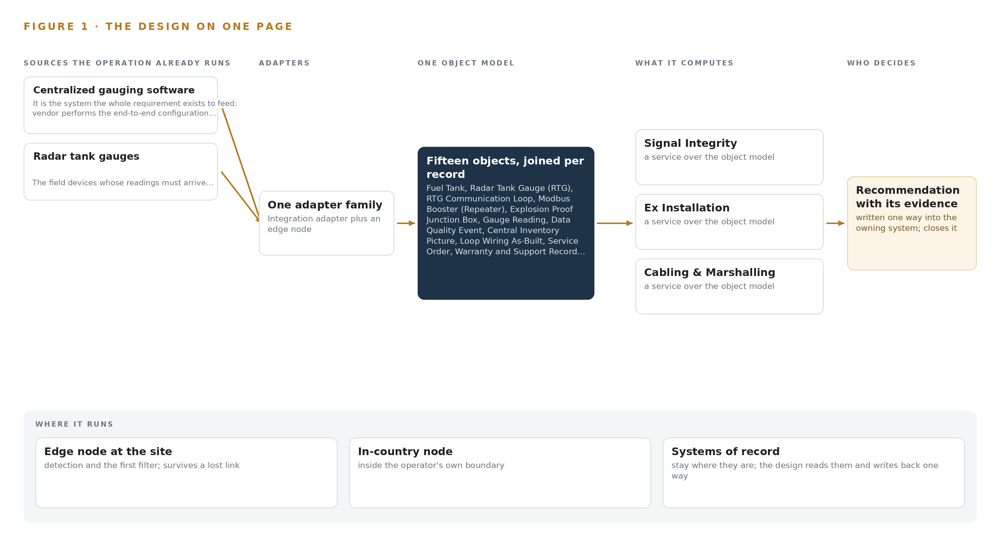
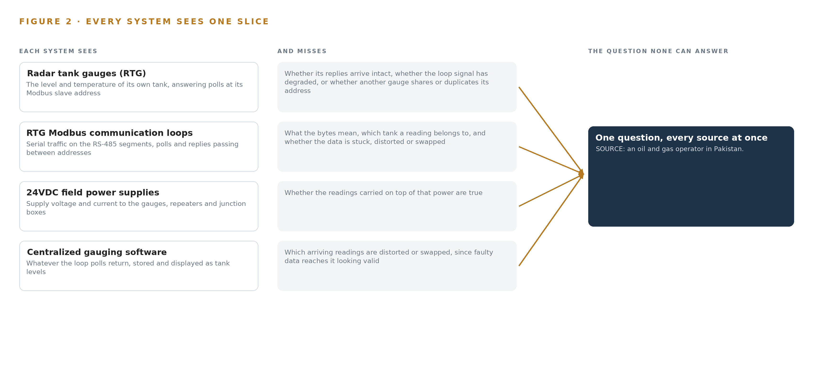
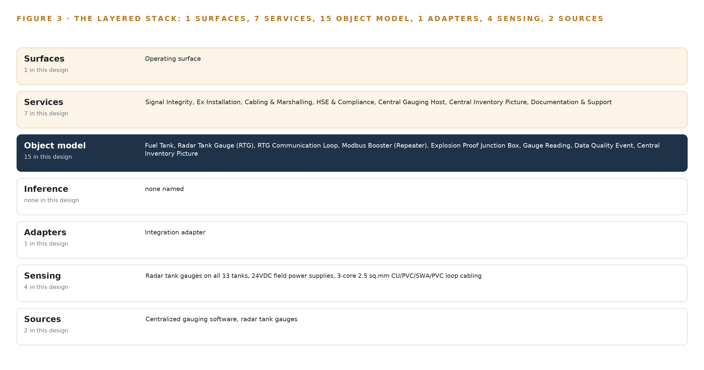
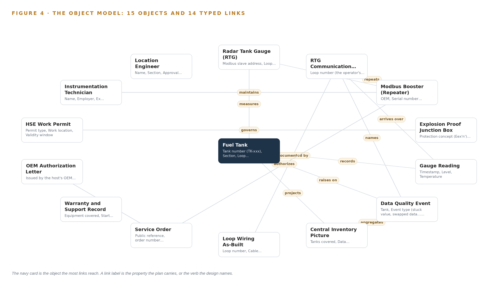
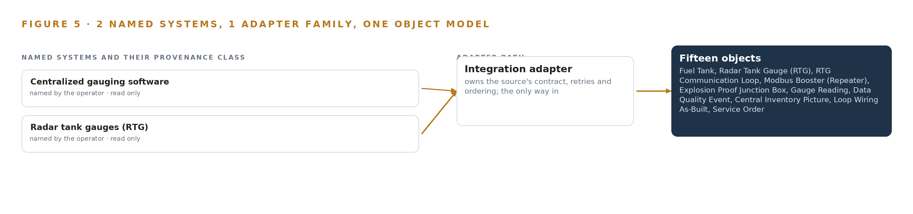
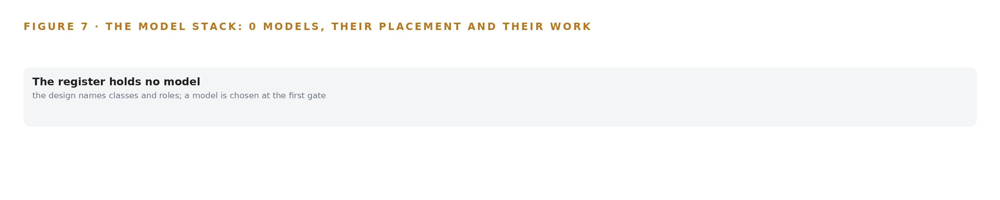
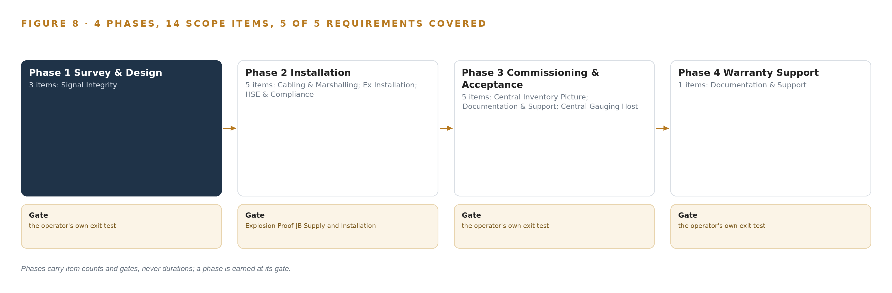
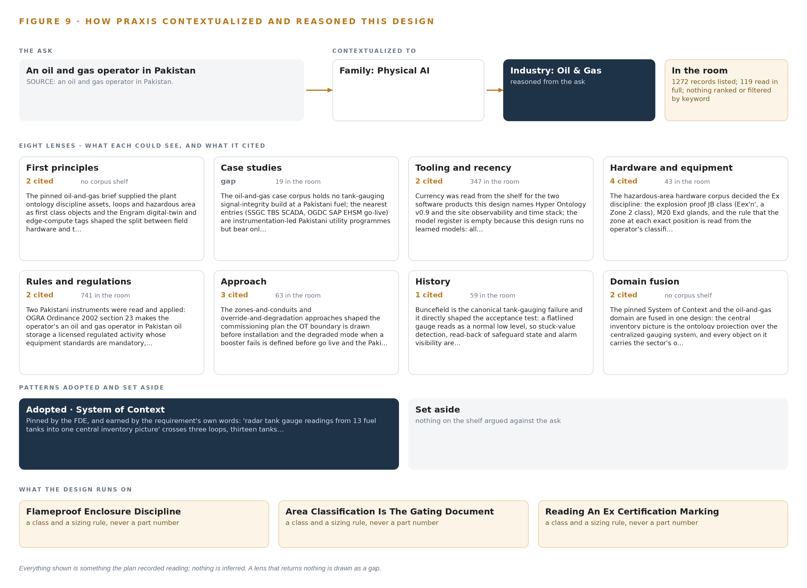

# Loop Integrity Watch: Ending Distorted Radar Level Readings and Tank-to-Tank Swapping Across the Tank Farm

Canonical: https://codeatoms.ai/tank-gauge-integrity-pakistan/
DOI: https://doi.org/10.5281/zenodo.23157967
PDF: https://codeatoms.ai/tank-gauge-integrity-pakistan/paper/loop-integrity-watch-radar-tank-gauge-integrity-fuel-terminal-pakistan.pdf
License: CC BY 4.0
Publisher: CodeNinja Atoms (https://codeatoms.ai), a fully owned subsidiary of CodeNinja

VERTICAL-DRIVEN ARCHITECTURES · OIL & GAS · DESIGNED WITH PRAXIS · OCTOBER 2026

# Loop Integrity Watch: Ending Distorted Radar Level Readings and Tank-to-Tank Swapping Across the Tank Farm

A system design that restores continuous, undistorted radar level readings from thirteen fuel tanks in Pakistan: three booster installations engineered from a signal survey on three Modbus loops, plus a governed inventory ontology over the centralized gauging host that detects distortion and swapping before the central picture misleads anyone.

CodeNinja Engineering Team

For the instrumentation and control lead accountable for tank gauging, the location engineer and HSE supervisor beside them, and the instrumentation, integration and platform engineers who would build and run it.

---

Vertical-Driven Architectures is a CodeNinja series of system designs. Every design in the series is driven by a real-world problem and scenario in a single industry, and every one is designed on Praxis, CodeNinja's platform for designing physical AI systems. Operations are described by class, never by name.

At a glance

## Radar tank gauge integrity for a fuel terminal in Pakistan

**What this is.** An open reference architecture for system design in physical AI: field hardware that rebuilds the signal path on three Modbus loops, and a governed inventory ontology that catches a flatlined or swapped radar gauge reading before the central inventory picture misleads anyone. It is written for the instrumentation and control lead, the location engineer and HSE supervisor, and the engineers who would build it. The operator is described by class, never by name.

**The answer in numbers.**

| Part | The design |
| --- | --- |
| Field scope | 13 fuel tanks on 3 Modbus RTU loops; 3 booster installations engineered from a measured signal survey inside explosion proof junction boxes |
| Sources joined | 2 named source systems, the centralized gauging host and the radar tank gauges, through 1 integration adapter family |
| Object model | 15 typed objects, with the fuel tank as the focal object, published as JSON for reuse |
| Models | None: every integrity check (stuck value, swap, distortion) is deterministic |
| Compute | Two containers on the operator's own site application server, inside its OT boundary |
| Three-year cost | No compute to price; the field equipment is priced by OEM quotation against the survey (Appendix A) |
| Human control | Every data quality event is acknowledged and resolved by a named person; the location engineer signs acceptance |

**Reuse it.** The object model, the model register and the figures are free to reuse under CC BY 4.0. Cite as DOI <https://doi.org/10.5281/zenodo.23157967.>

**Made with.** Reasoned on [Praxis](<https://codeatoms.ai/praxis/>), CodeNinja's platform for designing physical AI systems. The object model imports into [Hyper Ontology](<https://codeatoms.ai/hyper-ontology/>), which turns it into a living system. Both are in beta; access by request.

ABSTRACT

## Distorted Radar Level Readings Should Fail Loudly, Not Silently

The question the operation needs answered every hour is whether the radar tank gauge readings arriving in the central gauging host are continuous, undistorted and attributed to the right tank. Today it cannot be answered: the gauges sit on serial Modbus loops whose signal health is invisible, a flatlined gauge reads as a plausible low level, and a swapped gauge makes two tanks trade identities, so distortion and swapping surface only when the central inventory picture disagrees with physical stock, long after the field signal failed.

The design pairs field hardware with a governed ontology. Two named source systems, the centralized gauging host and the radar tank gauges, enter through one integration adapter family into an object model of fifteen objects, served by seven services and one operating surface, with zero learned models because every integrity check is deterministic. Three booster installations, engineered from a measured signal survey inside explosion proof junction boxes, rebuild the signal path on three loops; the ontology service and integrity monitor run as two containers on the operator's own site application server, inside the operator's own OT boundary, projecting a central inventory picture over the gauging host without replacing it.

The paper proceeds from the problem and the join failure across existing systems, through the constraints the requirement itself imposes, the stack, the fifteen-object model, ingestion through the adapter, inference placement on the operator's server, an honestly empty model register, the rollout phases with their gates, and ownership of what is built, closing with the chapter on how the design was reasoned on Praxis.

---



Figure 1. Loop Integrity Watch on one page: the sources the operation already runs, one object model, what it computes, and the person who decides.

## Contents

Each chapter is tagged for the reader it serves most directly: Executive, Team Lead, FDE, Reference.

|  |  |  |
| --- | --- | --- |
|  | Abstract · Distorted Radar Level Readings Should Fail Loudly, Not Silently | Executive |
| PART I · THE PROBLEM | | |
| 1 | [Distorted Radar Level Readings Undermine the Inventory Picture](#ch1) | Executive |
| 2 | [Every Gauge and Host Sees One Slice](#ch2) | ExecutiveTeam Lead |
| PART II · THE DESIGN | | |
| 3 | [Four Contractual and Physical Constraints Shape the Design](#ch3) | Team Lead |
| 4 | [One Stack Runs From Field Cable to Central Picture](#ch4) | Team LeadFDE |
| 5 | [Fifteen Objects Turn Gauge Signals Into One Argument](#ch5) | FDE |
| 6 | [Every Reading Enters Through One Integration Adapter](#ch6) | FDE |
| 7 | [Integrity Checking Belongs on the Operator's Server](#ch7) | FDE |
| 8 | [An Empty Model Register Is the Honest Answer](#ch8) | FDEExecutive |
| PART III · THE ROLLOUT | | |
| 9 | [Signal Survey Before Supply, Verification Before Acceptance](#ch9) | Team LeadExecutive |
| 10 | [The Inventory Intelligence Should Stay with the Operator](#ch10) | Executive |
| PART IV · HOW IT WAS DESIGNED | | |
|  | Conclusion · The Same Shape Runs on Any Tank Farm | Executive |
| 11 | [How Praxis Contextualized and Reasoned This Design](#ch11) | Team LeadFDE |
|  | [Sources](#sources) | Reference |

PART I · CHAPTER 1

## Distorted Radar Level Readings Undermine the Inventory Picture

The operation needs to know, tank by tank and hour by hour, whether its thirteen radar gauges are reporting true levels, and today nothing in the signal path can tell it.

The abstract states the question this paper answers and the shape of the design that answers it. This chapter grounds that question in the operation itself: what the tank farm runs, what data a trustworthy answer requires, what the failure costs when it goes wrong, and the regulatory ground the whole job stands on.

### 1.1  The Question the Operation Needs Answered

An oil and gas operator in Pakistan needs to know, tank by tank and hour by hour, whether each of its thirteen radar tank gauges is reporting the true level of the product beneath it. The question sounds simple; answering it requires data that no single component in the path holds today. It requires every reading stamped with the time it was taken, the identity of the gauge and of the serial loop that carried it, a quality flag saying whether the value arrived undistorted, and the electrical condition of the loop itself. The gauges are radar tank gauges, or RTGs, which measure level and temperature by radar and answer polls sent to a Modbus slave address over Modbus RTU, a serial master-slave protocol carried on twisted-pair RS-485 cabling. Thirteen tanks sit on three such communication loops, all feeding one centralized gauging host. The readings arrive when they arrive, and nothing in the path can say whether a flat line on a display is a tank at rest or a dead signal. The regulatory ground raises the stakes. Under the Oil and Gas Regulatory Authority Ordinance 2002, oil storage at this scale is a licensed and regulated activity, and the equipment standards attached to that license are mandatory. The Sindh Occupational Safety and Health Act 2017 carries the workplace, hazard-register and permit duties that govern any work performed on live plant. The procurement itself runs under the national public procurement regime and was published through the public procurement authority's electronic system. The hardware lives in a classified hazardous area, where the zone at each installation position dictates the enclosure class.

### 1.2  The Documented Cost of the Problem

The industry's investigation record prices this class of failure. An explosion and fire at a Texas City refinery in 2005 killed fifteen workers and injured one hundred eighty, and the investigation board's report examined the operator's safety culture and the regulatory regime surrounding the site (CSB 2005); the regulator later issued a record fine for failing to correct the hazards behind that event (NBC News 2009). A tank explosion at a refinery in Wales in 2011 killed four people and seriously injured a fifth (HSE 2011). Explosion, fire or burns is reported as the leading cause of worker fatalities in the oil and gas industry in North America, ahead of every other cause (HSE Review 2025). A distorted gauge reading is a small defect with a large tail: an inventory picture built on stuck or swapped signals misdirects receipts, issues and reconciliation, and it removes the earliest warning a tank farm has.

### 1.3  The Operation as a Scenario

The operation runs a fuel storage installation with thirteen storage tanks, each fitted with an RTG, wired in three Modbus RTU communication loops into one centralized gauging host. Two named systems therefore anchor the scenario: the gauges in the field and the host in the server room. The people in the loop are a location engineer who holds approval and acceptance authority, instrumentation technicians who carry the competence to work on explosion-protected equipment, a location incharge who approves outage windows, and the issuer of hot and cold work permits. The physical environments are three: the classified hazardous area around the tanks where every junction box, repeater and gland must carry a certificate valid for its zone, the cabling routes between field and control building, and the safe-area server room hosting the centralization host and the design's own software. The counts that size the job are two named systems, three loops, thirteen tanks, three booster installations, one service order raised under a public reference, and one centralized host that must never go blind. The work is bounded by a ninety-day completion window and followed by a year of warranty and support.

PART I · CHAPTER 2

## Every Gauge and Host Sees One Slice

The radar gauges see their own level, the serial loops carry it blind, and the centralized gauging host displays whatever arrives, so no component can see the distortion or the swap that joins them.

Chapter 1 framed the question and the ground it stands on. This chapter shows why nothing installed today can answer that question, system by system, and what the gap costs in practice.

### 2.1  What Each System Sees and What It Misses

Each RTG sees its own tank well. It measures level and temperature by radar and answers any poll addressed to its Modbus slave address. What it cannot see is everything downstream of itself: it does not know whether its replies arrive, whether the electrical signal carrying them has degraded along the loop, or whether another gauge on the same loop has been wired or addressed so that two devices answer as one. The gauge is honest about its tank and blind about its own report. The three Modbus RTU loops carry the readings blind. RS-485 transports bytes between addresses; it has no notion of what the bytes mean. If an address mapping is wrong, the loop faithfully delivers one tank's level to another tank's slot in the host, and every component downstream accepts it. The loop sees traffic and misses meaning, which is exactly the failure mode the operator has named: readings swapping between tanks. The 24VDC field power supplies see voltage and current, not data. They can report that a repeater is energized while the data behind that repeater is distorted or duplicated, so healthy power and healthy readings are two different facts that no component joins. The centralized gauging software sees whatever the polls return, and it stores and displays it as tank levels. It can notice silence, a gauge that stops responding altogether, but a stuck value and a swapped pair both arrive looking like valid data. The host has no independent knowledge of what the true level should be, so it cannot flag the distortion that joins it to the field. Figure 2 sets these views side by side.



Figure 2. Four systems, each seeing one part of the answer. the question needs all of them in one place at once.

### 2.2  What None of Them See Together

What none of the components see together is continuity of identity: the unbroken chain from physical tank, to gauge, to loop segment, to booster, to the number on the display, with the signal quality of every hop attached. No component can assert that the level shown for a tank at a given hour came from that tank's gauge, over a healthy loop, undistorted. The cost in practice is that the operator discovers the fault from the outside: stock discrepancies surface late, reconciliation falls back on walking the farm and cross-checking receipts, and a swap that persists undetected corrupts every decision that read the picture in the meantime. The measurement this design commits to, RTG data availability on the central host, exists precisely because today no number answers it.

PART II · CHAPTER 3

## Four Contractual and Physical Constraints Shape the Design

A ninety-day service order window, an explosion proof hardware discipline, OEM-authorized equipment and a system of record that must never be replaced bound every choice downstream.

Chapter 2 showed the blind spot that joins the gauges, the loops and the host. This chapter fixes the constraints that shape the design: four of them, two contractual and two physical, each hard in this industry in its own way, and each one a decision that every later chapter inherits.

### 3.1  A Ninety-Day Completion Window

The service order sets a ninety-day completion deadline, with liquidated damages accruing daily against the order's value up to a capped share. The window is hard in this industry because the critical hardware is OEM-specific and its lead time sits outside the installing contractor's control; because work inside a classified area requires permits whose availability is not guaranteed; and because commissioning must never leave the operator's stock accounting blind across the whole farm. The design answers the window by ordering equipment in the first phase against survey-confirmed quantities and sequencing the field work loop by loop, so the exposure at any moment is one loop, not three.

### 3.2  Explosion Proof Hardware Discipline

The boosters, junction boxes, glands and power supplies live inside a classified hazardous area, and the discipline there is unforgiving: area classification is the gating document. The enclosure class named in the requirement, Ex n, a restricted-breathing class associated with Zone 2, is only correct if the zone at each exact installation position says so; a Zone 1 position forces a heavier and more expensive class. The design therefore reads the zone, gas group and temperature class at each position from the operator's current classification drawing before any hardware is specified, and it specifies equipment by certificate marking rather than by part number. Every component entering the classified area carries a certificate valid for the zone it lands in.

### 3.3  OEM-Authorized Equipment and Configuration

The repeaters must be OEM equipment from the host's manufacturer supplied under a written authorization letter, and the end-to-end configuration of the centralized host is performed under the same authorization. This matters because authorization determines warranty validity and because the gauges themselves are off limits: the design improves the signal path to the gauges and never modifies the devices. One complication sits inside this constraint: the compliance sheet referenced in the requirement documents was not attached, so the repeater and power supply specifications are fixed through pre-bid clarification and carried as OEM-only, which removes substitution risk at the cost of narrowing the supply base to a single authorized manufacturer.

### 3.4  The System of Record Must Never Be Replaced

The centralized gauging software is the historian of record for gauge readings, and the design binds it in place: the central inventory picture is an ontology projection over the host, never a parallel tank inventory database. The constraint is hard in this industry because tank inventory data is custody data, and a second store of readings creates a reconciliation burden and a second place for truth that drifts from the first. The integrity monitor buffers recent readings inside the ontology service only, long enough to detect stuck values and swaps, and writes nothing that competes with the host.

### 3.5  Scoping Decisions

Three scoping decisions carry most of the design's weight, and each buys something real at a price worth stating. Table 1 sets them out.

Table 1 · Scoping Decisions

| Decision | What it buys | What it costs |
| --- | --- | --- |
| Ontology projection over the centralized gauging software | One central inventory picture with no second store of truth | No independent historian; the monitor buffers recent readings only inside the ontology service |
| Two software containers on one operator application server | The whole intelligence inside the operator's own boundary on hardware it already owns | No redundancy beyond what the operator's platform standard provides |
| Loop-by-loop commissioning | One loop affected at a time, so stock accounting is never blind across the farm | More permit cycles and a longer commissioning sequence inside the same window |

### 3.6  What the Design Chose Against

Every rejection below was made for a reason the operator can audit, and the list ends with the scope the design refuses to invent. Table 2 records them.

Table 2 · What the Design Chose Against

| Where | What was picked | Instead of, and why |
| --- | --- | --- |
| Booster topology | One booster serving the first two loops where the signal survey proves it viable | Two boosters, one per loop, which would put more certified equipment inside the classified area and raise the lifetime inspection and maintenance burden |
| Inventory truth | An ontology projection over the gauging host | A parallel tank inventory database, which would create a reconciliation burden and a second place for truth |
| Signal integrity logic | Deterministic stuck-value and swap detection with read-back and alarm visibility | Learned models, which cannot be audited against the data integrity acceptance clauses and would fill a model register this design keeps empty by design |
| Data path | The gauging host as the sole collector polling the three loops | A new event streaming backbone, which at thirteen tanks would only add a second collector to maintain |
| Whole design | Out of scope: camera analytics, gauge modification, agentic surfaces, historic data migration, infrastructure and license fees | Capability the requirement never asked for, which would put unpriced equipment and unowned risk into a bounded job |

PART II · CHAPTER 4

## One Stack Runs From Field Cable to Central Picture

The architectural pattern places the systems of record below, one object model in the middle, and the services and operating surface above, so the gauging host stays the single place where readings are true.

Chapter 3 fixed four constraints: the gauging host stays in place as the system of record, nothing leaves the operator's boundary, every acceptance is signed by a named person, and the model register stays empty because the physics is deterministic. This chapter shows the stack those constraints produce, layer by layer, from the field cable to the central picture.

### 4.1  The Architectural Pattern and Why It Fits

The pattern is three layers in a fixed order. Below sit the systems of record: the radar tank gauges as field devices and the centralized gauging system as the historian of record for every reading. These are never replaced, never modified and never loaded; the adapter tier reads them and writes nothing back. In the middle sits one object model, fifteen objects with typed links, projected over the host so that tanks, gauges, loops, boosters, quality events and people become one connected argument. Above sit the services and the operating surface: seven named services that do the work the requirement describes, and one surface, the central inventory picture, where the operator's people see availability, open quality events and last sync. The pattern fits because the requirement's own failure is a join failure. A distorted or swapped level at one tank is invisible in any single system: the gauges see only their own signal, the host sees only what arrives, and the wiring, the boosters and the permits live in documents and records no gauge can read. The object model is a projection over the systems of record, never a shadow copy of them, so crossing mappings answer the questions no single system can. Figure 3 shows the layering with its counts: two sources, one adapter family, fifteen objects, seven services, one surface, and zero learned models. The empty model register is a decision, not an omission. Stuck values and swapped addresses are caught by deterministic checks on freshness, flatline and address binding, so no inference tier exists and no learned component is served anywhere in the design. The kinetic loop still closes: the stack senses, decides, acts and learns, because every quality event raised becomes a record the next survey and the next loop maintenance read. The services and the surface sit above the model, and the operator's people act inside the tools they already use, so no agent tier and no second work surface are built.



Figure 3. The layered stack: 2 sources, 1 adapter family, 15 objects, 7 services and 1 surfaces.

### 4.2  The Stack Stage by Stage

Table 3 walks the stack from bottom to top, naming the components at each stage. The stages that a larger design would fill with event streaming, a parallel historian, video ingest or model serving are deliberately thin here: the host is the sole collector for thirteen tanks on three loops, and adding parallel infrastructure would create a second place where readings could disagree.

Table 3 · The Stack, Stage by Stage

| Stage | What it is responsible for | How |
| --- | --- | --- |
| Sources | Holding the readings the operator already owns | radar tank gauges on all thirteen tanks, polled on three Modbus RTU communication loops, with the centralized gauging system as the historian of record |
| Sensing | Watching the physical signal path without adding new instruments | The RTG gauges themselves, the 24VDC field power supplies, the three-core screened loop cabling and the Modbus RTU polling pattern, read as a signal-quality feed rather than a vision feed |
| Adapters | Bringing both source systems into the object model through one governed path | A single integration adapter family performing read-only polling, point mapping and provenance tagging; no direct writes in either direction |
| Object model | Turning tanks, gauges, loops, boosters and events into one typed graph | Fifteen objects with typed links, projected over the gauging host so the host remains the single place where readings are true |
| Inference | Detecting distortion and swapping before the operator feels it | Deterministic integrity checks only: stuck-value detection, swap detection and freshness checks; the model register is empty by design |
| Services | Doing the work the requirement names | Seven services: Signal Integrity, Ex Installation, Cabling and Marshalling, HSE and Compliance, Central Gauging Host, Central Inventory Picture, Documentation and Support |
| Surfaces | Giving the operator's people one place to see and decide | One operating surface, the central inventory picture, projecting data availability, open quality events and last sync over the gauging host |

PART II · CHAPTER 5

## Fifteen Objects Turn Gauge Signals Into One Argument

Tanks, gauges, loops, boosters, junction boxes, readings, quality events, permits and people become one typed graph in which any query can reach from a suspect level back to the loop, the booster and the technician who last touched it.

Chapter 4 placed one object model at the center of the stack. This chapter opens that model: every object by name, the typed links between them, where the human loop lives, and one object in its recorded form.

### 5.1  Every Object and Its Typed Links

Figure 4 shows the fifteen objects and their typed links. The assets are the fuel tank, the radar tank gauge, the communication loop, the Modbus booster and the explosion proof junction box; each carries the properties its own domain demands, from Modbus slave address on the gauge to protection concept and certificate reference on the junction box. The measure and the event are the gauge reading and the data quality event, the latter carrying the status vocabulary of open, acknowledged and resolved. The projection is the central inventory picture, which aggregates coverage and quality across all thirteen tanks. The records and documents are the loop wiring as-built, the service order, the warranty and support record, the authorization letter and the HSE work permit. The people are the instrumentation technician and the location engineer who holds acceptance authority. The typed links are what make the model an argument. A gauge measures a tank; a reading arrives over a loop; a booster repeats that loop; a quality event names the loop it degraded; a permit governs the junction box a technician will open. From a distorted level at one tank, a single query reaches the loop, the booster that serves it, the as-built that documents it, the technician assigned to it and the permit that covers the work. A document store cannot make these joins, because its documents live on different sides of the boundary: the loop exists only in wiring records, the booster only in procurement records, the permit only in the HSE system, and no document holds the crossing mappings between them.



Figure 4. The fifteen objects of the model and the typed links that let a query reach across them.

### 5.2  Where the Human Loop Lives and Where the Model Runs

The human loop lives in two objects and one status vocabulary. The technician object carries Ex competence and the assigned loop, so work is always attributed to a named person; the location engineer object carries approval authority and acceptance sign-off, so no phase closes without a signature. The data quality event is the hinge: every event moves from open to acknowledged to resolved, and each transition names the person who made it. The hosting posture keeps everything inside the operator's boundary. The ontology service and the integrity monitor run as two containers on one operator application server in the safe-area server room, on the operator's own hardware in Pakistan. Identity and access are provisioned through the operator's existing directory and site security regime, not a parallel account store. There are no external links: nothing crosses the OT boundary, and no data leaves the country. The only write path is narrow and explicit: the integrity monitor writes events and status changes into the object model, and the gauging host configuration changes under the authorization letter and the operator's change control. Readings themselves are never written by the design; the host is read-only to it.

### 5.3  One Object in Its Recorded Form

The booster object below is the heart of the requirement, because it is the piece of equipment the whole service order exists to install, and its recorded form shows how an asset, its loops, its supply and its commissioning date bind into one node of the graph.

```
{
  "id": "tank",
  "label": "Fuel Tank",
  "kind": "asset",
  "anchored_in": "centralized gauging software",
  "properties": [
    "Tank number (TK-xxx)",
    "Section (gasoline or kerosene)",
    "Loop assignment",
    "Product stored",
    "Capacity",
    "Current level",
    "Current temperature"
  ],
  "status_vocabulary": [
    "Reading",
    "Distorted",
    "Swapped",
    "Offline"
  ],
  "links": []
}
```

PART II · CHAPTER 6

## Every Reading Enters Through One Integration Adapter

Both named source systems enter through a single integration adapter family that guarantees point mapping, provenance and ordering, with no parallel historian and no second place for truth.

Chapter 5 gave the object model its fifteen objects and typed links. This chapter describes how data reaches them: every reading from both named source systems enters through one integration adapter family, with no parallel historian and no second place where readings could disagree.

### 6.1  The Named Sources and Their Provenance

Figure 5 shows the integration map. There are exactly two named source systems, and both are operator-held systems of record read in the read direction only. The first is the centralized gauging system, the host the whole requirement exists to feed and the historian of record for every gauge reading; it is also the system on which the end-to-end configuration is performed under the authorization letter. The second is the radar tank gauge fleet on all thirteen tanks, the field devices whose signal path the boosters improve without the gauges themselves being touched. Both enter through the single integration adapter family; neither is ever written to by the design, and no third source, feed or file enters the object model by another path. The adapter tags provenance at the moment of capture. Every reading carries its source loop, its Modbus slave address and its host timestamp into the object model, so any object in the graph can be traced back to the system and the loop that produced it. Provenance is what makes the swap detection possible: a reading is only swapped if its declared tank and its declared loop disagree, and both facts survive into the graph because the adapter records them together.



Figure 5. The 2 named systems, the adapter path each one takes, and the object model they all map into.

### 6.2  What the Adapter Tier Guarantees

The adapter tier guarantees four things. First, point mapping: each gauge's slave address is bound to exactly one tank object, so a repeated or moved address surfaces as a data quality event instead of propagating silently into the central picture. Second, direction: the integration is read-only against both sources; the only configuration write in the design is the host's point mapping itself, performed under the authorization letter and the operator's change control. Third, fidelity: quality flags pass through unsmoothed, so a distorted reading arrives in the graph as distorted rather than being averaged into plausibility. Fourth, ordering: every event is sequenced on timestamps from clocks synchronized by chrony across the host and the application server, so a stuck value and a swap are distinguishable in time.

### 6.3  The Event Backbone, and Why There Is Not One

There is deliberately no event backbone in this design. The centralized gauging system is the sole collector polling the three Modbus RTU loops through the boosters; for thirteen tanks on three loops, a parallel streaming layer would create a second place for truth without buying any capability the acceptance criteria need. Ordering comes from the synchronized host clock; delivery comes from the polling cycle itself, with the adapter consuming the host's polled reads and raising quality events into the ontology as they are detected. Buffering is bounded and local: the integrity monitor holds recent readings inside the ontology service, so a short host outage or a loop taken down for commissioning does not blank the central picture, and nothing else is stored outside the host. Replication is absent for the same reason the historian is absent: the host already is the record, and the observability stack, Prometheus with Grafana views, carries system status and never carries readings, so no duplicate of a tank level exists anywhere in the design.

PART II · CHAPTER 7

## Integrity Checking Belongs on the Operator's Server

All reasoning in this design is deterministic and runs as two containers on the operator's own site application server inside the OT boundary, so nothing about tank truth depends on a link leaving the site.

Chapter 6 followed every reading from a radar gauge through its booster and into the centralized gauging system, and left one question open: what watches those readings for distortion and swapping, and where does that watching run. This chapter answers the where. The design carries no learned inference anywhere in the field, so the placement question collapses to a single, deliberate choice: two small containers on one application server the operator already owns, inside the same operational technology boundary that the gauges poll into.

### 7.1  One Tier, Two Containers, No Weights

The design has exactly one inference tier, and Figure 6 shows it: the operator's own site application server in the safe-area server room, inside the operational technology boundary. Two containers run there. The first is the ontology service, built on the object model, which holds the fifteen-object inventory model and projects the central inventory picture over the gauging host. The second is the integrity monitor, which applies the deterministic checks that turn raw gauge readings into tank status: stuck-value detection against a flatlined reading, swap detection against a level that appears on the wrong tank, distortion detection against readings outside the shape a filling or emptying tank can produce, and availability accounting per tank and per loop.

This is the whole of the placement story, and it is worth being precise about why it is this small. The failure modes the operator is buying against are physical and deterministic: a degrading RS-485 segment distorts a Modbus signal in ways a threshold catches, and a wiring fault swaps two slave addresses in ways a consistency rule catches. No learned model is needed to catch them, so none is served. The memory arithmetic that a model-bearing design carries, weights against usable memory against the KV cache ceiling, has nothing to compute here: there are no weights, no accelerator, and no context window to budget, and the only resident footprint on the server is the two containers themselves. The platform's tooling lens recorded every heavier tier, from edge model serving to on-site language model serving to a frontier GPU cluster, as explicitly not needed, because staff act on outputs inside the tools they already use and no agentic work surface was asked for.

The choice of the operator's own hardware is also a sovereignty choice. The Pakistani Cloud First posture recorded in the design's reasoning confirms on-premises compute on the operator's own equipment, and the two containers are bought by class against the operator's own IT platform standard for orchestration rather than as named appliances.


Figure 6. Where each tier runs, what runs there, and the narrow set of outputs that cross the boundary.

### 7.2  The Latency Budget

With one tier, the latency budget is a chain of four hops, and each hop is sized by the signal survey rather than by assumption. The first hop is the gauge itself: a radar tank gauge updates its holding register on its own measurement cycle, independent of the network. The second hop is the RS-485 segment from gauge to booster, whose propagation behavior at the measured signal levels is exactly what the Phase 1 survey records and what the booster installation improves. The third hop is the Modbus RTU polling cycle: the centralized gauging system is the sole collector polling the three loops through the boosters, so the poll interval is the pace at which truth reaches the central picture. The fourth hop is the integrity monitor, which runs its checks inside the ontology service on each fresh reading the host exposes, so a stuck value, a swap or a distortion is caught on the poll cycle that carries it, not on a batch cycle afterward.

The budget therefore carries no invented millisecond figure: it is expressed as a rule, that detection latency equals one polling cycle plus container processing, and as a gate, that the signal survey's recorded levels must clear the margins the booster design assumes before any hardware is ordered.

### 7.3  What Crosses the Boundary, and What Fails

The honest inventory of boundary crossings is short: nothing crosses outward. No reading, event, status or decision record leaves the operator's operational technology boundary, because no external service, cloud tier or vendor endpoint exists in the design. The only ingress is the Modbus polling traffic the gauging host already generates, now extended through the boosters, and the existing LAN path from the host to the application server. The governing approach in the design's reasoning draws the operational technology boundary before installation, and Figure 6 marks it explicitly.

Failure behavior is defined per failure class, before go live, following the override-and-degradation approach. If the link fails, meaning a loop stops answering, the affected gauges read no response, the tanks flip to offline status, and the integrity monitor raises a data quality event on the loop rather than letting a stale level masquerade as a live one. If the power fails, meaning a 24VDC field supply or a booster drops, the loop degrades to failed status and the same event path fires, so the central picture shows the gap instead of hiding it. If the update path fails, there is little to fail: no models means no weight updates, and the only versioned artifacts are the OEM configuration packages and the as-built documentation, which carry written rollback rights confirmed with the operator's IT and instrumentation lead at mobilization. In every case the degraded mode is the same principle: a tank the system cannot see is shown as a tank the system cannot see, never as a tank holding a plausible number.

PART II · CHAPTER 8

## An Empty Model Register Is the Honest Answer

Stuck values, distorted readings and tank-to-tank swapping are caught by explicit thresholds and rules, so the model register holds zero entries and no license question arises.

Chapter 7 placed all of the design's reasoning in two deterministic containers on the operator's own server and left the model question hanging. This chapter closes it. The failure modes this operator is buying against, stuck values, distorted readings and tank-to-tank signal swapping, are caught by explicit thresholds and consistency rules over polled Modbus data, so the model register holds zero entries, no weights are licensed or held, and no license question arises at all. Figure 7 shows the model stack as it honestly is: a register with no rows.



Figure 7. The zero models, their placement, and the work each one does.

### 8.1  Why Zero Models Is a Design Decision, Not an Omission

An empty model register is usually a red flag in a design of this shape, so it is worth stating why it is correct here. Each check the integrity monitor runs is fully specified by physics and protocol. Stuck-value detection compares successive readings of one gauge against the movement a tank can produce; a radar gauge that returns the same level across consecutive polls while the tank is being worked is stuck, and the Buncefield lesson recorded in the design's reasoning is precisely that a flatlined gauge reads as a normal low level, so the check is explicit scope rather than an extra. Swap detection compares the loop and slave address a reading claims with the tank it lands on in the ontology, catching the crossed-signal fault the boosters exist to fix. Distortion detection checks each reading against the quality shape of its loop. Availability accounting aggregates the quality flags into the one measure the rollout tracks: gauge data availability on the central picture, with a fault recorded when readings swap between tanks on the operator's infrastructure.

Each of these is a rule with named inputs, named thresholds set from the signal survey, and a named person who acknowledges the resulting data quality event. None of them generalizes better with a learned component, and none would survive the operator's acceptance clauses, which are data integrity clauses, not accuracy benchmarks. The platform's tooling lens confirmed the same conclusion from the other direction: with no learned components there are no labels, no retraining loop, no model artifacts and no registry, and the versioned deliverables that would have lived in a registry live instead in the documentation pack as OEM configuration packages and as-builts.

The license chapter of a design normally answers one question: what permits the operator to hold the weights it runs. Here the answer is structural. There are no weights, so there is no license trigger, no usage clause and no terms to honor. The only licensing instruments in the design are commercial, not model licenses: the OEM authorization letter that names the service provider and scopes the OEM work, and the twelve-month warranty and support record on the supplied equipment.

### 8.2  The Model and Equipment Register

What the design lacks in models it carries in hardware discipline, and Table 4 records both: the empty model register on the first row, then the hardware classes and sizing rules, the sensing on which every check depends, the pattern the design stands on, and the ground it runs on.

Table 4 · Model and Equipment Register

| The choice | What was picked | Why here |
| --- | --- | --- |
| Model register | Zero entries; all integrity logic is deterministic thresholds and rules | The failure modes are physical and protocol-level, so no learned model is needed, no weights are held and no license question arises |
| Hardware class | Flameproof enclosure discipline | The junction boxes sit in the classified area, so the enclosure class is chosen against the zone at each exact position, not by part number |
| Hardware class | Area classification as the gating document | The zone, gas group and temperature class are read from the operator's current classification drawing before any hardware is specified, and the position list is countersigned |
| Hardware class | Reading an Ex certification marking | The Eex'n' marking is a Zone 2 restricted-breathing class, so a Zone 1 position would force a different, heavier enclosure and must be caught before ordering |
| Hardware class | Equipment protection levels drive the purchase | Protection levels, not catalog convenience, decide the explosion proof junction boxes, 24VDC power supplies, breakers and M20 Exd glands |
| Sensing | radar tank gauges on all 13 tanks | These are the field devices whose readings must arrive continuous, undistorted and unswapped; the design improves their signal path without modifying them |
| Sensing | 24VDC field power supplies | They power the boosters and the loop electronics, and their health is a named failure mode with its own degraded status |
| Sensing | 3-core 2.5 sq.mm CU/PVC/SWA/PVC loop cabling | The loop cabling is the medium the distortion travels in, so its schedule is recorded in the as-built against each loop |
| Sensing | Modbus RTU loop polling via the boosters | The polling cycle is the pace of truth for every check, and the boosters are what make the three loops readable end to end |
| Pattern | System of Context, primary | The central inventory picture is an ontology projection over the gauging host, never a shadow copy, so there is one place where tank truth lives |
| Ground | The operator's own site application server, on-premises | The two containers run inside the operational technology boundary on the operator's own hardware, consistent with the Pakistani Cloud First posture, so nothing about tank truth depends on a link leaving the site |

PART III · CHAPTER 9

## Signal Survey Before Supply, Verification Before Acceptance

Four phases move from survey and topology decision through installation and commissioning to a year of warranty support, each phase carrying named items and an exit gate before the next begins.

Chapter 8 closed the design's registers: a model register empty by design, because every integrity check in this build is deterministic, and a hardware register of four equipment classes that decide what may enter the classified area. This chapter turns that design into ordered work: four phases, fourteen named items, and a gate at the end of each phase that the next phase cannot pass until it is met.

### 9.1  Four Phases, Fourteen Items and Four Gates

Figure 8 lays the sequence out. Phase 1, Survey and Design, carries three items on the Signal Integrity workstream: the RTG loop signal survey across all thirteen tanks and three loops, the booster topology decision for loops 01 and 02, and procurement of the OEM repeaters against the OEM authorization letter. Its exit gate is the location engineer's approval of the written topology recommendation and the confirmed order quantities; no hardware is ordered before that signature.

Phase 2, Installation, carries five items across three workstreams: the HSE work permits for each affected loop, explosion proof junction box supply and installation, the 24VDC power supply and breaker installation, cable laying, termination and conduiting, and marshalling with loop continuity checks. Its exit gate is acceptance of the explosion proof junction box supply and installation against the countersigned position list.

Phase 3, Commissioning and Acceptance, carries five items across four workstreams: end-to-end configuration of the centralized gauging system, signal integrity verification across all thirteen tanks, the tank inventory ontology build, the central inventory picture, and the documentation pack. Its exit gate is a verification run with zero open data quality events and the operator's acceptance signature. Phase 4, Warranty Support, carries one item, the twelve-month warranty and free support arrangement, and closes at the gate where the warranty and support record is marked complete. Across the four phases, requirement coverage stands at five requirements covered, none partial and none in gap.



Figure 8. The four phases and their gates, and coverage of the 5 requirements across them.

### 9.2  What the Rollout Measures

The rollout measures one number: RTG data availability on the central gauging host, expressed as a percentage against a nominal of 100% and breaching whenever it falls below. The fault condition behind the measure is the one the whole requirement exists to kill: RTG data swapping between tanks on the operator's infrastructure. Beneath the headline number sit the deterministic integrity checks: stuck-value detection, so a flatlined gauge never reads as a calm tank; swap detection, so a level never attaches to the wrong tank; and read-back of loop state, so a degraded booster is visible before it fails outright.

### 9.3  Failure Modes

Six things can go wrong between award and acceptance, and each has a designed answer. Table 5 lists them.

Table 5 · Failure Modes

| What fails | What the design does |
| --- | --- |
| The compliance sheet referenced in the requirement was not published, leaving repeater and power supply specifications undefined at bid time | Fix the OEM models and compliance mapping in a pre-bid clarification, and carry OEM-only equipment as the recorded clarification answer directs |
| Whether RTG loops and 24VDC supplies may be briefly taken out of service under permits during commissioning is unknown | Sequence the work loop by loop so only one loop is affected at a time, and confirm outage windows at the pre-start meeting with the location incharge |
| The hazardous area classification at the junction box positions is unverified; a Zone 1 position would force a heavier enclosure class than the Eex'n' units assume | Read the zone, gas group and temperature class at each exact position from the current classification drawing before ordering, with the position list countersigned |
| A single booster serving loops 01 and 02 may prove not viable, moving the design from two boosters to three and changing cost and cabling | Issue the written topology recommendation in Phase 1 before any hardware is committed, so the change is a decision rather than a rework |
| The service order's 90-day completion window carries liquidated damages of 0.1% per day up to 10% while OEM lead times sit outside the contractor's control | Place the OEM order in Phase 1 against the survey's confirmed quantities, and agree delivery-lead-time relief language in the service order |
| Vendor access to the gauging host is not settled although the end-to-end configuration duty assumes it | Confirm credentials, change control and rollback rights with operator IT and the instrumentation lead at mobilization, before Phase 3 begins |

### 9.4  Lessons From the Shape of the Work

**Survey the signal before ordering anything.** The whole build hinges on one field measurement that decides whether loops 01 and 02 share a booster or carry one each; ordering hardware first would turn a survey finding into a site rework.

**Read the zone at every exact position.** The Eex'n' enclosure class is correct only where the classification drawing says Zone 2; a single uncounted Zone 1 position invalidates the specification, so the position list is countersigned before any purchase order moves.

**A flatlined gauge looks like a calm tank.** Stuck-value detection is explicit acceptance scope, not an extra, because degraded gauging hides the losses this industry reports worst: explosion and fire remain the leading reported cause of oil and gas fatalities (HSE Review 2025). Tank-side incidents such as the Pembroke amine unit explosion show how long degradation can run before anyone sees it (HSE 2011).

**Sequence the outage loop by loop.** Commissioning touches live gauges feeding a central inventory picture; taking one loop at a time keeps the picture degraded rather than dark, and keeps the permit conversation small.

### 9.5  What Is Still Open

Three questions remain open at award, and settling each changes a different part of the plan. The missing compliance sheet is the widest: a pre-bid clarification that fixes the repeater and power supply models closes it and lets procurement move without qualification. Whether loops may be briefly taken out of service under permits changes the commissioning sequence; if outages are refused, the design falls back on single-loop isolation windows agreed at the pre-start meeting. Whether one booster can serve loops 01 and 02 changes the bill of quantities from two certified repeaters to three; the survey answers it before any hardware is committed. A fourth question, vendor access to the gauging host, changes nothing in the design but gates Phase 3 entirely: without credentials, change control and rollback rights agreed at mobilization, the end-to-end configuration duty cannot start.

PART III · CHAPTER 10

## The Inventory Intelligence Should Stay with the Operator

The object model, the as-built documentation, the quality event record and the site boundary all remain the operator's property, so the central inventory picture outlives the service order that built it.

Chapter 9 ended at the last gate, the warranty record marked complete. What matters after that gate is who keeps what, and this chapter states it plainly: everything the design builds stays with the operator.

### 10.1  Ownership of the Model, the Record and the Boundary

The object model is the operator's: fifteen objects, from tank, rtg and loop through reading, dq\_event and picture to service\_order, warranty and the two person records, held as a projection over the centralized gauging system on the operator's own in-country server. No weights or fine-tunes exist to own, because the model register is empty by design; the integrity checks are deterministic logic whose source sits with the operator rather than behind a vendor's service. The decision record is the data quality event object, with its open, acknowledged and resolved vocabulary, joined to the location engineer's acceptance sign-offs; it is the kept record the next decision reads, and it accumulates in the operator's estate for as long as the loops run. The boundary is the operator's too: no reading, no event and no document leaves the site's OT boundary, and the as-built loop documentation, the warranty and support record and the OEM authorization letter all hand over as operator documents, so the central inventory picture outlives the service order that built it.

### 10.2  The Offer Behind the Design

CodeNinja produced this design on Praxis, its platform for designing physical AI systems, and each element of the design maps to one part of that offer: Hyper Ontology is the fifteen-object model projecting over the gauging host; Adaptive Operations is the sensing and detection of physical behavior in the radar gauges and the deterministic checks that catch a distorted or swapped reading; Decision Systems is the quality event record that a named person, the location engineer, ranks, acknowledges and resolves; and Sovereign Infrastructure is the in-country posture, running on the operator's own hardware inside its own OT boundary with no external dependency.

PART IV · CONCLUSION

## The Same Shape Runs on Any Tank Farm

In one view the design is a field repair and a projection at once: a signal survey that decides the booster topology before any hardware is committed, three booster installations in explosion proof enclosures placed by the zone read at each exact position, and a fifteen-object ontology over the centralized gauging host that turns raw radar level readings into a central inventory picture with stuck-value and swap detection, so a failing gauge announces itself instead of quietly reporting a plausible tank.

Running the same shape elsewhere takes four habits rather than new technology: survey the signal before supplying the fix, read the hazardous area classification at each exact position before ordering any enclosure, bind the system of record in place and project meaning over it instead of building a second store, and exhaust deterministic checks before reaching for a learned model. On any tank farm with serial gauging loops, that sequence turns a hardware procurement into an accountable, evidence-carrying system.

PART IV · CHAPTER 11

## How Praxis Contextualized and Reasoned This Design

Every choice in this paper traces back to recorded reading: the ask, the pinned patterns, the eight lenses, the precedent that shaped the acceptance test and the equipment classes that gated the hardware.

Chapter 10 showed that the design's intelligence stays with the operator. This closing chapter shows how the design itself was produced, and lets a reader trace any choice in this paper back to what justified it. Every design in this series is produced on Praxis, and the trace is deliberately open: Figure 9 shows it end to end, from the ask through the family and industry assigned, the records in the room, the eight lenses, the patterns adopted and the equipment classes that gated the hardware.

### 11.1  Contextualizing the Ask

The ask arrived as a published requirement: supply and installation of Modbus boosters for signal improvement of radar tank gauge readings on the centralized gauging software at the operator's storage site, issued with a service order reference, a defined scope across three loops and thirteen tanks, and a completion deadline. Praxis assigned the design to the Physical AI family and the oil and gas industry; the pin was the engineer's own decision rather than a reasoned match, and the brief was still read as a reasoning input. What was in the room: 1,272 records listed, 119 of them read in full and the remaining 1,153 available on demand, among them the requirement documents, the hazardous-area hardware corpus and the Pakistani regulatory instruments.



Figure 9. From the ask to the design: the family and industry Praxis assigned, the eight lenses and what each cited, the patterns adopted and set aside, and the equipment the design lands on.

### 11.2  The Lenses

Table 6 gives all eight lenses, what each could see, how many entries it cited and what it contributed. Case studies is the honest gap: nineteen oil-and-gas cases were in the room, but none describes a tank-gauging signal-integrity build at a Pakistani storage site, so no case study is cited as design input. Every other lens contributed.

Table 6 · The Lenses and What They Contributed

| Lens | Could see | Cited | What it contributed |
| --- | --- | --- | --- |
| First principles | The plant ontology discipline: loops and hazardous areas as first class objects, and the split between field hardware and the site server | 2 | Loops, tanks and boosters became first class objects; the field-versus-server split followed the digital-twin and edge-compute tags |
| Case studies | A Pakistani tank-gauging signal-integrity build to copy | 0 | Gap: no case matched, so no case study is cited as design input |
| Tooling and recency | Current versions for every named software product | 2 | the object model v0.9 and the observability and time stack were read from the shelf; the model register stayed empty because the checks are deterministic |
| Hardware and equipment | Hazardous-area hardware practice for enclosures, glands and power | 4 | The Eex'n' junction box class, M20 Exd glands, and the rule that the zone at each exact position is read before hardware is specified |
| Rules and regulations | The Pakistani instruments governing licensed oil storage and works | 2 | The OGRA Ordinance 2002 makes the storage a licensed regulated activity; the Sindh OSH Act 2017 carries the hazard-register and permit duties |
| Approach | A commissioning shape and a degraded mode | 3 | The OT boundary drawn before installation; the degraded mode when a booster fails defined before go live; on-premises compute confirmed |
| History | Tank-gauging failures to learn from | 1 | The recorded Buncefield lesson: a flatlined gauge reads as a normal low level, so stuck-value detection, read-back and alarm visibility became explicit scope |
| Domain fusion | A fusion of the pinned pattern with the sector's discipline | 2 | The central inventory picture as an ontology projection over the gauging host, every object carrying hazardous-area and data-integrity discipline |

### 11.3  Patterns Adopted and Set Aside

One pattern was adopted, system of context as the primary pattern, and it was earned by the requirement's own words, which ask for radar gauge readings from thirteen fuel tanks to land in one central inventory picture across three loops and the gauging host. The pattern carries four commitments in fixed order: systems of record below, never replaced, never modified, never loaded; the ontology as a projection over them, never a shadow copy; one small grammar turning nouns into objects, facts into properties and relationships into typed links; and a kinetic loop that closes sense, decide, act and learn. No patterns were set aside: no reference architecture beyond the pin was needed, because the hardware and protocol layers are classes rather than architectures. One precedent shaped the build: in the recorded Supermajor case, analysts lost months hand-mapping historian tags, which is why the thirteen tanks, three loops and gauges are contextualized once in the ontology rather than re-mapped by every consumer.

### 11.4  Where the Reasoning Lands

The reasoning lands on four equipment classes: Flameproof Enclosure Discipline, which governs what may be installed in the classified area; Area Classification Is The Gating Document, which makes the zone drawing the first thing read and the last thing trusted; Reading An Ex Certification Marking, which turns certificate text into a purchase decision; and Equipment Protection Levels Drive The Purchase, which replaces part numbers with the protection level each exact position demands. Beyond the hardware, the reasoning ends where the acceptance test begins: the flatline lesson that shaped stuck-value and swap detection, and the two Pakistani instruments that make the storage a licensed, regulated activity. Everything shown in this paper was recorded reading: the requirement text, the lens citations, the case precedent, the equipment rules. Nothing is inferred.

Appendix A

## What It Costs

The design buys no compute and serves no model. The integrity checks are deterministic rules that run on the operator's existing gauging host and server, and the model register is empty by design, so there is no owned-versus-rented comparison to print. The equipment the design does buy is field hardware inside the requirement's own supply scope: OEM-authorized Modbus boosters (repeaters), hazardous-area junction boxes, field power supplies and loop cabling. Those lines are priced by the OEM's quotation against the signal survey, not by any public list price, so this appendix prints none.

### A.1 What Would Change the Answer

| Line | When it appears | How to price it |
| --- | --- | --- |
| Booster count | If the signal survey finds a loop needs a second booster, or one loop needs none | One OEM quotation per installation; the survey sets the count, not the paper |
| A learned anomaly model | If deterministic checks stop catching a new failure pattern | A small time series model on CPU at the operator's server; no GPU class is required at this scale |
| A generative work surface | If the operator later asks questions of the inventory model in natural language | A frontier open-weight model on one node of eight 141 GB HBM-class GPUs, 320,000 to 420,000 dollars (Mercatus 2026), which needs a US export licence for Pakistan |

### A.2 Sources for This Appendix

- Mercatus. 2026. H200 server price. <https://mercatus-ai.com/blog/h200-server-price>

SOURCES

## Source Register

HSE Review. 2025. 'Explosion, fire or burns' leading cause of oil & gas fatalities. <https://hsereview.com/regional-coverage/north-america/explosion-fire-or-burns-leading-cause-of-oil-gas-fatalities>

CSB. 2005. INVESTIGATION REPORT. <https://www.csb.gov/assets/1/20/csbfinalreportbp.pdf>

HSE. 2011. Chevron Pembroke Amine regeneration unit explosion 2 June 2011: An overview of the incident and underlying causes. <https://www.hse.gov.uk/comah/assets/docs/chevron-pembroke-report-2020.pdf>

NBC News. 2009. BP fined record $87 million for refinery blast. <https://www.nbcnews.com/id/wbna33549487>

---

### About CodeNinja

CodeNinja is a Middle Eastern-American artificial intelligence lab focused on building self-improving systems. We are reinventing knowledge work to close the loop between vertical AI use cases and the generalized intelligence that fuels it, accelerating the path toward organizational superintelligence.
