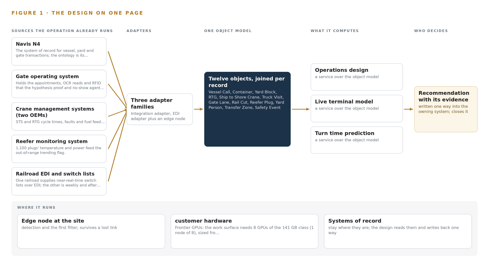
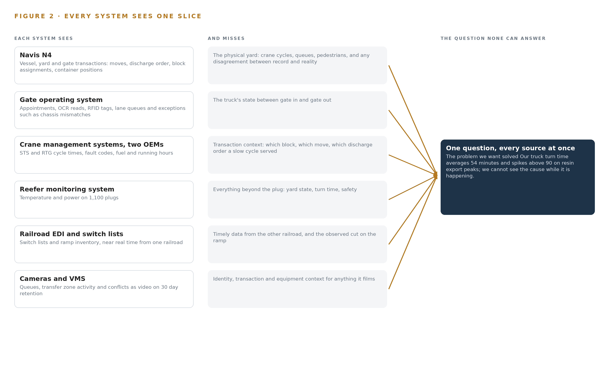
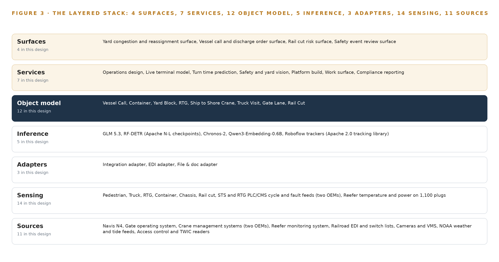
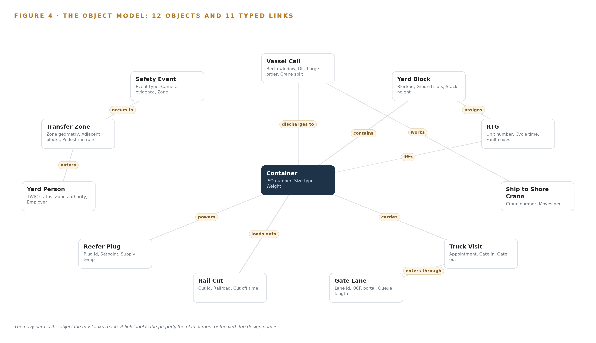
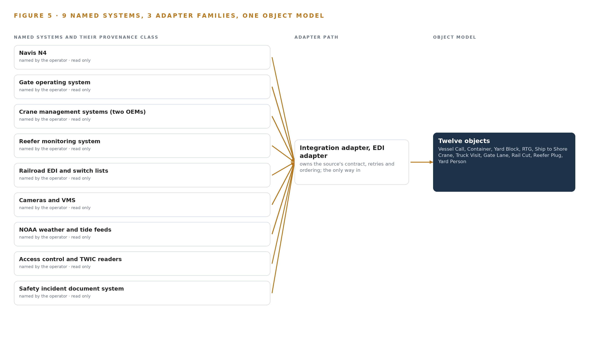
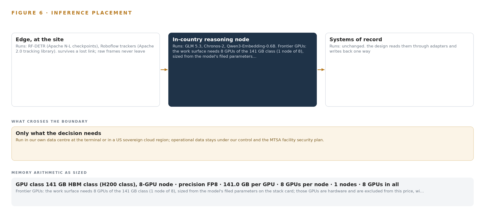
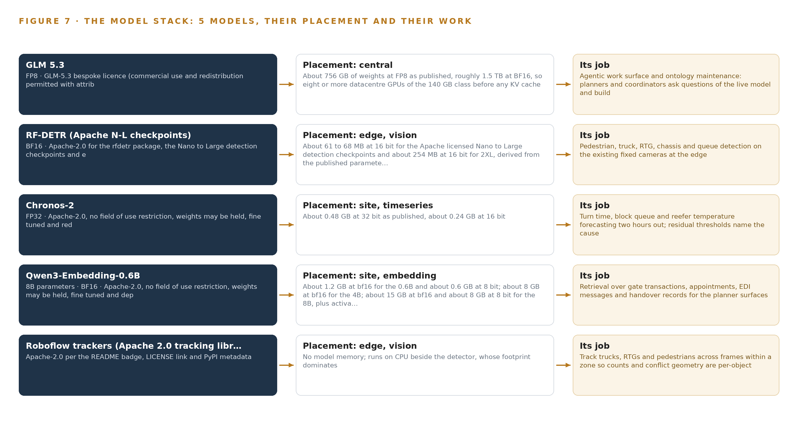
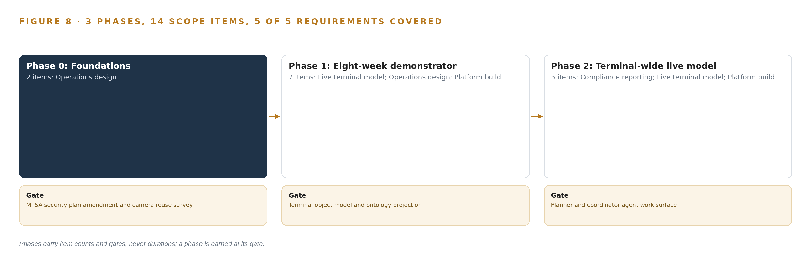
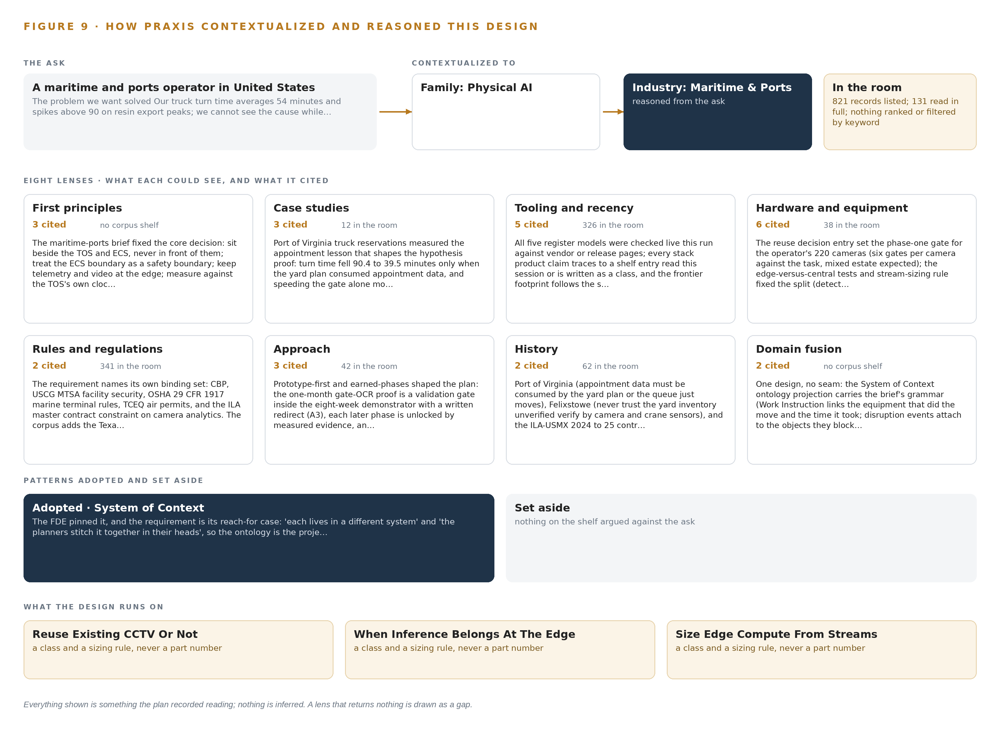

# Terminal Pulse: Predicted Truck Turn Time and Live Yard Sight for a Container Terminal

Canonical: https://codeatoms.ai/truck-turn-container-terminal-us/
DOI: https://doi.org/10.5281/zenodo.23159331
PDF: https://codeatoms.ai/truck-turn-container-terminal-us/paper/terminal-pulse-truck-turn-time-container-terminal-us.pdf
License: CC BY 4.0
Publisher: CodeNinja Atoms (https://codeatoms.ai), a fully owned subsidiary of CodeNinja

VERTICAL-DRIVEN ARCHITECTURES · MARITIME & PORTS · DESIGNED WITH PRAXIS · OCTOBER 2026

# Terminal Pulse: Predicted Truck Turn Time and Live Yard Sight for a Container Terminal

A live object model of vessel, yard, gate, crane, reefer and rail data that predicts truck turn time two hours out, names the cause and watches for conflicts as they happen, for a container terminal operator in the United States.

CodeNinja Engineering Team

For the terminal operations director, the yard, vessel and rail planners, and the platform, data and vision engineers who would build and run it.

---

Vertical-Driven Architectures is a CodeNinja series of system designs. Every design in the series is driven by a real-world problem and scenario in a single industry, and every one is designed on Praxis, CodeNinja's platform for designing physical AI systems. Operations are described by class, never by name.

At a glance

## Predicted truck turn time for a container terminal in the United States

**What this is.** An open reference architecture for system design in physical AI: truck turn time predicted two hours out and yard congestion seen live, at a container terminal, on the operator's own hardware with no outbound connection. It is written for terminal operations leaders and for the engineers who would build it. The operator is an illustrative scenario, not a CodeNinja customer.

**The answer in numbers.**

| Part | The design |
| --- | --- |
| Sources joined | 11 systems, including the terminal operating system, the gate system, two crane management systems, reefer monitoring, railroad switch lists, cameras and weather and tide feeds |
| Object model | 12 typed objects and 11 links, published as JSON for reuse |
| Models | 5 self-hosted open models: GLM 5.3 (reasoning), Chronos-2 (forecasting), Qwen3-Embedding-0.6B (retrieval), RF-DETR (vision), Roboflow trackers |
| Frontier compute | One node of eight 141 GB HBM-class GPUs holds GLM 5.3 at FP8 (753 GB of weights, 904 GB with headroom), at about 10 kW |
| Edge | Fanless IP-rated enclosures at the yard blocks, gate and quay; no safety reflex crosses a network hop |
| Three-year cost, owned | About 722,000 US dollars with support and power at the US industrial power price |
| Three-year cost, rented | 0.99 million to 2.52 million US dollars for the same GPUs around the clock; ownership is about four fifths the deepest three-year commitment (version 2) |
| Closed model break-even | The cheapest closed model matches the owned stack at about 35 users; above that, ownership is cheaper and the gap grows with every user |
| Human control | Surfaces warn and propose; the named planner acts in the terminal operating system and the named safety supervisor acknowledges every safety event |

**Reuse it.** The object model, the model register and the figures are free to reuse under CC BY 4.0.

**Made with.** Reasoned on [Praxis](<https://codeatoms.ai/praxis/>), CodeNinja's platform for designing physical AI systems. The object model imports into [Hyper Ontology](<https://codeatoms.ai/hyper-ontology/>), which turns it into a living system. Both are in beta; access by request.

ABSTRACT

## A Congestion Spike Should Be Named While It Is Still Forming

Truck turn time is the number the trucking community feels and the number a container terminal cannot currently explain while it is happening. Turn time at this operator averages 54 minutes and spikes above 90 minutes on resin export peaks, and the interacting causes live in separate systems: the terminal operating system knows the moves, the gate system knows the trucks, the crane controllers know the cycles, the cameras see the queues, and rail dwell arrives weekly after the fact. Planners stitch these slices together in their heads at the 06:00 and 14:00 operations meetings, so a spike is explained hours after the trucks have felt it, and safety conflicts in the transfer zones are found in incident reports rather than seen.

The design builds one live model of the terminal. Eleven source systems, from the terminal operating system and gate OCR to two crane makers' controllers, the reefer monitors, railroad feeds and the existing 220-camera estate, enter through three adapter families into a model of twelve objects with typed links, served by seven services and four decision surfaces. Five models carry the intelligence: detectors and trackers on edge compute at the yard blocks and gate, time series forecasting and retrieval embeddings on a site inference node, and frontier open weights on an eight-GPU node inside the operator's own data center within its facility security boundary, so no data leaves the site and every reassignment remains a planner's decision made inside the terminal operating system.

The paper opens with the problem and the join failure across the terminal's systems, then sets the constraints, the layered stack, the twelve-object model, ingestion through the adapter tier, and the placement of inference from the yard edge to the operator's own hardware, before registering the five models and their licenses. Part III covers the phased rollout, whose first gate proves or redirects the yard-side hypothesis using gate OCR data the operator already holds, and the ownership of everything built. It closes with the Praxis chapter, which traces every design choice back to what was recorded.

---



Figure 1. Terminal Pulse on one page: the sources the operation already runs, one object model, what it computes, and the person who decides.

## Contents

Each chapter is tagged for the reader it serves most directly: Executive, Team Lead, FDE, Reference.

|  |  |  |
| --- | --- | --- |
|  | Abstract · A Congestion Spike Should Be Named While It Is Still Forming | Executive |
| PART I · THE PROBLEM | | |
| 1 | [Turn Time Spikes Before Any Planner Can See Why](#ch1) | Executive |
| 2 | [Every Terminal System Sees One Slice of the Operation](#ch2) | ExecutiveTeam Lead |
| PART II · THE DESIGN | | |
| 3 | [Four Constraints Shape the Design Before Any Component](#ch3) | Team Lead |
| 4 | [One Stack Runs From Systems of Record to Surfaces](#ch4) | Team LeadFDE |
| 5 | [Twelve Objects Turn Terminal Data Into One Argument](#ch5) | FDE |
| 6 | [Every Source Enters Through an Adapter, Never Directly](#ch6) | FDE |
| 7 | [Detection Belongs at the Edge and Reasoning In-Country](#ch7) | FDE |
| 8 | [The License Decides What the Operator Can Own](#ch8) | FDEExecutive |
| PART III · THE ROLLOUT | | |
| 9 | [Shadow Mode Comes Before Any Flag Is Trusted](#ch9) | Team LeadExecutive |
| 10 | [The Intelligence Should Stay with the Terminal That Produced It](#ch10) | Executive |
| PART IV · HOW IT WAS DESIGNED | | |
|  | Conclusion · A Terminal Seen Whole Can Be Run Whole | Executive |
| 11 | [How Praxis Contextualized and Reasoned This Design](#ch11) | Team LeadFDE |
|  | [Sources](#sources) | Reference |

PART I · CHAPTER 1

## Turn Time Spikes Before Any Planner Can See Why

The causes of a turn time spike interact across five systems, so no one at the terminal sees the spike forming until the trucks are already waiting.

The abstract named the design in one paragraph: one live model of the terminal, built beside the systems that already hold its data. This chapter establishes the ground under that design, describing the question the operation cannot answer today, the documented cost of answering it too late, and the operation itself as the scenario the system must serve.

### 1.1  The Question, the Data and the Regulatory Ground

The question the operation needs answered is narrow and constant: why is truck turn time climbing right now, which interaction among yard congestion, gate exceptions, rubber tyred gantry availability and vessel discharge order is driving it, and what should be reassigned before the queue outside the gate grows. Turn time is the interval from gate in to gate out for a visiting truck, and the operator's average sits at 54 minutes, spiking above 90 minutes on resin export peaks. Answering the question while it is happening requires data the terminal already holds: vessel, yard and gate transactions in the terminal operating system, appointments, optical character recognition reads and radio frequency identification tags at the gate, cycle times, faults and fuel from two crane manufacturers' management systems, the camera estate over the yard, rail switch lists from two railroads, and weather and tide. The failure is not a missing sensor; it is that the data never meets.

The regime around the answer is fixed. Customs and Border Protection governs the container transactions themselves; the United States Coast Guard administers facility security under the Maritime Transportation Security Act, which bounds where terminal data may live; the Occupational Safety and Health Administration's marine terminal rules at 29 CFR 1917 govern yard safety; and the state environmental permit over the diesel fleet makes idling evidence reportable. The terminal sits on a flow that matters: about 80 percent of world trade volume moves by sea (Defesa n.d.), and a container terminal that cannot explain its own queue pushes delay outward to every trucking company and shipping line it serves.

### 1.2  The Documented Cost of Seeing Late

The industry record does not publish a per-terminal figure for turn time variance, and this design does not invent one. What the public record does document is the price of situational awareness that arrives late or incomplete. Maritime regulators already treat an awareness gap as a formal safety concern rather than a soft failing, analysing it as part of the competence required of anyone responsible for a moving maritime operation (MDPI 2020). The consequence of not seeing a developing hazard is on the record: a bulk carrier and a towing vessel collided on a busy United States shipping channel in July 2024 (Maritimecyprus 2024), and an operator was fined 6 million dollars over a 2024 runaway ship incident in which a required report was never made (Allaboutshipping 2024). Inside the terminal the cost is quieter but continuous: a variance discovered at the 06:00 operations meeting is already hours old, the trucks have waited, and the cause is reconstructed rather than observed.

### 1.3  The Operation as a Scenario

The operation is a container terminal on a major United States shipping channel, running two berths served by eight ship to shore cranes, twenty six rubber tyred gantry cranes across fourteen yard blocks, eleven truck gate lanes with optical character recognition portals, and an on dock rail ramp served by two Class I railroads. Throughput is more than a million twenty foot equivalent units a year, growing with Gulf resin exports and nearshoring imports, and eleven hundred reefer plugs carry refrigerated cargo. About sixty percent of visiting trucks carry radio frequency identification tags. Labour is International Longshoremen's Association labour under the master contract, worked across three shifts.

The people in the loop are eight roles: yard planners, vessel planners and rail coordinators who make the judgement calls; gate, safety and maintenance supervisors who act on alerts; the longshore crews and equipment operators whose work the cameras observe; and port authority staff who receive the monthly performance report. The physical environments are the quay and apron, the transfer zones where trucks meet gantry cranes, the yard blocks, and the gate plaza and rail ramp. The scenario holds nine named source systems, eight roles and four distinct working environments, and the design that follows must serve all of them without replacing any system they already run.

PART I · CHAPTER 2

## Every Terminal System Sees One Slice of the Operation

The terminal operating system, the gate system, the crane controllers and the cameras each hold one true slice of the terminal, and none of them together can answer what the planners ask at 06:00.

Chapter 1 showed a terminal whose data exists but never meets, and a cost recorded in the industry's investigation history. This chapter shows why the data never meets: each existing system holds one true slice of the operation, and the join between the slices exists only in the planners' heads.

### 2.1  What Each System Sees and What It Misses

The terminal operating system sees every vessel, yard and gate transaction: the move counts, the discharge order, the block assignments, the container's declared position. It misses the physical yard. A crane cycle that ran long, a queue forming at a lane, a pedestrian in a transfer zone are invisible to it, and a yard record can disagree with what the cameras and cranes actually see. The gate operating system sees the trucks: appointments, optical character recognition reads, radio frequency identification tags, lane queues and exceptions such as chassis mismatches. It misses everything after the kiosk; once the truck passes the gate it disappears into the yard with no observable state until it returns.

The crane management systems, one per manufacturer, see the machines: cycle times, fault codes, fuel and running hours for both ship to shore and rubber tyred gantry cranes. They miss the transaction context, so a slow cycle cannot by itself be attributed to congestion, a fault cascade or a discharge order change. The reefer monitoring system sees eleven hundred plugs' temperature and power, and nothing else. The rail feeds see the ramp unevenly: one railroad supplies near real time switch lists, the other reports weekly and after the fact, so the true state of a rail cut rests on whichever railroad owns it. The camera estate, two hundred and twenty fixed cameras on a video management system with thirty day retention, sees the queues, the transfer zones and the conflicts, but it sees them as video alone, without identity, transaction or equipment context. Weather and tide feeds see the conditions the pilots work under and nothing of how the terminal responds to them. Access control and Transportation Worker Identification Credential readers see who entered which zone; the safety incident document system sees only what was written down after the fact.

### 2.2  What None of Them See Together

Figure 2 sets these slices side by side, and the gap between them is the problem. No system can attribute a turn time spike to yard congestion rather than gate exceptions, because attribution needs the gate slice, the yard slice, the crane slice and the vessel slice joined on the same clock. No system can warn two hours ahead, because prediction needs the join too. The planners therefore stitch the picture by hand at the 06:00 and 14:00 operations meetings; rail dwell arrives weekly from the railroads, after the fact; and safety events surface in incident reports rather than being seen. The operator's own working hypothesis, that most turn time variance is yard side rather than gate side, is untestable while the slices never meet. That untestable hypothesis is the cost in practice: the terminal pays for the join in planner attention every shift and still cannot answer the question once.



Figure 2. Nine systems, each seeing one part of the answer. the question needs all of them in one place at once.

PART II · CHAPTER 3

## Four Constraints Shape the Design Before Any Component

Sitting beside the systems of record, keeping safety reflexes at the edge, holding data inside the security boundary and leaving every decision to a named person shape everything downstream.

Chapter 2 left the join unbuilt: nine true slices, no model to hold them. This chapter fixes the four constraints the design accepts before any component is chosen, because each one is hard to honour in this industry and each one shapes what follows.

### 3.1  Sit Beside the Systems of Record, Never in Front of Them

The terminal operating system is the audited record of every vessel, yard and gate transaction, and shipping lines, Customs and Border Protection and the operator's own governance all read it as truth. A design that writes back into it during the first phase would put an unproven model inside that chain of trust, and would need International Longshoremen's Association local and internal information technology sign off before a single reassignment flowed. The design therefore projects the systems of record into one object model and stays read only, with planners acting inside the terminal operating system exactly as they do today. This is hard in this industry because the temptation runs the other way: the fastest demo writes back, and the fastest demo is the one that breaks the audit.

### 3.2  Keep Safety Reflexes at the Edge

A pedestrian in a transfer zone next to a moving rubber tyred gantry cannot wait for a round trip to a server room, across a yard network that salt air, steel stacking and hurricanes degrade. The design keeps detection, tracking and conflict geometry on edge compute at the yard blocks, the gate and the ramp, so the safety reflex never crosses a network hop. This is hard here because the yard is the hostile case for edge compute: fanless enclosures, dirty and sunstruck camera optics, and a power supply that must survive generator transfer. The degradation contract follows from the same constraint: when the link drops, the edge reports stale state loudly rather than failing silently.

### 3.3  Hold the Data Inside the Security Boundary

The Maritime Transportation Security Act facility security plan governs the terminal, and camera footage of longshore labour is exactly the data that must never leave. The design runs every model, every weight and every record inside the operator's own data center within that plan, with in country colocation reserved for hurricane disaster recovery, and federates identity to the Transportation Worker Identification Credential backed access model. This is hard because the boundary is bureaucratic as well as technical: a facility security plan amendment has lead time, so it sits on the critical path of the build rather than in a risk register.

### 3.4  Leave Every Decision to a Named Person

Union labour rules and plain accountability both forbid a model that reassigns cranes or closes a lane on its own. The design names the decider for every output: the yard planner accepts or rejects a reassignment inside the terminal operating system, the safety supervisor acknowledges every seen event, and the model proposes only. This is hard because the operation runs three shifts under pressure, and an advisory system that planners override without a record would quietly become decoration; the design therefore keeps the decision, the outcome and the reasoning together so the next decision reads them.

### 3.5  Scoping Decisions and Their Price

Three scoping decisions follow from the four constraints, and each buys something at a price the operator accepts knowingly. Table 1 states them.

Table 1 · Scoping Decisions

| Decision | What it buys | What it costs |
| --- | --- | --- |
| Read only projection beside Navis N4, planners acting in N4 | No change to the system of record, no write path to audit, faster security approval | Every reassignment remains a human keystroke, so the model advises and never acts |
| Agent building surface for planners, vessel planners and rail coordinators only | The three judgement roles get the frontier weights on the operator's own hardware | Gate, safety and maintenance supervisors receive alerts and dashboards but build no agents |
| Reuse the existing 220 camera estate, judged camera by camera against six reuse gates | Sensing without new capital, new cable runs or new gate hardware | Some angles fail the gates and stay unsensed until a camera is moved or added |

### 3.6  What the Design Chose Against

Each choice was made against a named alternative, and the reasons are part of the design because a future maintainer will meet them again. Table 2 records them, closing with what sits outside scope entirely.

Table 2 · What the Design Chose Against

| Where | What was picked | Instead of, and why |
| --- | --- | --- |
| First gate | Gate OCR proof inside the eight week demonstrator | Instead of a separate one month study before any build: the proof gates the demonstrator's direction, and a gate side result redirects the build to lanes and appointments rather than stopping it |
| Terminal operating system integration | Read only against N4 in the first phase | Instead of writing approved reassignments back into the record: write back returns as a second phase option gated on ILA local and internal information technology sign off |
| Agent surfaces | Committed agent building surfaces for the three judgement roles | Instead of surfaces for every named role: supervisors act on alerts and the port authority receives the monthly performance report only |
| Scope boundary | No new cranes, RTGs or gate hardware, and no individual worker productivity analytics | Instead of broadening scope: the requirement excludes new handling hardware, and labour rules forbid camera analytics that measure individual productivity, so the design carries safety and equipment monitoring only |

PART II · CHAPTER 4

## One Stack Runs From Systems of Record to Surfaces

A layered stack carries terminal data from the systems of record through one object model to the surfaces where planners, coordinators and safety supervisors act.

Chapter 3 fixed the constraints: the model sits beside the systems of record and never in front of them, sensing stays at the edge, every decision stays with a named person, and the first gate can redirect the build cheaply. This chapter shows the stack that carries those constraints down to named components.

### 4.1  Records Below, One Model in the Middle, Agents Above

Sea transport carries about 80 percent of world trade volume, and a container terminal is one of the points where that volume compresses into truck minutes and rail cutoffs (Defesa n.d.). The terminal's difficulty is not a shortage of data; it is that each system holds one slice and the planners stitch the slices in their heads at two meetings a day. The same shared-picture logic that vessel traffic services guidance addresses to port authorities (Service n.d.) applies one layer down, inside the gate.

The architectural pattern is therefore three bands. Below sit the systems of record: the terminal operating system, the gate operating system, the two crane management systems, the reefer monitoring system, the railroad feeds, the camera estate and video management system, the access control readers and the incident document system. In the middle sits one object model, rebuilt continuously from an event backbone, holding twelve objects that project the terminal's live state. Above sit seven services that turn the model into predictions, detections and reports, and four surfaces that put each output in front of the person who decides. The pattern fits because it never asks a system of record to stop being authoritative: the terminal operating system remains the system of record for every move, and the model is a projection of it, never a rival. Planners act inside the system they already trust. Figure 3 shows the layered stack with its counts per layer: eleven sources, three adapter families, twelve objects, five models, seven services and four surfaces.



Figure 3. The layered stack: 11 sources, 3 adapter families, 12 objects, 7 services and 4 surfaces.

### 4.2  The Stack Stage by Stage

Table 3 walks the stack from the bottom band to the top, naming the component or family that carries each stage's responsibility.

Table 3 · The Stack, Stage by Stage

| Stage | What it is responsible for | How |
| --- | --- | --- |
| Sources | Hold the authoritative transactions and records the terminal already runs on | Navis N4, the gate operating system, two OEM crane management systems, the reefer monitoring system, railroad EDI and switch lists, the camera estate and its video management system, NOAA weather and tide feeds, access control and TWIC readers, and the safety incident document system |
| Sensing | Turn physical yard, gate, quay and ramp activity into machine-readable events | 220 fixed cameras on the existing video management system, gate OCR portals and RFID tags, STS and RTG PLC and CMS cycle, fault and fuel feeds, temperature and power on 1,100 reefer plugs, and NOAA weather and tide |
| Adapters | Move every event from source to backbone without ever writing back | Three adapter families: integration adapters for APIs and databases, EDI adapters for BAPLIE, COPRAR and switch lists, and file and document adapters for reports and incident records |
| Object model | Hold one live, queryable projection of the terminal | Twelve objects with typed links, rebuilt continuously from the event backbone inside the operator's own boundary |
| Inference | See, track and forecast on the model's streams | Edge detectors and trackers on the camera streams, Chronos-2 forecasting turn time and queues two hours out, an embedding model for retrieval, and GLM 5.3 serving the work-surface agents on the operator's own GPU node |
| Services | Turn predictions and detections into named operational outputs | Operations design, live terminal model, turn time prediction, safety and yard vision, platform build, work surface, and compliance reporting |
| Surfaces | Put each output in front of the person who decides | The yard congestion and reassignment surface, the vessel call and discharge order surface, the rail cut risk surface, and the safety event review surface |

PART II · CHAPTER 5

## Twelve Objects Turn Terminal Data Into One Argument

Twelve objects with typed links turn transactions, telemetry and video into one queryable model of the terminal's live state.

Chapter 4 placed one object model in the middle of the stack. This chapter opens that model object by object and shows what its links let a single query reach.

### 5.1  Twelve Objects and the Links Between Them

The twelve objects are Vessel Call and Truck Visit (events), Container (material), Yard Block and Transfer Zone (sites), RTG and Ship to Shore Crane (assets), Reefer Plug (asset), Gate Lane (asset), Rail Cut and Safety Event (records), and Yard Person (person). Each is anchored in the system of record that owns it: Vessel Call, Container and Yard Block in the terminal operating system; Truck Visit and Gate Lane in the gate operating system; RTG and Ship to Shore Crane in their OEM crane management systems; Rail Cut in the railroad switch lists; Safety Event in the incident document system; Yard Person in the access control and TWIC readers. Figure 4 draws every object and its typed links, with the links carrying verbs rather than bare references: a yard block assigns an RTG, a truck visit enters through a gate lane, a vessel call discharges containers, a reefer plug powers a container, a safety event occurs in a transfer zone.

The links are what make the model an argument rather than a store. Start from one truck visit whose turn time ran long: follow its gate lane to the exception that held it, follow the container it carried to its yard block, follow the block to its assigned RTG and that unit's fault codes, follow the container to its vessel call, discharge order and crane split, and follow it onward to the rail cut whose cutoff it may miss. A document store can hold every one of these records and still answer none of that, because it cannot traverse the relationships; the typed links make the whole traversal one query, which is exactly what turn time attribution and congestion warning require.



Figure 4. The twelve objects of the model and the typed links that let a query reach across them.

### 5.2  Where the Human Loop and the Boundary Sit

The human loop lives at the surfaces and at one record. Every surface warns and proposes; the named planner acts inside the terminal operating system, the named safety supervisor acknowledges a safety event, and the disposition lands on the record with the person's identity attached. The model advises; it never moves a crane or closes a lane on its own.

The hosting posture keeps the model inside the boundary. All twelve objects live in the operator's own data center inside the facility security plan, on generator-backed power, with in-country colocation reserved for hurricane disaster recovery. Identity federates from the operator's directory under a TWIC-backed access model that separates planner, supervisor and auditor roles. There are no external links: the model holds no outbound connection and reads every source. The only write path is into the model's own records, chiefly the safety event disposition and acknowledgment, and write-back into the terminal operating system is a second-phase option gated on labour and IT sign-off.

### 5.3  One Object in Its Recorded Form

Truck Visit is the object the hypothesis proof reads, and its recorded form appears below.

```
{
  "id": "vessel-call",
  "label": "Vessel Call",
  "kind": "event",
  "anchored_in": "Navis N4",
  "properties": [
    "Berth window",
    "Discharge order",
    "Crane split",
    "ETA",
    "Move count"
  ],
  "status_vocabulary": [
    "Planned",
    "Alongside",
    "Working",
    "Complete"
  ],
  "links": [
    {
      "to": "container",
      "label": "discharges to"
    }
  ]
}
```

PART II · CHAPTER 6

## Every Source Enters Through an Adapter, Never Directly

Eleven source systems enter only through three adapter families onto an event backbone, so the live model never touches a system of record directly and the read-only posture holds.

Chapter 5 described what the model holds. This chapter describes how data gets into it, and what the adapter tier promises on the way.

### 6.1  Eleven Sources, One Map

Eleven source systems feed the model, and Figure 5 maps each one to its adapter path. Navis N4 carries the vessel, yard and gate transactions, together with the EDI exchange with shipping lines that moves BAPLIE stowage plans and COPRAR discharge orders. The gate operating system holds the appointments, the OCR reads and the RFID tags on about 60 percent of visiting trucks. The two OEM crane management systems carry STS and RTG cycle times, faults and fuel. The reefer monitoring system carries temperature and power for 1,100 plugs. The rail path is asymmetric: one railroad supplies near-real-time switch lists over EDI while the other reports weekly after the fact, so ramp cameras count cuts where the data arrives late. The 220-camera estate rides its video management system. NOAA weather and tide feeds join so predictions carry the conditions pilots work under, a real concern where a single collision can close a shared channel and stop a terminal's vessel work without warning (Maritimecyprus 2024). Access control and TWIC readers anchor the Yard Person object, and the safety incident document system holds the paper history that camera detections join. Every source carries the same provenance class: operator-held, read through its adapter, never written.



Figure 5. The 11 named systems, the adapter path each one takes, and the object model they all map into.

### 6.2  What the Adapter Tier Guarantees

The adapter tier makes five promises. First, read-only: no adapter holds a write credential against any source, so the posture holds by construction rather than by policy. Second, schema mapping happens at the adapter, so a source's fields become object properties once and no source system ever changes for the model's sake. Third, idempotent replay: every event carries its source identity and source timestamp, so redelivery after a restart changes nothing. Fourth, late and partial data are typed as such rather than dropped, which is why the weekly railroad feed still enters the model, flagged for its age. Fifth, backpressure: an adapter buffers upstream when the backbone slows, so a burst of gate OCR reads never pushes overload into the stores. The video path keeps the same discipline: analytics ride the existing streams and the video management system keeps its 30-day retention untouched.

### 6.3  The Event Backbone

The backbone is Apache Kafka 4.3 on KRaft, running inside the operator's boundary. Ordering is per entity key, so one truck visit, one yard block or one rail cut always replays in sequence even when events arrive out of order across sources. Delivery is at-least-once with idempotent consumers, which pairs with the adapters' replay guarantee. Brokers replicate across the data center so a single node loss loses nothing, and buffering is sized for the outage window that matters here: a hurricane shutdown and generator transfer. Network UPS tools force clean shutdown, the time grandmaster holds its clock across the transfer, and on recovery consumers resume from their last committed offsets. When a link or a feed degrades, the model's contract is stale-marked reporting rather than silence, because an awareness gap during degraded operation is a formal safety concern in maritime human factors work (MDPI 2020).

PART II · CHAPTER 7

## Detection Belongs at the Edge and Reasoning In-Country

Pedestrian and conflict detection must run at the yard block within a camera frame's time, while forecasting and language reasoning stay on the operator's own hardware in-country.

Chapter 6 closed the path into the model: eleven named sources, three adapter families, one ordered event backbone. This chapter decides where the compute sits that turns those events into warnings, and it fixes a rule the whole design leans on: detection happens at the yard block, forecasting happens in the server room, and language reasoning happens on the operator's own hardware in-country. Figure 6 shows all three tiers and what crosses between them.

### 7.1  Three Tiers, One Arithmetic Each

The edge tier is fanless, IP-rated compute enclosures at the yard blocks, the gate and the quay. Each enclosure runs an RF-DETR detector for pedestrians, trucks, RTGs, chassis and queues, and a Roboflow tracker on CPU beside it that gives each detection an identity across frames. The checkpoints are small: about 61 to 68 MB at 16 bit for the Nano to Large sizes, about 254 MB at 16 bit for 2XL, so several camera streams share one accelerator. The serving runtime, drawn from a shelf that includes ONNX Runtime, OpenVINO and Triton, is pinned per accelerator after the bench measurement on actual streams and models that the sizing rule requires, because a detector sized from a datasheet rather than from the yard's own footage is the first way a vision system disappoints. Detection lives here and nowhere else for a physical reason: no safety reflex crosses a network hop, and work on autonomous and remote shipping treats an awareness gap introduced by a remote link as a formal safety concern rather than a nuisance (MDPI 2020). The site tier is one GPU server room node, H100-class 80 GB or L40S-class 48 GB, running Chronos-2 and Qwen3-Embedding-0.6B. The arithmetic is modest: Chronos-2 carries about 0.48 GB of weights at FP32, about 0.24 GB at 16 bit, and the embedding model about 1.2 GB at bf16, about 0.6 GB at 8 bit, plus activation memory that grows with its 32K window. Both fit on one card with room for those activations. The site tier exists because forecasting needs terminal-wide state: turn time is predicted two hours out against vessel discharge order, appointments and weather joined with each block's queue, and only the site tier sees all of those at once. The central tier is the frontier node: one 8-GPU machine of the 141 GB HBM class serving GLM 5.3 for the planner work surface and ontology maintenance. The memory arithmetic runs like this: 753 billion parameters at FP8, one byte per parameter, give 753 GB of weights; multiply by 1.2 for the KV cache and activations and the GPUs must hold 904 GB; eight GPUs of 141 GB give 1,128 GB, so the KV cache ceiling sits about 224 GB below usable memory. That is one node at about 10 kW, inside the power envelope of the operator's own generator-backed data center within the MTSA facility security plan, with in-country sovereign colocation reserved for hurricane disaster recovery. VLLM or SGLang serve the weights, the version pinned at install against the node's startup log line.



Figure 6. Where each tier runs, what runs there, and the narrow set of outputs that cross the boundary.

### 7.2  The Latency Budget

The budget is three clocks, each owned by a tier. The first is the camera frame: detection, tracking and the transfer-zone conflict verdict complete at the edge, so the strobe decision and the safety event never wait on a network. The second is the operational clock: the turn time and congestion forecast is recomputed as the event backbone delivers new crane cycles, gate reads and appointment changes, and residual thresholds against the forecast name the cause while a planner can still reassign an RTG, which is the whole point of a two-hour horizon. The third is the human clock: a planner's question at the work surface is an interactive session against the frontier node, while shift reconciliations and ontology maintenance run as asynchronous jobs behind it, so one planner's query never queues behind another's batch work.

### 7.3  What Crosses, and What Fails

Crossing outward from the edge are only detections, tracks, counts, queue lengths and cycle telemetry; camera frames stay inside the yard network and the video management system keeps its 30-day retention. Crossing inward are model weights and container images, moving one way over Lidi on a hardware data diode, so nothing outside the boundary can open a path back into yard compute. Three failures are designed for rather than feared. If the yard link drops, the edge cluster, chosen as the lightest that survives a yard network loss, keeps detecting and buffers its events, and the degraded-mode contract is stale reporting, never silent failure. If power fails or a hurricane forces a generator transfer, Network UPS Tools shuts the enclosures down cleanly and the OCP Time Card grandmaster holds time across the transfer window, so camera frames, PLC cycles and gate reads stay on one clock. If the update path fails, the Harbor registry inside the boundary holds the last mirrored images and detector weights, MLflow keeps model versions with rollback, and every edge box runs its last good weights until the diode carries the next one.

PART II · CHAPTER 8

## The License Decides What the Operator Can Own

Every weight in the design carries a license that lets the operator hold it on its own hardware inside the security boundary, and that fact decides the model register.

Chapter 7 fixed the three inference tiers and the arithmetic each must satisfy. This chapter fills them: five models, the license each carries, and why each license permits the operator to hold its weights on its own hardware inside the security boundary. Figure 7 shows the stack, from the edge detectors at the bottom to the frontier work-surface weights at the top.



Figure 7. The five models, their placement, and the work each one does.

### 8.1  Five Models and Their Licenses

GLM 5.3 is the work-surface model: the agentic surface where yard planners, vessel planners and rail coordinators question the live terminal model, build and run their own agents, and maintain the ontology. It is frontier class, with 753 billion parameters filed and FP8 and BF16 weights published openly on 28 August 2026. It runs on the central tier, one 8-GPU node of the 141 GB HBM class, where the FP8 weights plus KV headroom fit per the arithmetic in Chapter 7. Its license is bespoke: commercial use and redistribution are permitted with attribution, and it carries no revenue or model-as-a-service trigger, which is the fact that lets the weights live on the operator's own node rather than behind someone else's interface. It was chosen because this run's checks confirm it as the strongest open agentic model available to the design. RF-DETR is the edge detector: a real-time detection transformer family that finds pedestrians, trucks, RTGs, chassis and queues on the existing fixed cameras. Its footprint runs from about 61 to 68 MB at 16 bit for the Nano to Large checkpoints to about 254 MB at 16 bit for 2XL. The Apache-2.0 license covers the package and the detection checkpoints with no field restriction, so the operator may hold, fine tune and run them indefinitely. It was chosen because it is real-time on edge GPUs and built for fine tuning on site footage, which makes the operator-owned adaptation path real work; YOLO26 was set aside for its AGPL exposure and DEIMv2 for its non-commercial license, and open-vocabulary detectors were set aside because the terminal's classes are fixed and its counts must be auditable. Chronos-2 is the site forecaster: a time series foundation model, about 0.48 GB at FP32 as published, that predicts turn time, block queues and reefer temperature two hours out, with residual thresholds naming the cause. It is Apache-2.0 with no field of use restriction, and it is zero-shot across multivariate and covariate-informed series, so it forecasts against discharge order, appointments and weather with no per-block training set. The runner-up, TTM-R2, was weighed and set aside as univariate only. Qwen3-Embedding-0.6B is the site retrieval model, about 1.2 GB at bf16, embedding gate transactions, appointments, EDI messages and handover records for the planner surfaces. Its 32K window holds a whole shift's gate and appointment record as one passage. It is Apache-2.0, and BGE-M3 was set aside as older with a shorter window for record-level joins. The Roboflow trackers library does the edge tracking: Apache-2.0 clean-room implementations of SORT, ByteTrack and OC-SORT behind one interface, with an eval command to pick the tracker on the operator's own labelled clips. It carries no model memory and runs on CPU beside the detector; BoxMOT was set aside as AGPL.

### 8.2  The Model and Equipment Register

Table 4 gathers every choice in one register: the five models, the hardware classes and sizing rules, the sensing, the patterns the design stands on and the ground it runs on, each with the reason it is here.

Table 4 · Model and Equipment Register

| The choice | What was picked | Why here |
| --- | --- | --- |
| Work surface model | GLM 5.3, 753 billion parameters filed, FP8, on one 8-GPU node of the 141 GB HBM class | Bespoke license permits internal commercial use with attribution and no revenue trigger; one node holds the weights with KV headroom. |
| Edge detector | RF-DETR, Apache-2.0, Nano to 2XL checkpoints from about 61 to 254 MB at 16 bit | Real-time on edge GPUs, fine tunable on the operator's own footage, fixed auditable classes. |
| Site forecaster | Chronos-2, Apache-2.0, about 0.48 GB at FP32 | Zero-shot multivariate forecasting with covariates for the two-hour turn time, queue and reefer predictions. |
| Site embedding model | Qwen3-Embedding-0.6B, Apache-2.0, about 1.2 GB at bf16 | The 32K window holds a whole shift's gate and appointment record in one passage. |
| Edge tracker | Roboflow trackers, Apache-2.0 clean-room SORT, ByteTrack and OC-SORT | Per-object counts and conflict geometry at no model memory cost, on CPU beside the detector. |
| Edge compute class | Fanless IP-rated enclosures with accelerator at the yard blocks, gate and quay | Sized from actual streams and models by bench measurement, never from a datasheet. |
| Site inference server | One GPU node, H100-class 80 GB or L40S-class 48 GB | Holds forecaster and embedding model with room for 32K-window activation memory. |
| Frontier node | One 8-GPU node of the 141 GB HBM class, about 10 kW | 904 GB required against 1,128 GB usable, inside the room's power envelope. |
| Camera estate | Reuse of the 220 existing fixed cameras, decided per camera by six gates | Reuse existing CCTV or not is the first sizing rule; new buys carry no domestic US license restriction. |
| Positioning | RTKLIB with a site-owned GNSS base station | Grounds RTG and truck positions without an external positioning service. |
| Time synchronization | OCP Time Card grandmaster with holdover OCXO, linuxptp and chrony | Keeps camera frames, PLC cycles and gate reads on one clock through power transfer. |
| One-way transfer | Lidi over a hardware data diode | Weights and images move inward; nothing queries back across the boundary. |

PART III · CHAPTER 9

## Shadow Mode Comes Before Any Flag Is Trusted

The first gate proves or redirects the yard-side turn time hypothesis before the build grows, and no prediction or safety flag reaches a planner until it has run in shadow.

Chapter 8 fixed the models, their licenses and the hardware that holds their weights. This chapter sets the order in which those models earn the right to speak to a planner, what the rollout measures along the way, and what happens when a piece of it fails.

### 9.1  Phases, Workstreams and Gates

The build runs in three phases, shown in Figure 8, each closed by an exit gate that can stop the work cheaply. Phase 0, Foundations, carries two items under the operations design workstream: engagement with the ILA local on a data use covenant, and the facility security plan amendment with the camera reuse survey. Its gate is the amended security plan and a completed survey of which of the 220 cameras can carry analytics. Phase 1, the demonstrator, carries seven items across five workstreams: live terminal model, operations design, platform build, safety and yard vision, and turn time prediction. The items include the terminal object model and its ontology projection, read-only integrations against Navis N4 and the existing estate, and the gate-OCR hypothesis proof. Its gate is an accepted terminal object model and ontology projection, with the hypothesis proof settled inside the phase so the build either continues on the yard side or redirects to lanes and appointments. Phase 2, the terminal-wide live model, carries five items across compliance reporting, live terminal model, platform build, turn time prediction and the work surface. The items include two-hour turn time and congestion prediction running in shadow, rail cut risk and reefer trend flagging, and the planner and coordinator agent work surface. Its gate is that work surface, live in shadow, with every prediction and safety flag reviewed against the record before any flag reaches a planner directly. Requirement coverage closes all five requirements with none partial and none open.



Figure 8. The three phases and their gates, and coverage of the 5 requirements across them.

### 9.2  What the Rollout Measures

The rollout measures turn time against the TOS's own gate-in and gate-out clock, never against a separate stopwatch, so the planner's number and the model's number are the same number. It measures prediction error at the two-hour horizon, the attribution share of variance assigned to yard versus gate, and the precision of safety detections against reviewed camera clips. It also measures reefer out-of-range trend lead, the rail cut miss rate against each railroad's switch list, and idling minutes assembled from crane fuel data for the air permit evidence file.

### 9.3  Failure Modes

Table 5 lists what fails and what the design does about it.

Table 5 · Failure Modes

| What fails | What the design does |
| --- | --- |
| The turn time variance turns out gate side, contradicting the working hypothesis at the first gate | The demonstrator redirects to gate lanes and appointments rather than stopping, and the yard plan consumes the gate data either way |
| The ILA local reads the camera estate as productivity surveillance | Phase-zero engagement with a data use covenant enforced by schema, so no route leads from a safety record to discipline, before any analytic ships |
| Yard inventory in the TOS disagrees with what the cameras and cranes see | Positions are verified independently by camera and crane sensors, and the system degrades to stale reporting rather than trusting the record blindly |
| Security plan amendment lead time delays camera and network installation | The facility security officer joins in the first phase and the amendment sits on the critical path, not in the risk register alone |
| A hurricane shutdown or generator transfer corrupts event ordering or drops edge inference silently | Clean shutdown through the UPS integration, grandmaster clock holdover sized to the transfer window, and a degraded-mode contract of stale reporting, never silence |
| Vision accuracy measured at acceptance drifts through seasons on a dirty, salted, sunstruck yard | The acceptance number is treated as a floor, and an operator-owned in-place adaptation path with on-site labelling ships with the system |

### 9.4  Lessons

**Shadow the flags before anyone trusts them.** Every prediction and safety detection runs against the record before a planner sees it, because a flag that a planner acts on once and then discards is harder to recover than a flag that earns its place quietly. Situation-awareness gap analysis from maritime autonomy work supports treating any unseen conflict as a formal defect, not a nuisance (MDPI 2020). Let a failed hypothesis redirect the build, not stop it. The gate-OCR proof exists to settle the yard-versus-gate question at the cheapest possible point. A gate-side finding changes what the demonstrator optimizes; it does not end it, because the appointment and lane data feeds either answer. Write the labor covenant into the schema. A policy document can be reinterpreted; a schema with no path from a safety record to an individual's discipline record cannot. The Yard Person object holds TWIC status, zone authority and employer, and nothing that measures a person's output. Treat acceptance accuracy as a floor, not a promise. A yard environment of salt, sun and soot degrades any detector. The design ships labelling tooling and retraining on the operator's own footage so the operator holds the adaptation, not a vendor service call.

### 9.5  What Is Still Open

Three questions remain open. Whether approved reassignments should be written back into the TOS is deferred to a later phase gated on ILA local and IT sign-off; settling it would turn the surfaces from advisory to actuating and change the safety review around them. Whether the second railroad can supply switch lists near-real-time over EDI is unanswered; settling it would retire the ramp camera's cut counting and shrink the vision estate. How detector accuracy moves across Gulf summer and winter is unknown; settling it sets the retraining cadence the operator-owned adaptation path must meet.

PART III · CHAPTER 10

## The Intelligence Should Stay with the Terminal That Produced It

The object model, the weights and fine-tunes, the decision record and the data boundary belong to the operator, so the intelligence stays with the terminal that produced it.

Chapter 9 set the gates that let each part of the system earn trust. This chapter states who owns each part once it has, and why the design leaves the intelligence with the terminal that produced it.

### 10.1  What the Operator Owns

The object model belongs to the operator. Its objects are anchored in the operator's own systems of record, and schema changes are made through the work surface's ontology maintenance, so the model grows with the terminal rather than with a vendor's release calendar. The weights and fine-tunes belong to the operator as well: the Apache-2.0 detectors, forecaster, embedding model and trackers may be held, fine-tuned and run without restriction, and the work-surface model's license permits internal commercial use with no revenue trigger. Fine-tuned detector weights, trained on the operator's own footage, sit in the on-site registry with rollback under the operator's own governance rule. The decision record belongs to the operator: every proposed reassignment, the planner's decision and the outcome are kept so the next decision reads the last one, which is how the system compounds judgment instead of replacing it. The boundary belongs to the operator too: the data diode, the amended facility security plan, the ILA data use covenant and the in-country disaster recovery arrangement are all held inside the operator's own plan.

### 10.2  The Offer Behind the Design

CodeNinja designed this system on Praxis, the platform that produced every choice in this paper, and the design maps to its offer end to end. Adaptive Operations is the sensing, detection and forecasting of physical behavior across the quay, yard, gate and rail. Decision Systems is the ranking, attribution and recommendation that a named planner or safety supervisor decides. Hyper Ontology is the twelve-object model that turns eleven sources into one argument. Hyper Pragma is the work surface where planners, vessel planners and rail coordinators build and run their own agents. Sovereign Infrastructure is the operator's own hardware, open-weight licenses and in-country operation inside the security plan. The offer is a terminal that keeps its intelligence the way it keeps its cargo: on its own ground.

PART IV · CONCLUSION

## A Terminal Seen Whole Can Be Run Whole

Terminal Pulse is one live model of the terminal: eleven sources entering through three adapter families, twelve objects with typed links covering the vessel call, container, yard block, both crane classes, truck visit, gate lane, rail cut, reefer plug, yard person, transfer zone and safety event, and seven services that predict turn time two hours out, name the cause and propose the reassignment while the planner acts inside the terminal operating system. Pedestrian and truck conflicts surface at the edge as they happen; forecasting and language reasoning run on the operator's own hardware inside its security boundary.

The shape travels. Any terminal with a system of record for moves, an estate of cameras and machine telemetry, and a planning team that meets twice a shift can run the same pattern, and running it takes the discipline of the design rather than new machines: adapters instead of direct connections, an object model the operator owns, inference placed by reflex time rather than convenience, licenses that permit holding weights on site, and a first gate cheap enough to stop or redirect the work early.

PART IV · CHAPTER 11

## How Praxis Contextualized and Reasoned This Design

Every choice in this design is traceable to what was in the room and to what the eight reasoning lenses returned.

Chapter 10 established that the operator owns the object model, the weights, the decision record and the boundary. This chapter shows how the design was reasoned, so any reader can trace a choice back to what justified it. Every design in the series is produced on Praxis, the design team platform for designing physical AI systems, and Figure 9 lays out this run: the ask, the family and industry assigned, what was in the room, the eight lenses and the patterns each one moved.

### 11.1  Contextualizing the Ask

Praxis read the ask as a live-model problem in the physical operations family, industry Maritime and Ports, scenario class container terminal on a constrained channel waterway. What was in the room, each record read in full and available on request: the operator's statement of requirement; TOS transaction and move records; gate OCR, appointment and RFID records; crane cycle and fault logs from both OEMs; reefer monitoring exports; railroad switch lists and ramp inventories; the safety incident history; the camera estate inventory; references from the master labor contract, the facility security plan and the air permit conditions. The ask fixed the working hypothesis, the yard-side attribution of turn time variance, and the first gate that would prove or redirect it.



Figure 9. From the ask to the design: the family and industry Praxis assigned, the eight lenses and what each cited, the patterns adopted and set aside, and the equipment the design lands on.

### 11.2  The Lenses

Table 6 records what each of the eight lenses could see, how many sources it cited and what it contributed. No lens returned empty.

Table 6 · The Lenses and What They Contributed

| Lens | Could see | Cited | What it contributed |
| --- | --- | --- | --- |
| First principles | Why the model must sit beside the systems of record, never in front of them | 3 | Fixed the core decisions: read-only beside the TOS, no safety reflex across a network hop, measurement on the TOS's own clock |
| Case studies | How comparable terminals handled appointments, inventory truth and incident causation | 4 | Set the appointment-consumption lesson, independent position verification and the degradation contract, drawing on (Service 2021), (Maritimecyprus 2024), (MDPI 2020) and (Allaboutshipping 2024) |
| Tooling and recency | Which streaming, serving, tracking and registry products are current and correctly licensed | 14 | Pinned the event backbone, the ontology store, video ingest, the tracking library and the registries, and left the time-series store, edge runtime and cluster as classes to settle at bench |
| Hardware and equipment | What compute, cameras, timing and networking the yard environment permits | 10 | Sized edge boxes by class from stream counts, placed the site node and the single 8-GPU node, and added the timing card, data diode and private wireless path |
| Rules and regulations | What security, safety, customs and air rules demand of the design | 4 | Forced the security plan amendment onto the critical path, the idling evidence feed and the person-object anchoring, with VTS guidance informing the weather join (Service n.d.) |
| Approach | Whether a hypothesis-first gate or a full build comes first | 2 | Made the gate-OCR proof the first gate, with a redirect path instead of a stop |
| History | How planning knowledge has lived in heads, paper and weekly reports | 2 | Explained the meeting rhythm the surfaces must serve, and the after-the-fact rail reporting the design replaces, against the backdrop of sea-carried trade (Defesa n.d.) |
| Domain fusion | Where adjacent domains already formalize awareness gaps | 2 | Imported situation-awareness gap analysis from maritime autonomy as the acceptance frame for safety detections (MDPI 2020) |

### 11.3  Patterns Adopted and Set Aside

The lenses adopted four patterns: sit beside the systems of record rather than in front of them; keep telemetry and video at the edge and reasoning in-country; degrade to stale reporting rather than silent failure; and make labelling and adaptation operator-owned work on the operator's own footage. They set aside four: open-vocabulary detectors, because the terminal's classes are fixed and its counts must be auditable; a univariate-only forecaster, because turn time prediction needs vessel, appointment and weather covariates; copyleft-licensed tracking libraries, because the license terms would constrain how the operator holds its own estate; and a vendor-operated labelling service, because adaptation the operator does not own is adaptation that stops the first time a contract lapses.

### 11.4  Where the Reasoning Lands

The reasoning lands on equipment classes, not part numbers chosen in advance. Edge compute is sized from actual stream counts and actual models at bench, in fanless IP-rated enclosures at the yard blocks, gate and rail ramp. Site reasoning runs on one inference-server class node for the forecaster and embeddings, and the work surface on a single 8-GPU node of the 141 GB memory class, sized by the footprint arithmetic in Chapter 8. Timing comes from a GNSS grandmaster with holdover, crossing to the analytics side over a hardware data diode, with private wireless as the path to the ramp. Everything shown in this paper was recorded reading: systems named by the operator, counts taken from its estate, licenses read from their terms. Nothing is inferred.

Appendix A

## What Ownership Costs Over Three Years

*Version 2, 5 October 2026. Version 1 compared ownership with AWS's three-year EC2 Instance Savings Plan at the no upfront rates (27.34 and 13.02 dollars an hour) and printed "about two thirds"; the deepest three-year plan in the region, all upfront at 23.80 and 11.33, makes it about four fifths. Every other number is unchanged.*

The design runs on the operator's own hardware. This appendix prices that choice against the two ways an operator in the United States could otherwise get the same capability: renting the same accelerators from a cloud region, or buying a closed frontier model by the token. Every input is a public price, dated and cited. The arithmetic is shown so any reader can rerun it with a written quote. The operator in this design is an illustrative scenario, so the user count and the edge allowance below are assumptions, stated where they are used.

### A.1 The Answer

Owning the stack this design specifies costs about **722,000 US dollars over three years**, inside a range of 629,000 to 821,000. Renting the same capacity around the clock costs **0.99 million to 2.52 million dollars** over the same period. Against the cheapest three-year commitment listed (AWS, three-year EC2 Instance Savings Plan, all upfront), ownership is **about four fifths** the cost. Every rented option here can stay inside the United States, so for a US operator the case for ownership is cost, control and a site that keeps working when the link drops, not residency.

### A.2 What Owning Costs

| Line | Basis | Three-year cost (USD) |
| --- | --- | --- |
| Frontier tier | One server of eight 141 GB HBM-class cards, 320,000 to 420,000 dollars, typical 370,000 (Mercatus 2026) | 320,000 to 420,000 |
| Site tier | One GPU server, priced at the upper bound of eight 48 GB L40S-class cards although the paper's forecaster and embedder fit on one card, 85,271 dollars (Newegg 2026) | 85,000 |
| Edge | An allowance of 16 fanless IP-rated edge nodes, one at each of the 14 yard blocks, one at the gate and one at the quay at 4,000 dollars each (Eurotech 2026) | 64,000 |
| Support | 8 to 12 percent of hardware value a year (Introl 2026) | 113,000 to 205,000 |
| Power | 11.5 kW average IT load at a power usage effectiveness of 1.6 (Uptime Institute 2025), 481,870 kWh at the US industrial average of 9.77 cents per kWh in July 2026 (EIA 2026) | 47,000 |
| **Total** |  | **629,000 to 821,000, typical 722,000** |

The average load assumes the frontier server draws 7 kW of its 10.2 kW maximum (NVIDIA 2026), the site server 3.5 kW and each edge node 60 W. The frontier tier fits one node because GLM 5.3 is 753 GB at FP8 and needs 904 GB with headroom, against 1,128 GB on eight 141 GB cards.

### A.3 What Renting Costs

The same frontier server and site server, rented without a break for three years, because a terminal works three shifts and turn time is predicted around the clock. The edge nodes stay on site in every option and are included in each total.

| Option | Basis | Three-year cost (USD) |
| --- | --- | --- |
| AWS, us-east-1, on demand | p5en.48xlarge at 63.296 dollars an hour, g6e.48xlarge at 30.13 (Vantage 2026) | 2.52 million |
| AWS, three-year EC2 Instance Savings Plan, all upfront | the deepest three-year plan in us-east-1: 23.80 dollars an hour for p5en.48xlarge, 11.33 for g6e.48xlarge (AWS 2026) | 0.99 million |
| Azure, three-year reservation | ND96isr H200 v5 at 1,109,592 dollars for three years in East US 2, about 42.22 an hour (Azure 2026); site tier as AWS | 1.52 million |
| Specialist GPU cloud, on demand | 50.44 dollars an hour for eight H200 cards, 18.00 for eight L40S (CoreWeave 2026) | 1.86 million |
| Oracle, three-year commitment | 40 dollars an hour for eight H200 cards (Economize 2026); site tier as AWS | 1.46 million |

Egress, storage and support plans are excluded, so every rented figure is a floor. Spot capacity is excluded because a service that must run through a storm or a shift cannot be evicted.

### A.4 What Closed Models Cost by the Token

A closed frontier model replaces the frontier tier rather than the whole stack, and it is priced by use. At 40 users (an assumed count across the eight roles the paper names, over three shifts), each running the equivalent of five agents at 2.4 billion tokens a year, with four input tokens to every output token and half the input served from cache, three years is 288 billion tokens.

| Model | List price per million tokens, input and output | Three-year cost (USD) |
| --- | --- | --- |
| Claude Sonnet 5.5 | 2 and 10 (Anthropic 2026) | 0.83 million |
| Gemini 3.1 Pro | 2 and 12 (Google 2026) | 0.94 million |
| Claude Opus 5.5 | 4 and 20 (Anthropic 2026) | 1.66 million |
| GPT-5.5 | 5 and 30 (OpenAI 2026) | 2.36 million |

The cheapest closed model costs about 21,000 dollars per user over three years, so it matches the whole owned stack at about **35 users**. Below that, renting a closed model by the token is cheaper; above it, ownership is, and the gap widens linearly with users while the owned cost stays flat. Every closed option also sends terminal transactions and camera footage of longshore labour to a third-party AI service outside the boundary, which the design's constraints rule out.

### A.5 What the Price Does Not Include

- **Cameras and installation**; the design reuses the existing camera estate.
- **The site tier is priced high on purpose.** The paper allows one H100-class or L40S-class node, and its two site models fit on one card, so a written quote will come in lower.
- **Sales tax, freight and installation** on the hardware, which a written quote settles.
- **An export licence** does not apply: the hardware stays inside the United States.
- **People, facilities and implementation**, which both sides carry.
- **Price movement.** Cloud prices rose as well as fell in 2026; AWS raised its H200 capacity block price about 15 percent in January (Gigazine 2026).

### A.6 Sources for This Appendix

- AWS. 2026. Compute and EC2 Instance Savings Plans price file, us-east-1, 3 October 2026. <https://pricing.us-east-1.amazonaws.com/savingsPlan/v1.0/aws/AWSComputeSavingsPlan/current/region_index.json>
- Anthropic. 2026. Pricing. <https://claude.com/pricing>
- Azure. 2026. Retail prices, Standard\_ND96isr\_H200\_v5. <https://prices.azure.com/api/retail/prices>
- CoreWeave. 2026. Pricing. <https://www.coreweave.com/pricing>
- EIA. 2026. Electric Power Monthly, Table 5.6.A, July 2026. <https://www.eia.gov/electricity/monthly/epm_table_grapher.php?t=epmt_5_6_a>
- Economize. 2026. OCI BM.GPU.H200.8 pricing. <https://www.economize.cloud>
- Eurotech. 2026. ReliaCOR 33-11. <https://buy.eurotech.com/products/reliacor-33-11>
- Gigazine. 2026. AWS raises EC2 Capacity Blocks prices. <https://gigazine.net>
- Google. 2026. Gemini API pricing. <https://ai.google.dev/gemini-api/docs/pricing>
- Introl. 2026. GPU infrastructure TCO model. <https://introl.com/blog/gpu-infrastructure-tco-model-5-year-enterprise-ai-deployment>
- Mercatus. 2026. H200 server price. <https://mercatus-ai.com/blog/h200-server-price>
- NVIDIA. 2026. DGX H200. <https://www.nvidia.com/en-us/data-center/dgx-h200/>
- Newegg. 2026. Supermicro SYS-421GE-TNRT-02-G1. <https://www.newegg.com/p/N82E16859152404>
- OpenAI. 2026. API pricing. <https://developers.openai.com/api/docs/pricing>
- Uptime Institute. 2025. Global Data Center Survey 2025. <https://uptimeinstitute.com>
- Vantage. 2026. EC2 instance prices. <https://instances.vantage.sh>

SOURCES

## Source Register

Defesa. n.d.. Maritime Situational Awareness , the Portuguese Navy dual-use approach. <https://www.defesa.gov.pt/pt/pdefesa/ac/pub/acpubs/Documents/Atlantic-Centre_PB_06.pdf>

Service. 2021. MAIBInvReport 18/2024 , Mona Manx , Very Serious Marine Casualty. <https://assets.publishing.service.gov.uk/media/673c705af2eda558e9494e7c/2024-18-MonaManx.pdf>

Maritimecyprus. 2024. Collision Between Bulk Carrier Yangze 7 and Towing Vessel Miss Peggy. <https://maritimecyprus.com/wp-content/uploads/2026/09/NTSB-MIR2624-2026_08_c.pdf>

Service. n.d.. MGN 401 (M+F) , Navigation: Vessel Traffic Services (VTS) and Local Port Services (LPS) in the United Kingdom , as amended. <https://assets.publishing.service.gov.uk/media/5fbe14e9e90e077ee6d17a33/MGN401_R02.pdf>

MDPI. 2020. Regulatory Requirements on the Competence of Remote Operator in Maritime Autonomous Surface Ship: Situation Awareness, Ship Sense and Goal-Based Gap Analysis. <https://www.mdpi.com/2076-3417/10/23/8751>

Allaboutshipping. 2024. Ship Operator Fined $6 Million for Non-Report in 2024 Charleston Runaway Ship Incident , All About Shipping. <https://allaboutshipping.co.uk/2026/08/18/ship-operator-fined-6-million-for-non-report-in-2024-charleston-runaway-ship-incident/>

---

### About CodeNinja

CodeNinja is a Middle Eastern-American artificial intelligence lab focused on building self-improving systems. We are reinventing knowledge work to close the loop between vertical AI use cases and the generalized intelligence that fuels it, accelerating the path toward organizational superintelligence.
