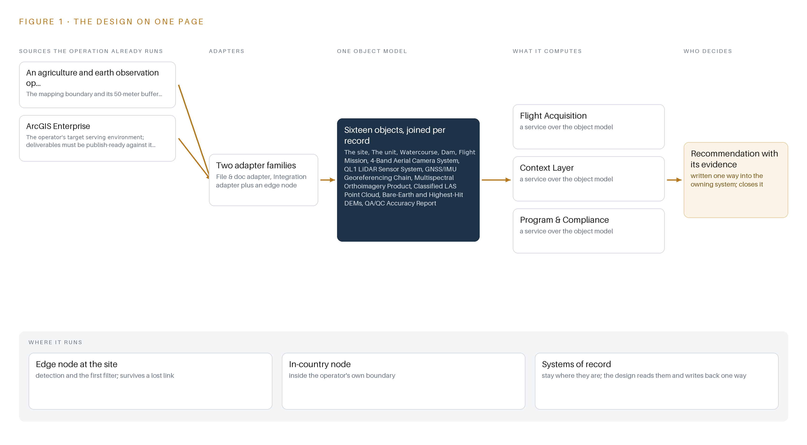
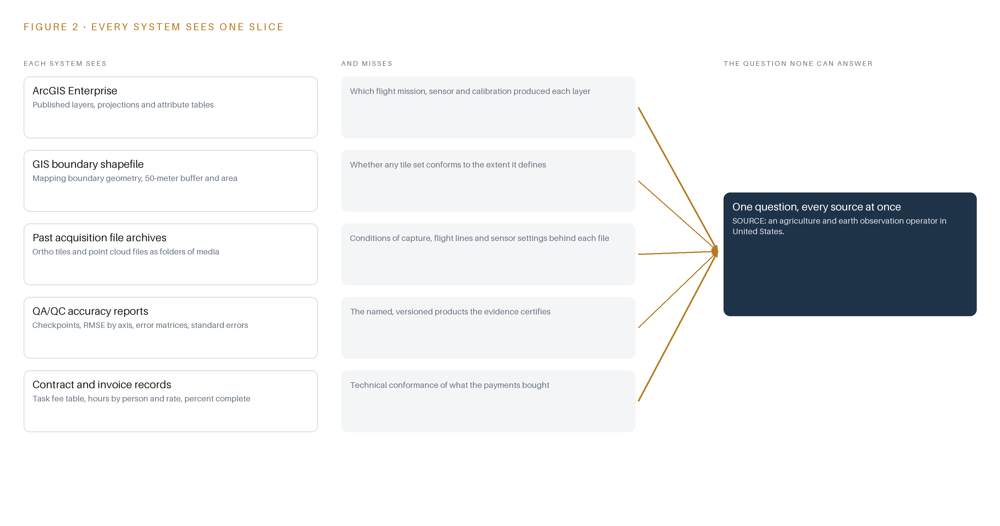
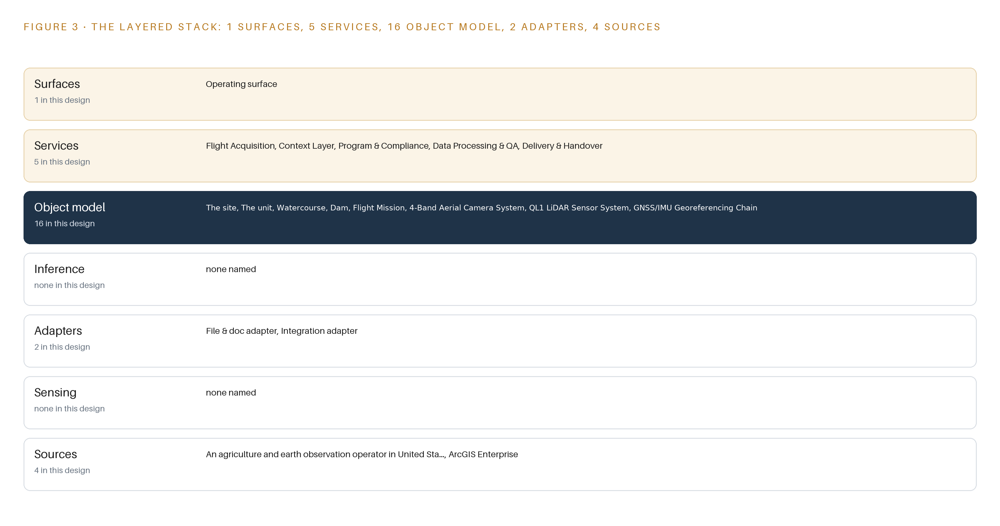
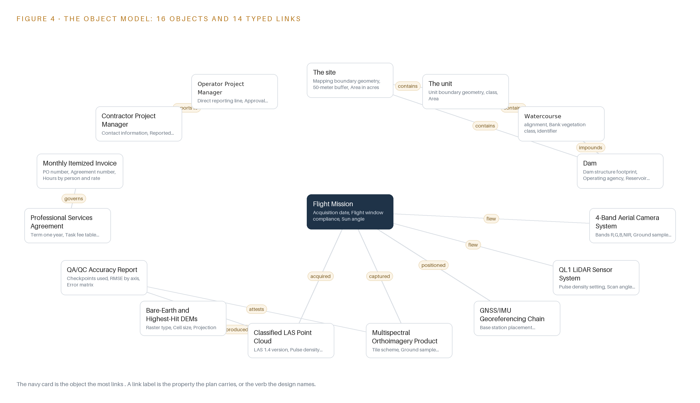
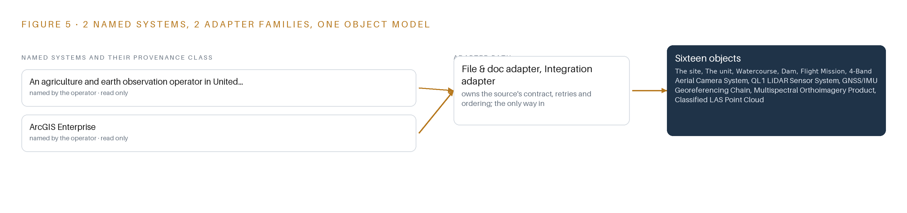
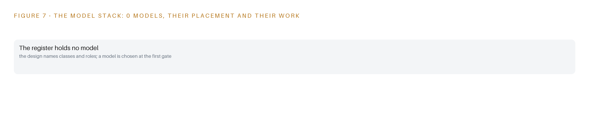
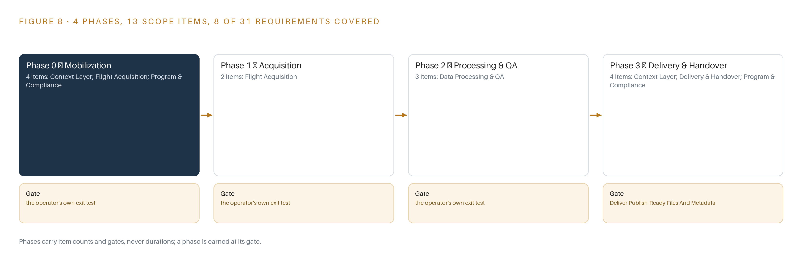
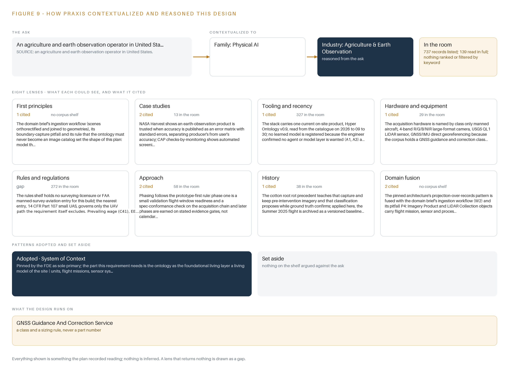

# Baseline: One Flight of 4 Band Orthoimagery and LiDAR for Vegetation Mapping

Canonical: https://codeatoms.ai/vegetation-mapping-lidar-us/
DOI: https://doi.org/10.5281/zenodo.23186673
PDF: https://codeatoms.ai/vegetation-mapping-lidar-us/paper/baseline-orthoimagery-lidar-vegetation-mapping-us.pdf
License: CC BY 4.0
Publisher: CodeNinja Atoms (https://codeatoms.ai), a fully owned subsidiary of CodeNinja

VERTICAL-DRIVEN ARCHITECTURES · AGRICULTURE & EARTH OBSERVATION · DESIGNED WITH PRAXIS · OCTOBER 2026

# Baseline: One Flight of 4 Band Orthoimagery and LiDAR for Vegetation Mapping

A one-flight acquisition of 3-inch 4 band orthoimagery and USGS QL1 LiDAR over the site of an agriculture and earth observation operator in United States, bound into a living ontology the operator's staff analyze in the GIS tools they already run.

CodeNinja Engineering Team

For the operator's project manager, its GIS and stewardship leads, and the data, geospatial and platform engineers who would build and run it.

---

Vertical-Driven Architectures is a CodeNinja series of system designs. Every design in the series is driven by a real-world problem and scenario in a single industry, and every one is designed on Praxis, CodeNinja's platform for designing physical AI systems. Operations are described by class, never by name.

At a glance

## One flight of imagery and LiDAR for vegetation mapping in the United States

**What this is.** An open reference architecture for system design in physical AI: one summer flight of 3-inch 4-band orthoimagery and USGS Quality Level 1 LiDAR, with every tile, point cloud and elevation model bound into a site ontology, so the next season starts from a comparison instead of rediscovery. It is written for the operator's project manager, its GIS and stewardship leads, and the geospatial and data engineers who would build it. The operator is described by class, never by name.

**The answer in numbers.**

| Part | The design |
| --- | --- |
| Acquisition | One manned flight within a week either side of 1 July; 3-inch 4-band (red, green, blue, near infrared) orthoimagery and Quality Level 1 LiDAR at a minimum of 8 pulses per square meter |
| Sources joined | 4 named sources through 2 adapter families |
| Object model | 16 typed objects, with the flight mission as the focal object, published as JSON for reuse |
| Models | None: vegetation analysis stays with the operator's own analysts |
| Ground | The operator's ArcGIS Enterprise; nothing runs in a cloud the operator does not control |
| Three-year cost | No compute to price; the acquisition is priced by the survey firm against the operator's own task table (Appendix A) |
| Human control | The operator's project manager accepts each deliverable against the QA/QC accuracy report |

**Reuse it.** The object model, the model register and the figures are free to reuse under CC BY 4.0. Cite as DOI <https://doi.org/10.5281/zenodo.23186673.>

**Made with.** Reasoned on [Praxis](<https://codeatoms.ai/praxis/>), CodeNinja's platform for designing physical AI systems. The object model imports into [Hyper Ontology](<https://codeatoms.ai/hyper-ontology/>), which turns it into a living system. Both are in beta; access by request.

ABSTRACT

## A Flight Should Leave Behind More Than Files

The question this operation needs answered is what vegetation and terrain conditions exist across its site during the narrow summer window around 1 July, and whether every acre inside the mapping boundary was flown, processed, verified and accepted to specification. Today it cannot answer that from its own records: past aerial deliveries arrive as tile archives, point clouds and invoices that no staff member can join to units, flight missions, sensor systems or seasons, so each flight season starts with rediscovery instead of comparison, and the record of what was flown, on which day, with which sensor and at what accuracy lives in scattered documents rather than in one queryable model.

The design is a one-year, one-flight acquisition of 3-inch 4-band orthoimagery and USGS QL1 LiDAR inside the July 2025 window, handed over as publish-ready files under the agreement's terms, with every deliverable bound into a living 16-object site ontology the operator owns outright. Four named sources enter through 2 adapter families into the object model, 5 services carry the work from boundary confirmation to handover, and 1 operating surface gives staff the joined view; 0 models are served because vegetation analysis stays with the operator's own analysts. The acquisition runs on a manned aircraft flown by the survey firm, processing runs in the survey firm's own pipeline, the object model is anchored in the operator's ArcGIS Enterprise, and nothing runs in a cloud the operator does not control.

The paper proceeds in order: the industry problem and the fixed flight window; the join failure across past deliverables; the four constraints and the scoping decisions; the stack from aircraft to archive; the 16-object model and where the human loop sits; ingestion through the 2 adapter families; inference placement, which is deliberately empty of compute; models and licenses, where the register holds zero models by choice; the 4-phase rollout with its gates and 31-requirement coverage; ownership of the record; and the Praxis chapter that traces every choice back to what justified it.

---



Figure 1. Baseline on one page: the sources the operation already runs, one object model, what it computes, and the person who decides.

## Contents

Each chapter is tagged for the reader it serves most directly: Executive, Team Lead, FDE, Reference.

|  |  |  |
| --- | --- | --- |
|  | Abstract · A Flight Should Leave Behind More Than Files | Executive |
| PART I · THE PROBLEM | | |
| 1 | [One Week in July Decides a Year of Vegetation Mapping](#ch1) | Executive |
| 2 | [Every Deliverable Arrives as Files No Record Joins](#ch2) | ExecutiveTeam Lead |
| PART II · THE DESIGN | | |
| 3 | [Four Constraints Shape the Acquisition and Its Record](#ch3) | Team Lead |
| 4 | [One Stack Runs From Aircraft to the Operator's Archive](#ch4) | Team LeadFDE |
| 5 | [Sixteen Objects Turn One Flight Into an Argument](#ch5) | FDE |
| 6 | [Every Source Enters Through an Adapter, Never Directly](#ch6) | FDE |
| 7 | [No Inference Runs, and That Is the Design](#ch7) | FDE |
| 8 | [Zero Models Means the License Question Disappears](#ch8) | FDEExecutive |
| PART III · THE ROLLOUT | | |
| 9 | [Readiness Gates Come Before the Flight Window Opens](#ch9) | Team LeadExecutive |
| 10 | [The Operator Owns the Record, Not Just the Files](#ch10) | Executive |
| PART IV · HOW IT WAS DESIGNED | | |
|  | Conclusion · A Flight Becomes Knowledge When the Record Survives | Executive |
| 11 | [How Praxis Contextualized and Reasoned This Design](#ch11) | Team LeadFDE |
|  | [Sources](#sources) | Reference |

PART I · CHAPTER 1

## One Week in July Decides a Year of Vegetation Mapping

The operation needs a seasonal 4 band orthoimagery and LiDAR baseline over its site, and a flight window of one week either side of 1 July means preparation, not the flight itself, decides whether the year's mapping succeeds.

The abstract framed this design as one seasonal flight bound into a record the operator owns outright. This chapter states the problem behind that design: the question the operation needs answered each year, the documented cost of answering it badly in this industry, and the scenario as it actually runs.

### 1.1  The Question, the Data and the Regulatory Ground

The question the operation needs answered is direct: what is the vegetation and land-cover state of the site this season, at a resolution fine enough to support stewardship decisions, with accuracy evidence strong enough to defend every figure derived from it. Answering it requires four kinds of data captured in a single coordinated effort. The first is orthoimagery, aerial imagery geometrically corrected so that every pixel sits at its true map position, acquired as 3-inch 4-band imagery, meaning each ground point is imaged in red, green, blue and near-infrared at a ground sample distance of 3 inches, the size of the ground each pixel covers. The second is a LiDAR point cloud at quality level 1, the top accuracy tier of the United States Geological Survey's classification ladder, in which laser returns from an aircraft are classified into ground and non-ground points. The third is the derived surface pair: a bare-earth digital elevation model and a highest-hit digital elevation model, rasters that describe the ground surface and the top of the canopy respectively. The fourth is a QA/QC accuracy report recording the checkpoints used, the root mean square error by axis, and the error matrix that separates the accuracy of the mapmaker from the accuracy a user of the map can expect. The regulatory ground is layered. The operator is a special district formed by the Legislature in 1933 to manage groundwater, so public-agency procurement rules govern how the work is awarded, and the United States Geological Survey's quality level 1 specification sets the accuracy bar the point cloud must meet. State prevailing wage law may apply to the flight and processing crew depending on classification, equal employment opportunity requirements apply to the awarded agreement, the agreement carries an insurance schedule with named endorsements, and records must be retained for three years. National aviation rules govern the manned survey flight itself, and because the requirement excludes unmanned aircraft, the rules that apply are those for manned survey aviation rather than the small-drone rule most imagery buyers know.

### 1.2  What the Industry Documents About Acting Without Good Evidence

The cost of the problem is documented at the industry level, and it is a cost of deciding without systematic evidence. Researchers who study agricultural injuries argue that hazards in production agriculture are hard to address without systematic surveillance, because the people accountable need ongoing data on workplace risks before they can improve anything (ResearchGate n.d.). The same industry carries a heavy documented burden when that evidence is absent: farm accidents and deaths were found to cost the agricultural sector more than one billion dollars per year (ABC 2010). Agriculture ranks among the most hazardous industries in the world, and figures from Great Britain showed a spike in fatalities in the industry in 2021 (IOSH Magazine 2021). In the United States, the National Ag Safety Database puts the toll at between 60 and 70 farmers killed per 100,000 every year (Watch Us Grow n.d.), and federal investigation reports record individual cases in detail, including one farmer who died in 2001 from injuries sustained when thrown from the tractor she was operating (CDC 2001). The lesson this design takes from that record is about evidence discipline: decisions on agricultural land are only as good as the systematic, dated, georeferenced observation behind them, and a seasonal observation missed is a season of decisions made from stale evidence. The flight window in this scenario is therefore not a scheduling detail; it is the year's only chance to capture the baseline.

### 1.3  The Operation as a Scenario

The operation runs a small estate of systems against a large physical responsibility. Its named systems number two: a GIS boundary shapefile holding the mapping boundary geometry and its 50-meter buffer, which defines the acquisition extent and every area figure, and ArcGIS Enterprise, the serving environment into which the operator's own staff publish and analyze imagery. The scale is banded simply: one site, one flight, one window of one week either side of 1 July 2025, and one seasonal baseline. No area figure is asserted in this paper because every area figure derives from the confirmed boundary, and storage, transfer and processing effort are all sized from that boundary before mobilization. The people in the loop number three named roles: the district project manager, who holds the direct reporting line and approval authority over personnel changes; the contractor project manager, who reports to that line and carries team assignments; and the operator's GIS staff, who publish the files into ArcGIS Enterprise and analyze vegetation in the tools they already use. The physical environments are varied and demanding: recharge basins and wetted areas, open land cover, and vegetation along the, where dense canopy forms the hardest LiDAR environment on site. The regulatory ground is the one described in section 1.1. The count that closes the scenario: the design binds two named systems, two adapter families, sixteen objects, five services, one surface and zero models into a single record, against thirty-one tracked requirements in the baseline.

PART I · CHAPTER 2

## Every Deliverable Arrives as Files No Record Joins

Past acquisitions produce tiles, accuracy reports and invoices that sit side by side without joining to units, flight missions, sensor systems or seasons, and that separation is where area figures, coverage claims and accuracy evidence get lost.

Chapter 1 showed a scenario in which one flight decides a year of vegetation mapping. This chapter shows why the records left behind by past acquisitions cannot answer the questions the next season asks, system by system, and what that separation costs in practice.

### 2.1  What Each System Sees Alone

Each system the operator holds sees one slice of the acquisition. ArcGIS Enterprise sees the published layer: the map service its own staff clicked into existence, with its projection, its symbology and its attribute table. It does not see which flight mission captured the source frames, which camera and calibration produced them, or under what sun angle and weather the frames were taken, so two layers from different seasons look like siblings when they are not. The GIS boundary shapefile sees the extent: the mapping boundary geometry, its 50-meter buffer and the acreage that follows from them. It does not see whether any particular tile set actually conforms to that extent, so coverage claims are asserted rather than reconciled. The file archives from past acquisitions, folders of ortho tiles and point clouds on flash drives, see the pixels and the points themselves. They do not see the conditions of capture, the flight lines flown or the sensor settings, so a suspicious tile cannot be traced back to the mission that produced it. The accuracy reports see the evidence: checkpoints, root mean square error by axis, error matrices and standard errors. They do not see the tiles they certify as named, versioned objects, so accuracy evidence floats free of the imagery it describes. The contract and invoice records see the money: the task fee table, hours by person and rate, percent complete per task. They do not see any technical conformance, so a payment can be fully documented and the underlying product still unverifiable. Figure 2 sets these slices side by side.



Figure 2. Five systems, each seeing one part of the answer. the question needs all of them in one place at once.

### 2.2  What None of Them See Together

What none of them see is the join: the chain that runs from a unit of land, through the flight mission and the sensor systems that observed it, to the imagery and point cloud products, to the accuracy report that certifies them, to the agreement and the invoices that paid for them. That chain is where area figures, coverage claims and accuracy evidence live or die. When the boundary register and the imagery are not joined, an area figure can be questioned and there is no single place to reconcile it. When coverage is not reconciled to geometry, a gap in the tiles is discovered by whoever analyzes the layer, months after the window to refly has closed. When accuracy evidence is orphaned from the products it certifies, a challenge to a figure means reconstructing the certification by hand from documents. And when a fourteen-day termination right can end the agreement, records scattered across these slices leave the operator holding fragments rather than a model. The cost in practice is that every one of these questions is answerable in principle from data the operator already holds, and answerable in practice only through manual effort that starts over each season. Figure 2 summarizes the gap each system carries.

PART II · CHAPTER 3

## Four Constraints Shape the Acquisition and Its Record

The fixed flight window, the excluded UAV path, publish-ready-files-only delivery and the one-year term each close a door, and the scoping decisions in this chapter state what each closed door buys and what it costs.

Chapter 2 showed that the join, not any single system, is what past acquisitions never produced. The design answers that with a record built around the acquisition, and the shape of that record is fixed by four constraints that each close a door.

### 3.1  Hold the Fixed Seasonal Window

The imagery must be flown within one week either side of 1 July 2025. This is hard in this industry because the window exists for a biological reason: the baseline must catch vegetation at the same phenological point each season, so a flight two weeks late compares against nothing. The failure mode is concrete, since coastal stratus or cloud can close the entire week, and a missed window is a missed season. The design therefore treats window readiness as a work product in its own right: multiple ready days are planned across the window, cloud-free-day forecasting is part of acquisition planning, and the district project manager is notified the moment a ready day opens.

### 3.2  Fix the Acquisition Class Before the Aircraft Flies

The requirement states that data from unmanned aircraft will not be considered, so the acquisition class is fixed: a manned aircraft carrying a 4-band large-format camera and a quality level 1 LiDAR sensor. This is hard because quality level 1 vertical accuracy is not decided by the sensor alone but by the whole positioning chain: the aircraft's GNSS/IMU georeferencing, meaning satellite positioning fused with inertial measurement, plus the correction source, either network corrections or an owned base station. The design specifies that chain as a class, with baselines, correction source and test evidence to standard procedures, rather than by part number, because no shelf entry covers aerial survey cameras or LiDAR sensors and the survey firm's turnkey rates already price the equipment.

### 3.3  Keep Publication with the Operator

The survey firm hands over publish-ready files and loads nothing into the operator's environment. This is hard because publish-ready is a conformance claim, not a courtesy: the tile scheme, 3-inch ground sample distance, band set and projection must match the operator's ArcGIS Enterprise exactly, and format translation to those shapes is committed as a class built on open GDAL utilities, the open-source geospatial format library. The design buys with this constraint a clean boundary: the operator's system of record is never touched by an outsider, and provenance metadata binds every file to the mission, sensor and processing steps behind it.

### 3.4  Make Every Phase Boundary an Exit Point

The agreement runs a minimum one-year term, and the operator holds a fourteen-day termination right. This is hard because a terminated acquisition normally strands the buyer with partial files and no way to say what they are. The design makes every phase boundary an exit point: each of the four phases leaves the operator holding complete, labeled records, and the export of the living ontology is rehearsed in the final phase so the model survives any exit. Sixteen objects, from the site and its units through flight missions, sensor systems and products to the agreement and invoices, carry the record.

### 3.5  Scoping Decisions and Their Prices

Three scoping decisions turn these constraints into a buildable plan, each with a price. Table 1 states them.

Table 1 · Scoping Decisions

| Decision | What it buys | What it costs |
| --- | --- | --- |
| Hand over publish-ready files only, with publication owned by the operator's GIS staff | The operator's system of record is never loaded by an outsider and its staff own every layer they serve | No automated publication, so format, projection and tile-scheme conformance must be proven before handover |
| Baseline the LiDAR at the quality level 1 minimum of 8 pulses per square meter, with the higher-density task priced separately | A baseline whose price the operator's own task table fixes, with the denser option exercisable later at the operator's option | Fewer returns in dense canopy, the hardest environment on site, so classification QA must gate on canopy and margin checkpoints |
| Build sixteen objects and no models: the ontology is the only living layer | Zero inference operations, no weights to license and no serving hardware to run | Analysis stays with the operator's staff in the tools they already use rather than moving into agents |

### 3.6  What the Design Chose Against

Each choice against a named alternative states where the design could have gone otherwise and why it did not. Table 2 records them, closing with what sits outside scope.

Table 2 · What the Design Chose Against

| Where | What was picked | Instead of, and why |
| --- | --- | --- |
| Acquisition platform | Manned aircraft with 4-band camera and quality level 1 LiDAR | Instead of a UAV or drone fleet: the requirement states UAV and drone data will not be considered, so the class is fixed by the operator's own terms |
| Data handover | Publish-ready files with provenance metadata | Instead of loading directly into the operator's ArcGIS Enterprise: publication stays with the operator's own GIS staff, keeping the boundary of section 3.3 |
| LiDAR task | Task 3a quality level 1 at a minimum of 8 pulses per square meter | Instead of the Task 3b high pulse count at 16 pulses per square meter: the operator's own task table prices both, so the baseline is 3a and 3b remains the operator's option |
| Record scope | A system of context over the operator's own records, as the sole primary pattern | Instead of agentic layers or a work surface where staff build agents: no agent or model layer was wanted for this acquisition, so every serving layer that would carry one reads not needed |
| Out of scope | The 2025 seasonal baseline and its record | Repeated flights beyond the baseline, downstream vegetation analysis by the operator's staff, and the requirement's proposal-submittal mechanics, which govern the award process rather than the system |

PART II · CHAPTER 4

## One Stack Runs From Aircraft to the Operator's Archive

The architectural pattern places systems of record below, a 16-object model in the middle, and 5 services with 1 operating surface above, with no streaming, no serving and no running system to monitor because the engagement is batch by nature.

Chapter 3 fixed the constraints: a single flight inside a fixed summer window, publish-ready files rather than a loaded environment, an ontology the operator owns outright, and no cloud layer of any kind. This chapter places those constraints into a stack that runs from the aircraft to the operator's own archive.

### 4.1  Records Below, One Model in the Middle, People Above

The design follows a system of context pattern in three layers of fixed order. Systems of record sit below and are never replaced, never modified and never loaded into a shadow copy: ArcGIS Enterprise and the operator's own file holdings remain the truth, and the survey firm's processing pipeline stays outside the boundary. The object model sits in the middle as a projection over those records, so crossing mappings answer questions that no single file can. Applications and people sit above, and the top of the stack is deliberately thin: this is a batch acquisition with a fixed seasonal window, so there is no streaming workload, no serving runtime and no running system to monitor. Figure 3 shows the layered stack with the counts per layer: 4 sources, 2 adapter families, 16 objects, 5 services, 1 operating surface and 0 models. The pattern fits for three reasons. A one-flight acquisition produces files and records whose value is provenance, and a projection over records carries that provenance without owning the bytes. The operator's own staff analyze vegetation in the tools they already use, so no serving layer is needed between the files and the analysis. And a projection can be rebuilt: if the fourteen-day termination right ends the engagement at any phase boundary, the operator still holds complete, labeled records and the model can be re-derived from them.



Figure 3. The layered stack: 4 sources, 2 adapter families, 16 objects, 5 services and 1 surfaces.

### 4.2  The Stack Stage by Stage

Table 3 walks the stack from sources to surfaces and names the components that fill each stage. The Inference stage looks empty, and the emptiness is the scoping decision from Chapter 3: no learned model serves anywhere in this design, so vegetation classification stays with the operator's analysts rather than with a model.

Table 3 · The Stack, Stage by Stage

| Stage | What it is responsible for | How |
| --- | --- | --- |
| Sources | Holds the four inputs the design reads: the operator's GIS boundary shapefile, ArcGIS Enterprise, the survey firm's acquisition records and the deliverable file set | Read in place; nothing is modified and nothing is loaded into a new store |
| Sensing | The manned aircraft with its 4-band R/G/B/NIR camera, QL1 LiDAR sensor and GNSS/IMU georeferencing chain | Owned and flown by the survey firm; the design specifies the equipment class, not a part number |
| Adapters | The file & doc adapter and the integration adapter; every byte enters through one of these two families | Provenance stamping, conformance checks against the confirmed boundary, and checksum verification at transfer |
| Object model | The 16-object site ontology anchored in ArcGIS Enterprise | Nouns become objects, facts become properties, relationships become typed links; versioned and operator owned |
| Inference | Nothing in this design | No learned model serves anywhere; classification and analysis stay with the operator's people in their own tools |
| Services | Flight Acquisition, Context Layer, Program & Compliance, Data Processing & QA, Delivery & Handover | Five named services coordinate the phases from mobilization to retention |
| Surfaces | One operating surface where the operator's people work | Publish-ready files and the ontology, read through the tools the operator already runs |

PART II · CHAPTER 5

## Sixteen Objects Turn One Flight Into an Argument

The object model carries the site, units, assets, flight missions, sensor systems, products and records as typed, versioned objects anchored in ArcGIS Enterprise, so an analyst can from a vegetation class to the mission that captured it.

Chapter 4 put a 16-object model in the middle of the stack. This chapter names all sixteen objects, wires them together with typed links, and fixes where the human loop, the hosting boundary and the only write path sit.

### 5.1  Sixteen Objects and Their Typed Links

The sixteen objects group into four families. The place objects describe the ground: the site carries the mapping boundary geometry, its 50-meter buffer, the area in acres and the acquisition purpose, and walks a status vocabulary from acquisition pending to accepted; the unit carries each unit's boundary, class, area and stewardship owner; the watercourse carries its alignment, bank vegetation class and identifier; and dam carries the structure footprint, the operating agency and the reservoir pool extent. The acquisition family records how the data was captured: flight-mission holds the acquisition date, flight window compliance, sun angle, weather conditions and flight lines flown, with statuses planned, flown, reflown and aborted; 4-band-aerial-camera-system and ql1-lidar-sensor-system hold band set, ground sample distance or pulse density setting, scan angle and calibration dates; and gnss-imu-georeferencing-chain holds base station placement, correction source and test evidence. The product family holds what the flight produced: multispectral-orthoimagery-product with tile scheme, 3-inch ground sample distance, bands and projection; classified-las-point-cloud with LAS 1.4 version, achieved pulse density, classification schema and vertical accuracy; bare-earth-and-highest-hit-dems with raster type, cell size and source mission; and qa-qc-accuracy-report with checkpoints, RMSE by axis, error matrix and standard errors. The governance family holds the engagement itself: professional-services-agreement, monthly-itemized-invoice, contractor-project-manager and the operator's project manager. Figure 4 shows every object and its typed links. The is the point: an analyst can start at a bank vegetation class, walk to the unit that contains it, to the flight mission that captured the imagery over it, to the sensors and georeferencing chain that positioned it, to the accuracy report that attests to it, and to the invoice line that paid for it. A document store can hold all of these as files; it cannot answer any question that crosses between them, because nothing in it links a tile to a mission, a sensor and a payment in one traversal.



Figure 4. The sixteen objects of the model and the typed links that let a query reach across them.

### 5.2  The Human Loop and the Hosting Posture

The human loop sits at two places: the contractor project manager reports through a direct line to the operator's project manager, who holds approval authority over personnel changes and signs each phase gate. Hosting follows the operator's own requirement: the model is anchored in ArcGIS Enterprise, the files stay inside the United States, and the publish-ready products fall under the operator's existing access controls and confidentiality obligations. There are no external links out of the model. The only write path is the Context Layer service binding records into the ontology at handover; no other service, and no contractor process, writes to it.

### 5.3  One Object in Its Recorded Form

The site object below shows the grammar in a single record: geometry, buffer and area as properties, purpose as context, and a status vocabulary that walks from acquisition pending to accepted.

```
{
  "id": "the-site",
  "label": "The site",
  "kind": "site",
  "anchored_in": "ArcGIS Enterprise",
  "properties": [
    "Mapping boundary geometry",
    "50-meter buffer",
    "Area in acres",
    "purpose"
  ],
  "status_vocabulary": [
    "Acquisition pending",
    "Flown",
    "Processed",
    "Delivered",
    "Accepted"
  ],
  "links": [
    {
      "to": "the-unit",
      "label": "contains"
    },
    {
      "to": "dam",
      "label": "contains"
    }
  ]
}
```

PART II · CHAPTER 6

## Every Source Enters Through an Adapter, Never Directly

Four named sources, from the boundary shapefile to ArcGIS Enterprise, enter through 2 adapter families that guarantee provenance classes, conformance to the confirmed boundary and file integrity before anything becomes an object.

Chapter 5 fixed what the ontology holds and who may write to it. This chapter fixes how bytes become objects: four sources, two adapter families, and a batch event backbone instead of a stream.

### 6.1  Four Sources and Their Provenance Classes

Figure 5 maps the integration. Two sources are operator-held: the GIS boundary shapefile, whose mapping boundary and 50-meter buffer define the acquisition extent and every area figure, and ArcGIS Enterprise, the target serving environment against which the products must be publish-ready without the survey firm loading anything. Two sources are contractor-produced: the acquisition records, which include flight logs, sensor calibration certificates and georeferencing test evidence, and the deliverable file set of ortho tiles, LAS point clouds, DEMs and the QA/QC accuracy report. The operator-held pair enter through the integration adapter, which reads in place; the contractor-produced pair enter through the file & doc adapter, which takes custody of files at transfer. Both families stamp a provenance class on every object they emit.



Figure 5. The 4 named systems, the adapter path each one takes, and the object model they all map into.

### 6.2  What the Adapter Tier Guarantees

The adapter tier guarantees four things before anything becomes an object. Provenance: every object carries the class of the source it came from, so an analyst can always tell operator records from contractor products. Conformance: geometry is verified against the confirmed boundary before flight, and post-flight coverage is reconciled to the same boundary, because a wrong or incomplete shapefile silently changes the extent and every area figure. Integrity: every file is checksummed at transfer and again at binding, so a corrupt tile or a truncated point cloud is caught before it is modeled. Idempotence: rebinding the same file yields the same object at the same version, never a duplicate. Adapters read and bind; they never write back to the systems of record.

### 6.3  A Batch Backbone Instead of a Stream

The event backbone is deliberately a batch manifest rather than a streaming broker, because this engagement has no continuous workload to order. Ordering comes from the handover manifest, which fixes one sequence over the tiles, point clouds, DEMs and reports so that binding is reproducible. Delivery runs on the two channels the requirement allows, flash drive and secure transfer. Buffering is a staging area where incoming files wait for the conformance and integrity checks of section 6.2 before they touch the model. Replication is the operator's own archive: each accepted object exists as the anchored record in ArcGIS Enterprise, the source file, and a retained copy under the three-year retention schedule. A stream would add a running system to monitor for no workload to carry, so the design carries none.

PART II · CHAPTER 7

## No Inference Runs, and That Is the Design

The inference tiers are empty by decision rather than omission: classification, orthorectification and georeferencing run in the survey firm's pipeline, the operator acts on deliverables in its own tools, and the design states what that placement costs.

Chapter 6 closed the ingestion story: every named source enters through one of two adapter families, and the event backbone is absent because this is a batch acquisition, not a stream. That absence raises the obvious next question about the layers above ingestion. This chapter answers it: where inference runs, what the latency budget is, and what crosses the network boundary when the design places no inference at all.

### 7.1  Every Tier Sits Empty by Decision

The standard stack for this series places inference at three tiers: model serving at the edge, language model serving on site, and a frontier inference cluster for large open-weight models. Figure 6 shows all three tiers for this design, and each is marked empty on purpose. No inference runs at any edge because nothing moves that this design tracks; the deliverables are static imagery tiles and point clouds, and the aerial frames belong to the survey firm, arriving only as orthorectified products. No language model runs on site because no work surface was committed and no language workload exists in the requirement. No frontier cluster is sized because the work surface was declined, so there is no open-weight model to serve and no key-value cache to budget; the KV cache, the memory a language model spends while attending to context, is a concept this design never reaches. What runs instead runs inside the survey firm's own pipeline. Orthorectification, which warps each aerial frame to the ground geometry, radiometric correction and point-cloud classification are the firm's processing steps, priced into its turnkey rates. Georeferencing runs in the aircraft's GNSS/IMU chain at the moment of capture, under the positioning class specified in Chapter 8. The operator's staff then act on the deliverables in the tools they already use, and the ontology makes those analyzes joinable to units, missions and seasons without a model in the loop. Because the register holds no weights, no fine-tunes and no serving runtime, the memory arithmetic that normally governs this chapter, model weights against usable memory with a KV cache ceiling above it, has nothing to compute. The design's quality argument moves to evidence instead: accuracy is published as an error matrix with standard errors, separating producer's from user's accuracy, because surveillance arguments in agricultural safety show that hazards cannot be addressed without ongoing, systematic data rather than a single point estimate (ResearchGate n.d.).


Figure 6. Where each tier runs, what runs there, and the narrow set of outputs that cross the boundary.

### 7.2  The Latency Budget Runs on a Season

There is no session latency to budget, because nothing is served interactively. The binding latency is seasonal: the imagery must be flown within one week either side of 1 July 2025, so the design plans multiple ready days across that window and treats a missed window as a missed season. Inside that constraint the budget has three parts: planning latency, measured in ready days and the moment a notification goes to the operator's project manager; processing latency, which lives inside the survey firm's pipeline and ends at conformance verification; and handover latency, the time for publish-ready files and metadata to move on media. The one measured figure the rollout tracks is orthoimagery ground sample distance against a 3-inch nominal, and the fault it watches for is a missed flight window.

### 7.3  Media Crosses the Boundary, and Nothing Else Does

What crosses the network boundary is delivery media and secure file transfer, not telemetry. No standing link exists, so there is no link to drop and no power path to fail at an edge node; no update path exists because no model is updated. Identity on the operator's side falls under its existing access controls and its confidentiality obligations. The real failure surface is elsewhere: stratus or cloud closing the flight window, a mapping boundary shapefile that proves wrong, media transfer failing, and the 14-day termination right in the agreement stranding partial work. The design answers each in kind: multiple ready days, boundary capture treated as a verified phase item, storage and transfer sized from the confirmed boundary before mobilization, and every phase boundary leaving the operator holding complete, labeled records with an ontology export rehearsed in the final phase.

PART II · CHAPTER 8

## Zero Models Means the License Question Disappears

The model register is empty on purpose, the hardware register holds one named class, the GNSS guidance and correction chain that actually decides QL1 accuracy, and the equipment is otherwise specified by class because the survey firm's turnkey rates price it in.

Chapter 7 emptied the inference tiers by decision and moved the quality argument onto evidence. That decision reaches further than placement: it removes the model register, and with it the license question that usually decides what an operator can own. This chapter states the empty register as a position, names the one hardware class that carries the accuracy argument, and records every choice in the register table.



Figure 7. The zero models, their placement, and the work each one does.

### 8.1  An Empty Register Is a License Position

Figure 7 shows the model stack, and it shows no model layers: no learned model, no fine-tune, no serving runtime and no registry workload. The register is empty because the design decision was confirmed with the operator's engineer that no agent or model layer is wanted; vegetation analysis is performed by the operator's own staff downstream, in its own tools, and no model is trained in this engagement. Because there are zero models, there is no license to hold, no license terms to honor and no license trigger to monitor. The usual argument of this chapter, that a given license permits the operator to hold its weights, has no weights to argue about. Ownership instead runs through the professional services agreement and through the ontology, which the operator owns outright: the contract, insurance, invoicing and intellectual property clauses of the requirement became compliance and phasing items, and the agreement carries the task fee table, insurance certificates and prevailing wage determination. The license question does not shrink here; it disappears, and the contract takes its place.

### 8.2  One Hardware Class Carries the Accuracy Argument

The hardware register holds one named class: the GNSS guidance and correction service. United States Geological Survey Quality Level 1, the accuracy tier the LiDAR must meet, is decided by the aircraft's GNSS/IMU direct georeferencing chain plus its correction source, network RTK or an owned base station, so the class is specified with baselines, correction source and test evidence following ISO 12188-style procedures rather than by part number. The acquisition equipment is otherwise named by class only: a manned aircraft, a large-format 4-band camera covering red, green, blue and near-infrared, and a Quality Level 1 LiDAR sensor, because the survey firm's turnkey rates price that equipment in and no shelf class exists for aerial survey cameras or LiDAR sensors. The baseline LiDAR option is a minimum of 8 pulses per square meter; the high-count option at 16 pulses per square meter is priced separately and exercisable at the operator's option. No fixed or thermal cameras exist in this design, no site-installed equipment is placed, and imagery is acquired from a manned aircraft because unmanned data will not be considered.

### 8.3  The Model and Equipment Register

Table 4 records every choice this chapter makes: the models, which are none; the hardware classes and sizing rules; the sensing; the pattern the design stands on; and the ground it runs on.

Table 4 · Model and Equipment Register

| The choice | What was picked | Why here |
| --- | --- | --- |
| Learned model | None; the model register is empty by decision | No agent or model layer was wanted; vegetation analysis stays with the operator's own staff in its own tools |
| License position | No model license exists to hold or trigger | With zero weights, ownership runs through the professional services agreement, not through a license |
| Positioning class | GNSS guidance and correction service, with network RTK or an owned base station | Quality Level 1 accuracy is decided by this chain, so it is specified by baselines, correction source and test evidence |
| Acquisition platform | Manned aircraft with a 4-band red, green, blue and near-infrared large-format camera | Unmanned data will not be considered, so the acquisition class is fixed by the requirement |
| LiDAR sensing | Quality Level 1 sensor at a minimum 8 pulses per square meter | The 16 pulses per square meter option is priced separately and exercisable at the operator's option |
| Pattern the design stands on | System of Context, with the ontology as a projection over the systems of record | Deliverables carry flight mission, sensor and processing provenance, so analysis joins to units, missions and seasons rather than to tiles |
| Ground it runs on | The operator's ArcGIS Enterprise environment in the United States | Files are publish-ready, and publication stays with the operator's own GIS staff inside its own boundary |

PART III · CHAPTER 9

## Readiness Gates Come Before the Flight Window Opens

Four phases carrying 13 items move from mobilization through acquisition and processing to handover, each gate earned on stated evidence rather than calendar dates, with 8 requirements covered and 23 held as open or excluded by the baseline.

Chapter 8 closed the design with the model and equipment register and the ground the acquisition runs on. This chapter turns that design into a sequence a program manager can run: four phases carrying 13 items, gates earned on stated evidence rather than calendar dates, the measures that decide conformance, the failure modes the design already plans for, and the questions the baseline leaves open.

### 9.1  Four Phases and Thirteen Items

The rollout runs as four phases carrying 13 items in total, where an item is a named piece of work and a gate is a statement of evidence that must exist before the next phase begins. Workstreams draw on the five services of the design: Flight Acquisition, Context Layer, Program & Compliance, Data Processing & QA, and Delivery & Handover. Figure 8 shows the phases, their item counts, their workstreams and the requirement coverage of the baseline. Phase 0, mobilization, carries 4 items across the Context Layer, Flight Acquisition and Program & Compliance workstreams. Among them are three named in the plan: confirm the boundary, formats and projections; model the objects before flight, so the 16-object ontology stands before any aircraft moves; and file the insurance certificates and endorsements the agreement requires. The phase exits when the boundary geometry is verified against the register and the object model is in place, because a wrong or incomplete boundary silently changes the acquisition extent and every area figure downstream. Phase 1, acquisition, carries 2 items in Flight Acquisition: plan the July flight window, and fly the manned multispectral and LiDAR acquisition. The collection condition is fixed by the requirement: imagery flown within one week either side of 1 July 2025. The gate is a Flight Mission object recorded as flown inside that window, with sun angle, weather conditions and flight lines captured as provenance. Phase 2, processing and QA, carries 3 items in Data Processing & QA: run aerial triangulation and sensor calibration; produce the ortho tiles, the classified point cloud and the DEMs; and verify QL1 and imagery conformance. The exit gate is stated evidence of conformance: checkpoints used, RMSE by axis and the error matrix recorded on the QA/QC Accuracy Report object, reviewed and issued. Phase 3, delivery and handover, carries 4 items across Context Layer, Delivery & Handover and Program & Compliance. Its named gate is deliver publish-ready files and metadata. The remaining items bind the deliverables into the ontology, rehearse the ontology export so the living model survives any exit, and hand over records under the three-year retention the agreement requires. Requirement coverage stands at 8 requirements covered and 23 held open or excluded by the baseline. The excluded items are the administrative machinery of the requirement itself: proposal submittal mechanics, addendum acknowledgments, references and the pre-proposal meeting, which a build plan does not carry. The open items concentrate where applicability turns on facts not stated, taken up in 9.5.



Figure 8. The four phases and their gates, and coverage of the 31 requirements across them.

### 9.2  What the Rollout Measures

The rollout measures orthoimagery ground sample distance, recorded in inches against a nominal figure of 3 inches. A reading below the nominal value breaches the measure, and the fault the measure is designed to catch is a missed flight window: off-window or reflight imagery changes the seasonal signal the acquisition exists to record, so the geometric measure doubles as the window's alarm. Conformance on the LiDAR side is verified in Phase 2 through checkpoint testing, with vertical accuracy published as an error matrix with standard errors rather than a single point estimate, and classification QA gated on canopy and margin checkpoints, the hardest environment on site.

### 9.3  Failure Modes

The plan names six failure modes and pairs each with the mechanism that contains it, summarized in Table 5.

Table 5 · Failure Modes

| What fails | What the design does |
| --- | --- |
| Coastal stratus or cloud closes the one-week flight window around 1 July 2025 | Plan multiple ready days across the window with cloud-free-day forecasting and notify the operator's project manager the moment a ready day opens; a missed window is a missed season |
| The mapping boundary shapefile proves wrong or incomplete, silently changing the acquisition extent and every area figure | Treat boundary capture as a phase, not an assumption; verify geometry against the register before flight and reconcile post-flight coverage to it |
| Tile and point-cloud data volume is unknown because the boundary area is not stated, so storage, transfer and effort may be mispriced | Size storage and transfer from the confirmed boundary before mobilization and re-price the pipeline once the area is known |
| QL1 classification degrades over dense canopy | Gate classification QA on canopy and margin checkpoints and publish accuracy with an error matrix and standard errors rather than a point estimate |
| Prevailing wage applicability to the flight and processing crew is unstated and lands as unbudgeted cost after award | Settle the classification with the operator during Phase 0 and load any wage delta into the fully loaded hourly rates |
| The 14-day termination right strands the operator with partial deliverables and no ontology | End every phase with complete, labeled records held by the operator and rehearse the ontology export in Phase 3 so the living model survives any exit |

### 9.4  Lessons

**Treat the boundary as a phase, not an assumption.** The boundary shapefile defines the acquisition extent and every area figure, and it arrives as a file with no accuracy statement attached. The plan spends one of its four mobilization items verifying it against the register before flight and reconciling post-flight coverage to it afterwards, because the cheapest place to find a boundary error is before the aircraft leaves the ground. A missed window is a missed season. The requirement fixes collection to one week either side of 1 July 2025 because the vegetation signal the imagery records exists only at that moment. The plan answers with multiple ready days across the window and immediate notification when one opens, accepting that weather, not effort, is the binding constraint. Accuracy is a distribution, not a point estimate. A single vertical accuracy number hides where classification fails, and dense canopy is exactly where it fails here. Publishing the error matrix with standard errors, and gating classification QA on canopy and margin checkpoints, makes the weak spots visible in the deliverable itself. End every phase holding a complete record. The agreement carries a 14-day termination right, so the operator can be left holding partial deliverables at short notice. The phasing answers it structurally: each phase boundary leaves the operator with complete, labeled records in the ontology, and the export is rehearsed in Phase 3 so the living model survives any exit.

### 9.5  What Is Still Open

Three questions remain open in the baseline. First, prevailing wage applicability to the flight and processing crew is unstated; settling the classification with the operator during Phase 0 would convert an unbudgeted-cost risk into a known wage delta inside the hourly rates, changing the fee table and nothing else. Second, the boundary area is not stated, so storage, transfer and processing effort are sized against a confirmed geometry rather than a figure; settling it would firm the pricing of the pipeline and the delivery media. Third, the rules reading found no entry covering surveying licensure or manned survey aviation, the nearest entry governing only the small unmanned aircraft the requirement itself excludes; settling it would move the compliance items carried as flags into the covered column of the requirement tally, turning 8 covered and 23 open or excluded into a fuller account without altering the design.

PART III · CHAPTER 10

## The Operator Owns the Record, Not Just the Files

Ownership of the object model, the provenance metadata and the decision record stays with the operator through every phase boundary, so termination, short payment or a missed window never strands it with partial, unlabeled deliverables.

Chapter 9 arranged the rollout so that every phase boundary leaves the operator holding complete, labeled records. This chapter states who owns what the design builds, and why that ownership holds through termination, short payment or a missed window.

### 10.1  What the Design Builds and Who Holds It

The object model is owned by the operator outright. The 16 objects and their typed links form a projection over the operator's own systems of record, never a shadow copy held on the survey firm's side, and each phase boundary binds more of the record into it: the flight mission, the products, the QA reports, the invoices. No weights or fine-tunes exist in this design, because the design registers no model; there is no licensed weight to own and no fine-tune to lose, and vegetation analysis runs in the operator's own tools against the handed over products. The decision record lives in the same ontology: the status vocabularies on each object, from flight mission statuses through product QA statuses to invoice and acceptance statuses, are the trail of named decisions, and the operator's project manager holds the direct reporting line and the approval authority recorded on the person object. The boundary holds throughout: delivery is inbound media by flash drive and secure transfer, handed over files fall under the operator's existing access controls and its confidentiality obligations, and the survey firm retains only what the agreement's retention terms require. A 14-day termination, a short-paid invoice or a missed window can strand the operator with fewer deliverables, but never with unlabeled ones.

### 10.2  The Offer Behind the Design

The design is a CodeNinja design, produced on Praxis, the platform that produced this paper and every choice recorded in Chapter 11. Its living record is Hyper Ontology, the object model that turns tiles and point clouds into a site the operator's staff can reason about across units, missions and seasons. Its posture is Sovereign Infrastructure: the operator holds its own hardware and its own environment, nothing leaves the boundary, and the deliverables stay under the operator's access controls in-country. The offer is therefore narrow and deliberate: a system of record the operator owns outright, built on a platform the operator can audit, with no model, no cloud and no dependency that survives a terminated agreement.

PART IV · CONCLUSION

## A Flight Becomes Knowledge When the Record Survives

In one view, the design is a survey procurement turned inside out: the flown imagery and point clouds matter, but the durable product is the 16-object ontology that binds every tile, cloud, DEM, report and invoice to the flight mission, sensor systems and season that produced it, so the one week of July 2025 becomes a versioned baseline that the next season can be compared against rather than a folder that must be rediscovered.

Running the same shape elsewhere takes three things: a survey engagement scoped so that boundary geometry is captured and verified as a phase item rather than assumed; a delivery path that leaves publish-ready files in the operator's own environment with provenance metadata rather than loading anything on its behalf; and an object model owned by the operator from Phase 0, so that even a 14-day termination right leaves it holding complete, labeled records instead of partial files.

PART IV · CHAPTER 11

## How Praxis Contextualized and Reasoned This Design

Every design in the series is produced on Praxis, and this chapter lets a reader trace the 737 records in the room, the eight lenses and the adopted system of context pattern back to what justified each choice.

Chapter 10 assigned ownership of everything the design builds to the operator. This closing chapter shows how the design itself was produced: what Praxis was given, which lenses it read over that material, which patterns it adopted and set aside, and where the reasoning lands. Every design in this series is produced on Praxis, the design team platform for designing physical AI systems, and this chapter exists so that a reader can trace any choice in the paper back to what justified it. Figure 9 shows the ask, the family and industry assigned, what was in the room, the eight lenses, the patterns and the equipment classes in one view.

### 11.1  Contextualizing the Ask

The ask, in the operator's own terms, is a one-year engagement to acquire 3-inch 4-band orthoimagery and USGS QL1 LiDAR over the site inside the July 2025 window and to deliver publish-ready files against the operator's own serving environment, with no loading performed by the survey firm. Praxis assigned the family Physical AI and the Agriculture & Earth Observation industry. What was in the room: 737 records listed, of which 139 were read in full and 598 are available on demand. The records read in full include the requirement itself, its evaluation criteria exhibit, the services agreement, the task fee table and the submittal checklist, so the constraints in Chapter 3 and the compliance items in Chapter 9 trace to specific clauses rather than summaries.



Figure 9. From the ask to the design: the family and industry Praxis assigned, the eight lenses and what each cited, the patterns adopted and set aside, and the equipment the design lands on.

### 11.2  The Lenses

Eight lenses were read over the room, and Table 6 records what each could see, how many of its readings are cited in this design and what each contributed. Seven lenses contributed; one returned nothing for this shape and is shown as a gap rather than filled.

Table 6 · The Lenses and What They Contributed

| Lens | Could see | Cited | What it contributed |
| --- | --- | --- | --- |
| First principles | The ingestion workflow, the boundary-capture pitfall and the rule that the ontology must never become an image catalog | 1 | Set the shape of the plan: model the site first, imagery second |
| Case studies | Earth-observation accuracy reporting and automated screening of agricultural parcels | 2 | Shaped the QA gate: publish accuracy as an error matrix with standard errors, and treat the boundary register, not the imagery, as the truth for area |
| Tooling and recency | The current on-site product shelf | 1 | Carried one current product, the ontology, and registered no learned model because the engineer confirmed no model layer is wanted |
| Hardware and equipment | Aerial survey cameras, LiDAR sensors and positioning chains | 1 | Named the acquisition hardware by class only, with the GNSS guidance and correction class entry as the nearest anchor |
| Rules and regulations | Surveying licensure and manned survey aviation rules | 0 | A gap: the nearest entry governs small unmanned aircraft the requirement excludes, so prevailing wage, equal opportunity and insurance items are flagged as open questions |
| Approach | Phasing rules for validation-first builds | 2 | Set the phase order: readiness confirmed before flight, later phases earned on stated evidence gates |
| History | Earlier crop-monitoring precedents | 1 | Taught that baseline imagery must be captured and kept, because any later treatment or repeat flight destroys the signal, so the flight is archived as a versioned baseline |
| Domain fusion | The pinned projection-over-records architecture fused with the domain brief's ingestion workflow | 2 | Fused projection over records with the ingestion workflow so product objects carry flight mission, sensor and processing provenance |

### 11.3  Patterns Adopted and Set Aside

One pattern was adopted. System of Context was pinned as the sole primary pattern, and it contributes exactly its ontology layer: objects and versioned product provenance laid over the operator's own records, which are never replaced, never modified and never loaded. Its agentic layers were excluded because the engineer confirmed that no work surface and no model layer is wanted; the operator analyzes vegetation in its own tools, and the ontology makes those analyzes joinable to units, missions and seasons. No other reference architecture was taken, and none was set aside: none of the published vendor architectures answers a one-time manned aerial acquisition, so none was added as supporting. The proven shelf held nothing for this shape and is carried empty, said plainly; the contract, insurance, invoicing and intellectual property clauses became compliance and phasing items instead of architecture.

### 11.4  Where the Reasoning Lands

The reasoning lands on equipment classes. The acquisition hardware is named by class only: a manned aircraft, a 4-band R/G/B/NIR large-format camera, a USGS QL1 LiDAR sensor, and a GNSS/IMU direct georeferencing chain with network corrections or an owned base station. Classes rather than part numbers, because the corpus holds a GNSS guidance and correction class entry and no aerial survey camera or LiDAR sensor class, and the requirement prices that equipment into the survey firm's turnkey rates, so the design specifies the positioning chain with baselines, correction source and test evidence rather than hardware. The pattern is the same everywhere in this paper: the boundary was read from the requirement, the accuracy gate from cited precedent, the phasing from a validation-first rule, and every figure from a record. Everything shown was recorded reading and nothing is inferred.

Appendix A

## What It Costs

The design buys no compute and serves no model. The acquisition is flown on a manned aircraft by the survey firm, processing runs in the survey firm's own pipeline, and the object model is anchored in the operator's existing ArcGIS Enterprise, so there is no owned-versus-rented comparison to print. The cost of this design is the acquisition itself, priced by the survey firm against the operator's own task table: the flight, the 4-band orthoimagery, the Quality Level 1 LiDAR at the baseline pulse density, and the processing, QA and delivery that bind every product into the site ontology.

### A.1 What Would Change the Answer

| Line | When it appears | How to price it |
| --- | --- | --- |
| The higher pulse density option | If the operator exercises the 16 pulses per square meter task | The operator's own task table prices it separately; the survey firm's quotation settles the delta |
| A reflight | If weather or sun angle closes the July window before the site is flown to specification | One further mobilization at the survey firm's quoted rate; the season is lost if no ready day opens |
| A vegetation model | If the operator later asks for automated classification instead of analyst review | One open-weight segmentation model on a single 48 GB card; one L40S-class card lists at 7,709 dollars (esaitech 2026) |

### A.2 Sources for This Appendix

- esaitech. 2026. PNY NVIDIA L40S 48 GB GDDR6 PCIe. <https://esaitech.com/products/pny-technologies-nvl40stcgpu-kit-nvidia-l40s-4-port-48gb-gddr6-graphic-card>

SOURCES

## Source Register

Watch Us Grow. n.d.. The Reality of Farm Accidents. <https://watchusgrow.org>

CDC. 2001. FACE Report No. 01OK061, Farmer died when she was. <https://stacks.cdc.gov>

ABC. 2010. Farm accidents cost $1b per year: research. <https://www.abc.net.au>

IOSH Magazine. 2021. Fatalities spike in agricultural industry. <https://www.ioshmagazine.com>

ResearchGate. n.d.. Data Extracted from AgInjuryNews.org 7.. <https://www.researchgate.net>

---

### About CodeNinja

CodeNinja is a Middle Eastern-American artificial intelligence lab focused on building self-improving systems. We are reinventing knowledge work to close the loop between vertical AI use cases and the generalized intelligence that fuels it, accelerating the path toward organizational superintelligence.
