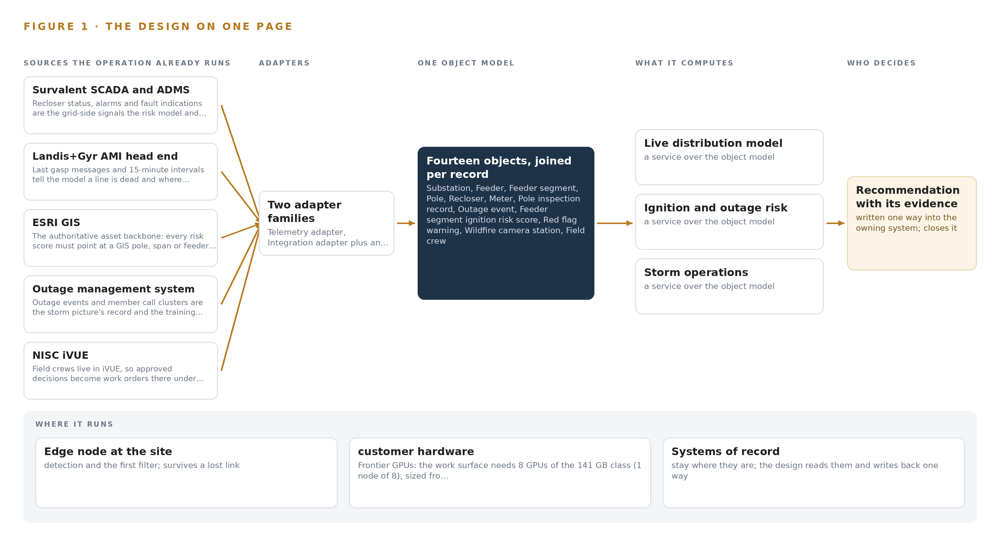
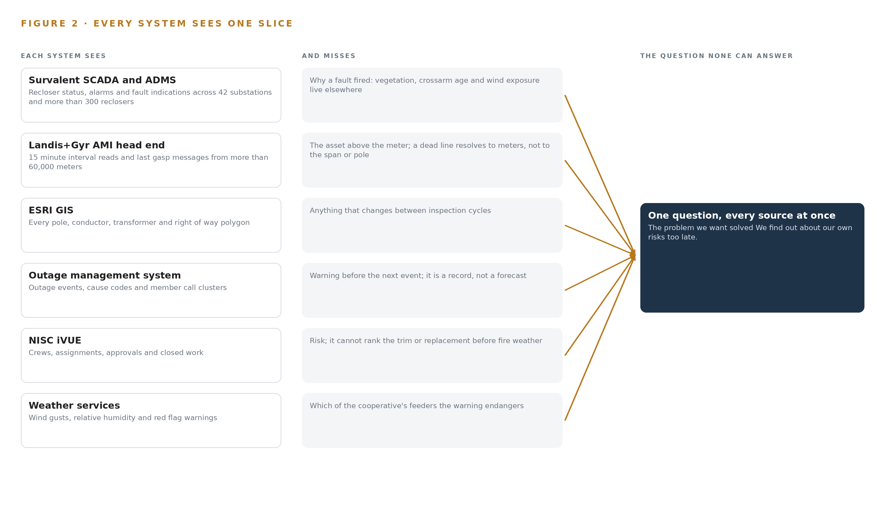
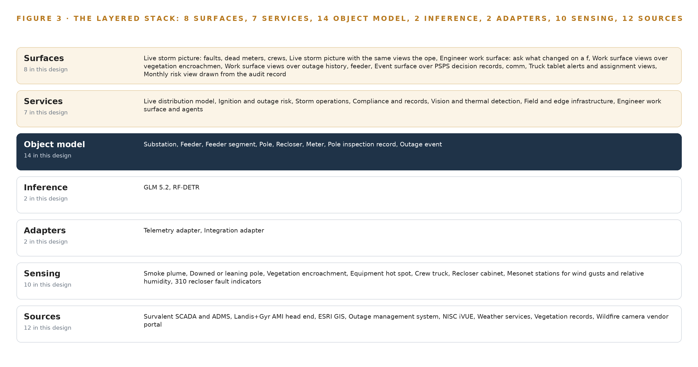
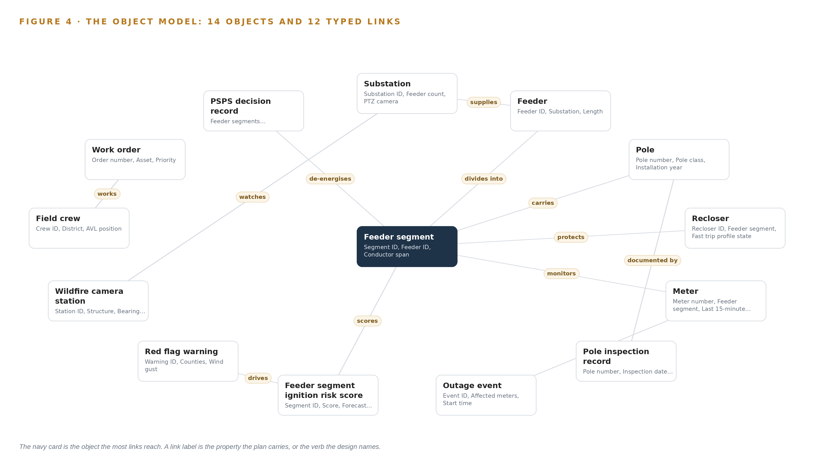
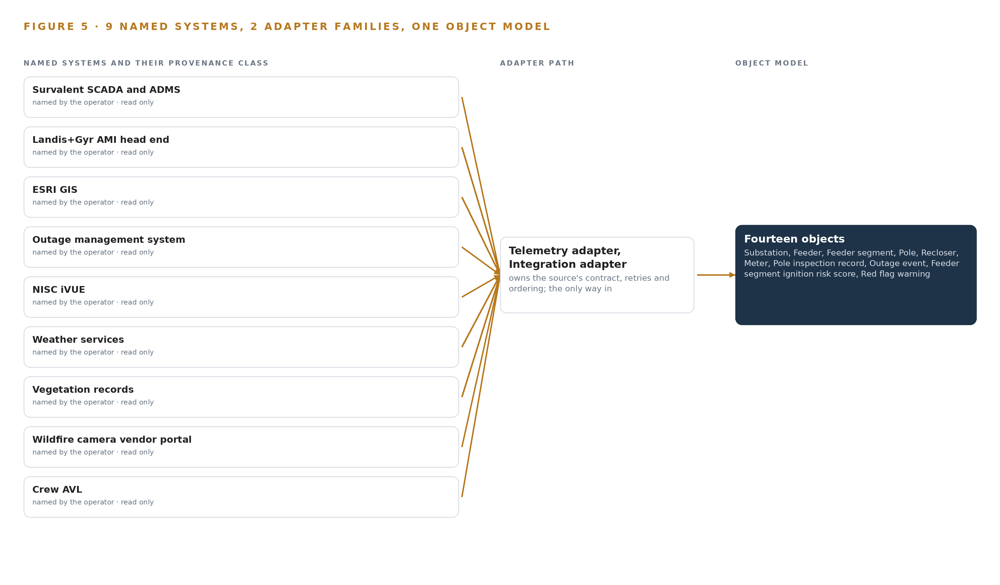
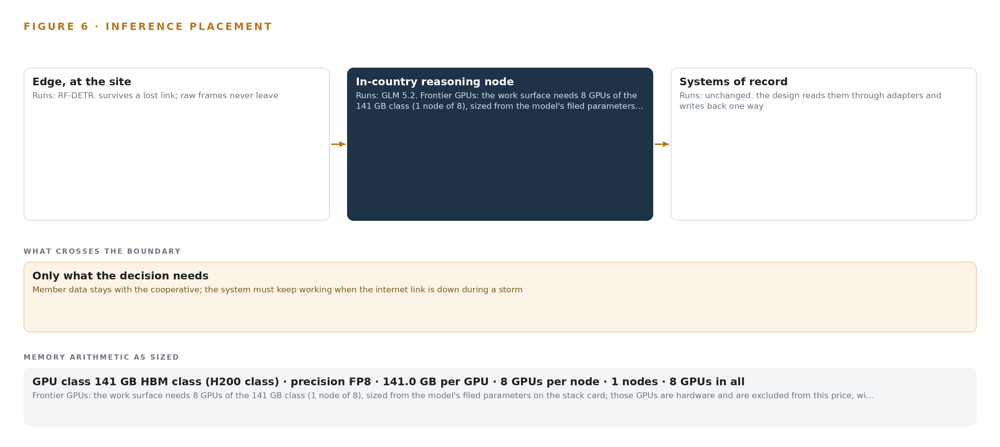
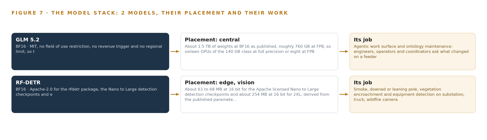
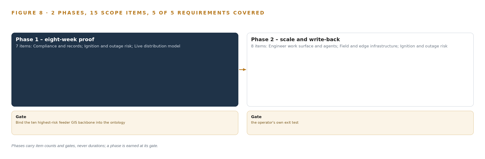
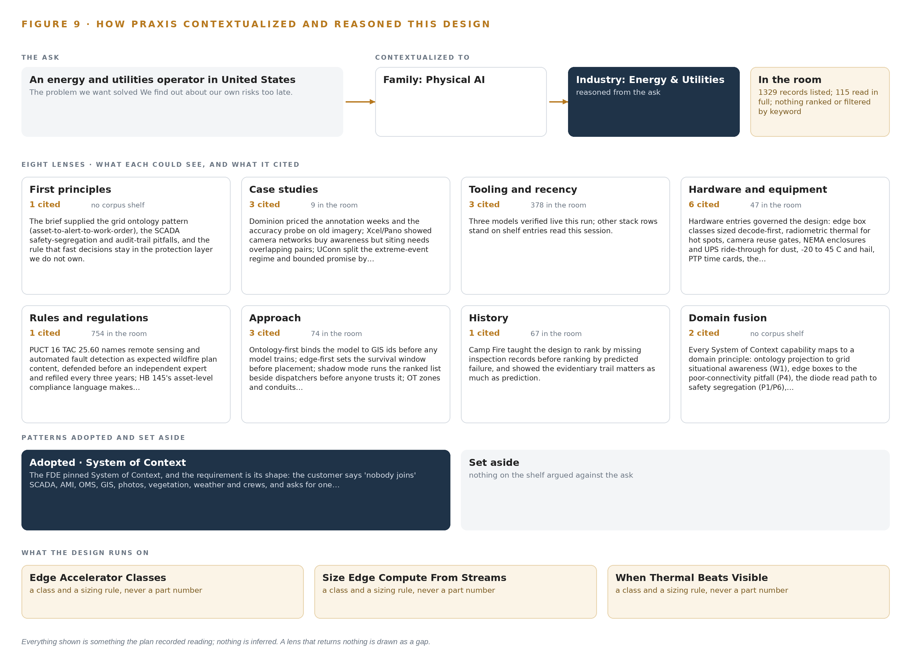

# Feeder Firewatch: Live Ignition and Outage Risk for Every Distribution Feeder

Canonical: https://codeatoms.ai/wildfire-risk-distribution-us/
DOI: https://doi.org/10.5281/zenodo.23159328
PDF: https://codeatoms.ai/wildfire-risk-distribution-us/paper/feeder-firewatch-wildfire-risk-distribution-cooperative-us.pdf
License: CC BY 4.0
Publisher: CodeNinja Atoms (https://codeatoms.ai), a fully owned subsidiary of CodeNinja

VERTICAL-DRIVEN ARCHITECTURES · ENERGY & UTILITIES · DESIGNED WITH PRAXIS · OCTOBER 2026

# Feeder Firewatch: Live Ignition and Outage Risk for Every Distribution Feeder

One live distribution risk model joins reclosers, meters, poles, vegetation, weather, cameras and crews into a 48-hour ignition and outage picture for a member-owned distribution cooperative in the United States, with every de-energisation and fast-trip decision left to a named person.

CodeNinja Engineering Team

For the operations and wildfire mitigation lead, the dispatch supervisor and vegetation management coordinator, and the grid, vision, data and platform engineers who would build and run it.

---

Vertical-Driven Architectures is a CodeNinja series of system designs. Every design in the series is driven by a real-world problem and scenario in a single industry, and every one is designed on Praxis, CodeNinja's platform for designing physical AI systems. Operations are described by class, never by name.

At a glance

## Live wildfire ignition risk for an electric distribution cooperative in the United States

**What this is.** An open reference architecture for system design in physical AI: a live ignition and outage risk score for every distribution feeder segment, built on the cooperative's own hardware, with every de-energisation and fast-trip change approved by a named operator. It is written for operations and engineering leaders at distribution utilities and for the engineers who would build it. The operator is an illustrative scenario, not a CodeNinja customer.

**The answer in numbers.**

| Part | The design |
| --- | --- |
| Sources joined | 12 systems, including SCADA, GIS, the AMI head end, the outage management system, work management, wildfire camera and weather feeds |
| Object model | 14 typed objects and 12 links, published as JSON for reuse |
| Models | Self-hosted open-weight models: GLM 5.2 under MIT (reasoning) on site, RF-DETR (vision) at the edge |
| Frontier compute | One node of eight 141 GB HBM-class GPUs holds GLM 5.2 at FP8 (753 GB of weights, 904 GB with headroom) |
| Edge | Sealed industrial boxes at substations and on patrol trucks detect smoke and damaged equipment when cellular coverage drops |
| Three-year cost, owned | About 841,000 US dollars with support and power at the Texas industrial power price |
| Three-year cost, rented | 0.88 million to 1.92 million US dollars for the same GPUs around the clock; ownership costs about the same as the deepest three-year commitment (version 2) |
| Closed model break-even | The cheapest closed model matches the owned stack at about 41 users; above that, ownership is cheaper and the gap grows with every user |
| Human control | Every public safety power shutoff (PSPS) recommendation becomes a decision record a named operator approves or declines; the design never opens or closes a recloser |

**Reuse it.** The object model, the model register and the figures are free to reuse under CC BY 4.0.

**Made with.** Reasoned on [Praxis](<https://codeatoms.ai/praxis/>), CodeNinja's platform for designing physical AI systems. The object model imports into [Hyper Ontology](<https://codeatoms.ai/hyper-ontology/>), which turns it into a living system. Both are in beta; access by request.

ABSTRACT

## An Ignition Risk Should Be Scored Days Ahead, Not Discovered in Smoke

The operator needs to know which feeder segments will fail or ignite next, and what to de-energise before a red flag wind arrives. It cannot answer that today because the signals that would answer it sit apart: recloser fault counts live in SCADA, last gasp messages live in the AMI head end, pole crossarm conditions live in inspection photos in folders, vegetation records sit with the trimming contractor, and public safety power shutoff decisions are made from two websites and a phone call. The systems that know a line is dead and the systems that know the wind is coming never meet before an event.

The design is one live distribution risk model built as a system of context: twelve named source systems enter through two adapter families into an ontology of fourteen objects that binds feeders, segments, poles, reclosers, meters, inspections, outages, weather, cameras, crews, work orders and PSPS decision records into a single feeder-and-pole picture. Seven services run on it, served through eight surfaces: edge vision boxes at substations and on patrol trucks detect smoke and damaged equipment where the cameras are, ruggedised servers at the operations center hold the risk store and the storm picture, and an agentic work surface on one FP8 node of the 141 GB HBM class lets four distribution engineers, six system operators and the dispatch supervisor ask what changed on a feeder and build their own agents. Two models carry the load, RF-DETR at the edge under Apache-2.0 and GLM 5.2 at the center under MIT, both held on the cooperative's own hardware, with read-only paths from every system of record and no SCADA control writes.

The paper opens with the problem and the join failure across the operator's existing systems, then the design: constraints and scoping, the stack from sources to surfaces, the object model and its hosting posture, ingestion through the adapter tier and event backbone, inference placement and the latency budget, and the models and licenses that decide what the cooperative owns. Part III covers the two-phase rollout with its item counts and exit gates, requirement coverage, failure modes and ownership. Part IV closes with the Praxis chapter, tracing every choice back to what justified it.

---



Figure 1. Feeder Firewatch on one page: the sources the operation already runs, one object model, what it computes, and the person who decides.

## Contents

Each chapter is tagged for the reader it serves most directly: Executive, Team Lead, FDE, Reference.

|  |  |  |
| --- | --- | --- |
|  | Abstract · An Ignition Risk Should Be Scored Days Ahead, Not Discovered in Smoke | Executive |
| PART I · THE PROBLEM | | |
| 1 | [The Ignition Risk Hides Between Patrols](#ch1) | Executive |
| 2 | [Every System Sees One Slice of the Line](#ch2) | ExecutiveTeam Lead |
| PART II · THE DESIGN | | |
| 3 | [Four Constraints Bound the Whole Design](#ch3) | Team Lead |
| 4 | [One Stack Runs From Record to Surface](#ch4) | Team LeadFDE |
| 5 | [Fourteen Objects Turn the Grid Into One Argument](#ch5) | FDE |
| 6 | [Every Source Enters Through an Adapter](#ch6) | FDE |
| 7 | [Vision Belongs at the Edge and Reasoning On-Premises](#ch7) | FDE |
| 8 | [The License Decides What the Cooperative Owns](#ch8) | FDEExecutive |
| PART III · THE ROLLOUT | | |
| 9 | [Shadow Mode Comes Before Any Flag Is Trusted](#ch9) | Team LeadExecutive |
| 10 | [The Intelligence Should Stay with the Cooperative That Produced It](#ch10) | Executive |
| PART IV · HOW IT WAS DESIGNED | | |
|  | Conclusion · The Risk Picture Should Be Owned Where the Risk Lives | Executive |
| 11 | [How Praxis Contextualized and Reasoned This Design](#ch11) | Team LeadFDE |
|  | [Sources](#sources) | Reference |

PART I · CHAPTER 1

## The Ignition Risk Hides Between Patrols

A distribution cooperative's leading ignition risks build up continuously on its feeders, but its patrol cycle, folder-bound inspection photos and website-driven shutoff decisions let them accumulate unseen until fire weather arrives.

The abstract gave the shape of the answer: one live distribution risk model built as a system of context, with every de-energisation decision left to a named person. This chapter establishes the problem that answer has to solve, the data the operation already holds, and the ground it stands on.

### 1.1  The Question and the Data Behind It

The question the operation needs answered is concrete: which feeder segments combine aged crossarms, dense vegetation and prevailing wind exposure in a way that makes ignition risk actionable this season, and which of those segments will be exposed to fire weather within the next 48 hours. Answering it requires joining data the operation already holds but never assembles in one place: recloser fault counters and trip indications from the supervisory control and data acquisition layer, last gasp messages and 15 minute interval reads from the meter fleet, pole locations and conductor geometry from the geographic information system, pole inspection records and their photographs, right of way and vegetation status, wind gust and relative humidity forecasts with red flag warnings, wildfire and substation camera feeds, and the positions of field crews. The regulatory ground adds its own demands: state public utility commission rules govern distribution practice, the regional grid operator's wildfire mitigation guidance issued after the 2024 fire season shapes expectations for risk documentation, outages are reported through the outage management system, and any public safety power shutoff recommendation carries a notification duty the approving operator must be able to evidence after the fact.

### 1.2  The Documented Cost of Finding Out Late

The cost of fragmented information during grid emergencies in Texas is a matter of public record. Reporting on the 2021 Texas blackouts found that paperwork failures worsened the crisis and forced a scramble in the middle of the storm to restore the critical fuel supply, because the records needed to act were scattered across systems and holders (TPR 2021). The pattern is older and broader: the joint federal investigation of the 2003 blackout in the United States and Canada traced the escalation in part to operators who did not grasp the state of the system as it degraded, a situation awareness failure rather than a equipment failure (Energy 2003). For a distribution cooperative, the same mechanism appears at smaller scale every storm: dispatchers rebuild the operating picture by hand from the outage management system, the supervisory alarms, member calls and crew radios, while the signals that could have warned them sit unjoined in folders and vendor portals.

### 1.3  The Operation as a Scenario

The operation is a member owned distribution cooperative serving more than 60,000 meters across more than ten counties in the Panhandle region of Texas. It runs more than 9,000 miles of overhead line, more than 40 substations fed from two regional grids, substantial oil field and irrigation load, and two wind farms interconnected on its own system. Its service territory has burned twice in the recent Panhandle wildfire seasons, so the risk in question is lived experience rather than a compliance abstraction. The people in the loop are four distribution engineers, six system operators under a dispatch supervisor staffing a 24 hour desk at the operations center, a vegetation management coordinator, a reliability engineer, an emergency management coordinator, and line crews working from a fleet of about 20 patrol trucks. The physical environments are open rangeland and farmland under high wind, dust, hail and temperatures from well below freezing to extreme heat, with intermittent cellular coverage at substations and patrol areas. The design scope counts nine named source systems, two adapter families, fourteen objects in the model, seven services, eight surfaces and two models, laid out in Figure 1.

PART I · CHAPTER 2

## Every System Sees One Slice of the Line

SCADA knows a recloser tripped, the AMI head end knows a line went dead, GIS knows where the pole stands, and none of them join to the vegetation, weather and inspection record before the fault becomes a fire.

Chapter 1 defined the question and showed that the data to answer it already exists inside the cooperative. This chapter examines why that data never becomes an answer: each system holds one slice of the line, and no system sees the slices together.

### 2.1  What Each System Sees

The supervisory control and data acquisition system sees the electrical state of the network: recloser positions, alarm streams and fault indications across the substations and more than 300 reclosers. It misses everything that explains why a fault fired, because vegetation condition, crossarm age and wind exposure live in other systems entirely. The meter head end sees consumption and silence: 15 minute interval reads and last gasp messages from more than 60,000 meters tell it exactly where and when a line went dead. It misses the asset above the meter; a last gasp cluster resolves to meters, not to the span of conductor or the pole that caused it. The geographic information system sees the static anatomy of the network, every pole, conductor, transformer and right of way polygon, but nothing that changes between inspection cycles, so it cannot say which of its own poles is deteriorating this year. The outage management system sees events and their causes as coded after the fact, along with member call clusters, which makes it a record of outages rather than a warning of the next one. The work management system sees the crews and the paperwork: who is assigned, what is approved, what closed. It sees nothing about risk, so it cannot prioritize the trim or the pole replacement before the fire weather arrives. The weather subscription sees the atmosphere, gusts, humidity and red flag warnings, but knows no feeders, so it cannot say which of the cooperative's segments a red flag warning actually endangers. The vegetation records see the trimming cycle and the purchased imagery; the wildfire camera portal sees the sky above a dozen stations; the crew automatic vehicle location feed sees the trucks. Each is blind to the others.

### 2.2  What None of Them See Together

What none of them sees is the joined statement the operation actually needs: this feeder segment has aged crossarms on record, vegetation encroaching in the imagery, a recloser fault history that has climbed over two seasons, a red flag warning arriving within 48 hours, and a crew close enough to act. Figure 2 sets the nine systems side by side, each with its slice and its blind spot converging on that one question. The cost in practice is that the cooperative's own signals identify its highest risk feeders only after an event joins them by hand: a dispatcher correlating dead meters against alarms and calls while the wind blows, exactly the manual picture building that research into control room situation assessment identifies as the slowest and most error prone path to awareness (OSTI 2007). The ignition risk hides in the gaps between the slices, and it is precisely the gaps the object model in Part II exists to close.



Figure 2. Nine systems, each seeing one part of the answer. the question needs all of them in one place at once.

PART II · CHAPTER 3

## Four Constraints Bound the Whole Design

Read-only access to every system of record, no new field devices, human ownership of every de-energisation and fast-trip decision, and operation through storm-grade connectivity loss shape every choice downstream.

Chapter 2 showed that the ignition risk lives in the gaps between nine systems that each see one slice of the line. This chapter fixes the four constraints that determine how those gaps may be closed, and records what the design scoped in, scoped out and chose against.

### 3.1  Read Only Access to Every System of Record

Every connection in the design reads; none writes. The geographic information system is never edited, the outage management system is never driven, and the supervisory layer is mirrored through a one way path rather than queried in both directions. This is hard in this industry because operational technology is rightly guarded: a distribution cooperative's compliance function must determine what falls inside reliability cybersecurity scope, and that determination is a decision to make with them, not an assumption to design on. The design therefore reads only through a hardware enforced one way path and lets the cooperative's own categorisation decide what touches what.

### 3.2  No New Field Devices

The constraint states that no new reclosers or meters are in scope; the design reads the more than 300 existing reclosers and more than 60,000 existing meters and nothing else. This is hard because the instinctive answer to blind spots is more hardware, and a device procurement program would add years of capital cycles before the first score was produced. The hypothesis behind the design is that the existing signals already identify the highest risk feeders once joined with the inspection photographs, so sensing effort goes to cameras and analysis at the edge rather than to new grid devices.

### 3.3  Human Ownership of Every De-energisation and Fast-Trip Decision

Every recommendation the system produces, whether a public safety power shutoff, a fast trip enablement or a de-energisation, is decided by a named person in the control room under the cooperative's procedure and the state commission's expectations. The design never writes to protection equipment. This is hard because the whole value of the system is speed under fire weather, and an operator will only decide fast on a recommendation whose provenance they can read: contributing signals, model version and rationale, kept as a decision record the next decision reads.

### 3.4  Operation Through Storm Grade Connectivity Loss

The system must work when cellular coverage at substations and patrol areas drops, because that is exactly when it matters. This is hard because the failure mode is silent: intermittent links drop detection evidence without announcing it. The design answers with store and forward buffers sized to the worst measured outage, edge inference that survives link loss, and degraded mode reporting that states plainly that its picture is stale.

### 3.5  What the Scoping Decisions Buy and Cost

Three scoping decisions set the shape of everything downstream, and Table 1 records what each buys and what it costs.

Table 1 · Scoping Decisions

| Decision | What it buys | What it costs |
| --- | --- | --- |
| Purpose built risk store keyed to GIS ids, synchronised from the geographic information system | Every score points at an authoritative pole, span or feeder segment id that field crews recognize | A synchronisation path to keep the store current, and a second store to run beside the system of record |
| Edge analysis with buffered synchronisation at substations, trucks and the yard | Detection that survives intermittent cellular and keeps evidence flowing during storms | Compute at each edge site and a buffer sizing discipline against the worst measured outage |
| GLM 5.2 under an MIT license on the cooperative's own hardware for the work surface | The cooperative owns the weights outright, with no revenue trigger and one node holding the model | The operator runs and updates the frontier node itself rather than consuming a hosted service |

### 3.6  What the Design Chose Against

Table 2 records the alternatives the design rejected and the scope it declined, with the reason in each case.

Table 2 · What the Design Chose Against

| Where | What was picked | Instead of, and why |
| --- | --- | --- |
| Risk storage | Purpose built risk store keyed to GIS ids, synchronised from ESRI GIS | Extending ESRI GIS as the risk store, because GIS stays authoritative and is never edited, and every score must point at a GIS id |
| Work surface model | GLM 5.2 under its plain MIT grant | GLM 5.3 under its bespoke vendor license, because that license would keep the weights out of the cooperative's hands |
| Video analysis | Edge analysis with buffered synchronisation | Streaming video centrally, because intermittent cellular at substations and patrol areas makes central streaming silently unreliable |
| Control actions | Human decisions recorded in the PSPS decision record | Any SCADA control write from the platform, because fast trip and de-energisation stay human actions in the control room |
| Historic records | Live feeds plus agreed opening balances | Bulk migration and cleansing of historic data, which stays with the cooperative's own records program |
| Scope boundary | Detection, scoring, evidence and a work surface | Vegetation trimming execution, regulatory approvals, new field devices and replacement of any system of record, all of which remain outside the design |

PART II · CHAPTER 4

## One Stack Runs From Record to Surface

A single layered architecture carries telemetry, imagery and records from nine named systems through two adapter families into one ontology, and serves seven services through eight surfaces without touching a control path.

Chapter 3 fixed the constraints: the design reads every system of record and writes back almost nothing, keeps every byte on the cooperative's own hardware, and leaves each de-energisation and fast-trip decision to a named person. This chapter describes the single stack that carries those constraints from the grid's source systems to the surfaces its people work in.

### 4.1  The Pattern: Records Below, One Model in the Middle, Agents Above

The architectural pattern is a system of context layered over systems of record. At the bottom, the cooperative's existing systems stay authoritative: Survalent SCADA and ADMS still run the grid, the Landis+Gyr head end still owns meter data, ESRI GIS still owns asset geometry and ids, the outage management system still owns outage state, and NISC iVUE still owns work. The design edits none of them and retires none of them. In the middle sits one object model of fourteen objects joined by typed links, which is the only place in the estate where a pole, its inspection photos, the recloser above it, the meters below it and the red flag warning over it exist together. Above the model run seven services and the agents the cooperative's engineers build themselves, which read the joined picture and write only recommendations, decision records and approval-gated work orders.

This shape fits a distribution cooperative for a specific reason: the operation's problem is not a missing system but nine adequate systems that cannot see one another, and research on grid control rooms shows that situation assessment degrades exactly when operators must assemble their picture by hand from fragments (OSTI 2007). The layered split also matches the physics of the data: high-rate telemetry and video are heavy and belong near where they are produced, on edge nodes and at the operations center, while records such as inspections and work orders change slowly and tolerate central storage.

Two alternatives were set aside. A point-to-point integration mesh would multiply interfaces with every new question, because each connection encodes one relationship; a document store keyed by asset id cannot hold the reach the risk question needs, because joining a meter to a weather event across an asset hierarchy is a traversal, not a lookup. The middle object model buys both: one interface per source and one edge per relationship. Figure 3 shows the layered stack with the component count at each layer: twelve sources, two adapter families, fourteen objects, seven services and eight surfaces.



Figure 3. The layered stack: 12 sources, 2 adapter families, 14 objects, 7 services and 8 surfaces.

### 4.2  The Stack Stage by Stage

Table 3 walks the stack stage by stage, naming the components at each stage and the mechanism each uses. Read from the top down, it is the path of a single fact, a recloser operation for example, from the point list where it originates to the storm picture where a dispatcher acts on it. Three properties run through every stage: sources are read-only, the object model is the only join point, and no stage touches a control path.

Table 3 · The Stack, Stage by Stage

| Stage | What it is responsible for | How |
| --- | --- | --- |
| Sources | Hold the records the estate already owns: SCADA points, alarms and fault indications, AMI intervals and last gasp messages, GIS assets and right of way, outage events, iVUE crews and work orders, inspection records, weather and red flag feeds, vegetation and satellite imagery, wildfire camera feeds, crew AVL | Read in place through each system's own vendor interface, with MultiSpeak and CIM where supported; nothing is migrated and no source is edited |
| Sensing | Turn the physical territory into signals: 42 substation PTZ cameras, 12 wildfire cameras, patrol truck forward cameras, a drone thermal camera, mesonet wind and humidity stations, 310 recloser fault indicators, last gasp messages from 61,000 meters and 20 truck AVL units | Existing cameras are reused through defined gates; new fixed thermal only where a gap is proven; every stream is time-synchronised against one grandmaster |
| Adapters | Two families move everything in: the telemetry adapter for high-rate points, intervals and events, and the integration adapter for records, files and imagery | Normalise to typed events, stamp source and provenance, buffer with store-and-forward, pass events in order over the backbone |
| Object model | Hold one live feeder-and-pole picture of fourteen objects with typed links, anchored to GIS ids so every score and every photo points at a real asset | An ontology and graph store in the operations center; the risk store hangs scores off the same ids |
| Inference | Detect at the edge and reason at the center: RF-DETR for smoke, pole and vegetation detections on edge nodes; 48-hour ignition and outage scoring in the risk service; GLM 5.2 on the work surface, served by vLLM on one eight-GPU node at FP8 | Detection runs beside the cameras and survives link loss; central scoring and language serving run on cooperative servers |
| Services | Seven services: live distribution model, ignition and outage risk, storm operations, compliance and records, vision and thermal detection, field and edge infrastructure, and the engineer work surface and agents | Each service reads and writes only the object model; no service touches a control path |
| Surfaces | Eight surfaces people act from: the live storm picture, the engineer work surface and its views, the PSPS event surface, truck tablet alerts and the monthly risk view | Served from the services over the same ontology, so every view and every recommendation names the asset, the evidence and the person who decides |

PART II · CHAPTER 5

## Fourteen Objects Turn the Grid Into One Argument

The ontology binds substations, feeders, segments, poles, reclosers, meters, inspections, outages, risk scores, weather, cameras, crews, work orders and PSPS decisions with typed links, so a question about one pole reaches the weather and the recloser that matters to it.

Chapter 4 placed one object model in the middle of the stack, fed by two adapter families and read by seven services. This chapter describes what that model holds: fourteen objects, the typed links between them, where the human loop lives, and what one object looks like in its recorded form.

### 5.1  Fourteen Objects and Their Typed Links

The fourteen objects are substation, feeder, feeder segment, pole, recloser, meter, pole inspection record, outage event, feeder segment ignition risk score, red flag warning, wildfire camera station, field crew, work order and PSPS decision record. Each is anchored in the system that authoritatively holds it: substation and recloser in Survalent SCADA; feeder, feeder segment and pole in ESRI GIS; meter in the Landis+Gyr head end; outage event in the OMS; inspection record in the pole inspection spreadsheet; field crew and work order in NISC iVUE; camera station in the wildfire camera vendor portal; red flag warning in the weather and mesonet subscription; and the ignition risk score in the risk model store. The PSPS decision record is the one object with no upstream system, because it originates in this design and carries the approving operator, the rationale and the state regulator notification reference. Figure 4 draws every object and its typed links, with the ignition risk score as the focal measure that substation, feeder, feeder segment, recloser and meter each point into.

The links are typed and directional, and the reach they give a query is what a document store keyed by asset id cannot reproduce. Starting from one pole with a defect found, the traversal reaches its inspection record and photo references, the feeder segment that carries it, that segment's ignition risk score with its contributing signals and model version, the recloser protecting the segment and its fast-trip profile state, the meters on the segment and their last gasp history, the red flag warning active over the counties, the camera stations with bearing coverage over the area, and the approved work order with its crew. None of that reach is precomputed; it is the edges. A document store would need a hand-built join for every one of those hops, and each new question would need a new pipeline. The ontology needs one typed edge per relationship, so a new question is a new traversal over structure that already exists.



Figure 4. The fourteen objects of the model and the typed links that let a query reach across them.

### 5.2  Where the Human Loop Lives and Where the Model Runs

The human loop lives in two objects. Every de-energisation and every fast-trip change is recorded as a PSPS decision record with a recommendation, a rationale, an approving operator and a state regulator notification reference, and it moves through the states recommended, approved, declined, de-energised and re-energised under a named person's hand; the design never opens or closes a recloser. Work orders follow the same discipline: a recommendation becomes a draft, enters iVUE as pending approval, and only an approved order reaches a crew, so field work is always issued from the system crews already live in.

The hosting posture keeps the model with the cooperative. All fourteen objects live on cooperative servers in its own operations center, with overflow and disaster recovery in a sovereign United States cloud; no object leaves the country. Every surface sits behind the operator's on-site identity provider with role-based access, so a dispatcher, a distribution engineer and a vegetation coordinator see the same picture under different rights. External links are inbound and read-only: weather feeds and the camera vendor portal are pulled, never pushed to, and no operational data flows out. The only write path back into the estate is the approval-gated one, into decision records here and into iVUE under approval; GIS is never edited, and scores live in a purpose-built risk store synchronised from GIS ids.

### 5.3  One Object in Its Recorded Form

The platform prints the pole object below in its recorded form; it is the object the ignition hypothesis turns on, and it shows the shape all fourteen share: an id, a label, a kind, typed properties including crossarm condition and installation year, a status vocabulary running from inspected to replacement scheduled, and links out to its inspection record, its segment and its scores.

```
{
  "id": "substation",
  "label": "Substation",
  "kind": "site",
  "anchored_in": "Survalent SCADA",
  "properties": [
    "Substation ID",
    "Feeder count",
    "PTZ camera",
    "Cellular coverage state"
  ],
  "status_vocabulary": [],
  "links": [
    {
      "to": "feeder",
      "label": "supplies"
    }
  ]
}
```

PART II · CHAPTER 6

## Every Source Enters Through an Adapter

Twelve source systems feed two adapter families into a Kafka backbone with ordered delivery, store-and-forward buffering and a one-way path from SCADA, so the model stays current without ever writing back to a system of record.

Chapter 5 described the fourteen objects the ontology holds and the typed links that join them. This chapter describes how their data gets in: which twelve sources, through which two adapter families, under what guarantees and over which event backbone.

### 6.1  Twelve Sources, One Provenance Class

Twelve source feeds enter the design, and every one carries the same provenance class: operator-procured, operator-controlled and read-only. Nine are the operational systems the cooperative runs today: Survalent SCADA and ADMS for recloser status, alarms and fault indications across 42 substations and 310 reclosers; the Landis+Gyr AMI head end for 15-minute intervals and last gasp messages from 61,000 meters; ESRI GIS for poles, conductors, transformers and right of way polygons; the outage management system for outage events and member call clusters; NISC iVUE for crews and work orders; the weather services subscription for wind gusts, relative humidity and red flag warnings; the vegetation records of the contractor trimming cycle; the wildfire camera vendor portal for the 12 camera feeds already reaching the operations center; and crew AVL from the 20 patrol trucks. Three more complete the count: the pole inspection spreadsheet with its photos, the mesonet station network behind the wind and humidity readings, and the purchased satellite imagery that complements the trimming records. Figure 5 draws the integration map: each named system, its provenance class and the adapter path it takes into the backbone.



Figure 5. The 12 named systems, the adapter path each one takes, and the object model they all map into.

### 6.2  What the Adapter Tier Guarantees

The adapter tier makes one promise first: it never writes back. Every interface is read-only, so no adapter can alter a point list, a GIS feature or a work order. On top of that, the two families guarantee five things. They normalise each source's output to the typed vocabulary of the object model, so a fault indication from Survalent and a last gasp from Landis+Gyr arrive as events the ontology can join. They stamp provenance onto every record: source system, interface, direction and time, so an auditor can trace any score back to its inputs. They preserve ordering per asset, so a recloser's open, lockout and close sequence is never reordered. They pass at-least-once with idempotent keys, so replay after a fault duplicates nothing. And they buffer with store-and-forward, so an outage of this platform never back-pressures a system of record. The SCADA path is one-way through a hardware-enforced data diode, so nothing on the platform side can reach the control network, and operational systems are joined through their own vendor interfaces with MultiSpeak and CIM where supported rather than through a parallel queue.

### 6.3  The Event Backbone

The backbone is Apache Kafka 4.3 in KRaft mode, with three dedicated controllers on a dynamic quorum. Partitions are keyed on the GIS asset id, so every event for one pole or one recloser is ordered on one partition and consumed in sequence. Delivery is at-least-once with idempotent consumers; buffering is sized to the worst measured storm and to AMI catch-up after a head-end interruption; and the cluster replicates across three brokers in the operations center, with the sovereign cloud copy held for disaster recovery only. Each service reads in its own consumer group, so storm operations, risk scoring and compliance keep their own pace against the same stream. Time synchronisation holds the stream together: an OCP Time Card GNSS grandmaster speaks PTP to the edge nodes, and chrony serves NTP-only hosts, so a recloser operation, a last gasp message and a camera frame land in the right order on one timeline. The value of that completeness is documented in event investigations: the 2003 blackout report traces the collapse of the operators' situational awareness to an alarm system that failed while events raced ahead of them, and later investigations list alarm floods among the abnormal situations crews cannot manage (Energy 2003; CSB 2022). One ordered, buffered stream is what keeps this design's picture whole when the weather is at its worst.

PART II · CHAPTER 7

## Vision Belongs at the Edge and Reasoning On-Premises

Smoke and equipment detection run on industrial edge boxes where the cameras are, the risk store and language model run on ruggedised servers at the operations center, and the latency budget is written down for what crosses each boundary and what happens when a link drops.

Chapter 6 closed the ingestion path: every source enters through an adapter, lands on the event backbone, and reaches the object model without a direct connection anywhere. This chapter places the compute that turns those events into detections, risk scores and answers, states the memory arithmetic that fixes the central hardware, and writes down the latency budget and the failure behavior for every link, power feed and update path in the design.

### 7.1  Two Tiers and Their Arithmetic

The design runs inference in two tiers, shown together in Figure 6. The edge tier sits where the cameras are: fanless, sealed industrial edge boxes rated for minus 20 to 45 degrees Celsius, dust and hail, mounted in NEMA 3R and 4 enclosures at substations, on patrol trucks and at the yard. Each box runs the detection model against the camera streams through a serving runtime pinned at design from a bench measurement of the actual feeds, orchestrated by K3s, with video ingest and local recording handled by the NVR stack. Smoke plumes, downed or leaning poles, vegetation encroachment and equipment hot spots are detected on the box, because the cellular coverage at substations and patrol areas is intermittent and a storm is exactly when the link drops. Streaming raw video centrally was weighed and set aside for that reason: the storm picture would sit on the wrong side of the weakest link in the system. The central tier sits on ruggedised servers at the operations center. It carries the live distribution model, the risk store and the language model node. The memory arithmetic fixes this hardware. The language model is filed at 753 billion parameters, a mixture-of-experts architecture in which the GPUs hold every weight. At FP8 precision, one byte per parameter, the weights occupy 753 gigabytes; multiplied by 1.2 for the KV cache and activations, the node must hold 904 gigabytes. One server with 8 GPUs of the 141 GB HBM class holds 1,128 gigabytes, which fits the requirement with roughly 224 gigabytes of headroom. Serving the published BF16 weights, about 1.5 terabytes, would need sixteen GPUs of the class; FP8 halves that to eight. The model is served on site by vLLM, and the time series store beside it is sized for 15-minute AMI intervals from 61,000 meters and 310 reclosers with store-and-forward buffering.



Figure 6. Where each tier runs, what runs there, and the narrow set of outputs that cross the boundary.

### 7.2  The Latency Budget

The budget is written as four tiers, not as a single number, because each tier answers a different question at a different pace. The first tier is outside the system: recloser fast trips execute in protection hardware the platform does not own, and fast decisions stay in that layer by constraint. The second tier is the detection loop, from camera frame to ontology event on the edge box, measured against the real streams before the runtime is pinned, with smoke confirmed temporally across frames rather than on a single image. The third tier is the storm picture: SCADA alarms, AMI last gasp messages and crew AVL positions joined into one live view within the event backbone's ordering guarantees. Grid operators build and maintain their picture of the system under load, and an incomplete or hand-rebuilt picture during an event is a documented cause of worsened outcomes (Energy 2003), so the design keeps that join continuous instead of leaving dispatchers to reconstruct it from separate screens and a phone call (OSTI 2007). The fourth tier is reasoning at human pace: 48-hour ignition and outage scores refreshed on the AMI interval and on weather updates, and work surface answers served from the FP8 node in conversation time. Every tier reports its own measure through the observability stack, so a budget breach is a visible alarm, not a slow drift.

### 7.3  What Crosses the Boundary, and What Fails

What crosses each boundary is small by design. Detection events, risk scores, alarms, AVL positions and last gasp messages move as compact event records; raw video does not cross, because it is analyzed and recorded locally. SCADA reaches the platform as a read-only mirror through a hardware-enforced one-way data diode, so no fault, misconfiguration or compromise on the platform side can write toward control. The only approved write path runs the other direction: a person-approved decision becomes a work order in work management, never a grid command. Each failure mode has a stated behavior. If the link drops, edge inference continues on the box, store-and-forward buffers sized to the worst measured outage hold the evidence, and degraded-mode reporting states plainly that its view is stale rather than presenting old data as current, which keeps alarm load honest in the control room in the way abnormal-situation guidance demands (CSB 2022). If power fails, one UPS covers the edge node and its switch with Network UPS Tools ordering clean shutdowns, and the central tier rides on the operations center's power with sovereign cloud capacity reserved for overflow and recovery only. If the update path fails, nothing breaks open: artifacts and model weights move through the air-gapped registry, signed and scheduled by the operator, and time discipline from the GNSS grandmaster keeps event ordering correct when hosts resynchronize. The design supports the emergency operating plans and public safety power shutoff procedure the operator must already maintain; it does not replace them (NERC n.d.).

PART II · CHAPTER 8

## The License Decides What the Cooperative Owns

GLM 5.2 under MIT and RF-DETR under Apache-2.0 let the cooperative hold its own weights on one FP8 node, which is exactly why the bespoke-licensed alternative and cloud-hosted options were set aside.

Chapter 7 fixed where inference runs and how much memory it needs. This chapter names the two models that run there, states their sizes, architectures, licenses and terms, and explains why the license, more than any benchmark, decided which language model the work surface carries.



Figure 7. The two models, their placement, and the work each one does.

### 8.1  The Model Stack and Why MIT Won

Figure 7 shows the model stack: one central language model, one edge detection model, and the runtime and hardware classes beneath them. The central model is GLM 5.2, a frontier mixture-of-experts language model filed at 753 billion parameters and published at BF16 at about 1.5 terabytes of weights. Its role is the agentic work surface and ontology maintenance: the four distribution engineers, the six system operators and the dispatch supervisor, the vegetation management coordinator, the reliability engineer and the emergency management coordinator ask what changed on a feeder, build and run their own agents, and write approved decisions back to work management through it. It runs on the single 8-GPU node of the 141 GB HBM class at the operations center, served at FP8 by vLLM, as the arithmetic in Chapter 7 shows. Its license is MIT, with no field-of-use restriction, no revenue trigger and no regional limit, so the cooperative holds its own weights outright. The newer GLM 5.3 was weighed and set aside for one reason: its bespoke managed-service license does not give the operator that ownership, and ownership of the weights is the point of running the model on the cooperative's own hardware.

### 8.2  Detection at the Edge

The edge model is RF-DETR, a real-time detection transformer released under Apache-2.0 for both the code and the Nano to Large checkpoints, with no field-of-use restriction. The checkpoints run from about 61 to 68 megabytes at 16-bit precision, with the 2XL variant at about 254 megabytes, which is what makes the model practical on the industrial edge box class. It detects smoke plumes, downed or leaning poles, vegetation encroachment, equipment hot spots, crew trucks and recloser cabinets across the 42 existing substation PTZ cameras, the 12 wildfire camera feeds, the patrol truck forward cameras and the drone thermal camera. It is placed on the edge boxes through the serving runtime pinned at design, and it is fine-tuned on the cooperative's own fire-season frames, with labeling in CVAT and Label Studio so the fine-tune improves as the seasons accumulate. Both models were chosen on the same test: the license must permit the operator to hold and fine-tune the weights on hardware it owns, inside its own boundary, with no cloud dependency in a storm.

### 8.3  The Model and Equipment Register

Table 4 gathers the models, the hardware classes and sizing rules, the sensing, the patterns and the ground into one register, so every choice in the stack points at the reason it was made.

Table 4 · Model and Equipment Register

| The choice | What was picked | Why here |
| --- | --- | --- |
| Language model | GLM 5.2, mixture-of-experts, 753 billion parameters filed, FP8, MIT license | Agentic reasoning over the ontology with weights the cooperative owns; one 8-GPU FP8 node holds it |
| Detection model | RF-DETR, Nano to Large checkpoints at 61 to 68 MB and 2XL at about 254 MB, BF16, Apache-2.0 | Smoke, pole, vegetation and equipment detection on the edge box class, fine-tuned on the cooperative's own fire-season frames |
| Edge compute class | Industrial edge accelerator modules, fanless and sealed, NEMA 3R/4 enclosures | Sized decode-first from the actual camera streams, rated for dust, heat, hail and cold |
| Site inference server | Ruggedised server class at the operations center, one node of 8 GPUs of the 141 GB HBM class | 1,128 GB against a 904 GB requirement, sized from filed parameters at FP8 |
| Serving runtimes | vLLM on site; Triton Inference Server, ONNX Runtime or OpenVINO class at the edge | The edge runtime is pinned at design against a bench measurement of the real streams |
| Sizing rules | Size edge compute from streams; when thermal beats visible; reuse existing cameras or not; size GPUs from filed parameters | Every hardware choice derives from a measured duty rather than a vendor default |
| Sensing | 42 substation PTZ cameras, 12 wildfire camera feeds, truck and drone cameras, mesonet wind and humidity, 310 recloser fault indicators, AMI last gasp from 61,000 meters, crew AVL on 20 trucks | Reused through the reuse gates; new fixed thermal only where a coverage gap is proven |
| Patterns | System of context; adapters-only ingestion; read-only systems of record; human-approved write-back; one-way diode for SCADA | Keeps the grid protected and the systems of record authoritative while the platform joins them |
| Ground | Cooperative servers at the operations center as primary; sovereign cloud for overflow and recovery only | The model must survive an internet outage during a storm, and the risk picture cannot live outside the boundary |

PART III · CHAPTER 9

## Shadow Mode Comes Before Any Flag Is Trusted

Two phases, seven items and an eight-week proof gate put the ten highest-risk feeders into the ontology and shadow every risk flag against the outage record before anyone acts on it.

Chapter 8 fixed the models, the licenses and the hardware classes the design stands on. This chapter fixes the order the work lands in, the gates that can stop it cheaply, and what the rollout measures before any risk flag is allowed to influence a decision.

### 9.1  Two Phases, Seven Items, One Proof Gate

The rollout runs in two phases, tracked with their workstreams and requirement coverage in Figure 8. Phase 1, the eight-week proof, carries seven items across four workstreams: compliance and records, ignition and outage risk, live distribution model, and storm operations. Its exit gate is the binding of the ten highest-risk feeders' GIS backbone into the ontology, with Survalent SCADA mirrored through the one-way path, Landis+Gyr AMI intervals and last gasp messages landed in the risk store, and the first feeder-level ignition and outage scores running in shadow against the outage record. Phase 2, scale and write-back, carries eight items across five workstreams: engineer work surface and agents, field and edge infrastructure, ignition and outage risk, storm operations, and vision and thermal detection. It exits when the first fast trip and de-energization candidates reach a named operator for approval, substation and wildfire camera feeds are watched at the edge, and drone and truck footage is analyzed at the yard, with every flag still shadowed until its agreement with the outage record is demonstrated. Requirement coverage stands at five requirements covered, none partial and none uncovered, and Figure 8 carries the mapping per requirement so the executive sponsor can see which item closes which requirement. No phase carries a duration beyond the named proof clock; each closes on its gate or it does not close.



Figure 8. The two phases and their gates, and coverage of the 5 requirements across them.

### 9.2  What the Rollout Measures

The shadow period measures five things. First, agreement: the share of feeder segments flagged at a given score that later appear in the outage record as events, which is the only honest test of a risk flag. Second, calibration: whether the scored intervals cover the observed event rate, reported as calibrated intervals rather than point scores. Third, latency: the time from a last gasp message to its appearance on the storm picture, and from a recloser fault indication to dispatcher awareness. Fourth, detection precision on the cooperative's own held-out frames, because vendor benchmark numbers do not transfer to Panhandle dust, haze and hail-damaged imagery. Fifth, staleness in degraded mode: every view states how old its evidence is when the link is down, so an operator never mistakes a buffered picture for a live one. The extreme-event regime is evaluated separately from the seasonal baseline, because the errors that matter during a red flag warning are not the errors of an average day.

### 9.3  Failure Modes

Table 5 sets each failure mode against what the design does about it.

Table 5 · Failure Modes

| What fails | What the design does |
| --- | --- |
| Access delays consume the proof clock, since the eight-week period starts at signature and includes building the SCADA, AMI, GIS and inspection connections | Data access granted on day one; point list and export owners named in week one; risk store sequenced before the vision tier |
| Old inspection photos are sparse and low quality, with only 18 percent of poles carrying recent imagery, so defect detection may not reach usable accuracy | Accuracy probe on a few hundred real frames before scope is committed; annotation effort priced as its own line item |
| Intermittent cellular coverage silently drops detection evidence at the moments that matter | Store-and-forward buffers sized to the worst measured outage; edge inference survives link loss; degraded-mode reporting states its own staleness |
| Outage prediction error is dominated by weather forecast uncertainty at 48 hours | Error budget decomposed between forecast and model; calibrated intervals reported instead of point scores; extreme-event regime evaluated separately |
| A detection program is scoped as if it were a mitigation program and overpromises against the regulatory record | Detection and mitigation kept separate in scope and in the wildfire plan evidence; cameras sited in overlapping pairs where triangulation is wanted |
| The North American reliability boundary is assumed instead of determined | Zone and conduit diagram drawn in week one; read-only access through the one-way path; the compliance function's categorization decides what touches what |

### 9.4  Lessons

**Shadow the flags before anyone trusts them.** A risk flag that has never been scored against the outage record is an opinion with a number attached. The shadow period converts it into evidence, and it costs nothing but patience: the same scores run, nobody acts on them, and the disagreement between flag and event becomes the calibration dataset for phase 2. Rank the alarms; never flood them. Documented investigations of industrial disasters show that alarm floods degrade operator response exactly when response matters most (CSB 2022), and grid control room studies show that operators maintain their picture by actively sampling a few trusted signals, not by reading everything (OSTI 2007). The storm picture therefore ranks and joins rather than streams every alarm, and the dispatch desk sees the ten feeders that changed, not the 310 reclosers that did not. Write the record at the moment of decision. Reporting on the Texas grid failure found that paperwork failures forced a mid-storm scramble to restore critical fuel supply, because the record did not match the event (TPR 2021). The PSPS decision record and the work order approval trail are written as the decision happens, by the person making it, so the next storm reads a current picture.

### 9.5  What Is Still Open

Four questions remain open. The edge serving runtime is pinned only after a bench measurement of the actual camera streams, and the zero-shot probabilistic baseline for the 48-hour ignition and outage scores is still to be chosen; settling both fixes the edge box class and removes the last sizing contingency. The placement of any new fixed thermal cameras waits on the six reuse gates over the existing 42 PTZ, 12 wildfire, truck and drone feeds; settling it determines whether the thermal tier is bought at all. The North American reliability scope determination sits with the cooperative's compliance function; settling it decides which components inherit hardening requirements. And the deliverable precision at the 48-hour lead time waits on the shadow calibration; settling it determines whether the forecast horizon is stated as scored intervals or shortened.

PART III · CHAPTER 10

## The Intelligence Should Stay with the Cooperative That Produced It

The object model, the weights, the decision records and the boundary itself belong to the cooperative, because a risk picture paid for by its members should not live in someone else's cloud.

Chapter 9 showed that the rollout can stop cheaply at its first gate. This chapter settles who holds what the design builds once the gates pass, because ownership decides whether the risk picture outlives any single vendor relationship.

### 10.1  What the Cooperative Owns

The object model belongs to the cooperative. The fourteen objects, their typed links and the instance running on its own servers are its schema and its data, and the design never edits the ESRI GIS that anchors them: every score points at a GIS identifier, and the systems of record stay authoritative. The weights belong to the cooperative as well. GLM 5.2 carries a plain MIT license with no field-of-use restriction, no revenue trigger and no regional limit, so the cooperative holds the weights outright; the RF-DETR checkpoints are Apache-2.0, and the fine-tunes trained on the cooperative's own fire-season frames are its property. The decision record is kept by the cooperative: every PSPS decision with its recommendation, approving operator, rationale and notification reference, every work order approval trail, and the audit record behind the monthly risk view, so the next decision reads the last one. The boundary itself is the cooperative's: the one-way data diode path, the zone and conduit diagram, and identity under its own control, with the sovereign US cloud carrying overflow and disaster recovery only and no system of record.

### 10.2  The Offer Behind the Design

CodeNinja designed this system on Praxis, its platform for designing physical AI systems, and the design maps to its offer element by element. Adaptive Operations is the sensing, detection and forecasting of physical behavior: the cameras, recloser fault indicators, AMI last gasp messages and the 48-hour ignition and outage scores. Decision Systems is the ranking and recommendation layer where a named operator approves every fast trip and de-energization. Hyper Ontology is the fourteen-object model that binds the twelve source systems into one picture. Hyper Pragma is the work surface where the distribution engineers, system operators, dispatch supervisor, vegetation management coordinator, reliability engineer and emergency management coordinator build and run their own agents. Hyper Engram is the kept record of PSPS decisions and outcomes that the next decision reads. Sovereign Infrastructure is the posture underneath: open-weight licenses and the cooperative's own hardware at its operations center. Praxis is the platform on which every choice in this paper was recorded as it was made.

PART IV · CONCLUSION

## The Risk Picture Should Be Owned Where the Risk Lives

In one view, the design is an ontology layered over the systems of record the cooperative already runs, fed read-only by twelve sources, scored 48 hours ahead by services the cooperative owns, watched at the edge by cameras and detectors it already had, and argued with daily by the engineers and dispatchers who hold the de-energisation pen. Nothing is retired, nothing leaves the boundary except through a one-way path, and every fast trip and shutdown stays a human decision with a recorded rationale.

Running the same shape elsewhere takes four things the cooperative already has in some form: an authoritative GIS backbone to anchor every score, telemetry from protective devices and meters to say where the grid is stressed, a visual tier that can be reused rather than replaced, and a person whose decision the record exists to serve. Change the feeders for feeders, the wind for the wind, and the pattern holds: bind the records into one object model, keep detection where the cameras are, keep reasoning where the operator is, and let the license keep the weights at home.

PART IV · CHAPTER 11

## How Praxis Contextualized and Reasoned This Design

Every choice in this design was recorded on Praxis as it was made, and this chapter lets any reader trace a decision back to the records in the room and the eight lenses that tested it.

Chapter 10 established that the cooperative holds the model, the weights and the record. This last chapter turns inward and shows how the design itself was reasoned, so any reader can trace a choice back to what justified it. Every design in this series is produced on Praxis, and this chapter is the trace: the ask as it was understood, the records that were in the room, the eight lenses that tested the reasoning, and the patterns adopted or set aside. Figure 9 shows the path from ask to equipment in one view.

### 11.1  Contextualizing the Ask

The ask, in the operator's own terms, was one live distribution risk model joining feeders, poles, reclosers, substations, vegetation, weather and crews; cameras feeding it; early warnings by feeder; and a work surface where engineers and dispatchers ask their own questions instead of waiting for a report. Praxis assigned it to the energy and utilities industry and to the operations-intelligence family of physical AI designs: a situation picture and a risk forecast over assets the operator already owns. What was in the room, listed as records read in full and available on request: the SCADA point and alarm lists for the 42 substations and 310 reclosers, the AMI head end export specification covering 61,000 meters, the GIS layer catalog with poles, conductors, transformers and right-of-way polygons, the pole inspection spreadsheet, the vegetation contractor cycle records, the wildfire camera feed inventory, the OMS cause-code history, the work order and crew structure in iVUE, and the weather and mesonet subscription terms.



Figure 9. From the ask to the design: the family and industry Praxis assigned, the eight lenses and what each cited, the patterns adopted and set aside, and the equipment the design lands on.

### 11.2  The Eight Lenses

Table 6 records each lens, what it could see, what it cited and what it contributed. A lens that returned nothing would be shown as a gap; none did.

Table 6 · The Lenses and What They Contributed

| Lens | Could see | Cited | What it contributed |
| --- | --- | --- | --- |
| First principles | The grid's own chain from asset to alert to work order | 1 | The ontology pattern, the SCADA safety-segregation and audit-trail pitfalls, and the rule that fast decisions stay in the protection layer the design does not own |
| Case studies | Prior camera, inspection and outage prediction programs at other utilities | 3 | The annotation pricing and accuracy probe on old imagery from the Dominion precedent and the overlapping-pair camera siting from the Xcel precedent, with nine records in the room |
| Tooling and recency | The current state of streaming, serving, registry and edge tooling | The stack record | Apache Kafka 4.3 KRaft, the object model v0.9, Frigate NVR with MediaMTX, vLLM, K3s, Harbor with MLflow, CVAT with Label Studio, Keycloak, and Prometheus with Grafana and Loki |
| Hardware and equipment | Edge and site compute classes, cameras, enclosures, timing | The equipment register | The industrial edge box class sized from measured streams, the ruggedized site server class, NEMA 3R/4 enclosures, the GNSS grandmaster and the hardware data diode |
| Rules and regulations | PUCT rules, post-2024 wildfire mitigation guidance, thermal export rules | (NERC n.d.) | De-energization kept human under the PSPS procedure, detection kept separate from mitigation in the evidence, and the confirmation that fixed thermal on the cooperative's own premises needs no federal license |
| Approach | How to structure the build itself | The scoping record | The adapter-only ingestion rule, the shadow-first rollout and the two-phase gate structure with requirement coverage |
| History | How grid failures have run through paperwork and lost pictures before | 2 | The live storm picture and the at-decision-time record, grounded in the documented cost of stale paperwork and lost situation assessment (Energy 2003; TPR 2021) |
| Domain fusion | What wildfire detection and control-room human factors each contribute | 1 | The join of the fire-season detection tier to the dispatch picture, where alarm floods and degraded awareness are documented failure modes (CSB 2022; OSTI 2007) |

### 11.3  Patterns Adopted and Set Aside

Praxis recorded four patterns as adopted: the asset-to-alert-to-work-order ontology as the spine of the object model; read-only SCADA mirroring through the one-way path; edge analysis with buffered synchronization, matching the intermittent cellular reality; and a purpose-built risk store keyed to GIS identifiers. Three were set aside with reasons on the record: streaming video centrally, because the links cannot be trusted during the events that matter; the object tracking and trajectory forecasting layer, because detections are static assets and temporally confirmed smoke and crew positions already arrive from AVL; and the newer GLM 5.3 under its bespoke license, because its terms would put the work surface's weights outside the cooperative's ownership where GLM 5.2 under MIT keeps them inside.

### 11.4  Where the Reasoning Lands

The reasoning lands on equipment classes, not part numbers: Edge Accelerator Classes for the sealed edge boxes, Size Edge Compute From Streams as the sizing rule, When Thermal Beats Visible for the camera gap analysis, and Reuse Existing CCTV Or Not governing the six reuse gates over the existing feeds. At the center the arithmetic closes: 753 billion filed parameters at FP8 give 753 GB of weights, 904 GB with KV cache and activations at a factor of 1.2, and one node of eight GPUs at 141 GB each holds it with 1,128 GB. Every figure in this paper was recorded on Praxis as it was read or decided. Nothing is inferred; anything not in the record is marked open.

Appendix A

## What Ownership Costs Over Three Years

*Version 2, 5 October 2026. Version 1 compared ownership with AWS's three-year EC2 Instance Savings Plan at the no upfront rate (27.34 dollars an hour) and printed "about four fifths"; the deepest three-year plan in the region, all upfront at 23.80, makes ownership about the same cost as renting. Every other number is unchanged.*

The design runs on the operator's own hardware. This appendix prices that choice against the two ways an operator in the United States could otherwise get the same capability: renting the same accelerators from a cloud region, or buying a closed frontier model by the token. Every input is a public price, dated and cited. The arithmetic is shown so any reader can rerun it with a written quote. The operator in this design is an illustrative scenario, so the user count and the edge allowance below are assumptions, stated where they are used.

### A.1 The Answer

Owning the stack this design specifies costs about **841,000 US dollars over three years**, inside a range of 741,000 to 946,000. Renting the same capacity around the clock costs **0.88 million to 1.92 million dollars** over the same period. Against the cheapest three-year commitment listed (AWS, three-year EC2 Instance Savings Plan, all upfront), ownership costs **about the same**. Every rented option here can stay inside the United States, so for a US operator the case for ownership is cost, control and a site that keeps working when the link drops, not residency.

### A.2 What Owning Costs

| Line | Basis | Three-year cost (USD) |
| --- | --- | --- |
| Frontier tier | One server of eight 141 GB HBM-class cards, 320,000 to 420,000 dollars, typical 370,000 (Mercatus 2026) | 320,000 to 420,000 |
| Edge | An allowance of 63 fanless industrial edge nodes, one at each of the paper's more than 40 substations, one on each of its about 20 patrol trucks and one at the yard at 4,000 dollars each (Eurotech 2026) | 252,000 |
| Support | 8 to 12 percent of hardware value a year (Introl 2026) | 137,000 to 242,000 |
| Power | 10.8 kW average IT load at a power usage effectiveness of 1.6 (Uptime Institute 2025), 453,277 kWh at the Texas industrial average of 7.07 cents per kWh in July 2026 (EIA 2026) | 32,000 |
| **Total** |  | **741,000 to 946,000, typical 841,000** |

The average load assumes the frontier server draws 7 kW of its 10.2 kW maximum (NVIDIA 2026) and each edge node 60 W. The frontier tier fits one node because GLM 5.2 is 753 GB at FP8 and needs 904 GB with headroom, against 1,128 GB on eight 141 GB cards.

### A.3 What Renting Costs

The same frontier server, rented without a break for three years, because wildfire risk does not stop at night and a storm is when the picture matters most. The edge nodes stay on site in every option and are included in each total.

| Option | Basis | Three-year cost (USD) |
| --- | --- | --- |
| AWS, us-east-1, on demand | p5en.48xlarge at 63.296 dollars an hour (Vantage 2026) | 1.92 million |
| AWS, three-year EC2 Instance Savings Plan, all upfront | p5en.48xlarge at 23.80 dollars an hour, all upfront, the deepest three-year plan in us-east-1 (AWS 2026) | 0.88 million |
| Azure, three-year reservation | ND96isr H200 v5 at 1,109,592 dollars for three years in East US 2, about 42.22 an hour (Azure 2026) | 1.36 million |
| Specialist GPU cloud, on demand | 50.44 dollars an hour for eight H200 cards (CoreWeave 2026) | 1.58 million |
| Oracle, three-year commitment | 40 dollars an hour for eight H200 cards (Economize 2026) | 1.30 million |

Egress, storage and support plans are excluded, so every rented figure is a floor. Spot capacity is excluded because a service that must run through a storm or a shift cannot be evicted.

### A.4 What Closed Models Cost by the Token

A closed frontier model replaces the frontier tier rather than the whole stack, and it is priced by use. At 30 users (an assumed count across the dispatchers, distribution engineers and vegetation coordinators the paper names), each running the equivalent of five agents at 2.4 billion tokens a year, with four input tokens to every output token and half the input served from cache, three years is 216 billion tokens.

| Model | List price per million tokens, input and output | Three-year cost (USD) |
| --- | --- | --- |
| Claude Sonnet 5.5 | 2 and 10 (Anthropic 2026) | 0.62 million |
| Gemini 3.1 Pro | 2 and 12 (Google 2026) | 0.71 million |
| Claude Opus 5.5 | 4 and 20 (Anthropic 2026) | 1.24 million |
| GPT-5.5 | 5 and 30 (OpenAI 2026) | 1.77 million |

The cheapest closed model costs about 21,000 dollars per user over three years, so it matches the whole owned stack at about **41 users**. Below that, renting a closed model by the token is cheaper; above it, ownership is, and the gap widens linearly with users while the owned cost stays flat. Every closed option also sends grid telemetry, member meter data and de-energisation decisions to a third-party AI service outside the boundary, which the design's constraints rule out.

### A.5 What the Price Does Not Include

- **Cameras, enclosures and installation** at substations and on trucks; the edge line prices the compute only.
- **The edge count.** It is the largest cost line this design controls: 63 nodes is one per place the paper puts a box, and a bench measurement on the real camera streams may let several sites share one node.
- **Sales tax, freight and installation** on the hardware, which a written quote settles.
- **An export licence** does not apply: the hardware stays inside the United States.
- **People, facilities and implementation**, which both sides carry.
- **Price movement.** Cloud prices rose as well as fell in 2026; AWS raised its H200 capacity block price about 15 percent in January (Gigazine 2026).

### A.6 Sources for This Appendix

- AWS. 2026. Compute and EC2 Instance Savings Plans price file, us-east-1, 3 October 2026. <https://pricing.us-east-1.amazonaws.com/savingsPlan/v1.0/aws/AWSComputeSavingsPlan/current/region_index.json>
- Anthropic. 2026. Pricing. <https://claude.com/pricing>
- Azure. 2026. Retail prices, Standard\_ND96isr\_H200\_v5. <https://prices.azure.com/api/retail/prices>
- CoreWeave. 2026. Pricing. <https://www.coreweave.com/pricing>
- EIA. 2026. Electric Power Monthly, Table 5.6.A, July 2026. <https://www.eia.gov/electricity/monthly/epm_table_grapher.php?t=epmt_5_6_a>
- Economize. 2026. OCI BM.GPU.H200.8 pricing. <https://www.economize.cloud>
- Eurotech. 2026. ReliaCOR 33-11. <https://buy.eurotech.com/products/reliacor-33-11>
- Gigazine. 2026. AWS raises EC2 Capacity Blocks prices. <https://gigazine.net>
- Google. 2026. Gemini API pricing. <https://ai.google.dev/gemini-api/docs/pricing>
- Introl. 2026. GPU infrastructure TCO model. <https://introl.com/blog/gpu-infrastructure-tco-model-5-year-enterprise-ai-deployment>
- Mercatus. 2026. H200 server price. <https://mercatus-ai.com/blog/h200-server-price>
- NVIDIA. 2026. DGX H200. <https://www.nvidia.com/en-us/data-center/dgx-h200/>
- OpenAI. 2026. API pricing. <https://developers.openai.com/api/docs/pricing>
- Uptime Institute. 2025. Global Data Center Survey 2025. <https://uptimeinstitute.com>
- Vantage. 2026. EC2 instance prices. <https://instances.vantage.sh>

SOURCES

## Source Register

Energy. 2003. PDF Final Report on the August 14, 2003 Blackout in the United .... <https://www.energy.gov/sites/prod/files/oeprod/DocumentsandMedia/BlackoutFinal-Web.pdf>

OSTI. 2007. . <https://www.osti.gov/servlets/purl/935904>

CSB. 2022. Investigation Report. <https://www.csb.gov/assets/1/6/final%5Freport%5F-%5F20241.pdf>

TPR. 2021. Paperwork Failures Worsened Texas Blackouts, Sparking Mid-storm Scramble To Restore Critical Fuel Supply TPR. <https://www.tpr.org/texas/2021-03-21/paperwork-failures-worsened-texas-blackouts-sparking-mid-storm-scramble-to-restore-critical-fuel-supply>

NERC. n.d.. EOP-011 to 4. <https://www.nerc.com/globalassets/standards/reliability-standards/eop/eop-011-4.pdf>

---

### About CodeNinja

CodeNinja is a Middle Eastern-American artificial intelligence lab focused on building self-improving systems. We are reinventing knowledge work to close the loop between vertical AI use cases and the generalized intelligence that fuels it, accelerating the path toward organizational superintelligence.
